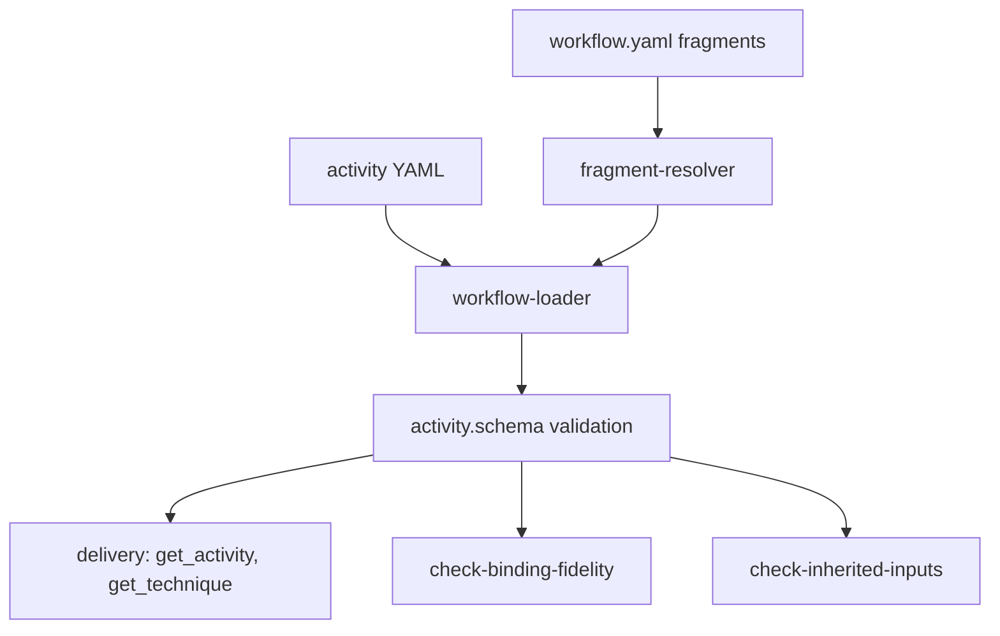
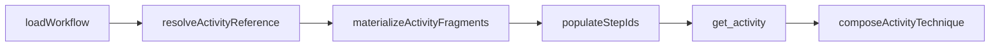
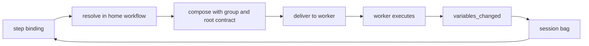

# Activity Technique Binding — Comprehension

How an activity step names a technique, what that binding guarantees about the data flowing through it, and what it cannot express.

## Structure

The activity layer is the only place the server sees work. A workflow is a graph of activities, an activity is an ordered list of steps, and a step of one kind binds a technique. Everything the runtime can order, gate, check or account for hangs off that chain.

### Overview

Three components define the layer: a schema that fixes what a step may be, a loader that resolves borrowed activities and splices declared fragments, and a guard that checks bindings against the techniques they name. Nothing else reads a binding.

### Project

The schema and loader are server source; the guards are standalone scripts; the definitions they govern are corpus content in the pinned submodule. The corpus holds 117 activities across 117 files, one activity per file, and 605 technique steps among 955 steps in total — technique steps are two thirds of the layer.

#### Entry points

An activity reaches an agent one way. The workflow loader resolves the activity, the fragment resolver splices any checkpoint bodies, and the activity tool delivers the raw YAML alongside the composed techniques its steps bind.

### Module Map

| Module | Responsibility | Depends on |
|--------|----------------|------------|
| [activity.schema](https://github.com/m2ux/workflow-server/blob/c8dc480b4029dfbfb72496684e811e0c03311b13/src/schema/activity.schema.ts) | Define the four step kinds and the binding object; derive and validate step ids | common schema |
| [workflow-loader](https://github.com/m2ux/workflow-server/blob/c8dc480b4029dfbfb72496684e811e0c03311b13/src/loaders/workflow-loader.ts) | Resolve activity references, including borrowed cross-workflow ones, and record where each was authored | activity.schema, fragment-resolver |
| [fragment-resolver](https://github.com/m2ux/workflow-server/blob/c8dc480b4029dfbfb72496684e811e0c03311b13/src/loaders/fragment-resolver.ts) | Splice declared rule text and checkpoint bodies into workflows and activities | workflow.schema |
| [check-binding-fidelity](https://github.com/m2ux/workflow-server/blob/c8dc480b4029dfbfb72496684e811e0c03311b13/scripts/check-binding-fidelity.ts) | Resolve every step binding and check its arguments, producers and consumers | the technique loader's resolution rules, mirrored |
| [check-inherited-inputs](https://github.com/m2ux/workflow-server/blob/c8dc480b4029dfbfb72496684e811e0c03311b13/scripts/check-inherited-inputs.ts) | Flag a technique redeclaring an input its container already declares | — |

### Design Patterns

#### A closed union of four step kinds

Steps are a discriminated union on `kind` with exactly four members — technique, action, checkpoint, loop — and the activity carries one flat ordered list of them. There are no parallel arrays for checkpoints or loops, and the only nesting is a loop body. Every member is strict, so an unrecognised field on a step is a load error. No step kind carries a description: a step is a bound unit of work, and guidance belongs to the technique it binds.

#### Strictness stops at the binding object

The step is strict; the binding inside it is not. [TechniqueBindingSchema](https://github.com/m2ux/workflow-server/blob/c8dc480b4029dfbfb72496684e811e0c03311b13/src/schema/activity.schema.ts#L63) is a plain object, so an unknown key written inside a structured binding is silently dropped rather than rejected, while the same key one level up at step level is a hard error. The purity guarantee the step kinds provide does not extend into the object that carries the data flow.

#### Borrow by reference, resolve at the source

A workflow lists an activity it borrows as a path into another workflow, and the loader records which workflow each activity was authored in. That recorded origin is what a technique reference resolves against, so a borrowed activity's bindings mean the same thing in the borrower as at home.

#### Fragments are content, not composition

A fragment is named content declared once at workflow scope and spliced in by reference before anything downstream sees it. There are exactly two kinds, rule text and checkpoint bodies, and the schema that holds them is strict over those two keys. A rule fragment is a string or list of strings; a checkpoint fragment is a strict object of decision fields. Neither can hold a protocol, and a technique step has no reference field to import one with. Fragments are therefore not a substrate for composing techniques.

### Core Types

| Type | Role |
|------|------|
| [TechniqueStep](https://github.com/m2ux/workflow-server/blob/c8dc480b4029dfbfb72496684e811e0c03311b13/src/schema/activity.schema.ts#L88) | One bound unit of work: a technique reference, an optional id, optional actions, and a gate |
| [TechniqueBindingSchema](https://github.com/m2ux/workflow-server/blob/c8dc480b4029dfbfb72496684e811e0c03311b13/src/schema/activity.schema.ts#L63) | The whole formal vocabulary for invoking a technique with data: a name, input deviations, output remaps |
| [LoopStep](https://github.com/m2ux/workflow-server/blob/c8dc480b4029dfbfb72496684e811e0c03311b13/src/schema/activity.schema.ts#L139) | The only repetition construct, with its body as a recursive step list |
| [CheckpointStep](https://github.com/m2ux/workflow-server/blob/c8dc480b4029dfbfb72496684e811e0c03311b13/src/schema/activity.schema.ts#L123) | A user decision point, inline or imported from a fragment |
| [WorkflowFragments](https://github.com/m2ux/workflow-server/blob/c8dc480b4029dfbfb72496684e811e0c03311b13/src/schema/workflow.schema.ts#L64) | The strict two-key container for declared rule text and checkpoint bodies |

### Data Model

#### The binding triple

A step names its technique either as a bare string, when nothing deviates from the defaults, or as an object carrying a name plus the deviations. Input deviations map a callee input id to a source expression — a literal, a rename of another bag variable, or a template. Output remaps map a callee output id to the bag name its value lands under. Both maps carry only what differs; an input already in the bag under its own id is omitted by convention.

#### One namespace for values

Every value a binding moves lives in the session variable bag. An output remap targets a bag name, and an unremapped output lands under its own id. There is no second namespace: a technique's protocol-run-scoped locals are explicitly not part of its interface and cannot be a binding target.

## Behaviour

### Data Flow Map

Authority enters where a workflow author writes a step. From there the binding is resolved against the activity's home workflow, composed with its container contracts, and delivered; its outputs return to the bag through the worker's completion result.

The bag is written at exactly two moments: a checkpoint effect applied when a response is recorded, and a completing activity's outputs relayed when the workflow advances. Both are boundaries between activities, never points inside one.

### What the binding is checked for

Four properties are proved mechanically, all by one guard, and the corpus passes all four: every step's technique reference resolves; every input deviation key is a declared input of the callee; every output remap key is a declared output; and every gate expression reads a name something produces.

### Invariant Alignment

The question this area exists to answer is whether the activity layer binds the I/O contract or merely names it. It names it more than it binds it.

| Invariant | Producer enforces? | Consumer assumes? | Gap? |
|-----------|--------------------|-------------------|------|
| The step's technique reference resolves | Yes | Yes | None |
| Deviation keys are declared on the callee | Yes, both directions | Yes | None |
| A gate reads a name something produces | Yes | Yes | None |
| Required **own** inputs of the callee are supplied at the site | Partly | Yes | 82 of 748 bind sites supply none of at least one |
| Required **inherited** inputs are supplied at the site | No, deliberately | Yes | Never checked per step; they resolve as ambient session context |
| An input several techniques share that no container declares | Catalogue entry only, no guard | Yes | Judgement-enforced; a hand sweep found the pattern on roughly seventy leaves across fifteen groups |
| A borrowed activity's bindings hold in the borrowing workflow | No | Yes | 143 bind sites are only ever checked against the workflow that authored them |
| An unknown key inside a binding object | No | Yes | Silently dropped, where the same key on the step is an error |
| A loop's continuation predicate means what the schema says | No | Yes | Carried by the step-gate field; the dedicated field is unused corpus-wide |

### Why the guard passes while 82 sites are silent

The binding-fidelity guard exits clean on this corpus: 69 violations, all triaged as accepted debt, none live or untriaged. That and the figure above are both true, because the guard's unconsumed-input check is narrower than the question in four separate ways, each deliberate and documented.

It reads the callee's **own** declared inputs only, on the stated ground that container-contract entries are ambient session context. That exemption covers most of the surface: of the unsatisfied requirements this pass found, the great majority are inherited entries rather than own ones.

It keys a finding on the **seam** — the triple of binding workflow, resolved operation and input — rather than the site, so the same unsupplied input bound at many steps is one defect. It then **clears a seam entirely when any one site supplies the input**, on the ground that one site passing it proves the value reaches the operation by design. A site that omits an input its sibling passes is therefore not reported. And its producer test is **order-blind**: a producer anywhere in the workflow satisfies an input, whether or not it runs first.

None of those is a bug. Together they mean a clean exit is evidence about seams, not about sites, and the site-level question the inline-call surface is measured by has no mechanical answer today.

The two figures reconcile exactly, which is what makes the account trustworthy. Running the guard's own finding collector and then modelling its four rules over the same corpus produces 20 findings against the guard's 22, with nothing raised by the model that the guard does not raise. The residue of two is fully explained: both come from bind sites in the shared pattern-activity directory, which the guard walks and the loader — reading its activity directory without recursing — never loads. Those two are checked and never run.

From there each rule accounts for a step of the ladder. Including activities a workflow borrows takes 20 to 37. Dropping the sibling-clearing rule takes it to 59. Requiring a producer to run before the step that reads it, rather than merely exist somewhere in the workflow, takes it to 46. Keying on the site instead of the seam takes it to 73. Counting container-contract inputs alongside own ones takes it to 761.

### Borrowed activities are checked in the wrong scope

The largest single step of that ladder is the first, and it is a blind spot rather than a narrowing. A workflow that borrows an activity gets that activity's steps and their bindings, but the guard walks each workflow's own activity directory, so a borrowed activity's bindings are only ever checked against the workflow that authored them. Across the corpus that leaves 143 bind sites unchecked in the scope they actually run in.

The exposure is specific to what a borrow is. A borrowed activity assumes the producers its home workflow supplies; the borrower may supply different ones. That is exactly the case a producer check exists to catch, and it is the case the check does not see.

### The hoist entry exists; no guard implements it

The catalogue does carry the mirror defect — an input several techniques share that no container declares — as a long-standing entry, and the container guard's header cites it by name when declaring it out of scope. So the rule is written down and the corpus is expected to honour it by judgement. What does not exist is any mechanical check, which is why the sweep behind that entry's most recent sibling had to be done by hand and found the pattern on roughly seventy leaves across fifteen groups.

### What does not survive a hoist

Moving an inline call up to become an activity step is not a relocation. Four things the technique layer expresses have no activity-layer equivalent.

A call sitting between two protocol bullets cannot become a step between them. The activity's step list is flat apart from loop bodies, a technique step has no field for a position inside a protocol, and protocol bullets are plain strings with no ids on the technique side either. Hoisting a mid-protocol call therefore **splits the host technique in two**, each half needing its own capability statement, id and interface.

A value that crossed that split as a protocol-run-scoped local must be **promoted to a declared output of the first half and an input of the second**, which makes session-global state out of what was scratch state, under a name that must not collide anywhere in the corpus.

A call gated on something known only mid-protocol cannot be gated at the activity layer at all, because a gate reads the bag and the bag is written only at activity boundaries. Gating it requires splitting the **activity**, not just the step.

A call repeated a number of times the technique itself determines needs a loop whose driver is a declared collection or a bag variable. The corpus already shows the workaround and its price: an analysis group declares its convergence and residue flags as both inputs and outputs purely so a technique-determined termination condition can be externalised where a loop can read it — and that same group's rules instruct callers not to re-implement its loop per activity.

The third case is the one the visibility rule already carves out, and it is the case where hoisting costs most and buys least: a call whose result stays inside the caller gains nothing from becoming visible, and pays the split, the promotion and a new public bag name.

### What this settles about the choice

The question this area was read to answer was posed as a choice between two options: move these calls up to the activity layer, where technique use is properly handled, or define a canonical mechanism for them where they are. The second half of that first option does not hold.

Technique use at this layer is not properly handled in the sense the choice assumes. A binding names a contract more than it binds one: 82 of 748 bind sites leave a required own input of their callee unsupplied, container inputs — the larger part of most interfaces — are checked at no site at all, borrowed activities are checked in the wrong scope, and no guard would confirm a hoist had been performed correctly, because the check for the defect a hoist repairs is a catalogue entry with nothing mechanical behind it. Four call shapes cannot be expressed here at any price, fragments cannot serve as the substrate, and the analysis group's rule against re-implementing its loop per activity is a standing objection written into the corpus before the question was asked.

So the two options are not symmetric alternatives where one avoids the contract problem. Both layers have the same defect at different densities, and moving a call between them moves the defect with it. The live question is **where the contract work lands**, not which option escapes it.

### A defect this reading found and does not scope

The borrowed-activity gap is not part of the inline-call question. It arrived while reconciling two measurements of it, and it stands on its own: 143 bind sites whose producers are never checked in the workflow that runs them, in a mechanism whose whole purpose is reusing an activity somewhere other than where it was written.

It is recorded here as an explicit scope decision rather than an observation, because it will otherwise be rediscovered. Either this package takes it — it touches the same guard and the same resolution path — or it is filed separately and named as out of scope. It should not pass unremarked in either direction.

### Execution Context

Gates are evaluated by the executing agent against current variable state; the server never evaluates one. Loop bounds are likewise agent-honoured. The server's role is to resolve, compose, deliver and record — the ordering the YAML expresses is instruction to an agent, not control flow the runtime executes.

### Error Handling

| Error type | Consumer reaction |
|------------|-------------------|
| Unknown field on a step | Load error, the activity fails validation |
| Unknown key inside a binding object | Silently dropped |
| Unresolvable activity reference | Load throws, naming the reference |
| Checkpoint carrying both a fragment reference and a body field | Load error, naming the one-home rule |
| Duplicate resolved step id in one scope | Load error; each loop body is its own scope |

### Operational Scenarios

| Scenario | Effect on this layer | Risk |
|----------|----------------------|------|
| An activity is borrowed by another workflow | Bindings resolve against the authoring workflow at run time, but are also only ever *checked* there | Medium — the borrower's producers are never verified against them |
| A callee gains a new required own input | No existing bind site is updated; the guard may stay silent if one site supplies it | Medium |
| A callee gains a new required container input | Nothing checks any site | Medium |
| A technique is split to hoist a call | Every value crossing the split becomes a session variable | High — public surface grows |
| A shared input is added to several leaves | No guard notices the missing container declaration | Medium |

## Inferred Design Rationale

Rationale here is read out of the code and its comments; entries say so where the source states a reason outright.

### Container inputs are exempt because they are usually ambient

The guard's comment says container entries are ambient session context and are marked at delivery rather than checked per step, and the server's provenance resolver agrees, classifying an unresolved inherited input as ambient rather than unresolved. That is correct for the common case — a planning-folder path really is supplied by the session — and it buys freedom from a flood of false findings. What it costs is that the container contract, the largest part of most callees' interfaces, has no per-site check at all.

### Findings key on seams so a baseline survives refactoring

The comment is explicit: the same unsupplied input bound at many steps is one defect on the operation-to-workflow seam, so the baseline stays stable when steps move between activities. That makes the guard's output a stable ledger of distinct defects. It also makes its counts incomparable with any site-level measurement, which is the trap this area sets for anyone comparing the two layers.

### One site clearing a seam is treated as proof of design

Where a shared operation takes a value only some callers override, one caller passing it shows the value reaches the operation by design, so claiming it has no producer would be false. The rule is sound for that pattern and over-general for others: it also clears sites that simply forgot.

### Fragments never recurse, and the schema guarantees it

The stated reason is that fragment bodies are plain content, so resolution never needs to recurse — and the types make it unrepresentable rather than merely discouraged, since neither fragment kind has a field a reference could occupy. The cost is that fragments cannot grow into a composition mechanism, which is why they are not an answer to technique reuse.

## Domain Concept Mapping

### Glossary

| Domain term | Technical construct | Description |
|-------------|---------------------|-------------|
| Bind | [TechniqueBindingSchema](https://github.com/m2ux/workflow-server/blob/c8dc480b4029dfbfb72496684e811e0c03311b13/src/schema/activity.schema.ts#L63) | Naming a technique from a step, with the deviations that step needs |
| Deviation | The `inputs` and `outputs` maps | Only what differs from same-name binding or a declared default |
| Seam | The guard's finding key | One operation's one input as seen from one workflow, however many steps bind it |
| Container contract | A group or workflow-root technique index | Inputs, outputs and rules every descendant inherits |
| Borrow | An activity reference into another workflow | Reusing an orchestration pattern whole, resolved at its source |
| Fragment | Declared rule text or checkpoint body | Content spliced by reference before delivery; not a composition construct |
| Hoist | No construct | Moving an inline technique call up to become an activity step |

### Domain Model

The layer expresses a sequence of bound units over a shared bag of named values, gated by expressions an agent evaluates. Its vocabulary is deliberately small: name a technique, rename what flows into it, rename what flows out. Everything the workflow can see about a piece of work, it sees because someone wrote a step. That is the layer's strength and the exact reason a call written inside a protocol is invisible — and also the reason moving one there is expensive, because the layer has no way to represent a thing that happens partway through something else.

## References

Coverage: the activity layer's step schema, binding object, borrow and fragment resolution, and the two guards that check bindings — read at server commit c8dc480b, with corpus measurements taken at corpus commit 34cd5429. The site-level contract figures were computed through the server's own loader and technique resolver, and three sampled sites were verified by hand against the corpus.

Every count here carries the unit and definition it was taken under, for the reason set out under [Counting this area](technique-reference-resolution.md#counting-this-area) — which also states the standing rule that a figure cited from either artifact is restated with its unit or re-derived.

Two questions this area raises are not answered here, because neither is settled by reading code: which parts of the delegation epic a work package delivers, and whether the recorded doctrine on inline calls is executed or reopened. Both are stakeholder decisions.

| Reference | What it carries |
|-----------|-----------------|
| [technique-reference-resolution.md](technique-reference-resolution.md) | The technique half of the same question: how a reference written in a protocol is resolved, delivered and checked |
| [Comprehension log](../planning/2026-08-15-handling-inline-techniques/15-codebase-comprehension.md) | The questions, investigations and corrections behind both artifacts |
| [orchestration.md](orchestration.md) | The orchestrator and worker execution model these steps run under |
| [workflow-server-schemas.md](workflow-server-schemas.md) | The schema system and its field-propagation lifecycle |

| Contributing work package | Dates |
|---------------------------|-------|
| [Handling inline techniques](../planning/2026-08-15-handling-inline-techniques/) | 2026-08-15 to 2026-08-16 |
