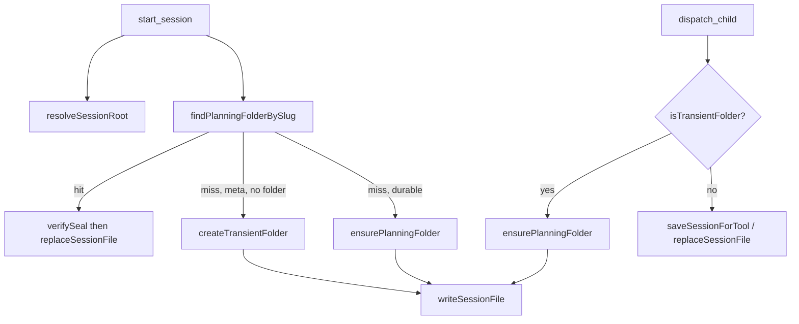
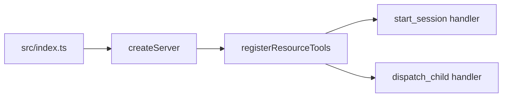
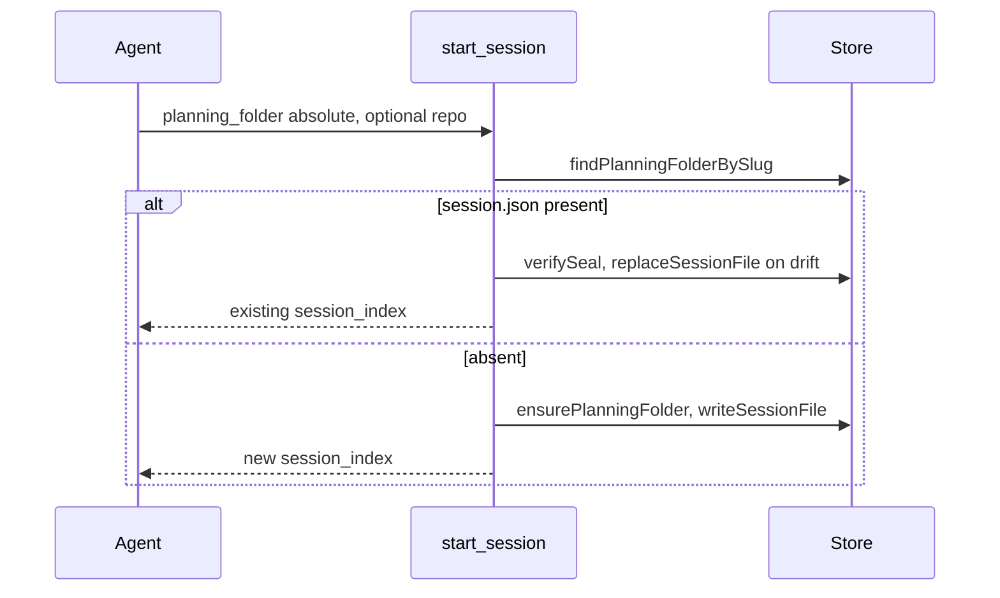
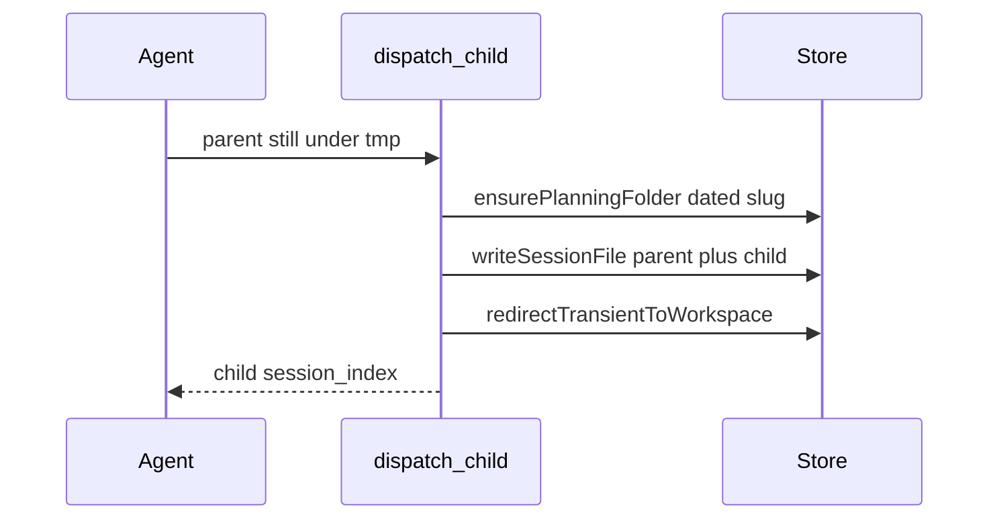

# Session Setup — Comprehension

Work package 2026-09-11-server-owned-session-setup · codebase-comprehension · 2026-09-11

The server births a session by resolving a planning folder, writing a sealed `session.json`, and handing back a six-character index. Repository identity and occupancy of that folder are caller-shaped today: the agent passes `owner/repo`, and a promote writes over whatever the destination already holds.

## Structure

What exists for session birth, persist, and path presentation. Runtime wipe and resume behaviour sit under Behaviour.

### Overview

Tool handlers in [registerResourceTools](https://github.com/m2ux/workflow-server/blob/c62606b2c26b348f367ecaaa12f8f0009a1c7a87/src/tools/resource-tools.ts#L83) call the session store. The store persists unconditionally. Path presentation rewrites server paths for the agent in one direction only.

### Project

Session birth lives in the TypeScript MCP server at `src/`. The worktree under study is `feat/528-server-owned-session-setup` at revision [c62606b2](https://github.com/m2ux/workflow-server/commit/c62606b2c26b348f367ecaaa12f8f0009a1c7a87).

#### Build units

| Unit | Path | Role in this area |
|------|------|-------------------|
| Resource tools | `src/tools/resource-tools.ts` | Registers `start_session` and `dispatch_child` |
| Session store | `src/utils/session/store.ts` | Persist, occupancy probe, transient folders |
| Session resolver | `src/utils/session/resolver.ts` | Load/save and error prose |
| Session scope | `src/utils/session/scope.ts` | Maps `owner/repo` onto an engineering root |
| Path presentation | `src/utils/path-presentation.ts` | Server path to agent-facing path |
| Config | `src/config.ts` | [normalizeRepoPath](https://github.com/m2ux/workflow-server/blob/c62606b2c26b348f367ecaaa12f8f0009a1c7a87/src/config.ts#L274) |
| Session schema | `src/schema/session.schema.ts` | [bindSessionRepo](https://github.com/m2ux/workflow-server/blob/c62606b2c26b348f367ecaaa12f8f0009a1c7a87/src/schema/session.schema.ts#L321) |

There is no git derivation module under `src/`. There is no inverse of [presentPathToAgent](https://github.com/m2ux/workflow-server/blob/c62606b2c26b348f367ecaaa12f8f0009a1c7a87/src/utils/path-presentation.ts#L109). `src/` does not import `child_process`. The inverse this area needs is a sibling that maps the longest host root onto the matching server root without un-collapsing `owner/repo`.

#### Entry points

A process starts at `src/index.ts`, then [createServer](https://github.com/m2ux/workflow-server/blob/c62606b2c26b348f367ecaaa12f8f0009a1c7a87/src/server.ts) registers tools. Session birth is the `start_session` closure inside [registerResourceTools](https://github.com/m2ux/workflow-server/blob/c62606b2c26b348f367ecaaa12f8f0009a1c7a87/src/tools/resource-tools.ts#L104). Child birth is the `dispatch_child` closure in the same function.

### Module Map

| Module | Responsibility | Depends on |
|--------|----------------|------------|
| Resource tools | MCP call contract, resume vs create, promote vs append | Store, resolver, scope, schema, path presentation |
| Store | Atomic persist, seals, slug walk, transient registry | Crypto, filesystem |
| Resolver | Index to folder, compare-and-swap save, error text | Store |
| Scope | Multi-root engineering directory from `repo` | Config |
| Path presentation | Host bind rewrite | Config map |
| Migration | Legacy `workflow-state.json` to `session.json` | Store [writeSessionFile](https://github.com/m2ux/workflow-server/blob/c62606b2c26b348f367ecaaa12f8f0009a1c7a87/src/utils/session/store.ts#L422) |

### Design Patterns

#### Unconditional persist beside compare-and-swap

[writeSessionFile](https://github.com/m2ux/workflow-server/blob/c62606b2c26b348f367ecaaa12f8f0009a1c7a87/src/utils/session/store.ts#L422) always replaces. Production callers are the fresh [start_session](https://github.com/m2ux/workflow-server/blob/c62606b2c26b348f367ecaaa12f8f0009a1c7a87/src/tools/resource-tools.ts#L365) branch, the transient [dispatch_child](https://github.com/m2ux/workflow-server/blob/c62606b2c26b348f367ecaaa12f8f0009a1c7a87/src/tools/resource-tools.ts#L563) promote, and [migratePlanningFolder](https://github.com/m2ux/workflow-server/blob/c62606b2c26b348f367ecaaa12f8f0009a1c7a87/src/utils/session/migration.ts#L347). [replaceSessionFile](https://github.com/m2ux/workflow-server/blob/c62606b2c26b348f367ecaaa12f8f0009a1c7a87/src/utils/session/store.ts#L438) writes only while on-disk bytes still match the read. Both call private [persistSessionFile](https://github.com/m2ux/workflow-server/blob/c62606b2c26b348f367ecaaa12f8f0009a1c7a87/src/utils/session/store.ts#L369).

#### Existence probe that does not verify

[sessionFileExists](https://github.com/m2ux/workflow-server/blob/c62606b2c26b348f367ecaaa12f8f0009a1c7a87/src/utils/session/store.ts#L875) stats `session.json`. A broken seal still counts as present. [verifySeal](https://github.com/m2ux/workflow-server/blob/c62606b2c26b348f367ecaaa12f8f0009a1c7a87/src/utils/session/store.ts#L474) is the readable/unreadable split. The probe is used by slug walk, migration short-circuit, and `start_session` resume. The promote branch does not call it.

#### Transient then promote

A meta session with no `planning_folder` lands under `os.tmpdir()`. The first [dispatch_child](https://github.com/m2ux/workflow-server/blob/c62606b2c26b348f367ecaaa12f8f0009a1c7a87/src/tools/resource-tools.ts#L452) mkdir's a dated slug and writes the parent-plus-child file there.

### Core Types

| Type | Role |
|------|------|
| [SessionStoreError](https://github.com/m2ux/workflow-server/blob/c62606b2c26b348f367ecaaa12f8f0009a1c7a87/src/utils/session/store.ts#L88) | Domain error with a closed code union |
| [SessionFile](https://github.com/m2ux/workflow-server/blob/c62606b2c26b348f367ecaaa12f8f0009a1c7a87/src/schema/session.schema.ts#L205) | Sealed on-disk session, recursive through children |
| [PathPresentationMap](https://github.com/m2ux/workflow-server/blob/c62606b2c26b348f367ecaaa12f8f0009a1c7a87/src/utils/path-presentation.ts#L22) | Server-root to host-root rewrite |

The error-code union is `NOT_FOUND`, `COLLISION`, `SEAL_MISMATCH`, `INVALID_INDEX`, `STALE_WRITE`, `WORKSPACE_INVALID`. There is no occupancy code.

### Traits and Interfaces

| Interface | Reached for |
|-----------|-------------|
| MCP `start_session` | Open or resume the top-level session |
| MCP `dispatch_child` | Embed a child; promote if the parent is transient |
| [describeSessionStoreError](https://github.com/m2ux/workflow-server/blob/c62606b2c26b348f367ecaaa12f8f0009a1c7a87/src/utils/session/resolver.ts#L340) | Map a store error to agent-facing prose |

Both handlers wrap throws through [withSessionStoreErrors](https://github.com/m2ux/workflow-server/blob/c62606b2c26b348f367ecaaa12f8f0009a1c7a87/src/tools/resource-tools.ts#L69), so a `SessionStoreError` becomes a failed tool call.

### Data Model

#### Session pair

A planning folder holds `session.json` and `.session-token`. The seal is HMAC of the exact JSON bytes. [findPlanningFolderBySlug](https://github.com/m2ux/workflow-server/blob/c62606b2c26b348f367ecaaa12f8f0009a1c7a87/src/utils/session/store.ts#L710) matches basename plus a present `session.json`.

#### Embedded child identity

[computeEmbeddedSessionIndex](https://github.com/m2ux/workflow-server/blob/c62606b2c26b348f367ecaaa12f8f0009a1c7a87/src/utils/session/derivation.ts) hashes folder realpath plus JSON path. A promote always uses slot zero, so a second promote into the same folder mints the same child index.

#### Bound repository

`session.json#repo` is `owner/repo`. [resolveSessionRoot](https://github.com/m2ux/workflow-server/blob/c62606b2c26b348f367ecaaa12f8f0009a1c7a87/src/utils/session/scope.ts#L181) maps that onto `$ROOT/<repo>/.engineering`. The bind is caller-supplied `repo`, not git at a checkout.

## Behaviour

What the handlers do once a call is in flight.

### Data Flow Map

Authority for repository identity enters as the `repo` argument. Authority for the planning folder enters as `planning_folder` or as a slug derived on promote.

#### Fresh start, named folder

Any present `session.json` resumes. The handler does not distinguish a folder the caller named from a slug the server would derive.

#### Transient promote

[ensurePlanningFolder](https://github.com/m2ux/workflow-server/blob/c62606b2c26b348f367ecaaa12f8f0009a1c7a87/src/utils/session/store.ts#L770) is an idempotent mkdir. The following write does not consult [sessionFileExists](https://github.com/m2ux/workflow-server/blob/c62606b2c26b348f367ecaaa12f8f0009a1c7a87/src/utils/session/store.ts#L875). That is the wipe: a resume that re-promotes onto yesterday's dated slug replaces the file and returns the same child index.

A persistent parent appends under compare-and-swap via [saveSessionForTool](https://github.com/m2ux/workflow-server/blob/c62606b2c26b348f367ecaaa12f8f0009a1c7a87/src/utils/session/resolver.ts). Occupancy does not apply there.

### Design Patterns

#### Error as throw, success as JSON

Failed calls throw. Successful calls return JSON with `session_index`. There is no successful-call shape that names a `decision` without creating a session.

#### One-way path rewrite

[presentPathToAgent](https://github.com/m2ux/workflow-server/blob/c62606b2c26b348f367ecaaa12f8f0009a1c7a87/src/utils/path-presentation.ts#L109) maps container roots onto `HOST_PROJECTS_ROOT`. Incoming `planning_folder` is not inverted; git at an agent-facing path would miss the container checkout when a map is configured.

### Invariant Alignment

| Invariant | Producer enforces? | Consumer assumes? | Gap? |
|-----------|-------------------|-------------------|------|
| Folder empty or absent before first persist | no — [writeSessionFile](https://github.com/m2ux/workflow-server/blob/c62606b2c26b348f367ecaaa12f8f0009a1c7a87/src/utils/session/store.ts#L422) replaces | Promote and fresh create assume a vacant destination | Occupied folder is overwritten |
| Bound repo is the checkout under work | no — caller `repo` | Downstream path resolution uses `session.json#repo` | Prose or PR-link binds |
| Unreadable session is not absent | [verifySeal](https://github.com/m2ux/workflow-server/blob/c62606b2c26b348f367ecaaa12f8f0009a1c7a87/src/utils/session/store.ts#L474) on resume | Promote treats any mkdir success as vacant | Broken seal on promote is overwritten |

### Execution Context

Handlers run on the MCP request thread of the Node server. A throw becomes a failed tool result through [withSessionStoreErrors](https://github.com/m2ux/workflow-server/blob/c62606b2c26b348f367ecaaa12f8f0009a1c7a87/src/tools/resource-tools.ts#L69). Two in-flight writes against one file hit `STALE_WRITE` on the compare-and-swap path; the promote path does not compare, so two promotes serialize as two unconditional writes.

### Error Handling

| Error type | Consumer reaction |
|------------|-------------------|
| `SEAL_MISMATCH` | Restore-from-commit prose. Does not name key rotation |
| `STALE_WRITE` | Retry same arguments |
| `WORKSPACE_INVALID` | Pass `repo` / fix `--workspace` |
| Schema-invalid session on resume | Generic `Error` from `start_session`, not a store code |
| Occupied destination on promote | None — write succeeds |

### Operational Scenarios

| Scenario | Effect on this code path | Risk |
|----------|------------------------|------|
| Second meta bootstrap same day, same workflow id | Promote onto `YYYY-MM-DD-<workflow_id>` replaces the first run | Critical — measured wipe |
| `start_session` with named existing folder | Resume and restamp | Intended |
| Working directory not a git checkout | Not an input; caller still passes `repo` | Empty-directory bind |
| Docker agent path vs container checkout | Presentation is outbound only | git at the presented path misses the server tree |
| Persistent parent, second child | Append, new slot, new index | Intended; occupancy must not fire |

## Inferred Design Rationale

Rationale here is read out of comments and structure, not from a design doc in the source.

### Persist has two functions so a create can stay unconditional

[writeSessionFile](https://github.com/m2ux/workflow-server/blob/c62606b2c26b348f367ecaaa12f8f0009a1c7a87/src/utils/session/store.ts#L414)'s comment names the cases that have no prior read: fresh session, migrated legacy folder, promoted transient parent. [replaceSessionFile](https://github.com/m2ux/workflow-server/blob/c62606b2c26b348f367ecaaa12f8f0009a1c7a87/src/utils/session/store.ts#L438) is the path that has a read. Occupancy is not a third persist mode in the tree today.

GitNexus rates changing [writeSessionFile](https://github.com/m2ux/workflow-server/blob/c62606b2c26b348f367ecaaa12f8f0009a1c7a87/src/utils/session/store.ts#L422) **CRITICAL**: six direct callers, eight processes in this index, five modules. Direct callers are [registerResourceTools](https://github.com/m2ux/workflow-server/blob/c62606b2c26b348f367ecaaa12f8f0009a1c7a87/src/tools/resource-tools.ts#L83), [migratePlanningFolder](https://github.com/m2ux/workflow-server/blob/c62606b2c26b348f367ecaaa12f8f0009a1c7a87/src/utils/session/migration.ts), and four test files (`session-store`, `session-scope`, `session-concurrency`, `mcp-server`). The comment and the call graph together say occupancy belongs on a different function.

### Agent-supplied repo keeps the server off git

[start_session](https://github.com/m2ux/workflow-server/blob/c62606b2c26b348f367ecaaa12f8f0009a1c7a87/src/tools/resource-tools.ts#L107) describes `repo` as derived by the agent via `version-control::resolve-host-repo`. The server has no `git -C` in `src/`. That keeps handlers free of process spawns and puts the bind in the caller's hands. The cost is a bind that can name a repository the checkout is not.

### Transient tmp avoids littering the planning root

Comments on [createTransientFolder](https://github.com/m2ux/workflow-server/blob/c62606b2c26b348f367ecaaa12f8f0009a1c7a87/src/utils/session/store.ts#L786) say bootstrap sessions should not mint durable folders until a child exists. Promote then writes the first durable file. The same write is how a second bootstrap destroys the first.

## Domain Concept Mapping

### Glossary

| Domain term | Technical construct | Description |
|-------------|-------------------|-------------|
| Durable session | Planning folder with sealed `session.json` | Lives under the engineering checkout |
| Transient session | [createTransientFolder](https://github.com/m2ux/workflow-server/blob/c62606b2c26b348f367ecaaa12f8f0009a1c7a87/src/utils/session/store.ts#L807) | Process-local tmp; promote moves it |
| Promote | Transient branch of [dispatch_child](https://github.com/m2ux/workflow-server/blob/c62606b2c26b348f367ecaaa12f8f0009a1c7a87/src/tools/resource-tools.ts#L491) | mkdir dated slug, unconditional write |
| Occupancy | Absent as a code; the folder already holds a session | Spec name for the refuse that does not exist yet |
| Bound repo | `session.json#repo` | `owner/repo` used by [resolveSessionRoot](https://github.com/m2ux/workflow-server/blob/c62606b2c26b348f367ecaaa12f8f0009a1c7a87/src/utils/session/scope.ts#L181) |
| Named folder | `planning_folder` argument | Caller chose the slug; resume stays |
| Derived slug | Dated fallback on promote, or a future `working_directory` create | Caller did not name the folder |
| Open decision | Absent as a response shape | Successful call, no `session_index`, named `decision` |

### Domain Model

Session setup is the moment a run becomes a folder on disk. The domain split is create versus resume versus promote. Create and promote share [writeSessionFile](https://github.com/m2ux/workflow-server/blob/c62606b2c26b348f367ecaaa12f8f0009a1c7a87/src/utils/session/store.ts#L422). Resume uses [replaceSessionFile](https://github.com/m2ux/workflow-server/blob/c62606b2c26b348f367ecaaa12f8f0009a1c7a87/src/utils/session/store.ts#L438). The missing split is occupied versus vacant on the create/promote side.

## GitNexus blast radius

Taken on this tree, `impact({ target, direction: "upstream", repo: "workflow-server" })`, tests included. [writeSessionFile](https://github.com/m2ux/workflow-server/blob/c62606b2c26b348f367ecaaa12f8f0009a1c7a87/src/utils/session/store.ts#L422) is **CRITICAL**. Do not change its contract.

| Symbol | Risk | Direct (d=1) | Notes |
|--------|------|--------------|-------|
| [writeSessionFile](https://github.com/m2ux/workflow-server/blob/c62606b2c26b348f367ecaaa12f8f0009a1c7a87/src/utils/session/store.ts#L422) | CRITICAL | 6 | Callers stay on unconditional persist |
| [registerResourceTools](https://github.com/m2ux/workflow-server/blob/c62606b2c26b348f367ecaaa12f8f0009a1c7a87/src/tools/resource-tools.ts#L83) | CRITICAL | 2 (`createServer`, `captureTools`) | Holds both handlers Landing 1 edits |
| [sessionFileExists](https://github.com/m2ux/workflow-server/blob/c62606b2c26b348f367ecaaa12f8f0009a1c7a87/src/utils/session/store.ts#L875) | CRITICAL | 4 | Probe only; do not fold seal verify into it |
| [SessionStoreError](https://github.com/m2ux/workflow-server/blob/c62606b2c26b348f367ecaaa12f8f0009a1c7a87/src/utils/session/store.ts#L88) | CRITICAL | 12 | Add `FOLDER_OCCUPIED` to the union |
| [describeSessionStoreError](https://github.com/m2ux/workflow-server/blob/c62606b2c26b348f367ecaaa12f8f0009a1c7a87/src/utils/session/resolver.ts#L340) | CRITICAL | 3 | New arm; both `withSessionStoreErrors` wrappers |
| [presentPathToAgent](https://github.com/m2ux/workflow-server/blob/c62606b2c26b348f367ecaaa12f8f0009a1c7a87/src/utils/path-presentation.ts#L109) | CRITICAL | 4 | Add an inverse; leave this function's contract |

## References

Coverage: session birth, persist, promote, path presentation, error surface. Read at [c62606b2](https://github.com/m2ux/workflow-server/commit/c62606b2c26b348f367ecaaa12f8f0009a1c7a87) on `feat/528-server-owned-session-setup`.

| Reference | What it carries |
|-----------|-----------------|
| [15-codebase-comprehension.md](../planning/2026-09-11-server-owned-session-setup/15-codebase-comprehension.md) | Questions, traces, Landing 1 edit map |
| [dispatch-child-transient-parent.md](dispatch-child-transient-parent.md) | Earlier promote-branch notes; line numbers are from 2026-06-18 |
| [hierarchical-dispatch.md](hierarchical-dispatch.md) | Embedded-child tree |
| [state-tools.md](state-tools.md) | Session-file persistence overview |
| [workflow-server.md](workflow-server.md) | Server layout |

| Contributing work package | Dates |
|---------------------------|-------|
| 2026-09-11-server-owned-session-setup | 2026-09-11 |
