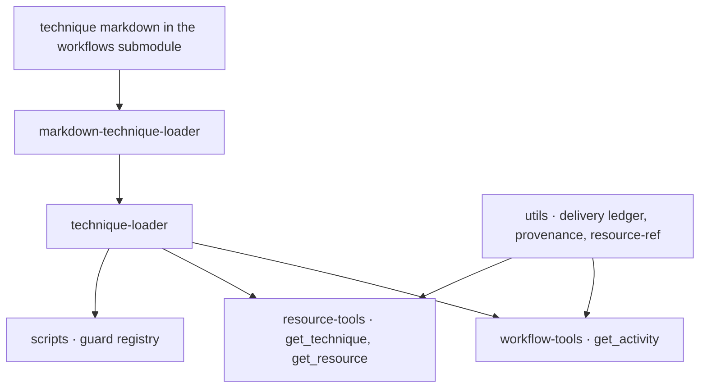
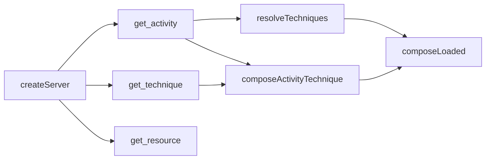
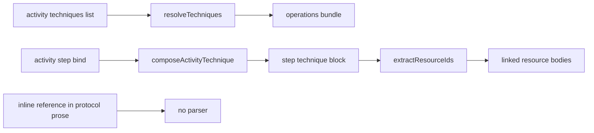

# Technique Reference Resolution — Comprehension

How the workflow server turns a written reference to a technique into a composed body an agent can execute, and which of those references it checks.

## Structure

The area spans three layers that never call each other: a loader that parses and composes technique markdown, a pair of MCP tool handlers that deliver the result, and a set of standalone guard scripts that re-resolve references at build time using the same loader.

### Overview

The loaders are the only place technique markdown becomes an object. Both delivery doors sit above them and share one composition function, so a technique fetched lazily and the same technique bundled eagerly are byte-identical by construction. The guards sit beside the server rather than inside it: they import the loader directly and run as separate processes.

### Project

The server is a TypeScript MCP server whose source divides into loaders, tool handlers, utilities and schema. Two of the units that govern this area sit outside that source tree: the technique content lives in a [git submodule](https://github.com/m2ux/workflow-server/tree/34cd5429752a41ad2af3172422f3cf3260c39a4e) pinned beneath the repository, carrying both the technique files and the design canon that governs them, and the normative reference grammar lives in the [protocol specification](https://github.com/m2ux/workflow-server/blob/3cf1d7f5536b719f94e1707bff196af8525e4ad2/docs/technique-protocol-specification.md). Code and content therefore version independently, and a claim about the corpus is only true of a named submodule commit.

#### Entry points

An agent reaches this area only through MCP tool calls. The server registers the tool surface at startup, and every path into composition converges on one function.

### Module Map

Each module owns one transformation and hands off a validated object; nothing reaches backwards.

| Module | Responsibility | Depends on |
|--------|----------------|------------|
| [markdown-technique-loader](https://github.com/m2ux/workflow-server/blob/3cf1d7f5536b719f94e1707bff196af8525e4ad2/src/loaders/markdown-technique-loader.ts) | Split a technique file into its canonical sections and build a technique object | schema |
| [technique-loader](https://github.com/m2ux/workflow-server/blob/3cf1d7f5536b719f94e1707bff196af8525e4ad2/src/loaders/technique-loader.ts) | Resolve reference paths, merge ancestor contracts, project to the wire shape | markdown-technique-loader, schema |
| [core-ops](https://github.com/m2ux/workflow-server/blob/3cf1d7f5536b719f94e1707bff196af8525e4ad2/src/loaders/core-ops.ts) | Name the baseline operations each role receives regardless of what a definition declares | none |
| [fragment-resolver](https://github.com/m2ux/workflow-server/blob/3cf1d7f5536b719f94e1707bff196af8525e4ad2/src/loaders/fragment-resolver.ts) | Splice declared rule and checkpoint fragments into workflow and activity structures | workflow-loader |
| [workflow-tools](https://github.com/m2ux/workflow-server/blob/3cf1d7f5536b719f94e1707bff196af8525e4ad2/src/tools/workflow-tools.ts) | Assemble the activity response: operations bundle, eager step techniques, linked resources | technique-loader, delivery, binding-provenance |
| [resource-tools](https://github.com/m2ux/workflow-server/blob/3cf1d7f5536b719f94e1707bff196af8525e4ad2/src/tools/resource-tools.ts) | Serve one composed technique or one resource on demand | technique-loader, delivery, resource-ref |
| [delivery](https://github.com/m2ux/workflow-server/blob/3cf1d7f5536b719f94e1707bff196af8525e4ad2/src/utils/delivery.ts) | Decide whether content is sent in full or as an unchanged marker | none |
| [binding-provenance](https://github.com/m2ux/workflow-server/blob/3cf1d7f5536b719f94e1707bff196af8525e4ad2/src/utils/binding-provenance.ts) | Annotate each declared input with where its value comes from | technique-loader |
| [guards](https://github.com/m2ux/workflow-server/blob/3cf1d7f5536b719f94e1707bff196af8525e4ad2/scripts/guards.ts) | Register every corpus and repository check behind one runner protocol | the individual check scripts |

### Design Patterns

Four structural shapes recur, and each one keeps something apart that would otherwise drift.

#### One composition, two doors

[composeLoaded](https://github.com/m2ux/workflow-server/blob/3cf1d7f5536b719f94e1707bff196af8525e4ad2/src/loaders/technique-loader.ts#L499) is the single implementation of ancestor-contract merging and protocol wrapping. The lazy door reaches it through [composeTechnique](https://github.com/m2ux/workflow-server/blob/3cf1d7f5536b719f94e1707bff196af8525e4ad2/src/loaders/technique-loader.ts#L575); the bundle door reaches it through [resolveTechniques](https://github.com/m2ux/workflow-server/blob/3cf1d7f5536b719f94e1707bff196af8525e4ad2/src/loaders/technique-loader.ts#L246). Neither door owns composition logic of its own.

#### Rewrite at parse, for one link kind only

[rewriteResourceLinks](https://github.com/m2ux/workflow-server/blob/3cf1d7f5536b719f94e1707bff196af8525e4ad2/src/loaders/markdown-technique-loader.ts#L226) runs before sectioning and turns an authored relative link to a resource file into the identifier the resource tool accepts. Its docstring states the boundary directly: technique links are left untouched. This is the only body transformation in the pipeline, and it is the precedent any technique-link rewrite would follow.

#### Reference-not-repeat delivery

[delivery](https://github.com/m2ux/workflow-server/blob/3cf1d7f5536b719f94e1707bff196af8525e4ad2/src/utils/delivery.ts) records a hash per content key per agent context. A second request for byte-identical content returns [unchangedMarker](https://github.com/m2ux/workflow-server/blob/3cf1d7f5536b719f94e1707bff196af8525e4ad2/src/utils/delivery.ts#L85) instead of the body. Content-hash-suffixed keys need no invalidation, because changed content produces a different key.

Two key shapes already coexist, and which one a delivered body takes decides what it collapses against. A whole technique is keyed by its identifier, and that key is the same at both delivery doors. Named blocks inside a technique — the inherited-input and inherited-output blocks, the rules map, the provenance note — are keyed by a hash of their own content, so a shared preamble collapses across techniques whose own interfaces differ.

#### Where a folded callee would be keyed

A fold has to pick one of those two shapes. The choice belongs to whoever plans the work; what follows is the choice with its consequences already worked out, so that it can be answered rather than investigated.

| | Keyed as a technique | Keyed as a block inside the caller |
|---|---|---|
| Collapses against a step-bound delivery of the same operation | Yes, at both doors | No — different key namespace |
| Collapses across two callers folding the same operation | Yes | Only where the block content is byte-identical |
| Can carry the call site's own binding annotations | No — the body must stay identical to be shared | Yes |
| Needs a new key namespace | No | Yes |

The population that decides it is the operations reached both ways. Of the 81 distinct techniques an inline call reaches, 31 are also bound as an activity step somewhere; the other 50 are reached only from prose. For those 31 the technique-keyed choice collapses a fold against a bind that already happens, and the caller-block choice delivers the same body twice under two keys. That asymmetry is why the choice reads as lopsided rather than balanced — but it is a genuine trade, because the annotation the block shape would carry is the one thing a shared body cannot hold, and the existing split of inherited blocks from their parent technique is precedent for carrying that separately rather than giving up the collapse.

#### Guards as separate processes over a shared registry

Every check is a standalone script named in [GUARDS](https://github.com/m2ux/workflow-server/blob/3cf1d7f5536b719f94e1707bff196af8525e4ad2/scripts/guards.ts#L28), and the runner spawns each one. A guard that wants the server's resolution semantics imports the loader rather than reimplementing it — [check-all-refs](https://github.com/m2ux/workflow-server/blob/3cf1d7f5536b719f94e1707bff196af8525e4ad2/scripts/check-all-refs.ts#L56) and [check-stealth-isolation](https://github.com/m2ux/workflow-server/blob/3cf1d7f5536b719f94e1707bff196af8525e4ad2/scripts/check-stealth-isolation.ts#L208) both do. The stealth check is the only one that scans a composed protocol, which makes it the guard a change to composition perturbs first.

#### Resolution never recurses

No reference resolution in this area follows a reference found inside what it resolved. Ancestor composition walks a filesystem path, so it cannot cycle by construction. Fragment resolution states non-recursion as an invariant, on the ground that a fragment body is plain content. The resource scan runs once over each bundled technique and does not re-scan a loaded resource. There is consequently no cycle detection anywhere in the codebase, and no place where one would currently be reached.

The graph that would be traversed is not acyclic, though it is very nearly so. Counting it requires fixing what an edge is, because the answer moves by a factor of four depending on the choice. Read conservatively — an invoking verb followed by whitespace, an unanchored relative link to a technique file, inside a Protocol section — the graph is 168 edges across 87 calling files over 132 nodes. Read permissively, counting anchored links too, it is 177 edges.

On the conservative reading the corpus contains exactly one cycle and two self-references, and all three are correct as authored:

| Cycle | Edges | Why it is written that way |
|-------|-------|----------------------------|
| Index freshness and indexing | The freshness check applies the indexing operation when no index exists or the index is stale; the indexing operation applies the freshness check afterwards to confirm the result | A retry-and-confirm relationship between two operations that genuinely depend on each other |
| Index freshness, on itself | The freshness check applies itself after re-indexing | Retry after recovery |
| Cloud-site resolution, on itself | The resolver applies itself when a product tool was called before an identifier was resolved | Error recovery, the shape the specification sanctions for inline application |

The permissive reading adds one further pair, between activity dispatch and batch continuation. It is not a call: the citation is to a named rule on the other file, and the canon's own mnemonic is that a double colon invokes while a dot names. Counted conservatively it disappears, which is the clearest illustration of why the edge definition has to be stated wherever a count is.

Three of the 87 callers have a cycle inside their reach.

### Core Types

These are the objects a reader meets first, and the whole area is expressed in terms of them.

| Type | Role |
|------|------|
| [Technique](https://github.com/m2ux/workflow-server/blob/3cf1d7f5536b719f94e1707bff196af8525e4ad2/src/schema/technique.schema.ts#L99) | The validated parse of one technique file, with a closed field set |
| [ProtocolBlock](https://github.com/m2ux/workflow-server/blob/3cf1d7f5536b719f94e1707bff196af8525e4ad2/src/schema/technique.schema.ts#L24) | One titled group of ordered step bullets, each bullet a plain string |
| [ResolvedTechnique](https://github.com/m2ux/workflow-server/blob/3cf1d7f5536b719f94e1707bff196af8525e4ad2/src/loaders/technique-loader.ts#L183) | The outcome of resolving one reference: a technique body, a rule text, or a miss |
| [TechniqueBindingSchema](https://github.com/m2ux/workflow-server/blob/3cf1d7f5536b719f94e1707bff196af8525e4ad2/src/schema/activity.schema.ts#L62) | The only machine-readable way to invoke a technique with data: a name plus input and output deviations |
| [ProducerSite](https://github.com/m2ux/workflow-server/blob/3cf1d7f5536b719f94e1707bff196af8525e4ad2/src/utils/binding-provenance.ts#L58) | A place in a workflow that produces a named value, used to explain where an input resolves from |
| [GuardSpec](https://github.com/m2ux/workflow-server/blob/3cf1d7f5536b719f94e1707bff196af8525e4ad2/scripts/guards.ts#L14) | A registered check: its script, its scope, whether it speaks the machine-readable [finding protocol](https://github.com/m2ux/workflow-server/blob/3cf1d7f5536b719f94e1707bff196af8525e4ad2/scripts/guard-protocol.ts#L19), and what it proves |

### Traits and Interfaces

The area reaches the rest of the system through a small set of seams.

| Interface | Reached for |
|-----------|-------------|
| [Result](https://github.com/m2ux/workflow-server/blob/3cf1d7f5536b719f94e1707bff196af8525e4ad2/src/result.ts) | Typed success-or-error return from every load path, so a miss is a value rather than a throw |
| [FragmentsLookup](https://github.com/m2ux/workflow-server/blob/3cf1d7f5536b719f94e1707bff196af8525e4ad2/src/loaders/fragment-resolver.ts) | A synchronous view of declared fragments, shared by the async loaders and the sync guards |
| MCP tool registration | The only way an agent reaches composition, via the activity, technique and resource handlers |
| [markdown-refs](https://github.com/m2ux/workflow-server/blob/3cf1d7f5536b719f94e1707bff196af8525e4ad2/scripts/markdown-refs.ts) | Fence-aware, CommonMark-complete link destination scanning, shared across guards |

### Data Model

Four reference grammars coexist in the corpus. Three are parsed by code; the fourth is the subject of this work package and is parsed by nobody.

#### The logical technique path

[parseTechniquePath](https://github.com/m2ux/workflow-server/blob/3cf1d7f5536b719f94e1707bff196af8525e4ad2/src/loaders/technique-loader.ts#L219) accepts a double-colon-delimited path whose leading segment is a workflow only when a directory of that name exists. The parent workflow is implicit for same-workflow references and resolution runs current-workflow-first then the shared meta layer. A legacy slash form normalises into the same shape.

#### The resource reference

[parseResourceRef](https://github.com/m2ux/workflow-server/blob/3cf1d7f5536b719f94e1707bff196af8525e4ad2/src/utils/resource-ref.ts#L8) splits an optional heading anchor, strips a file extension, and then splits an optional workflow prefix. The anchor is part of the delivery key, so a whole-file fetch and a section fetch never collapse against each other.

#### The fragment reference

[parseFragmentRef](https://github.com/m2ux/workflow-server/blob/3cf1d7f5536b719f94e1707bff196af8525e4ad2/src/loaders/fragment-resolver.ts#L37) uses the same workflow-then-meta candidate order for rule and checkpoint bodies declared in a workflow definition. Resolution is deliberately non-recursive: a fragment body is plain content and cannot itself carry a reference.

#### The inline protocol reference

The specification defines a hyperlinked call written inside a protocol step — a group link, a double colon, an operation link, and an optional parenthesised argument list — in [§4.1 and §4.2](https://github.com/m2ux/workflow-server/blob/3cf1d7f5536b719f94e1707bff196af8525e4ad2/docs/technique-protocol-specification.md#L324). No code path parses it. It survives composition as an ordinary string inside a protocol block, because [ProtocolBlock](https://github.com/m2ux/workflow-server/blob/3cf1d7f5536b719f94e1707bff196af8525e4ad2/src/schema/technique.schema.ts#L24) declares its steps as strings and [TechniqueSchema](https://github.com/m2ux/workflow-server/blob/3cf1d7f5536b719f94e1707bff196af8525e4ad2/src/schema/technique.schema.ts#L99) is closed against extra fields.

## Behaviour

Composition runs per request, from disk, with no cache between calls. What follows is what happens to a reference once a tool handler starts work.

### Data Flow Map

Authority enters at the activity definition: the workflow author decides which references reach the loader. Three routes carry a reference to a delivered body, and a fourth carries one nowhere.

#### Declared reference lists

An activity's declared operations, the workflow-level inherited list, and the role baseline from [core-ops](https://github.com/m2ux/workflow-server/blob/3cf1d7f5536b719f94e1707bff196af8525e4ad2/src/loaders/core-ops.ts) are unioned and passed to [resolveTechniques](https://github.com/m2ux/workflow-server/blob/3cf1d7f5536b719f94e1707bff196af8525e4ad2/src/loaders/technique-loader.ts#L246) in one call. [formatTechniqueBundle](https://github.com/m2ux/workflow-server/blob/3cf1d7f5536b719f94e1707bff196af8525e4ad2/src/loaders/technique-loader.ts#L624) buckets the outcome into an unordered map of bodies, a flat list of rules, and a list of references that did not resolve. Rules of every touched technique are auto-included, which is how a bundle carries obligations nobody named.

#### Step-bound techniques

The eager bundling loop walks ungated technique steps in document order, composes each through [composeActivityTechnique](https://github.com/m2ux/workflow-server/blob/3cf1d7f5536b719f94e1707bff196af8525e4ad2/src/loaders/technique-loader.ts#L603), decorates it with provenance, and emits it as a discrete marked block keyed by step. This is the only construct that produces a position in document order, a delivery event, and a step manifest slot. A reference that is not a step is none of those things.

#### Linked resources

[extractResourceIds](https://github.com/m2ux/workflow-server/blob/3cf1d7f5536b719f94e1707bff196af8525e4ad2/src/utils/resource-ref.ts#L72) scans the projected text of each bundled technique for outbound resource identifiers, and the handler then loads and bundles their bodies within the same budget. Structurally this is a complete fold pipeline — scan a composed body for references, resolve them, deliver them, deduplicate, warn on a miss — already built and pointed at resources.

The pipeline exists at one door only. The scan is called from the activity handler and nowhere else, so a technique fetched lazily carries its resource identifiers as rewritten links for the agent to fetch, while the same technique bundled eagerly arrives with those bodies attached. Any reference-following delivery built on this pipeline inherits that asymmetry.

What keeps the asymmetry in place is the doors' contracts rather than their code. The activity tool requires the caller to declare its context window, and every budget in the bundling loop is derived from that declaration; the technique tool has no such parameter, so there is no quantity to spend. The activity response also carries a sibling map for attached bodies and a note saying which delivery shape it used, where the technique response is a single projection with no slot for a second body. Lifting the scan is therefore a port plus two contract additions — a budget input and a multi-body response shape — and not a refactor. The one thing that already spans both doors is the ledger: the same key names a technique whichever door delivered it, so deduplication works across them today.

#### Inline protocol references

Nothing resolves them. The loader rewrites only resource links; the schema has no slot; no guard opens a protocol looking for one. The compensation is a hand-maintained list in [core-ops](https://github.com/m2ux/workflow-server/blob/3cf1d7f5536b719f94e1707bff196af8525e4ad2/src/loaders/core-ops.ts#L48), whose comment states the invariant plainly: a technique named inside another technique's protocol has no other delivery path, so an orchestrator without these entries reaches the dispatch step with nothing to apply and improvises.

An agent that meets such a reference today has one route and one fallback. The route is the role baseline: if the callee is named in the orchestrator or worker list, its body already arrived with the response and the reference is readable. The fallback is nothing — the technique tool takes a step identifier, never a technique identifier, so a callee outside both the baseline and the activity's own steps cannot be asked for by name.

Where the callee arrives as the value of a variable, no name exists in the calling file. That class divides three ways, and only one part of it is genuinely out of reach.

| Shape | Instances | Reachable how |
|-------|-----------|---------------|
| Callee drawn from a table the corpus enumerates | The harness technique and operation pair, at the spawn, resume and concurrent sites | Closure over the table, which an existing guard already performs |
| Callee supplied as a value by an activity step binding | The dispatched agent's technique, bound once; the analysis loop's technique, bound at seven sites across two distinct values | Join the token to its bind sites — every value is an ordinary resolvable reference |
| Operation chosen from a catalog entry at run time | Lens application in the analysis workflows; probe and pattern routing in the review workflows | Not reachable, and not this surface: what is selected is a resource, not a technique |

The middle row is the one worth stating precisely, because it is easy to file under the first. Those callees are beyond *file-local* reach, not beyond static reach: the calling technique cannot name them, but the activity that binds the caller does, in plain text, in its own definition.

### Design Patterns

Two runtime shapes govern what an agent actually receives.

#### Budget by prefix, cap by item

The eager bundle stops at the first technique that would exceed the request budget, preserving a contiguous document-order prefix, while a technique larger than the per-item cap is skipped and the loop continues. The two rules differ deliberately: a break keeps the delivered set a readable prefix; a skip keeps one oversized file from starving the rest.

### Invariant Alignment

The safety argument for this area is checkable here: for each property an agent relies on when it follows a reference, whether anything upstream guarantees it.

| Invariant | Producer enforces? | Consumer assumes? | Gap? |
|-----------|--------------------|-------------------|------|
| A declared operations-list reference resolves | Yes — [check-all-refs](https://github.com/m2ux/workflow-server/blob/3cf1d7f5536b719f94e1707bff196af8525e4ad2/scripts/check-all-refs.ts#L56) | Yes | None |
| A step-bound reference resolves | Yes — the binding-fidelity resolver | Yes | None |
| A step binding's argument names exist on the callee | Yes — the argument-conformance sub-check | Yes | None |
| An anchored link to a markdown heading resolves | Yes — [check-resource-anchors](https://github.com/m2ux/workflow-server/blob/3cf1d7f5536b719f94e1707bff196af8525e4ad2/scripts/check-resource-anchors.ts#L86) | Yes | None |
| An unanchored link to a technique file resolves | No — the anchor regex requires a heading anchor | Yes | One live dangling target: the create-pr link in [submit-update](https://github.com/m2ux/workflow-server/blob/34cd5429752a41ad2af3172422f3cf3260c39a4e/prism-update/techniques/submit-update.md#L38) climbs one directory too many and lands outside the corpus |
| An inline protocol reference resolves | No | Yes | Every such reference |
| Inline argument names exist on the callee | No — stated as an anti-pattern, unenforced | Yes | Many call sites omit a required input |
| A callee reached only inline has producers for its inputs | No — producer analysis is activity-scoped | Yes | Unanalysed; worse, the callee's own output reads as unconsumed, so the guard fires away from the defect |
| A callee named by a variable is deliverable | No | Yes | Only the catalog-selected shape is genuinely unreachable; the table-drawn and bind-supplied shapes both resolve |

The inline-only callee row inverts in practice rather than merely going unchecked. [cross-link](https://github.com/m2ux/workflow-server/blob/34cd5429752a41ad2af3172422f3cf3260c39a4e/codebase-wiki/techniques/cross-link.md) is invoked from exactly one place, an inline apply in [ingest](https://github.com/m2ux/workflow-server/blob/34cd5429752a41ad2af3172422f3cf3260c39a4e/codebase-wiki/techniques/ingest.md#L77), and no activity in any workflow binds it. The unconsumed-output check therefore reports its declared output as dead, and that report sits in the guard's triage file marked harmless under a shared-return-contract rationale — the same rationale carrying most of the suppressed entries of that class. The signal that a callee has no bind site is present, correctly raised, and read as noise.

### Execution Context

Composition runs inside a single MCP tool call, asynchronously, reading each ancestor file from disk on every request. There is no cross-request cache, so a corpus edit takes effect on the next call. Failure never halts the server: every load path returns a typed result and every degradation is logged. The observable surface for an operator is the structured log line each handler emits, plus the validation warnings folded into the response.

### Error Handling

How far a failure travels depends on which layer raised it. Almost everything warns and degrades; the area fails loudly at exactly one point, when a technique file is missing a required section at parse.

| Error type | Consumer reaction |
|------------|-------------------|
| Malformed technique markdown | Logged as a warning; the technique reads as not found |
| Composed technique fails schema validation | Logged; the uncomposed technique is returned |
| Declared reference does not resolve | Listed under an unresolved key in the bundle |
| Step-bound reference does not resolve | The step is silently omitted from the eager bundle |
| Linked resource does not resolve | A warning in the response validation block; the activity still returns |
| Batch bound exceeded | The call throws and the payload is undelivered |

### Resource Bounds

Delivery is bounded in three independent places, and each bound limits something narrower than its name suggests.

#### Declared limits

| Limit | Where it comes from | What it binds |
|-------|---------------------|---------------|
| Per-technique character cap | An activity's bundling configuration | One technique's projected text, not the response |
| Eager budget | The caller's declared context window, scaled by a headroom fraction | Technique bodies and resource bodies together |
| Per-resource cap | A delivery constant | One resource body, after which the identifier is sent instead |
| Batch bound | Activity count and a separate headroom fraction | How many activities one agent context may take |

#### Enforcement

The eager budget and the resource budget draw down one shared counter, so a large technique reduces the number of resources that fit. Unchanged markers cost nothing against either. The batch bound is computed before any composition begins, so the call that hits it reports no batch block at all.

At peak, one response carries every ungated technique step of an activity plus the resources those techniques name, all against the one counter. The ceiling any reference-following delivery works inside is the corpus itself: about a megabyte across 571 technique files, the largest under seventeen kilobytes.

Following the call graph adds a bounded, measurable amount on top. The heaviest single caller — the workflow orchestrator — reaches fourteen files totalling under forty-seven kilobytes, against its own four. Summed across all callers, before any cross-caller deduplication, the whole corpus of closures is a little over half a megabyte, which is why content-keyed deduplication is what decides whether that cost is paid once or per caller.

A traversal that stops at a body it has already visited costs nothing over one that cannot meet a cycle at all. Simulated over the corpus, every caller terminates, the deepest walk queues 26 entries, and the heaviest delivered closure is the same forty-seven kilobytes. That is not a coincidence: visiting each body once is what the resource loop already does, through a set of identifiers gathered before anything is loaded and a ledger that stages a hash per body and consults it before staging the next. Revisit-tolerance is the existing deduplication read as a traversal rule rather than a new mechanism.

#### What checking a closure costs

The one guard that reads a composed protocol would have to read a folded closure instead of a single technique. Measured on two callers — the heaviest in the corpus and one mid-weight — the answer is that the scan is not the cost.

| Caller | Closure members | Protocol text scanned | Against the caller alone | Compose time | Scan time |
|--------|-----------------|-----------------------|--------------------------|--------------|-----------|
| Workflow orchestrator | 15 | 21,777 characters | 9.0 times more | 22.3 ms | 0.29 ms |
| Task implementation | 6 | 6,701 characters | 3.2 times more | 6.7 ms | 0.04 ms |

Two things follow. Composition dominates the scan by roughly two orders of magnitude, and composition is already paid by delivery — so a scan over the closure is a rounding error on work the fold does anyway. And the scan surface is smaller than the delivery surface: the heaviest closure is forty-seven kilobytes of file, but only twenty-two thousand characters of protocol, because the scan reads protocols and nothing else. Neither closure matched any prohibited invocation. The sample is two callers, chosen as the extreme and a typical case rather than at random.

### Operational Scenarios

The path behaves differently in situations a running deployment meets.

| Scenario | Effect on this code path | Risk |
|----------|--------------------------|------|
| First delivery to a new agent context | Full bodies for everything in budget | None |
| Repeat delivery to the same context | Unchanged markers; a context that lost the original cannot read them | Medium — recovered by forcing full delivery |
| A callee file is renamed or moved | Declared and step-bound references fail a guard; inline references silently strand | High for the inline class |
| Worktree without the submodule checked out | Every corpus-scoped guard reports unmeasured rather than clean | Medium — a green run can mean nothing ran |
| A step falls outside the eager budget | Its technique must be fetched lazily; an unresolvable one has no delivery path | High — the failure is silent |

## Inferred Design Rationale

Rationale here is read out of the code, its comments and its structure. Where a source documents a reason outright, the entry says so.

### Composition has one implementation because two doors must agree

The comment on [composeLoaded](https://github.com/m2ux/workflow-server/blob/3cf1d7f5536b719f94e1707bff196af8525e4ad2/src/loaders/technique-loader.ts#L499) states the reason: both delivery paths therefore produce identical inputs, outputs, rules and protocol. The cost is that composition cannot specialise per door, so any per-door delivery decision has to be made above the loader. It makes a byte-identical guarantee cheap to keep and makes a door-specific optimisation expensive to add.

### Only resource links are rewritten, and that boundary is stated

The rewrite docstring names technique links as deliberately untouched. Read alongside the closed technique schema, the choice reads as scope discipline rather than oversight: resources had a delivery tool to rewrite into, and techniques had no equivalent addressing surface reachable from a protocol. It leaves the parse layer simple, and it is the reason the inline reference class has no data path — there is nothing structured to check.

### Delivery is keyed on the agent context rather than the session

The [delivery scope](https://github.com/m2ux/workflow-server/blob/3cf1d7f5536b719f94e1707bff196af8525e4ad2/src/utils/delivery.ts#L44) documentation gives the failure it prevents: many workers share one session index, and a marker is unreadable to a context that never received the bytes. It buys safe deduplication across a batch, at the price of an identity discipline every caller must observe.

### The core operations list trades correctness for maintenance

The [core-ops](https://github.com/m2ux/workflow-server/blob/3cf1d7f5536b719f94e1707bff196af8525e4ad2/src/loaders/core-ops.ts#L25) comments say what each entry is for, and several exist purely because inline references are not re-resolved. This delivers the named operations today with no loader change; it also means nothing keeps the list aligned with the prose it mirrors, and an operation added to a protocol reaches nobody until a person notices.

### The technique schema is closed, which forces the question upward

The technique object rejects unknown fields and the template guard rejects unknown frontmatter keys and unknown sections. A declaration surface for callees therefore cannot be added quietly at the leaves; it has to be added to the schema, the parser, the guard and the specification together. That is friction by design, consistent with the principle that a resolution gap is fixed in the structure rather than encoded in leaf prose.

### Guards read structure, and the canon governs prose

Every mechanical check reads a definition file — a workflow, an activity, an interface section — and the design canon carries everything about protocol prose. Three authorities consequently disagree about the inline call, and nothing mechanical stands behind any of them. The design principles and the anti-pattern catalogue's older entry forbid technique-to-technique work calls. The specification defines their grammar in two subsections and sanctions them for error recovery in a third. And the catalogue's newer entry requires that each such call be checked against its callee's declared inputs — a conformance obligation that only makes sense for a construct expected to exist.

The symmetry matters more than the disagreement. A contradiction with a checker on one side would be a mechanical fact overriding a written rule; this is three written positions and no checker, so nothing in the running system currently expresses any of them.

The disagreement is unattended rather than adjudicated. The record that plans the reconciliation names two neighbouring catalogue entries for it and not the conformance entry, and the history shows why: that record's last revision predates the conformance entry by under a day, and it has not been revised since. The two files also live in different submodules, so no single commit could have carried both. The omission is an artifact of sequencing between two repositories, not a judgement anyone made about the entry.

## Domain Concept Mapping

The vocabulary of the design canon and the vocabulary of the code diverge in places, and the divergence is where most confusion in this area lives.

### Glossary

| Domain term | Technical construct | Description |
|-------------|---------------------|-------------|
| Technique | [Technique](https://github.com/m2ux/workflow-server/blob/3cf1d7f5536b719f94e1707bff196af8525e4ad2/src/schema/technique.schema.ts#L99) | One capability, authored as one markdown file with a fixed section set |
| Operation | A nested technique file inside a group directory | Addressed as group, double colon, operation; the loader treats it as an ordinary technique |
| Group or container | A directory whose index file carries shared contract | Its inputs, outputs and rules merge into every descendant |
| Ancestor wrap | [wrapProtocolWithAncestors](https://github.com/m2ux/workflow-server/blob/3cf1d7f5536b719f94e1707bff196af8525e4ad2/src/loaders/technique-loader.ts#L445) | The only protocol splicing that exists: ancestor opening blocks before, closing blocks after |
| Bind | [TechniqueBindingSchema](https://github.com/m2ux/workflow-server/blob/3cf1d7f5536b719f94e1707bff196af8525e4ad2/src/schema/activity.schema.ts#L62) | An activity step naming an operation with its argument deviations |
| Fold | No construct | The proposed resolution of an inline reference into a delivered callee body |
| Visibility rule | No construct | The doctrine test for whether an edge may fold: whether the workflow itself acts on the outcome |
| Guard | [GuardSpec](https://github.com/m2ux/workflow-server/blob/3cf1d7f5536b719f94e1707bff196af8525e4ad2/scripts/guards.ts#L14) | One registered build-time check over the corpus or the repository |

### Domain Model

A workflow is a graph of activities; an activity is an ordered list of steps; a step binds one operation. That chain is the only path along which the server can see work, and every runtime affordance — ordering, argument checking, delivery events, manifest slots, provenance — hangs off it. A technique's protocol sits below the chain: it is prose the agent executes, and the server's view of it stops at the string. The design canon's rule that composition belongs at the activity layer is a restatement of that boundary, and the inline reference is the construct that crosses it without a passport.

## References

Coverage: the parse, compose, deliver and check path for technique references — the loaders, the two delivery doors, the delivery ledger, provenance annotation, and the guard registry — read at server commit 3cf1d7f5 and corpus commit 34cd5429. Corpus counts are measured at that corpus commit and are superseded by any submodule bump.

### Counting this area

Every figure in this artifact and in its [sibling](activity-technique-binding.md) carries the unit and the definition it was taken under, and that is a requirement rather than a courtesy. Reading this area produced five measurement corrections, and every one was a unit or definition error rather than a coding mistake: callers reaching a cycle counted as cycles; an invoking-verb pattern matching inside a hyphenated link label; a borrowed activity resolved against the borrower rather than its author; a variable list read as an object; and link occurrences counted where the comparison figure counted distinct caller-callee pairs, and site-input pairs where it counted sites.

The corpus supports figures differing by an order of magnitude under definitions that read identically in prose — edges or occurrences, sites or seams or pairs, techniques or bind sites. The standing rule that follows is that **a count cited from here is restated with its unit or re-derived**. That applies to figures carried from earlier work as well as to these: the edge and occurrence counts recorded in this package's design-philosophy document came from the same class of one-off script and have not been re-derived under this discipline, so they should be re-measured before anything is planned against them.

Two questions this area raises are deliberately not answered here, because neither is settled by reading code: which parts of the delegation epic a work package delivers, and whether the recorded doctrine on inline calls is executed or reopened. Both are decisions taken with stakeholders.

The artifact runs past the usual one-area length. It stays one area because its central table has the runtime on one column and the checks on the other, and the value of the reading is that comparison; splitting it would file the question and its answer separately.

| Reference | What it carries |
|-----------|-----------------|
| [activity-technique-binding.md](activity-technique-binding.md) | The other half of the same question: what an activity step's binding guarantees, and what a hoist to that layer costs |
| [Comprehension log](../planning/2026-08-15-handling-inline-techniques/15-codebase-comprehension.md) | The questions, investigations and open items behind this artifact |
| [resource-section-addressing.md](resource-section-addressing.md) | The resource half of the same reference surface, whose pipeline the technique half would mirror |
| [technique-output-audience-pipeline.md](technique-output-audience-pipeline.md) | The parse-to-delivery path for output declarations, the same six transformation points |
| [delivery-ledger.md](delivery-ledger.md) | The reference-not-repeat delivery subsystem in full |
| [workflow-server.md](workflow-server.md) | Cross-cutting server behaviour outside this area |

| Contributing work package | Dates |
|---------------------------|-------|
| [Handling inline techniques](../planning/2026-08-15-handling-inline-techniques/) | 2026-08-15 |
