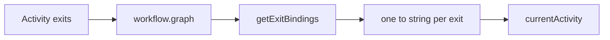
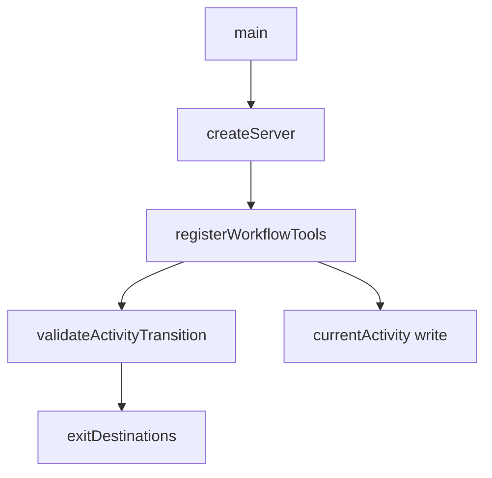
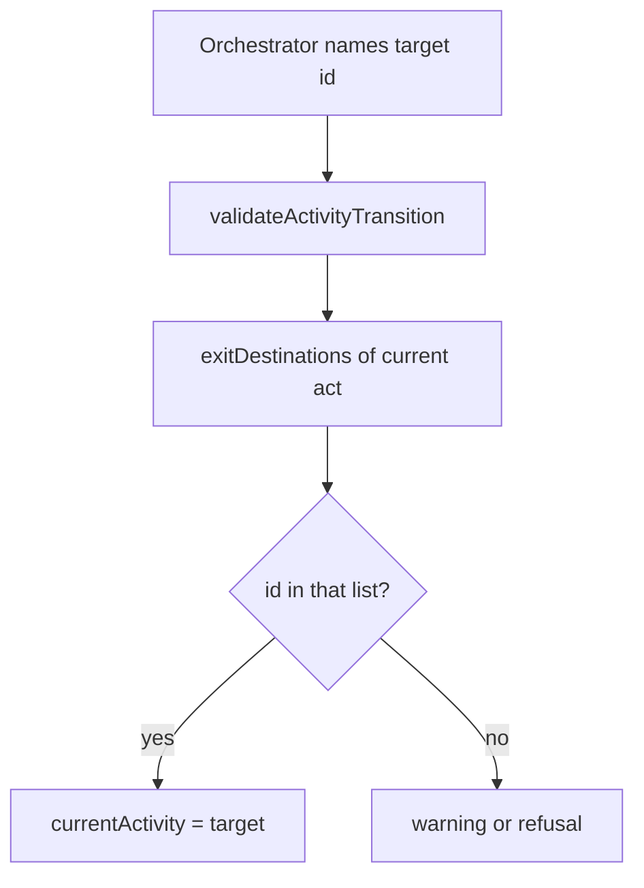

# Workflow graph — Comprehension

A workflow's graph is the single home for routing: each activity names outcomes, and the graph names the one next activity (or the terminal sentinel) each outcome leads to.

## Structure

Routing has two halves that meet in one reader. An activity declares named exits. The workflow file binds each of those exits to a destination string. Every load-time and run-time reader that needs where this activity can go goes through that meeting point.

### Overview

The dependency shape is activity exits into the graph map, then into one binding reader, then into one session field.

### Project

The server is TypeScript on Node, package `@m2ux/workflow-server`. Definitions live on the `workflows` branch. This area's code lives under schema, loaders, utils, and tools in the worktree at revision `d54f3562f2781e63201d17b0423de5e8b1ff08fa`.

#### Build units

| Unit | Path | Role |
|------|------|------|
| Schema | [workflow.schema.ts](https://github.com/m2ux/workflow-server/blob/d54f3562f2781e63201d17b0423de5e8b1ff08fa/src/schema/workflow.schema.ts) | Graph type |
| Loader | [workflow-loader.ts](https://github.com/m2ux/workflow-server/blob/d54f3562f2781e63201d17b0423de5e8b1ff08fa/src/loaders/workflow-loader.ts) | Bindings, load check, terminal sentinel |
| Validation | [validation.ts](https://github.com/m2ux/workflow-server/blob/d54f3562f2781e63201d17b0423de5e8b1ff08fa/src/utils/validation.ts) | Transition and reported-exit checks |
| Reachability | [activity-variables.ts](https://github.com/m2ux/workflow-server/blob/d54f3562f2781e63201d17b0423de5e8b1ff08fa/src/utils/activity-variables.ts) | Guard walk over destinations |
| Tools | [workflow-tools.ts](https://github.com/m2ux/workflow-server/blob/d54f3562f2781e63201d17b0423de5e8b1ff08fa/src/tools/workflow-tools.ts) | Pointer move, exit map, checkpoint payload |
| Session | [session.schema.ts](https://github.com/m2ux/workflow-server/blob/d54f3562f2781e63201d17b0423de5e8b1ff08fa/src/schema/session.schema.ts) | Walk position |

#### Entry points

Process start is [main](https://github.com/m2ux/workflow-server/blob/d54f3562f2781e63201d17b0423de5e8b1ff08fa/src/index.ts#L30) to [createServer](https://github.com/m2ux/workflow-server/blob/d54f3562f2781e63201d17b0423de5e8b1ff08fa/src/server.ts#L12) to tool registration. A walk reaches this area when a session advances: the orchestrator names a target activity id, validation asks whether that id is among the current activity's destinations, and the session records the target as the new position.

### Module Map

Each module below owns one slice of the two-halves split: the type, the meeting point, the load check, the walk check, or the pointer.

| Module | Responsibility | Depends on |
|--------|----------------|------------|
| [GraphSchema](https://github.com/m2ux/workflow-server/blob/d54f3562f2781e63201d17b0423de5e8b1ff08fa/src/schema/workflow.schema.ts#L51) | Nested string records | zod |
| [getExitBindings](https://github.com/m2ux/workflow-server/blob/d54f3562f2781e63201d17b0423de5e8b1ff08fa/src/loaders/workflow-loader.ts#L496) | Pair each declared exit with its bound `to` | [getActivity](https://github.com/m2ux/workflow-server/blob/d54f3562f2781e63201d17b0423de5e8b1ff08fa/src/loaders/workflow-loader.ts) |
| [exitDestinations](https://github.com/m2ux/workflow-server/blob/d54f3562f2781e63201d17b0423de5e8b1ff08fa/src/loaders/workflow-loader.ts#L506) | Deduped list of `to` strings | getExitBindings |
| [validateExitBindings](https://github.com/m2ux/workflow-server/blob/d54f3562f2781e63201d17b0423de5e8b1ff08fa/src/loaders/workflow-loader.ts#L520) | Load fails on unbound exit or unknown destination | getActivity |
| [validateActivityTransition](https://github.com/m2ux/workflow-server/blob/d54f3562f2781e63201d17b0423de5e8b1ff08fa/src/utils/validation.ts#L33) | Requested id must be a destination of the current activity | exitDestinations |
| [validateReportedExit](https://github.com/m2ux/workflow-server/blob/d54f3562f2781e63201d17b0423de5e8b1ff08fa/src/utils/validation.ts#L239) | Reported exit's `to` must equal the requested id | getExitBindings |
| [activityGraph](https://github.com/m2ux/workflow-server/blob/d54f3562f2781e63201d17b0423de5e8b1ff08fa/src/utils/activity-variables.ts#L540) | Reachability map for the activity-variables guard | workflow.graph |

### Design Patterns

#### Two-halves routing

An activity says what happened. The workflow says where that goes. A borrowed activity can sit in two workflows because destinations are not on the activity.

#### Single meeting point

[getExitBindings](https://github.com/m2ux/workflow-server/blob/d54f3562f2781e63201d17b0423de5e8b1ff08fa/src/loaders/workflow-loader.ts#L496) is the documented meeting point. Load checks, transition checks, tool headers, and checkpoint exit payloads all read it or `exitDestinations`. GitNexus upstream impact on that function is CRITICAL: five direct callers, eight processes.

### Core Types

| Type | Role |
|------|------|
| [Graph](https://github.com/m2ux/workflow-server/blob/d54f3562f2781e63201d17b0423de5e8b1ff08fa/src/schema/workflow.schema.ts#L52) | Nested string records: one destination string per exit |
| [ExitBinding](https://github.com/m2ux/workflow-server/blob/d54f3562f2781e63201d17b0423de5e8b1ff08fa/src/loaders/workflow-loader.ts#L477) | `exit`, `to`, optional `when` / `isDefault` / `immediate` |
| [SessionView](https://github.com/m2ux/workflow-server/blob/d54f3562f2781e63201d17b0423de5e8b1ff08fa/src/utils/validation.ts#L14) | `act` is the current activity id used in transition checks |

### Traits and Interfaces

The wider system reaches this area through the session projection and the binding record, not through a class hierarchy.

| Interface | Reached for |
|-----------|-------------|
| [SessionView](https://github.com/m2ux/workflow-server/blob/d54f3562f2781e63201d17b0423de5e8b1ff08fa/src/utils/validation.ts#L14) | Storage-agnostic current activity for walk checks |
| [ExitBinding](https://github.com/m2ux/workflow-server/blob/d54f3562f2781e63201d17b0423de5e8b1ff08fa/src/loaders/workflow-loader.ts#L477) | One declared exit paired with one destination string |
| [ActivityGraph](https://github.com/m2ux/workflow-server/blob/d54f3562f2781e63201d17b0423de5e8b1ff08fa/src/utils/activity-variables.ts#L532) | Activity id to destination-id list for the guard walk |

### Data Model

#### Destination

[GraphSchema](https://github.com/m2ux/workflow-server/blob/d54f3562f2781e63201d17b0423de5e8b1ff08fa/src/schema/workflow.schema.ts#L51) is `z.record(z.record(z.string()))`. A destination is one activity id, or [TERMINAL_SENTINEL](https://github.com/m2ux/workflow-server/blob/d54f3562f2781e63201d17b0423de5e8b1ff08fa/src/loaders/workflow-loader.ts#L584) (`__terminal__`). There is no list, object, or collection form.

#### Walk position

[currentActivity](https://github.com/m2ux/workflow-server/blob/d54f3562f2781e63201d17b0423de5e8b1ff08fa/src/schema/session.schema.ts#L96) is one string on the session file. Active [WorkflowState](https://github.com/m2ux/workflow-server/blob/d54f3562f2781e63201d17b0423de5e8b1ff08fa/src/schema/state.schema.ts#L182-L184) requires it. There is no frontier list beside it.

Child workflows are a different grain: each child has its own `currentActivity` inside `triggeredWorkflows[]`. That is [hierarchical dispatch](hierarchical-dispatch.md), not sibling activities of one graph.

## Behaviour

Trust for what runs next enters as an activity id the orchestrator supplies. The server checks it against the current activity's destinations, then writes it onto `currentActivity`.

### Data Flow Map

#### Producer to consumer

[validateExitBindings](https://github.com/m2ux/workflow-server/blob/d54f3562f2781e63201d17b0423de5e8b1ff08fa/src/loaders/workflow-loader.ts#L520) is the producer of a sound graph: every declared exit is bound, every destination is a known activity or the sentinel. [validateActivityTransition](https://github.com/m2ux/workflow-server/blob/d54f3562f2781e63201d17b0423de5e8b1ff08fa/src/utils/validation.ts#L33) consumes that list at walk time from [registerWorkflowTools](https://github.com/m2ux/workflow-server/blob/d54f3562f2781e63201d17b0423de5e8b1ff08fa/src/tools/workflow-tools.ts#L928). [validateReportedExit](https://github.com/m2ux/workflow-server/blob/d54f3562f2781e63201d17b0423de5e8b1ff08fa/src/utils/validation.ts#L239) consumes the same bindings when the orchestrator also names the exit: `binding.to` must equal the requested id.

The pointer write is [draft.currentActivity = activity_id](https://github.com/m2ux/workflow-server/blob/d54f3562f2781e63201d17b0423de5e8b1ff08fa/src/tools/workflow-tools.ts#L842). A worker never reads the workflow graph. [getExitBindings](https://github.com/m2ux/workflow-server/blob/d54f3562f2781e63201d17b0423de5e8b1ff08fa/src/loaders/workflow-loader.ts#L496) is projected to that worker as `exit_destinations` on the activity payload so it can resolve its own next id without a control-plane read.

### Design Patterns

#### Scalar destination, scalar position

Every runtime path that selects a next step treats `to` as one id and the in-flight set as one field. Checkpoint present/respond handlers attach one `next_activity` from the same binding.

### Invariant Alignment

| Invariant | Producer enforces? | Consumer assumes? | Gap? |
|-----------|-------------------|-------------------|------|
| Each exit has exactly one destination string | Yes — GraphSchema and validateExitBindings | Yes — ExitBinding.to, validateReportedExit | None today; a list destination would fail both |
| Walk position is one activity | Yes — currentActivity string | Yes — SessionView.act | None today; a fan in flight has nowhere to record sibling branches |
| Terminal sentinel ends the run | Yes — compared as a string | Yes — validateActivityTransition allows it from any activity | None |

### Execution Context

Graph checks run on the MCP tool thread that advances the session. A failed load is a refused workflow, not a skipped edge. A mismatched transition is a validation warning or error on that call. There is no concurrent walker: one `currentActivity` is the whole in-flight set.

### Error Handling

| Error type | Consumer reaction |
|------------|-------------------|
| Unbound exit or unknown destination at load | Load fails; the workflow is not walkable |
| Requested id not in exitDestinations | Transition invalid |
| Reported exit bound to a different id | Reported-exit warning |
| Active checkpoint while advancing | Hard throw; resolve the gate first |

### Resource Bounds

The graph itself has no numeric cap. What it bounds is identity: a destination must be a known activity id or the sentinel, checked as a string equality at load. [activityGraph](https://github.com/m2ux/workflow-server/blob/d54f3562f2781e63201d17b0423de5e8b1ff08fa/src/utils/activity-variables.ts#L540) walks `Object.values` of each activity's graph row once per guard pass.

| Site | Live at peak | Bounded by |
|------|--------------|------------|
| validateExitBindings | Every exit of every activity | Workflow size |
| activityGraph | One list per activity | Same |

### Operational Scenarios

| Scenario | Effect on this code path | Risk |
|----------|------------------------|------|
| First activity | currentActivity empty; only initialActivity is legal | Low |
| Immediate checkpoint exit | Remaining steps do not run; payload names binding.to | Medium if to were a list — payload shape is one id |
| Re-entry on a cycle | Same currentActivity field overwritten | Low |
| Child workflow running | Parent and child each hold one currentActivity | Different grain from a graph fan |

## Inferred Design Rationale

Rationale below is read out of the types, the load check, and the comments on getExitBindings.

### Destinations live on the workflow, not the activity

The graph comment states that a borrowed activity sits in this graph without its lending workflow having a say. That keeps outcomes portable and routing local to the workflow file.

What it costs: every reader of where next must go through the graph. Widening a destination from a string to a list is a change to that shared type and to every consumer of `to`.

### One string position on the session

A running session must have currentActivity. The field is a scalar, so what is in flight is always one activity id. Hierarchical children nest another scalar rather than listing siblings on the parent.

What it costs: a fan in flight cannot be re-derived from session state as a set of open branches. A crash and resume would see one pointer.

### Load fails closed

validateExitBindings treats an unbound exit and an unknown destination as load errors, not warnings, because a session cannot be walked through a graph with a hole in it. The comment says so on the function.

What it costs: a new destination shape that the load check does not understand fails the corpus until the check and the schema move together.

## Domain Concept Mapping

Independence and repetition are not routing facts in this codebase. Repeating work over a collection happens inside an activity (scatter-gather). Independent activities occupy the walk one after another because each destination is one id and the session holds one position.

### Glossary

| Domain term | Technical construct | Description |
|-------------|-------------------|-------------|
| Graph | workflow.graph | Table of exit → destination |
| Exit / outcome | activity.exits[].id | What happened, named by the activity |
| Destination | GraphSchema inner string | Where the walk goes next |
| Join | none in code today | Spec term for the activity entered after a fan; not a schema construct |
| Frontier | currentActivity | Spec term for what is in flight; the code holds one id |
| Terminal | TERMINAL_SENTINEL | Destination that ends the run |
| Child workflow | triggeredWorkflows[].state | A nested session, not a graph branch |

### Domain Model

Scatter-gather fans work units inside one activity, which is why a parallel branch today has no activity identity. Hierarchical dispatch nests another session, each still scalar. Neither is a graph destination that names several next activities.

## References

Coverage: graph schema, exit bindings, transition validation, session position, reachability walk, checkpoint exit payload. Revision `d54f3562f2781e63201d17b0423de5e8b1ff08fa`.

| Reference | What it carries |
|-----------|-----------------|
| [comprehension log](../planning/2026-09-09-parallel-activities/15-codebase-comprehension.md) | Questions, caller enumeration, challenge lenses |
| [orchestration.md](orchestration.md) | Broader server layout; dated 2026-06-18 |
| [hierarchical-dispatch.md](hierarchical-dispatch.md) | Child sessions, not graph fans |
| [zod-schemas.md](zod-schemas.md) | Schema file map |
| [state-tools.md](state-tools.md) | Session persistence |

| Contributing work package | Dates |
|---------------------------|-------|
| Parallel activities #671 | 2026-09-09 |
