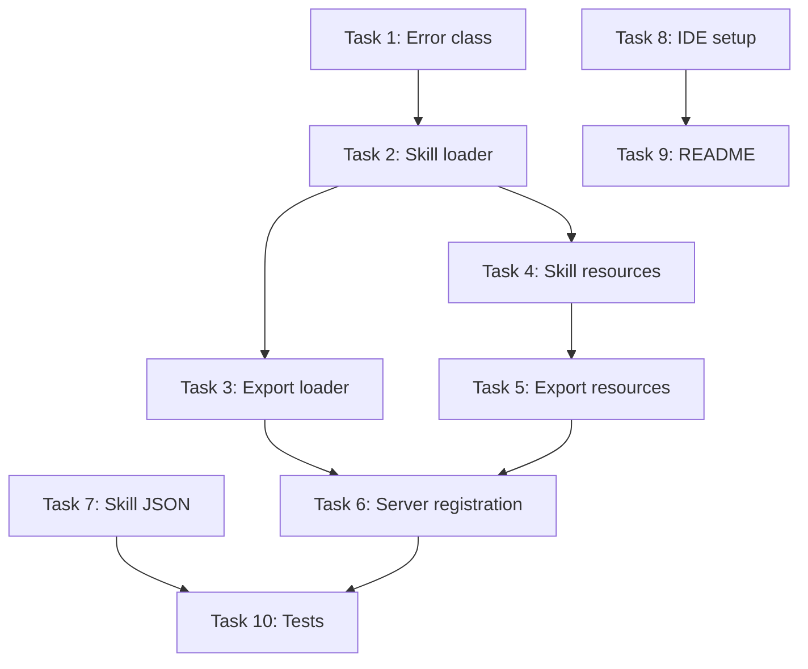

# Work Package Plan: Skills Interface

## Overview

| Field | Value |
|-------|-------|
| **Issue** | #1 - Agents lack guidance for consistent workflow tool usage |
| **PR** | #2 - feat: skills interface for workflow execution guidance |
| **Branch** | `feat/skills-interface` |
| **Estimated Effort** | ~2 hours agentic time |
| **Status** | ✅ **COMPLETE** - Merged 2026-01-20 |

## Problem Statement

Agents using workflow-server MCP tools have no structured guidance for tool selection and execution order, leading to inconsistent workflow execution across sessions.

## Solution Approach

Implement a skills interface following the concept-rag pattern:

1. **Skill Definition** - JSON file encoding tool orchestration and workflow interpretation guidance
2. **MCP Resources** - Expose skill via `workflow://skills` resources
3. **IDE Bootstrap** - Markdown file instructing agents to load skill before tool usage

## Design Decisions

| Decision | Rationale |
|----------|-----------|
| Single "workflow-execution" skill | Works with any workflow; avoids per-workflow maintenance |
| MCP Resources (not Tools) | Skills are read-only context, not actions |
| Hybrid JSON structure | Token-efficient; balances tool lookup and execution pattern |
| Agent-managed state | Simpler than persistent state; sufficient for session-based execution |
| Hardcoded skill path | Skills in `prompts/skills/`; no env var needed |

## Implementation Tasks

### Task 1: Add SkillNotFoundError

**File:** `src/errors.ts`

Add error class following existing pattern:

```typescript
export class SkillNotFoundError extends Error {
  readonly code = 'SKILL_NOT_FOUND';
  constructor(public readonly skillId: string) { 
    super(`Skill not found: ${skillId}`); 
    this.name = 'SkillNotFoundError'; 
  }
}
```

### Task 2: Create Skill Loader

**File:** `src/loaders/skill-loader.ts`

Create loader following guide-loader pattern:
- `listSkills()` - Return available skills
- `readSkill()` - Load skill JSON by ID

### Task 3: Export Skill Loader

**File:** `src/loaders/index.ts`

Add export for skill loader.

### Task 4: Create Skill Resources

**File:** `src/resources/skill-resources.ts`

Create MCP resource handlers:
- Static resource: `workflow://skills` (list)
- Dynamic resource: `workflow://skills/{id}` (get specific)

### Task 5: Export Skill Resources

**File:** `src/resources/index.ts`

Add export for skill resources.

### Task 6: Register Skill Resources in Server

**File:** `src/server.ts`

Import and register skill resources alongside guide resources.

### Task 7: Create Skill JSON

**File:** `prompts/skills/workflow-execution.json`

```json
{
  "id": "workflow-execution",
  "version": "1.0.0",
  "capability": "Execute workflows from start to completion with consistent tool usage",
  "execution_pattern": {
    "start": ["list_workflows", "get_workflow"],
    "per_phase": ["get_phase", "get_checkpoint"],
    "transitions": ["validate_transition"]
  },
  "tools": {
    "list_workflows": {
      "when": "Discovering available workflows",
      "returns": "Array of workflow IDs with metadata",
      "next": "get_workflow"
    },
    "get_workflow": {
      "when": "Loading workflow for execution",
      "returns": "Complete workflow definition",
      "preserve": ["id", "initialPhase", "variables", "rules", "phases"]
    },
    "get_phase": {
      "when": "Entering a new phase",
      "returns": "Phase details with steps, checkpoints, decisions",
      "preserve": ["steps", "checkpoints", "decisions", "transitions"]
    },
    "get_checkpoint": {
      "when": "User decision required at checkpoint",
      "returns": "Checkpoint options and their effects",
      "action": "Present options to user; apply selected effect"
    },
    "validate_transition": {
      "when": "Moving between phases",
      "returns": "Validity of transition and applicable conditions"
    }
  },
  "state": {
    "track": ["workflowId", "currentPhase", "completedPhases", "variables", "checkpointResponses"],
    "initialize": "On get_workflow, set currentPhase to initialPhase",
    "update_on": {
      "phase_transition": "Add previous phase to completedPhases; update currentPhase",
      "checkpoint_response": "Record response; apply effects (setVariable, transitionTo, skipPhases)",
      "variable_change": "Update variables object"
    }
  },
  "interpretation": {
    "transitions": "Evaluate conditions against state.variables; take matching transition or default",
    "checkpoints": "Present message and options to user; apply effect from selected option",
    "decisions": "Evaluate branch conditions; take first matching branch or default",
    "loops": "For forEach: iterate over collection; For while: check condition before each iteration"
  },
  "errors": {
    "workflow_not_found": {
      "cause": "Invalid workflow_id parameter",
      "recovery": "Call list_workflows to discover valid IDs"
    },
    "phase_not_found": {
      "cause": "Invalid phase_id or workflow not loaded",
      "recovery": "Verify phase exists in workflow.phases array"
    },
    "invalid_transition": {
      "cause": "Transition not allowed from current phase",
      "recovery": "Check phase.transitions for valid targets; evaluate conditions"
    },
    "missing_variable": {
      "cause": "Condition references undefined variable",
      "recovery": "Check workflow.variables for required variables; ensure checkpoint effects set them"
    },
    "checkpoint_required": {
      "cause": "Attempting to transition past blocking checkpoint",
      "recovery": "Present checkpoint to user; await response before continuing"
    }
  }
}
```

### Task 8: Create IDE Setup File

**File:** `prompts/ide-setup.md`

```markdown
Paste the following into your IDE rules location:

```
Before using workflow-server MCP tools, fetch the `workflow://skills/workflow-execution` resource.
```
```

### Task 9: Update README

**File:** `README.md`

Add skills section documenting:
- New MCP resources
- IDE setup instructions
- Skill purpose

### Task 10: Add Tests

**File:** `tests/skill-loader.test.ts`

Test skill loader functions:
- listSkills returns available skills
- readSkill loads valid skill JSON
- readSkill returns error for invalid ID

## Dependencies



## File Changes Summary

| Action | File | Description |
|--------|------|-------------|
| Modify | `src/errors.ts` | Add SkillNotFoundError |
| Create | `src/loaders/skill-loader.ts` | Skill loading functions |
| Modify | `src/loaders/index.ts` | Export skill loader |
| Create | `src/resources/skill-resources.ts` | MCP resource handlers |
| Modify | `src/resources/index.ts` | Export skill resources |
| Modify | `src/server.ts` | Register skill resources |
| Create | `prompts/skills/workflow-execution.json` | Skill definition |
| Create | `prompts/ide-setup.md` | Bootstrap instructions |
| Modify | `README.md` | Documentation |
| Create | `tests/skill-loader.test.ts` | Unit tests |

## Success Criteria

- [x] `workflow://skills` resource lists available skills
- [x] `workflow://skills/workflow-execution` returns skill JSON
- [x] IDE setup file provides clear bootstrap instructions
- [x] Skill JSON is ~300-400 tokens
- [x] All existing tests pass
- [x] New tests pass for skill loader

## Additional Deliverables (Added During Implementation)

- [x] Intents layer (`workflow://intents`, 3 intents)
- [x] ADR-001 documenting Intent→Skill→Tool architecture
- [x] Simplified README with links to detailed docs
- [x] SETUP.md and docs/api-reference.md

## Completion

| Metric | Value |
|--------|-------|
| **Files Changed** | 21 |
| **Lines Added** | 1,047 |
| **Tests Added** | 17 |
| **Total Tests** | 69 (all passing) |
| **Merged** | 2026-01-20 |

## Date

2026-01-20
