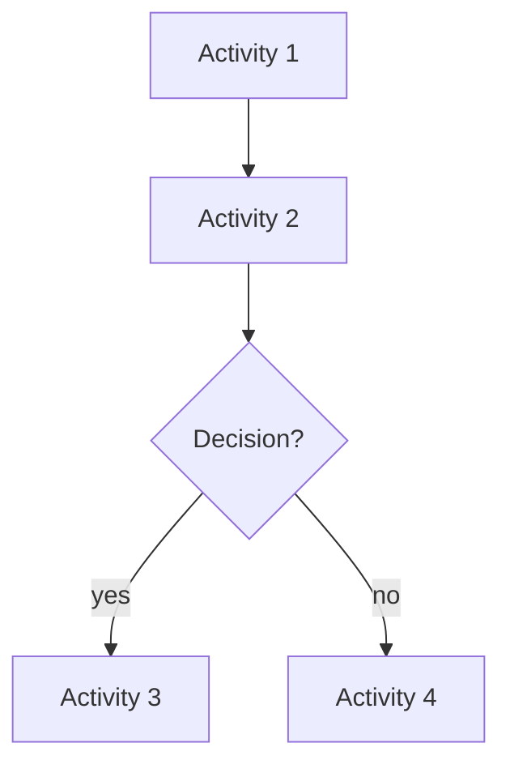
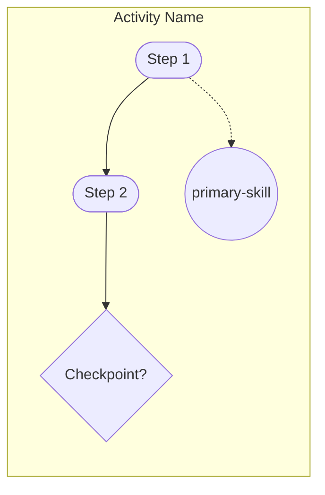

# Implementation Analysis: Workflow README Diagrams

**Issue:** #29  
**PR:** #30  
**Date:** 2026-01-28

---

## Current State

### Existing Documentation
- `workflows/README.md` - Branch structure overview, no workflow diagrams
- No README.md files in individual workflow folders

### Workflow Inventory

| Workflow | Activities | Skills | Checkpoints | Decisions | Loops |
|----------|------------|--------|-------------|-----------|-------|
| meta | 3 | 3 | 0 | 0 | 0 |
| work-package | 11 | 3 | 17 | 2 | 1 |
| work-packages | 7 | 0 | 6 | 0 | 2 |
| **Total** | **21** | **6** | **23** | **2** | **3** |

---

## Meta Workflow Analysis

### Structure
- **Type:** Independent entry points (no sequential flow)
- **Purpose:** Bootstrap workflow for lifecycle management

### Activities
| ID | Name | Primary Skill | Steps |
|----|------|---------------|-------|
| start-workflow | Start Workflow | workflow-execution | 9 |
| resume-workflow | Resume Workflow | workflow-execution | 9 |
| end-workflow | End Workflow | workflow-execution | 6 |

### Skills
| ID | Capability |
|----|------------|
| activity-resolution | Resolve user goals to appropriate activities and skills |
| workflow-execution | Execute workflows following schema patterns |
| state-management | Manage workflow state across sessions |

### Diagram Approach
- Single diagram showing 3 independent activities
- Each activity linked to its skills
- No transitions between activities (recognition pattern matching)

---

## Work-Package Workflow Analysis

### Structure
- **Type:** Sequential with conditional branches and feedback loops
- **Purpose:** Implement ONE work package from inception to merged PR

### Activity Flow
```
issue-verification
    ├──[needs_elicitation=true]──> requirements-elicitation ──> implementation-analysis
    └──[needs_elicitation=false]─────────────────────────────> implementation-analysis
                                                                      │
    ┌──────────────[needs_research=true]──────────────────────────────┤
    │                                                                 │
    ▼                                                                 ▼
research ──────────────────────────────────────────────────────> plan-prepare
                                                                      │
                                                                      ▼
                                                                  implement
                                                                      │
                                                                      ▼
    ┌───────────────────────────────────────────────────────────  validate
    │                                                                 │
    │ [minor issues]                     [major issues]               │ [pass]
    │      │                                  │                       │
    │      ▼                                  ▼                       ▼
    └─> implement                        plan-prepare          strategic-review
                                                                      │
                                              ┌───────────────────────┤
                                              │ [issues]              │ [pass]
                                              ▼                       ▼
                                          plan-prepare            finalize
                                                                      │
                                                                      ▼
                                                                  update-pr
                                                                      │
                                                                      ▼
                                                            post-implementation
                                                                      │
                                              ┌───────────────────────┤
                                              │ [significant changes] │
                                              ▼                       ▼
                                          plan-prepare              END
```

### Checkpoints by Activity
| Activity | Checkpoints |
|----------|-------------|
| issue-verification | issue-verification, issue-created, pr-created |
| requirements-elicitation | requirements-confirmed |
| implementation-analysis | research-decision |
| research | kb-insights, web-research-confirmed |
| plan-prepare | approach-confirmed, ready-implement |
| implement | task-progress, code-review, arch-significance, adr-confirmed |
| validate | (decision only) |
| strategic-review | review-findings |
| update-pr | pr-description |
| post-implementation | review-received, review-outcome |

### Skills
| ID | Capability | Used By |
|----|------------|---------|
| code-review | Rust/Substrate code review | implement |
| test-review | Test suite quality review | validate |
| pr-review-response | Respond to PR review feedback | post-implementation |

---

## Work-Packages Workflow Analysis

### Structure
- **Type:** Sequential with triggers
- **Purpose:** Plan and coordinate multiple work packages

### Activity Flow
```
scope-assessment ──> folder-setup ──> analysis ──> package-planning ──> prioritization
                                                        │                    │
                                                   [forEach]                 │
                                                   package                   │
                                                                             ▼
                                                                      finalize-roadmap
                                                                             │
                                                                             ▼
                                                                      implementation
                                                                             │
                                                                        [forEach]
                                                                        package
                                                                             │
                                                                    ┌────────┴────────┐
                                                                    ▼                 │
                                                              work-package         (loop)
                                                              workflow             back
                                                                    │                 │
                                                                    └─────────────────┘
```

### Checkpoints by Activity
| Activity | Checkpoint |
|----------|------------|
| scope-assessment | scope-confirmed |
| folder-setup | folder-created |
| analysis | analysis-confirmed |
| package-planning | plans-created |
| prioritization | priority-confirmed |
| finalize-roadmap | roadmap-complete |

### Loops
| Activity | Loop Type | Over |
|----------|-----------|------|
| package-planning | forEach | work_packages |
| implementation | forEach | remaining_packages |

---

## Diagram Patterns

### Schema-to-Mermaid Mapping

| Schema Element | Mermaid Syntax | Visual |
|----------------|----------------|--------|
| Activity | `id[Name]` | Rectangle |
| Checkpoint | `id{Question?}` | Diamond |
| Decision | `id{Decision}` | Diamond |
| Step | `id([Step])` | Rounded rect |
| Skill | `id((skill))` | Circle |
| Loop | `id[[forEach: var]]` | Stadium |
| Conditional transition | `-->|condition|` | Labeled arrow |
| Default transition | `-->` | Plain arrow |

### Layered Diagram Structure

**Layer 1: Main Flow**


**Layer 2: Activity Detail**


---

## Complexity Assessment

| Workflow | Complexity | Diagram Estimate |
|----------|------------|------------------|
| meta | Low | 1 main + 3 activity details |
| work-package | High | 1 main + 11 activity details |
| work-packages | Medium | 1 main + 7 activity details |

**Total diagrams needed:** 3 main flow + 21 activity details = **24 diagrams**

---

## Baseline Metrics

| Metric | Current | Target |
|--------|---------|--------|
| READMEs with diagrams | 0 | 3 |
| Workflow documentation | 1 (root only) | 4 |
| Visual accuracy | N/A | 100% schema match |

---

## Risks and Considerations

1. **Mermaid complexity:** Work-package workflow has many feedback loops; may need simplified main diagram
2. **Maintenance:** Manual diagrams may drift from schema changes
3. **Readability:** Very detailed diagrams may be hard to read; balance detail with clarity
