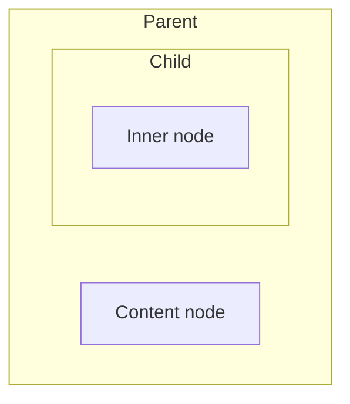
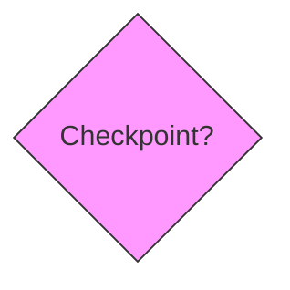
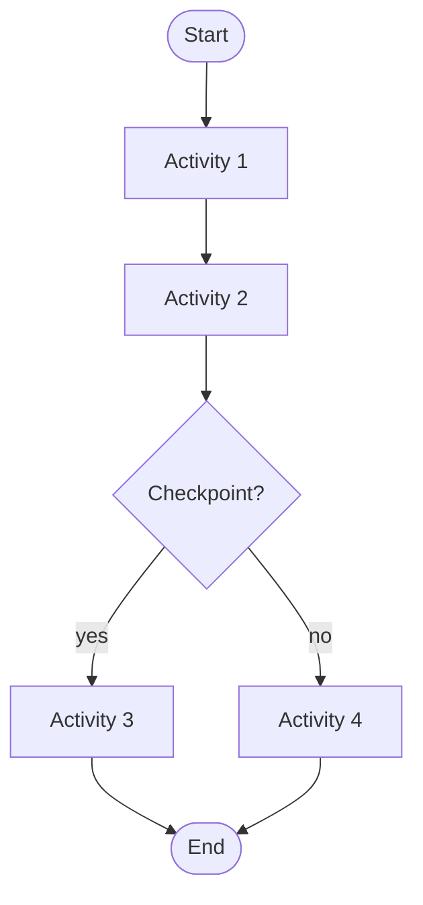
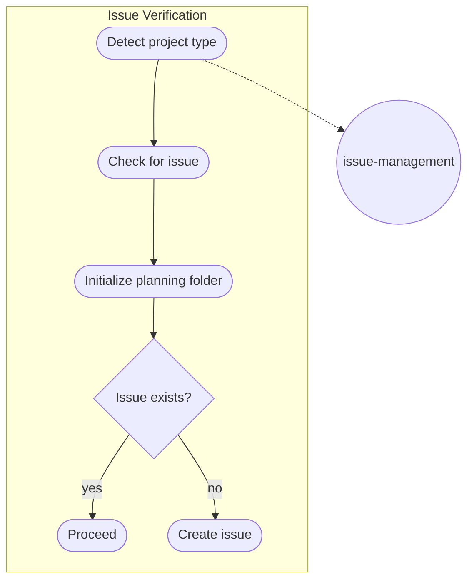
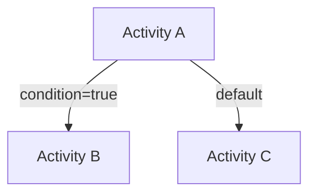

# Research: Mermaid Diagrams for Workflows

**Issue:** #29  
**PR:** #30  
**Date:** 2026-01-28

---

## Research Questions

1. What are best practices for complex Mermaid flowcharts?
2. How do subgraphs work for nested structures?
3. What node shapes to use for different workflow elements?
4. Are there GitHub rendering limitations to consider?

---

## Findings

### 1. Complexity Management

**Key Constraint:** Flowcharts exhibit O(n²) complexity - **avoid exceeding 100 connections** per diagram.

**Implications for this work package:**
- `work-package` workflow has 11 activities with complex transitions → may need simplified main diagram
- Use layered approach: main flow diagram + detail diagrams per activity
- Keep individual diagrams focused and readable

### 2. Subgraph Support

**Status:** Subgraphs are supported but can be problematic when nested.

**Best practice:** Add at least one node to parent subgraphs before nesting:


**Implication:** Use flat subgraphs for activities rather than deep nesting.

### 3. Node Shape Conventions

| Workflow Element | Mermaid Shape | Syntax |
|-----------------|---------------|--------|
| Activity | Rectangle | `id[Name]` |
| Checkpoint | Diamond | `id{Question?}` |
| Decision | Diamond | `id{Decision}` |
| Step | Rounded rectangle | `id([Step])` |
| Skill | Circle | `id((skill))` |
| Loop | Subroutine | `id[[forEach]]` |
| Start/End | Stadium | `id([Start])` |

### 4. GitHub Rendering

**Supported:** Native Mermaid rendering in markdown files, PRs, issues.

**Limitations:**
- Some hyperlinks and tooltips may not work
- Special characters can break rendering
- Always test in GitHub preview

**Version check:** Use `info` diagram type to verify Mermaid version.

### 5. Flowchart Declaration

**Required:** Every diagram must start with declaration:
```
graph TD    %% Top-down
graph LR    %% Left-right
flowchart TD  %% Alternative syntax
```

### 6. Styling for Visual Distinction



Use consistent colors:
- Checkpoints: Pink/magenta background
- Decisions: Yellow background  
- Skills: Blue background
- Loops: Green background

---

## Diagram Patterns for Workflows

### Main Flow Diagram Pattern



### Activity Detail Diagram Pattern



### Transition with Conditions



---

## Recommendations

1. **Layered structure:** Main flow + activity details (as specified in requirements)
2. **Keep diagrams under 50 connections** for readability (well under 100 limit)
3. **Use consistent node shapes** per element type
4. **Test rendering on GitHub** before finalizing
5. **Avoid deep subgraph nesting** - prefer flat structure with clear sections
6. **Use LR (left-right) for wide activities** with many parallel steps
7. **Use TD (top-down) for sequential flows**

---

## Sources

- [Mermaid Flowchart Syntax](https://mermaid.js.org/syntax/flowchart.html)
- [Mermaid Chart Blog - Complexity](https://www.mermaidchart.com/blog/posts/flow-charts-are-on2-complex-so-dont-go-over-100-connections)
- [GitHub Creating Diagrams](https://docs.github.com/en/get-started/writing-on-github/working-with-advanced-formatting/creating-diagrams)
- [Mermaid Chart Shapes](https://docs.mermaidchart.com/mermaid/flowchart/shapes)
