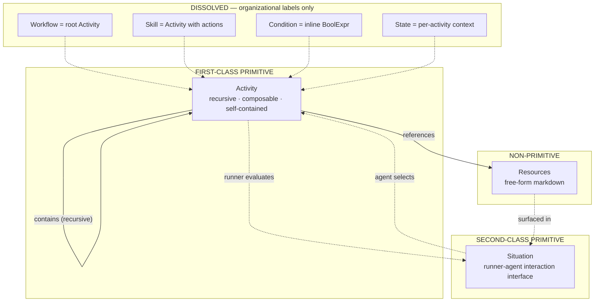
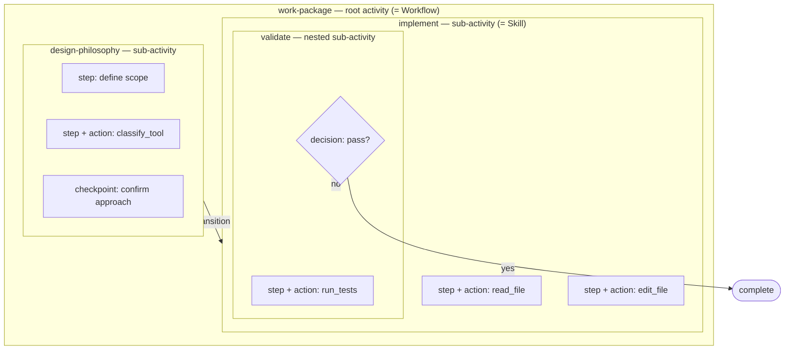
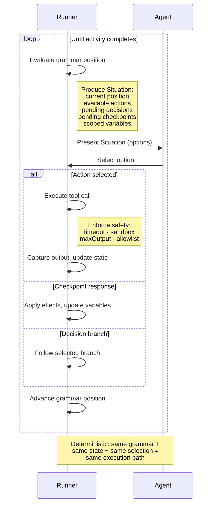
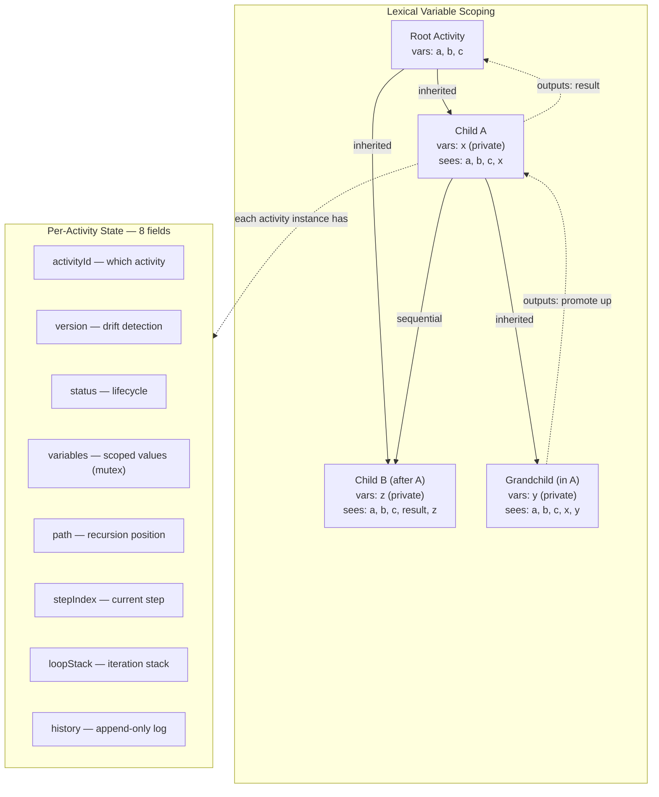
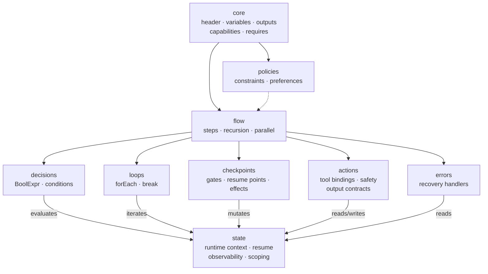

# Orchestra DSL v2 — Requirements Elicitation

| | |
|---|---|
| **Issue** | [#45](https://github.com/m2ux/workflow-server/issues/45) |
| **Branch** | `feat/orchestra-dsl-remaining-primitives` |
| **Date** | 2026-02-14 |
| **Activity** | requirements-elicitation |

---

## 1. Problem Statement

The Orchestra DSL specification (`docs/orchestra-specification.md`) defines formal grammar and semantic constraints only for the **activity** primitive (section 3). The remaining primitives — workflow, skill, condition, and state — have JSON schemas but lack formal grammar, constraints, validation rules, and examples. This gap prevents validation tooling, makes agent interpretation rely on implicit conventions, and leaves the specification incomplete.

**Evolved scope**: Through elicitation, the problem transformed from "add grammar for 4 more primitives" to "redesign Orchestra as a unified DSL with a single recursive primitive (Activity), a TypeScript embedded type system, and a runner-mediated execution model."

## 2. Stakeholder Input

Three foundational points provided by the stakeholder at the start of elicitation:

1. **Primitive Hierarchy Reclassification**: Workflows are simply activity sequences. Skills represent a protocol specialised to use tools. The proposal was to reclassify the first-class / second-class boundaries — activities, conditions, and state as first-class; workflows and skills as second-class compositions.

2. **Existing Artifacts Inform Design**: The actual `.toon` files in the `workflows/` directory should inform the decision process for defining first-class primitive boundaries. The goal is an efficient composability architecture that remains sufficiently expressive.

3. **Situation Primitive**: A new second-class primitive is needed — one that aggregates workflow, state, activity, resources into a structured response for an agent. When an agent makes a "get-situation" call mid-workflow, the response includes current workflow, activity, state, available skills/resources, and possibilities for action.

## 3. Architecture Decisions

Decisions are listed in the order they were made during elicitation. Each builds on the previous.

### 3.1 Primitive Hierarchy Evolution

| Stage | First-Class | Second-Class | Trigger |
|-------|-------------|--------------|---------|
| Initial | Activity, Condition, State, Protocol | Workflow, Skill, Situation | Stakeholder reclassification + protocol addition |
| After recursive activities | Activity, Condition, State | Skill, Situation | Workflow dissolved into root activity |
| After protocol collapse | Activity, Condition, State | Skill, Situation | Protocol subsumed by `action:` on steps |
| After condition collapse | Activity, State | Skill, Situation | Conditions subsumed into inline BoolExpr |
| After skill analysis | Activity, State | Situation | Skills are activities with action-bound steps |
| **Final** | **Activity** | **Situation** | State is per-activity runtime context, not a separate primitive |

### 3.2 Recursive Activities

Activities can contain other activities. A "workflow" is simply a root activity. This was the pivotal decision that collapsed the primitive hierarchy.

**Implications:**
- Transitions stay in activities (parent activity wires sub-activities)
- The existing `- activity: <id>` flow item becomes sub-activity invocation
- Activities declare `variables:` (artifact locations, modes, etc. are just variables)
- No separate workflow grammar needed

### 3.3 Lexical Variable Scoping (Inputs Dropped)

- Parent variables are visible to children automatically (lexical/closure-style)
- Child variables are private to the child
- `outputs:` explicitly promotes selected values back to parent scope
- `inputs:` on activities is **dropped** — parent scope is inherited
- Sibling sub-activities share parent scope; mutations from one sibling visible to the next (sequential)
- Mutex protects concurrent access (future parallelism)

### 3.4 Protocol Collapsed into Activity

Adding an `action:` primitive to activity steps allows steps to optionally bind to tool calls. This eliminates Protocol as a separate primitive. The "what/how" boundary is at the **step level**: a step without an action says *what* to do; a step with an action says *how* to do it.

**Validated against**: `elicit-requirements`, `implement-task`, `workflow-execution`, `activity-resolution`, `classify-problem`, `review-diff`, `manage-artifacts`, `create-plan`, `manage-git`, `research-knowledge-base`, `artifact-management`, `state-management`, `orchestrate-workflow` skill files — all constructs map to the enriched activity grammar.

### 3.5 Conditions Collapsed into Activity

Conditions are exclusively used within activity flow control — decisions, transitions, loop guards. They do not exist as standalone files or independent definitions. The existing activity grammar already defines boolean expressions inline (BoolExpr). The condition schema is absorbed into the activity grammar with extended operators.

### 3.6 State as Per-Activity Runtime Context

State is not a separate first-class primitive. It is the implicit runtime context of an activity execution, with a fixed minimal schema (8 fields), managed in protected memory with mutex control. Scoping rules enforce I/O contracts.

### 3.7 Skills = Activities (Organizational Label)

Gap analysis of skill `.toon` files confirmed every skill construct maps to the enriched activity grammar:
- `protocol:` steps → activity steps (some with actions)
- `tools:` → tool declarations in actions
- `inputs:/outputs:` → activity variables/outputs
- `rules:` → activity policies
- `errors:` → error handlers
- `interpretation:` → formal grammar constructs (Description Purity)
- `execution_patterns:` → activity flow (decisions, loops)

"Skill" is an organizational label for an activity with action-bound steps, not a grammar type.

### 3.8 Description Purity Principle

Descriptions in steps are labels for human readability only. All execution semantics must be expressed in formal grammar constructs (actions, decisions, loops, checkpoints, conditions, policies). No prose instructions in descriptions.

**Anti-patterns eliminated:**
- ~~`description: "Iterate through question domains, asking one question at a time"`~~ → use loop + policy
- ~~`description: "Check if already on a feature branch"`~~ → use condition
- ~~`description: "Create feature branch from main with naming convention"`~~ → use action + policy

### 3.9 Runner-Mediated Execution

Agents NEVER call tools directly. The runner evaluates the grammar, produces a Situation, the agent selects from presented options, and the runner executes the selection.

**The execution loop:**
1. Runner evaluates grammar position → produces Situation
2. Situation presented to agent (via MCP tool response or CLI output)
3. Agent selects from available options (action, checkpoint response, decision branch)
4. Runner executes selection (runs tool, applies effects, updates state)
5. Runner evaluates next grammar position → produces next Situation
6. Repeat until activity completes

**Metaphor**: Grammar is a game board. Runner is the game engine. Agent is the player.

**Impact**: Actions become declarations of runner-executable operations, not agent instructions. Checkpoints, decisions, and actions converge — all are "runner presents options, agent selects."

### 3.10 Grammar Decomposition (9 Concern-Based Modules)

The unified Activity grammar is decomposed into 9 modules by concern:

| Module | Concern |
|--------|---------|
| `core` | Header, variables, outputs, capabilities, version requirements |
| `flow` | Steps, flows, sub-activity invocation, recursion, parallel composition |
| `decisions` | Decisions, conditions, BoolExpr (extended operators) |
| `loops` | forEach, break, iteration semantics |
| `checkpoints` | Blocking gates, options, effects/state mutations, resume points |
| `actions` | Tool declarations, params, output contracts, safety annotations |
| `errors` | Structured error recovery (cause/detection/recovery) |
| `policies` | Structured constraints/preferences (replaces free-text rules) |
| `state` | Runtime context, resume semantics, observability events, scoping rules |

### 3.11 TypeScript Embedded DSL (Replaces YAML)

- **TypeScript embedded DSL** for workflow definitions (runner-interpreted)
- **TOON** remains for agent-facing artifacts
- The runner imports TypeScript modules → gets typed activity definitions
- Code runs ONCE at load time to produce data structures; runner interprets the data
- The existing workflow-server is already TypeScript — natural alignment
- No custom parser needed; the TypeScript type system enforces structural constraints at compile time

## 4. Enhancements

Eight enhancements adopted during the competitive analysis phase. All are in scope.

### 4.1 Safety Annotations on Actions (Essential)

**What**: Optional `timeout:`, `sandbox:`, `maxOutput:` fields on action-bound steps.
**Why**: Inspired by Lobster's safety-first runtime policies. The language declares intent; the runner enforces.
**Module**: `actions` — add optional safety fields to action types.

### 4.2 Resume Semantics (Essential)

**What**: `resumable:` annotation on activities; `snapshot` event type in state. Language defines valid resume points (after checkpoints, between steps) and what is serialized (8-field state).
**Why**: Inspired by Lobster's durable token pattern. Workflows span sessions; the language must define where resumption is valid.
**Module**: `state` — resume point declarations. `checkpoints` — natural resume boundaries.

### 4.3 Parallel Composition (Essential)

**What**: `parallel:` flow item executing branches concurrently with join conditions (all, first, N-of-M).
**Why**: Gap identified across PayPal, Conductor, Lamina. Sequential-only is limiting for independent tasks.
**Module**: `flow` — parallel production with branches and join semantics. `state` — parallel tracking.

### 4.4 Formal Action Output Contracts (Essential)

**What**: Actions declare output shape — variable names and types produced. Enables static validation that downstream steps can consume action results.
**Why**: Inspired by PayPal's type-safe variable store. Description Purity demands formalizing what actions produce.
**Module**: `actions` — `produces:` field with variable names and types.

### 4.5 Structured Policies (High Priority)

**What**: Elevate free-text `rules:` to structured `policy:` with `constraint:` (must/must-not), `preference:` (should/should-not), and `scope:` (applicability).
**Why**: Inspired by Lamina's policy abstraction and ai.txt's permissions model. Free-text rules violate Description Purity.
**Module**: `policies` — replaces rules in core types.

### 4.6 Observability Declarations (High Priority)

**What**: Optional `emit:` annotations on steps/activities — structured events the runner should produce.
**Why**: Gap exposed by PayPal and Conductor. The language declares what's observable; the runner implements emission.
**Module**: `state` — formalize history event types as the observability contract.

### 4.7 Tool Capability Allowlists (High Priority)

**What**: Activities declare permitted tools via `capabilities:`. Sub-activities inherit but cannot exceed parent capabilities (narrowing only).
**Why**: Inspired by Lobster's sandboxing and ai.txt's permissions model. Prevents unexpected tool access in recursive compositions.
**Module**: `core` — capabilities declaration. Constraint: every action's tool must be in the activity's capabilities.

### 4.8 Version Compatibility (Nice-to-Have)

**What**: `requires:` field in activity header declaring minimum runner version and grammar module dependencies.
**Why**: Enables graceful failure when grammar evolves across runner versions.
**Module**: `core` — requires field in header types.

## 5. Competitive Analysis Summary

### Closest Competitor: PayPal's Declarative Agent DSL

| Dimension | PayPal | Orchestra |
|-----------|--------|-----------|
| Composition | DAGs (flat) | Recursive activities |
| Human-in-the-loop | None | Checkpoints (blocking gates) |
| Formal constraints | Static validation | TypeScript types + runtime validation |
| Execution | Engine-compiled | Runner-mediated (agent selects, runner executes) |
| Scoping | Lexically scoped | Lexical with outputs-only contract |

### Closest in Philosophy: Lobster

| Dimension | Lobster | Orchestra |
|-----------|---------|-----------|
| Composition | Flat pipeline | Recursive activities |
| Branching | Binary condition gate | Multi-way decisions |
| Loops | None | forEach with break |
| Steps | CLI commands | Abstract or action-bound |
| Approvals | Binary approve/deny | Multi-option checkpoints with effects |
| Safety | First-class (timeout, sandbox, caps) | Adopted: safety annotations on actions |
| Resume | Compact token | State object with path/stepIndex/loopStack |
| Formal spec | None | TypeScript types + runtime constraints |

### Orchestra's Genuine Differentiators

1. **Runner-mediated execution** — agent selects from presented options; runner executes. No other system uses this model.
2. **Formal semantic constraints** — TypeScript compile-time types + runtime validation functions. No competitor provides this.
3. **Checkpoints as first-class human-in-the-loop** — multi-option, with variable effects. Unique in the AI workflow domain.
4. **Recursive composition with lexical scoping** — closer to programming language semantics than any workflow DSL.
5. **Description Purity** — grammar is the complete execution spec. No other system commits to this.
6. **Single unified primitive** — one grammar for workflows, skills, and protocols. Maximum composability, minimum concepts.

### Ideas Incorporated from Alternatives

| Source | Idea | How Adopted |
|--------|------|-------------|
| Lobster | Safety annotations (timeout, sandbox, caps) | Enhancement 4.1 |
| Lobster | Resume token pattern | Enhancement 4.2 |
| PayPal | Formal output contracts | Enhancement 4.4 |
| PayPal | Parallel execution | Enhancement 4.3 |
| Lamina | Policy abstraction | Enhancement 4.5 |
| ai.txt | Tool capability allowlists | Enhancement 4.7 |
| PayPal | Observability specification | Enhancement 4.6 |
| Aigentic | TypeScript embedded DSL approach | Format decision (section 10) |

## 6. Grammar Module Specification

### TypeScript Type Mapping

| Module | Concern | TypeScript Types |
|--------|---------|-----------------|
| `core` | Header, variables, outputs, capabilities, requires | `ActivityDef`, `VariableDef`, `OutputDef`, `CapabilityDef`, `RequiresDef` |
| `flow` | Steps, flows, recursion, parallel | `StepDef`, `FlowDef`, `ParallelDef`, `SubActivityRef` |
| `decisions` | Decisions, conditions, BoolExpr | `DecisionDef`, `Condition`, `BoolExpr` |
| `loops` | forEach, break | `LoopDef`, `ForEachDef`, `BreakDef` |
| `checkpoints` | Blocking gates, options, effects, resume | `CheckpointDef`, `OptionDef`, `EffectDef` |
| `actions` | Tool declarations, params, output contracts, safety | `ActionDef`, `ToolDecl`, `OutputContract`, `SafetyAnnotation` |
| `errors` | Error recovery | `ErrorHandler`, `RecoveryPath` |
| `policies` | Constraints, preferences | `PolicyDef`, `ConstraintDef`, `PreferenceDef` |
| `state` | Runtime context, resume, observability, scoping | `StateDef`, `ResumePoint`, `ObservabilityEvent` |

### Constraint Split

- **Compile-time (TypeScript types)**: Structural correctness — required fields, type compatibility, enum membership, nested structure validity.
- **Runtime validation functions**: Semantic correctness that types cannot express — reachability (all sub-activities reachable from initial), variable reference validity (conditions reference declared variables), capability inheritance (sub-activities don't exceed parent), output completeness (declared outputs actually produced).

## 7. State Schema

### Minimal 8-Field Schema

| Field | Type | Purpose |
|-------|------|---------|
| `activityId` | string | Root activity being executed |
| `version` | string | Definition version for drift detection |
| `status` | enum | Lifecycle: `running` \| `paused` \| `completed` \| `aborted` \| `error` |
| `variables` | Record | Current scoped variable values (per-activity, filtered by I/O contracts) |
| `path` | string[] | Recursion position for resumption (e.g., `["work-package", "design-philosophy"]`) |
| `stepIndex` | number | Current step in leaf activity |
| `loopStack` | LoopState[] | Active loop positions (collection, index, item) |
| `history` | HistoryEvent[] | Shared append-only event log (with activity ID per event) |

### Composition Semantics (Scoped State)

- **Parent invokes child**: child state created with variables filtered to parent's visible scope (lexical)
- **Child executes**: reads parent scope + own variables; writes own variables; appends to shared history
- **Child completes**: declared outputs merged back to parent's variable scope via mutex
- **Mutex**: ensures safe access for future parallel sub-activities

### Variable Scoping Rules

- Parent variables visible to all descendants (lexical/downward)
- Child-declared variables private (not visible to parent or siblings)
- `outputs:` promotes selected child values to parent scope on completion
- Sequential siblings share parent scope; prior sibling mutations visible to next
- No `inputs:` declaration — inheritance is automatic

## 8. Situation Primitive

### Role

The Situation is the **sole interaction interface** between runner and agent. Elevated from passive status snapshot to active dialogue surface.

### Schema (Response Shape)

The Situation presents:

| Field | Content |
|-------|---------|
| `position` | Current path in the activity recursion tree |
| `availableActions` | Selectable actions at this grammar position (tool, params, expected output) |
| `pendingDecisions` | Decision branches awaiting agent selection |
| `pendingCheckpoints` | Checkpoint options awaiting agent response |
| `variables` | Current scoped variable values |
| `resources` | Relevant resources for the current activity context |
| `status` | Activity execution status |

### Specification Approach

The Situation is a **computed response** (not an authored artifact). It is specified as a **TypeScript type definition** (schema for the response shape), not as grammar. No EBNF needed — it is a runner API contract.

## 9. Design Principles

### Description Purity

Descriptions are human-readable labels only. All execution semantics must be formalized in grammar constructs. If guidance is needed, it must not be baked into descriptions — it must use the expressive grammar available (actions, decisions, loops, checkpoints, conditions, policies).

### Runner-Mediated Execution

Agents never call tools directly. Actions declare what the runner can execute. The runner presents available actions to the agent via the Situation. The agent selects; the runner executes. All tool execution is auditable and controllable by the runner. Safety policies (timeout, sandbox, allowlist) are enforced by the runner at execution time.

### Deterministic by Construction

Same grammar definition + same state + same agent selection = same execution path. The runner controls all side effects. Non-determinism is eliminated by construction — the grammar defines a state machine.

### Lexical Scoping with Outputs-Only Contract

Variable visibility follows lexical (closure-style) rules. Parent scope flows down automatically. Children promote values up explicitly via `outputs:`. No `inputs:` needed. This creates a simple, predictable data flow model.

## 10. Format Decisions

| Artifact Type | Format | Consumer | Purpose |
|---------------|--------|----------|---------|
| Workflow definitions | TypeScript embedded DSL | Runner (imports modules) | Typed activity definitions; code runs once at load time to produce data structures |
| Agent-facing artifacts | TOON | Agents (via MCP server) | Readable workflow guidance for agent interpretation |
| Specification document | Markdown | Humans | Grammar documentation referencing TypeScript types |
| Constraint definitions | TypeScript types (compile-time) + validation functions (runtime) | Runner + build tooling | Structural and semantic correctness |

**Rationale for TypeScript DSL:**
- The workflow-server is already TypeScript — natural alignment
- TypeScript's type system enforces structural constraints at compile time (no custom parser)
- Code runs once at load time → produces data structure → runner interprets the data
- IDE support (autocomplete, type checking, refactoring) comes free
- Inspired by the Aigentic Kotlin DSL approach (host-language embedding)

## 11. Assumptions

Updated from initial assumptions log, incorporating all elicitation outcomes.

| # | Category | Assumption | Status |
|---|----------|------------|--------|
| 1 | Pattern Reuse | The activity section pattern (grammar → constraints → validation → example) remains the template, adapted for TypeScript types instead of EBNF | Confirmed (adapted) |
| 2 | Grammar Authority | The TypeScript type definitions are the authoritative specification; JSON schemas are derived artifacts | Confirmed (evolved from "Schema Flexibility") |
| 3 | Resource Deferral | Resources are free-form markdown — no grammar, no types needed | Confirmed |
| 4 | Cross-Primitive Scope | Cross-concern validation is in scope: sub-activity references, variable references in conditions, capability inheritance | Confirmed (reframed — no separate primitives, but cross-concern within Activity) |
| 5 | State as Specification | State is specified as part of the DSL (8-field schema with scoping rules), not deferred as purely runtime | Confirmed |
| 6 | Unified Primitive | All former primitives (workflow, skill, protocol, condition) are expressed through the single Activity grammar | New — established through elicitation |
| 7 | Runner Separation | The runner/executor is out of scope for this work package. The language is designed with awareness of runner-mediated execution, but only the language (types, constraints, spec) is delivered. | New |
| 8 | TypeScript Host | TypeScript is the host language for the embedded DSL. Type definitions use TypeScript's type system for compile-time constraints. | New |
| 9 | TOON Continuity | TOON format is preserved for agent-facing artifacts. The TypeScript DSL is for runner-consumed definitions only. | New |
| 10 | Description Purity | All execution semantics are in formal grammar constructs. Descriptions are human labels only. No prose instructions. | New |
| 11 | Runner-Mediated Execution | Agents never call tools directly. The runner presents options; the agent selects. This is a language-level architectural constraint. | New |

## 12. Acceptance Criteria

### Language Definition (Core Deliverables)

- [ ] 9 TypeScript type definition modules covering all Activity grammar concerns
- [ ] Each module has compile-time type constraints (TypeScript types)
- [ ] Runtime validation functions for semantic constraints types cannot express
- [ ] Cross-concern constraints: sub-activity reachability, variable reference validity, capability inheritance, output completeness
- [ ] Situation response type definition (runner API contract)
- [ ] State schema type definition (8 fields with scoping rules)

### Specification Document

- [ ] Updated `docs/orchestra-specification.md` with the redesigned architecture
- [ ] Grammar documentation referencing TypeScript types for each of the 9 modules
- [ ] Validation rules table for each concern module
- [ ] At least one complete example per concern module
- [ ] Cross-concern constraint documentation

### Enhancements

- [ ] Safety annotations on actions (timeout, sandbox, maxOutput)
- [ ] Resume semantics (valid resume points, state serialization)
- [ ] Parallel composition (branches + join conditions)
- [ ] Formal action output contracts
- [ ] Structured policies (constraint/preference/scope)
- [ ] Observability declarations (emit events)
- [ ] Tool capability allowlists (narrowing inheritance)
- [ ] Version compatibility declarations

### Quality

- [ ] All TypeScript types pass `npm run typecheck`
- [ ] Runtime validation functions have tests
- [ ] Existing `.toon` workflow artifacts can be expressed in the new type system (validated by example)

## 13. Diagrams

### 13.1 Primitive Architecture

The single recursive first-class primitive (Activity) and its relationship to the dissolved former primitives, the Situation interaction interface, and Resources.

### 13.2 Recursive Activity Composition

How a root activity (Workflow) contains sub-activities (some labeled Skills), with steps that optionally bind to actions. Same grammar at every nesting level.

### 13.3 Runner-Agent Execution Loop

The mediated execution cycle: runner evaluates grammar, produces Situation, agent selects, runner executes.

### 13.4 Variable Scoping and State

Lexical scoping: parent variables flow down, child outputs promote up. Each activity carries 8-field state.

### 13.5 Grammar Module Architecture

The 9 concern-based TypeScript type modules and their dependencies.

