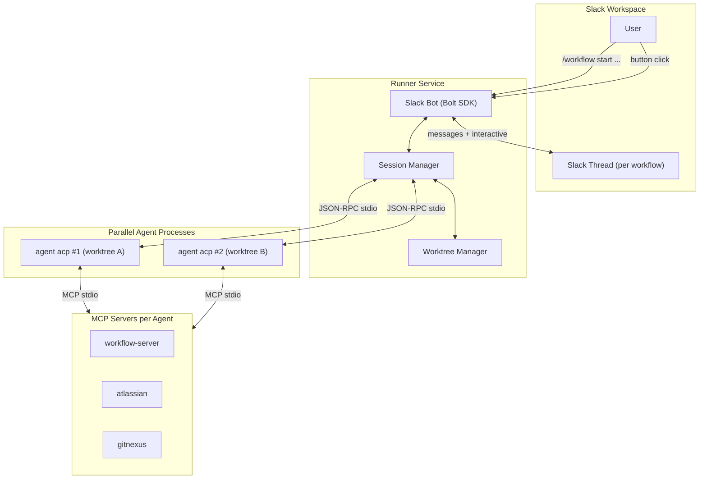

# Work Package Plan - Headless Slack Workflow Runner

**Created:** 2026-03-05
**Target:** workflow-server (`feat/headless-slack-runner` branch)

---

## Architecture

## Checkpoint Bridge

Current (IDE): Agent calls `AskQuestion` -> Cursor presents UI -> user clicks -> response returns synchronously

Proposed (Slack):
1. Agent calls `AskQuestion` -> ACP emits `cursor/ask_question` JSON-RPC request
2. Runner intercepts, posts Slack message with interactive buttons to the workflow thread
3. User clicks button in Slack
4. Slack fires interaction webhook -> Runner resolves the pending `cursor/ask_question` by responding on ACP stdin
5. Agent resumes

---

## Implementation Tasks

| # | Task | Description | Status |
|---|------|-------------|--------|
| 1 | Scaffold runner module | `src/runner/` structure, entry point, config, package.json scripts | Done |
| 2 | ACP client | JSON-RPC 2.0 over stdio, spawn `agent acp`, protocol handshake, event routing | Done |
| 3 | Worktree manager | `git worktree add/remove`, submodule init, `.cursor/mcp.json` + `cli.json` placement | Done |
| 4 | Checkpoint bridge | `cursor/ask_question` -> Slack interactive messages -> ACP response | Done |
| 5 | Session manager | Lifecycle tracking, status streaming, ACP event wiring, cleanup | Done |
| 6 | Slack bot | Bolt SDK, Socket Mode, `/workflow` slash command, button interaction handler | Done |
| 7 | Entry point | Config loading, app startup, graceful shutdown | Done |
| 8 | Tests | ACP protocol (8), checkpoint bridge (7), worktree manager (4) -- 19 total | Done |

---

## New Dependencies

- `@slack/bolt` -- Slack Bolt SDK for Node.js
- `dotenv` -- environment variable loading

## Key Design Decisions

- **Agent runtime:** Cursor ACP (`agent acp`) -- uses existing Cursor API key, full tool support, MCP compatible
- **Slack interaction:** Bolt SDK with Socket Mode -- no public URL needed
- **Isolation:** Git worktrees per workflow run
- **MCP servers:** Configured per-worktree via `.cursor/mcp.json`
- **Permissions:** Auto-approved via `.cursor/cli.json` per worktree
- **State persistence:** In-memory for PoC (production: SQLite or Redis)

## Prerequisites (not code)

- Slack App with Bot Token, Signing Secret, App-Level Token, `/workflow` slash command, Interactivity enabled
- Cursor CLI (`agent`) binary on the host
- `CURSOR_API_KEY` environment variable
- Base repo cloned on the host

## Production Gaps (out of PoC scope)

- State persistence (SQLite/Redis)
- Error recovery and agent restart
- Claude Code adapter
- Multi-repo support
- Rate limiting and session caps
- Observability (structured logging, metrics)
