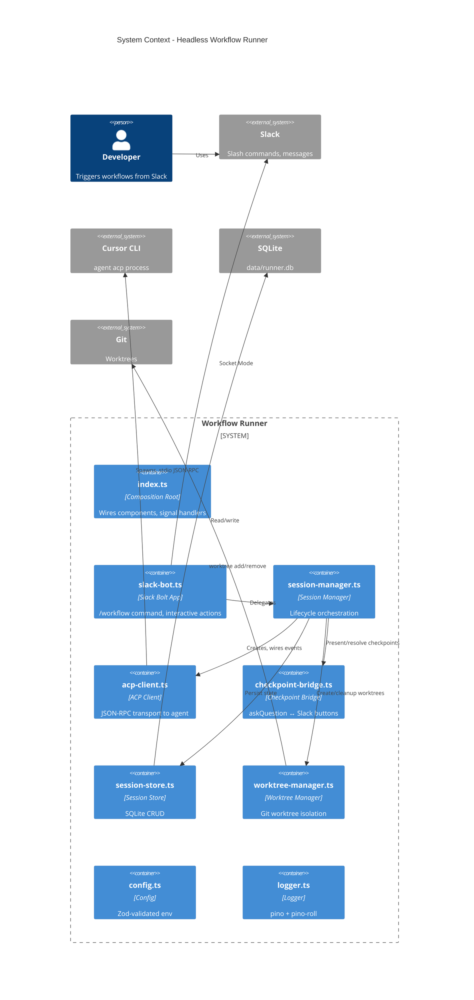

# Architecture Summary: Headless Slack Workflow Runner

**Branch:** `feat/headless-slack-runner`  
**Date:** 2026-03-05  
**Scope:** `src/runner/` (~1,350 LOC), `tests/runner/` (~800 LOC)

---

## 1. System Context

The headless Slack workflow runner is a **standalone execution path** within the workflow-server repository. It enables Slack-driven workflow execution without requiring a Cursor IDE window.

### Where It Fits

The workflow-server repository provides two distinct entry points:

| Entry Point | Command | Purpose |
|-------------|---------|---------|
| **MCP Server** | `npm start` / `npm run dev` | Stdio MCP transport for AI agents in Cursor IDE. Agents call workflow tools (get_workflow, get_activity, etc.) to orchestrate workflows. |
| **Headless Runner** | `npm run runner` | Slack Socket Mode app that spawns Cursor ACP agent processes per session. Bridges Slack slash commands and interactive messages to agent execution. |

The runner **does not** use the MCP server. It is a parallel execution model: instead of an agent in Cursor calling MCP tools, a user triggers workflows via Slack, and the runner spawns `agent acp` child processes that connect to the same workflow definitions (via `.engineering/workflows/` in the target worktree).

### External Dependencies

- **Cursor CLI** — `agent acp` binary for headless agent execution (JSON-RPC 2.0 over stdio)
- **Slack** — Bot token, app token, slash command, interactivity enabled
- **Git** — Worktree support for per-session filesystem isolation
- **Node.js 24+** — Built-in `node:sqlite` for persistence

---

## 2. Component Diagram



### Module Relationships

| Module | Depends On | Provides |
|--------|------------|----------|
| **index.ts** | config, logger, SessionStore, SessionManager, createSlackApp, WorktreeManager | Composition root, SIGINT/SIGTERM handlers |
| **slack-bot.ts** | SessionManager, RunnerConfig | Bolt app, /workflow command, checkpoint action handler |
| **session-manager.ts** | AcpClient, CheckpointBridge, SessionStore, WorktreeManager, config | startWorkflow, handleCheckpointResponse, listActive, shutdownAll |
| **acp-client.ts** | (none) | spawn, initialize, authenticate, createSession, prompt, respond, EventEmitter |
| **checkpoint-bridge.ts** | WebClient, AcpClient types | presentCheckpoint, resolveCheckpoint, cancelAll |
| **session-store.ts** | node:sqlite | save, load, loadActive, updateStatus |
| **worktree-manager.ts** | config (McpServerConfig) | create, cleanup, sweepOrphaned |
| **config.ts** | zod | loadRunnerConfig |
| **logger.ts** | pino, pino-roll | logger, createChildLogger |

---

## 3. Data Flow

### Workflow Execution Flow

```
┌─────────┐     /workflow start work-package midnight-node PM-123
│  User   │ ─────────────────────────────────────────────────────► ┌──────────┐
└─────────┘                                                         │  Slack   │
                                                                    └────┬─────┘
                                                                         │ Socket Mode
                                                                         ▼
┌─────────────────────────────────────────────────────────────────────────────────────┐
│  slack-bot.ts                                                                        │
│  • Parse subcommand, validate args                                                   │
│  • say() initial message → get thread_ts                                              │
│  • sessionManager.startWorkflow(workflowId, targetSubmodule, issueRef, channel, ts)  │
└─────────────────────────────────────────────────────────────────────────────────────┘
                                                                         │
                                                                         ▼
┌─────────────────────────────────────────────────────────────────────────────────────┐
│  session-manager.ts                                                                   │
│  1. Generate session ID, persist to SessionStore (status: creating)                    │
│  2. postStatus("Creating worktree...")                                                │
│  3. worktreeManager.create() → git worktree add, submodule update, .cursor/cli.json  │
│  4. Update status: running                                                            │
│  5. new AcpClient(), wireAcpEvents()                                                  │
│  6. acp.spawn(worktreePath)                                                           │
│  7. acp.initialize() → acp.authenticate() → acp.createSession()                       │
│  8. acp.prompt(buildPrompt()) — long-running                                          │
│  9. Start 5s flush timer for pendingText                                              │
└─────────────────────────────────────────────────────────────────────────────────────┘
                                                                         │
                    ┌────────────────────────────────────────────────────┼────────────────────────────────────────────────────┐
                    │                                                    │                                                    │
                    ▼                                                    ▼                                                    ▼
┌───────────────────────────────┐  ┌───────────────────────────────┐  ┌───────────────────────────────┐
│  acp-client.ts                │  │  checkpoint-bridge.ts          │  │  session-manager (completion)  │
│  • session/update (chunk)     │  │  • cursor/ask_question        │  │  • handleCompletion()          │
│    → session.pendingText +=   │  │    → status: awaiting_        │  │  • postStatus("completed")     │
│  • cursor/ask_question        │  │    checkpoint                  │  │  • cleanupSession()             │
│    → emit ask_question        │  │  • presentCheckpoint()         │  │  • worktreeManager.cleanup()    │
│  • session/request_permission │  │    → Slack buttons             │  │  • store.updateStatus(completed)│
│    → auto-approve             │  │  • User clicks button         │  │                                │
│  • cursor/create_plan         │  │  • resolveCheckpoint()         │  │                                │
│    → auto-approve             │  │    → acp.respond()             │  │                                │
└───────────────────────────────┘  └───────────────────────────────┘  └───────────────────────────────┘
```

### Checkpoint Bridge Flow

1. **Agent hits checkpoint** → ACP sends `cursor/ask_question` JSON-RPC request.
2. **AcpClient** emits `ask_question` event with `requestId` and `params` (title, questions, options).
3. **SessionManager** sets `status: 'awaiting_checkpoint'`, flushes pending text, calls `checkpointBridge.presentCheckpoint()`.
4. **CheckpointBridge** posts Slack message with Block Kit buttons; each button has `action_id: checkpoint_{questionId}_{optionId}`.
5. **User clicks button** → Slack sends `block_actions` to Bolt app.
6. **slack-bot** action handler calls `sessionManager.handleCheckpointResponse(channel, threadTs, actionId)`.
7. **CheckpointBridge.resolveCheckpoint()** looks up pending checkpoint by `channel:threadTs`, maps `actionId` to `{ questionId, optionId }`, calls `acpClient.respond(requestId, { outcome: { outcome: 'selected', responses: [...] } })`.
8. **Agent resumes** → SessionManager sets `status: 'running'`.

---

## 4. Persistence Model

### SQLite Schema

```sql
CREATE TABLE IF NOT EXISTS sessions (
  id TEXT PRIMARY KEY,
  workflow_id TEXT NOT NULL,
  target_submodule TEXT NOT NULL,
  issue_ref TEXT,
  slack_channel TEXT NOT NULL,
  slack_thread_ts TEXT NOT NULL,
  status TEXT NOT NULL DEFAULT 'creating',
  worktree_path TEXT,
  created_at INTEGER NOT NULL,
  completed_at INTEGER,
  error TEXT
);
```

- **Location:** `data/runner.db` (or `DB_PATH` env)
- **Driver:** `node:sqlite` `DatabaseSync` (synchronous, zero deps)
- **Operations:** `save`, `load`, `loadActive`, `updateStatus`

### Session Lifecycle States

| Status | Meaning | Transitions To |
|--------|---------|----------------|
| `creating` | Worktree being created, ACP not yet spawned | `running`, `error` |
| `running` | Agent executing, no checkpoint pending | `awaiting_checkpoint`, `completed`, `error` |
| `awaiting_checkpoint` | Agent paused on `cursor/ask_question`, waiting for Slack button click | `running`, `error` |
| `completed` | Workflow finished successfully | (terminal) |
| `error` | Agent crashed, user error, or stale session | (terminal) |

### Startup Recovery

On runner start, `SessionStore.loadActive()` returns sessions with status in `('creating', 'running', 'awaiting_checkpoint')`. These are **not** re-attached (the ACP process is gone). They are marked `error` with message `"Stale session from previous run"` so the DB reflects reality.

### Orphan Worktree Sweep

`WorktreeManager.sweepOrphaned()` runs at startup. It lists worktrees whose path basename starts with `wf-runner-` and removes them. This cleans up worktrees left behind if the runner process crashed.

---

## 5. Deployment View

### Startup

```bash
npm run runner   # → tsx src/runner/index.ts
```

**Prerequisites:**

- `REPO_PATH` — Path to the monorepo (e.g. midnight-agent-eng)
- `SLACK_BOT_TOKEN`, `SLACK_SIGNING_SECRET`, `SLACK_APP_TOKEN`
- `CURSOR_API_KEY`
- Optional: `CURSOR_AGENT_BINARY` (default `agent`), `WORKTREE_BASE_DIR`, `DB_PATH`, `LOG_LEVEL`, `MCP_SERVERS_JSON`

### Process Topology

```
┌─────────────────────────────────────────────────────────────────┐
│  workflow-server (runner process)                               │
│  • Slack Bolt app (Socket Mode — no HTTP server)                 │
│  • SessionStore → SQLite                                        │
│  • For each active session:                                      │
│    └── agent acp (child process)                                 │
│        • cwd: ~/worktrees/wf-runner-{sessionId}                  │
│        • stdio: JSON-RPC 2.0                                     │
│        • .cursor/mcp.json, .cursor/cli.json in worktree           │
└─────────────────────────────────────────────────────────────────┘
```

### Shutdown

- `SIGINT` / `SIGTERM` → `shutdown()`:
  1. `sessionManager.shutdownAll()` — cleanup each active session (kill agent, remove worktree)
  2. `store.close()`
  3. `app.stop()`
  4. `process.exit(0)`

---

## 6. Key Design Decisions

| Decision | Rationale |
|----------|-----------|
| **Separate entry point (`npm run runner`)** | Runner is a standalone Slack app with its own lifecycle. It does not run inside the MCP server process. Keeps MCP server focused on stdio tool serving. |
| **Socket Mode for Slack** | No HTTP server or public URL required. Ideal for dev-machine deployment. App connects to Slack via WebSocket. |
| **One ACP process per session** | Each workflow run gets an isolated agent. No shared state between runs; crash isolation. |
| **Git worktrees per session** | Filesystem isolation. Each run operates in `wf-runner-{id}` worktree. Prevents cross-session file conflicts. |
| **`node:sqlite` over better-sqlite3** | Zero dependencies, native ESM. Synchronous API acceptable for single-user, low-concurrency session state. |
| **pino + pino-roll** | Structured JSON logs, daily rotation, 14-day retention. Transport runs in worker thread — non-blocking. |
| **Checkpoint bridge (Slack buttons)** | `cursor/ask_question` is blocking. Headless mode has no IDE UI. Slack interactive messages provide the human-in-the-loop surface. |
| **Auto-approve permissions** | Headless runner cannot prompt a human. `.cursor/cli.json` allowlist + auto-approve for `request_permission` and `create_plan`. Tools outside allowlist still auto-approved but logged at warn. |
| **Batched Slack status (5s)** | Agent emits many small text chunks. Posting each would hit rate limits. Accumulate in `pendingText`, flush every 5s. |
| **Stale session marking on startup** | Sessions that were `creating`/`running`/`awaiting_checkpoint` when runner died cannot be resumed. Mark as `error` so DB is consistent. |
| **Orphan worktree sweep** | Runner crash leaves worktrees. Sweep at startup removes `wf-runner-*` worktrees to avoid accumulation. |

---

## Appendix: File Inventory

| File | LOC | Responsibility |
|------|-----|-----------------|
| acp-client.ts | 319 | JSON-RPC 2.0 transport, spawn, initialize, prompt, event routing |
| checkpoint-bridge.ts | 141 | askQuestion → Slack blocks, button click → ACP respond |
| config.ts | 73 | Zod schema, env loading |
| index.ts | 49 | Composition root, signal handlers |
| logger.ts | 20 | pino + pino-roll |
| session-manager.ts | 349 | Session lifecycle, ACP wiring, status posts |
| session-store.ts | 102 | SQLite CRUD |
| slack-bot.ts | 142 | Bolt app, /workflow, checkpoint actions |
| worktree-manager.ts | 154 | Git worktree create/cleanup/sweep, .cursor config |
