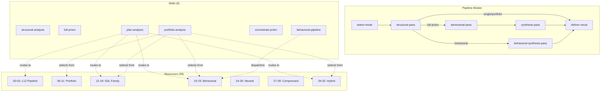

# Architecture Summary

> **Date**: 2026-03-13
> **Work Package**: #53 — Import New Prism Families

## Overview

This enhancement expands the prism workflow from 3 pipeline modes and 12 resources to 4 pipeline modes and 30 resources. The core architecture (orchestrator/worker isolation model, artifact-mediated communication) is unchanged. The changes are additive — new resources, a new skill, a new activity, and expanded routing tables.

## Architecture Diagram



## Key Architectural Properties

### Preserved

| Property | Status |
|----------|--------|
| Orchestrator/worker isolation model | Unchanged |
| Fresh sub-agent per pass (never resumed) | Unchanged |
| Artifact-mediated communication between passes | Unchanged |
| Resource index-based lens loading | Unchanged (extended) |
| No user checkpoints during pipeline execution | Unchanged |

### Extended

| Extension | Impact |
|-----------|--------|
| 4th pipeline mode (behavioral) | New activity chain: structural-pass → behavioral-synthesis-pass → deliver-result |
| 30 resources (was 12) | Expanded catalog, 7 families (was 3) |
| 6 skills (was 5) | New behavioral-pipeline worker skill |
| 6 activities (was 5) | New behavioral-synthesis-pass |
| 24 goal mappings (was 12) | plan-analysis covers all new lenses |
| 24 portfolio lenses (was 6) | portfolio-analysis catalog expanded |

### New Dependency: Behavioral Pipeline

The behavioral pipeline introduces a fixed-composition dependency not present in other modes:

```
behavioral-pipeline skill
  ├── defines label mapping (ERRORS→19, COSTS→20, CHANGES→21, PROMISES→22)
  ├── references behavioral_synthesis resource (23)
  └── artifact naming convention (behavioral-{role}.md)

behavioral-synthesis-pass activity
  ├── reads 4 behavioral artifacts by name
  ├── constructs labeled sections (## ERRORS, ## COSTS, etc.)
  └── applies behavioral_synthesis lens (23)

behavioral_synthesis resource (23)
  └── expects exactly 4 labeled sections in its input
```

This coupling is by design — the synthesis lens's analytical operations reference the specific cognitive dimensions of each input.

## Change Surface

| Layer | Before | After | Delta |
|-------|--------|-------|-------|
| Resources | 12 files | 30 files | +21 added, -3 deleted |
| Skills | 5 files | 6 files | +1 new, 4 modified |
| Activities | 5 files | 6 files | +1 new, 5 modified |
| Workflow | 1 file | 1 file | Modified (2 new variables) |
| Documentation | 3 files | 3 files | All 3 modified |
| **Total** | 26 files | 46 files | +23, -3, +13 modified |
