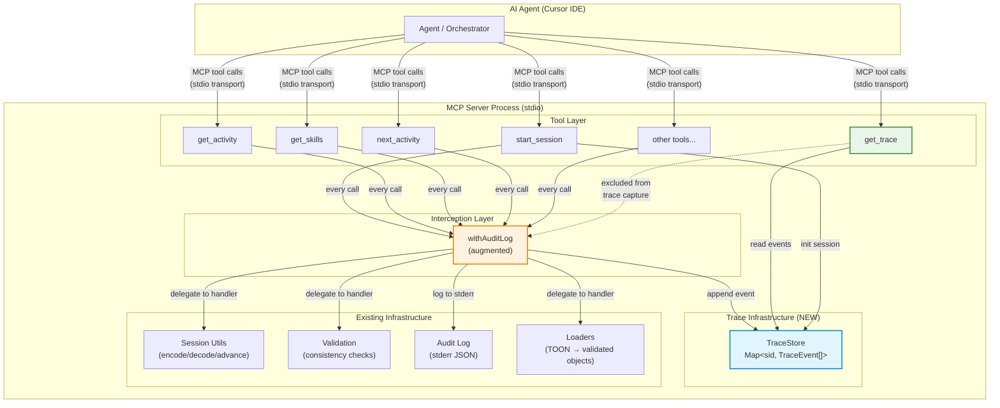
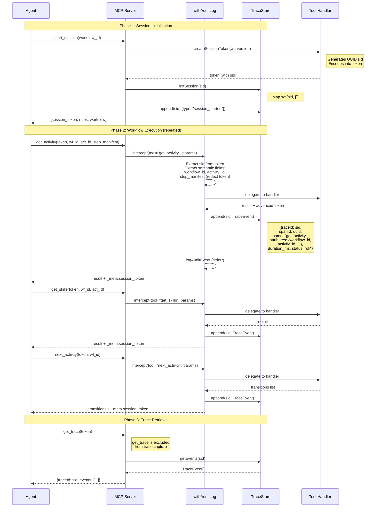
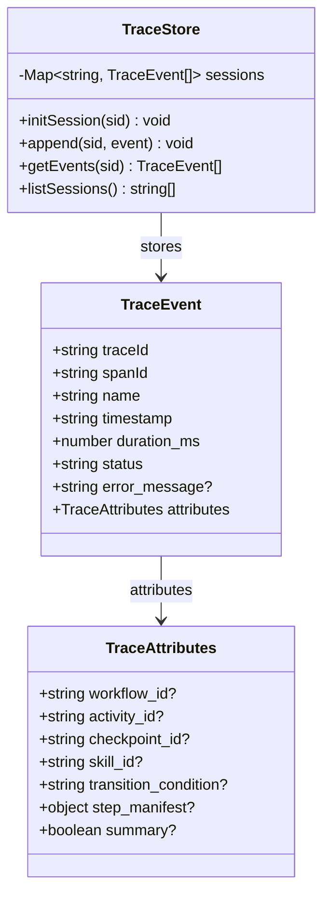
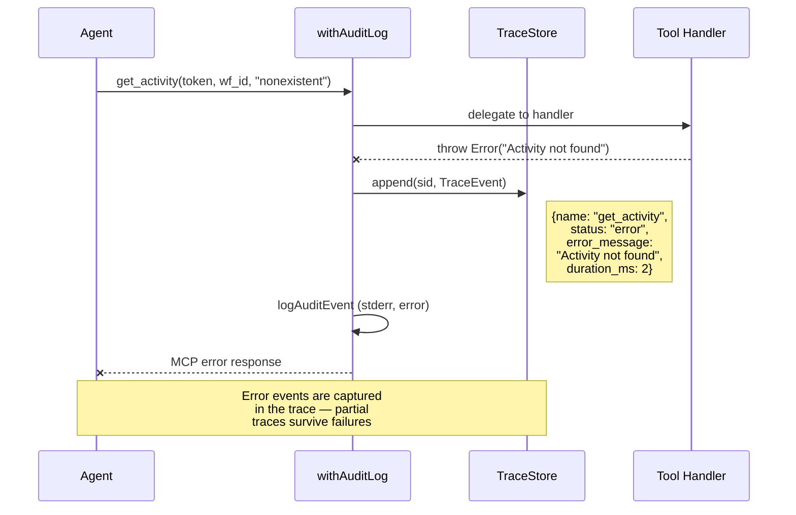
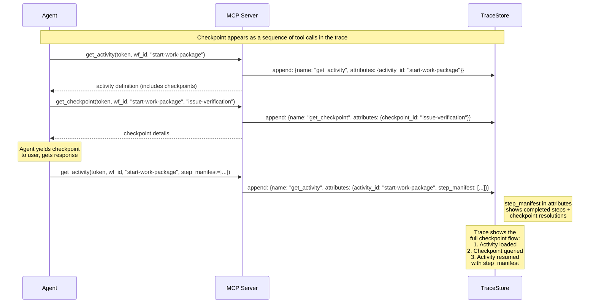
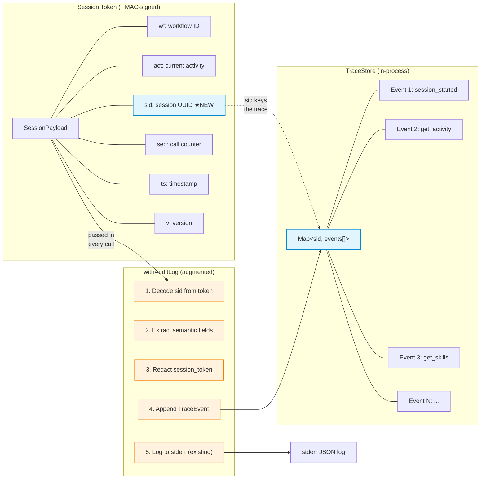

# Solution Diagrams: Execution Traces

**Work Package:** Execution Traces for Workflows  
**Issue:** [#63](https://github.com/m2ux/workflow-server/issues/63)  
**Created:** 2026-03-25

---

## 1. Component Architecture

How the trace system fits into the existing server architecture.



---

## 2. Session Lifecycle — Trace Capture Flow

The full lifecycle from session creation through trace retrieval.



---

## 3. Trace Event Structure

What each trace event contains, with OTel-compatible naming.



---

## 4. Error Handling in Traces

How tool errors appear in the trace.



---

## 5. Checkpoint Flow in Traces

How checkpoint interactions appear across multiple tool calls.



---

## 6. Data Flow — Token and Trace Interaction

How session tokens and trace events relate.



---

## 7. Typical Trace Output Example

What `get_trace` returns for a short workflow session.

```json
{
  "traceId": "a1b2c3d4-e5f6-7890-abcd-ef1234567890",
  "workflow_id": "work-package",
  "workflow_version": "3.4.0",
  "started_at": "2026-03-25T18:00:00.000Z",
  "event_count": 6,
  "events": [
    {
      "spanId": "span-001",
      "name": "start_session",
      "timestamp": "2026-03-25T18:00:00.000Z",
      "duration_ms": 45,
      "status": "ok",
      "attributes": { "workflow_id": "work-package" }
    },
    {
      "spanId": "span-002",
      "name": "get_activity",
      "timestamp": "2026-03-25T18:00:01.200Z",
      "duration_ms": 32,
      "status": "ok",
      "attributes": {
        "workflow_id": "work-package",
        "activity_id": "start-work-package"
      }
    },
    {
      "spanId": "span-003",
      "name": "get_skills",
      "timestamp": "2026-03-25T18:00:02.500Z",
      "duration_ms": 28,
      "status": "ok",
      "attributes": {
        "workflow_id": "work-package",
        "activity_id": "start-work-package"
      }
    },
    {
      "spanId": "span-004",
      "name": "get_checkpoint",
      "timestamp": "2026-03-25T18:00:15.000Z",
      "duration_ms": 5,
      "status": "ok",
      "attributes": {
        "workflow_id": "work-package",
        "activity_id": "start-work-package",
        "checkpoint_id": "issue-verification"
      }
    },
    {
      "spanId": "span-005",
      "name": "get_activity",
      "timestamp": "2026-03-25T18:01:30.000Z",
      "duration_ms": 38,
      "status": "ok",
      "attributes": {
        "workflow_id": "work-package",
        "activity_id": "design-philosophy",
        "step_manifest": [
          {"step_id": "check-issue", "output": "Issue verified"},
          {"step_id": "create-branch", "output": "Branch created"}
        ]
      }
    },
    {
      "spanId": "span-006",
      "name": "save_state",
      "timestamp": "2026-03-25T18:02:00.000Z",
      "duration_ms": 120,
      "status": "ok",
      "attributes": {
        "workflow_id": "work-package"
      }
    }
  ]
}
```
