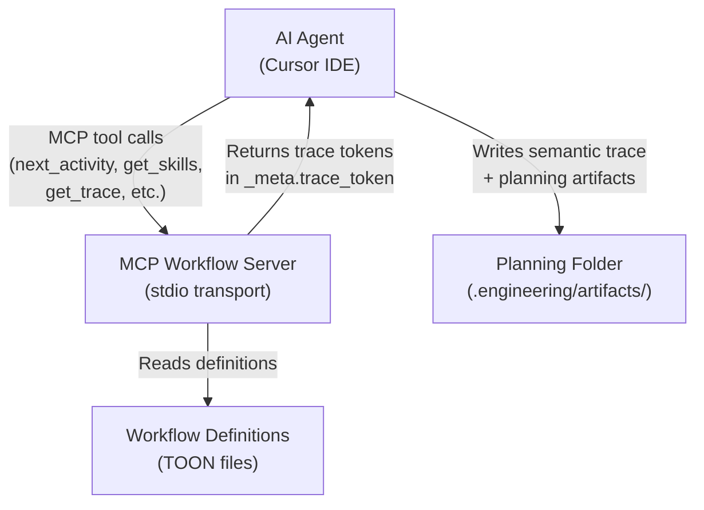
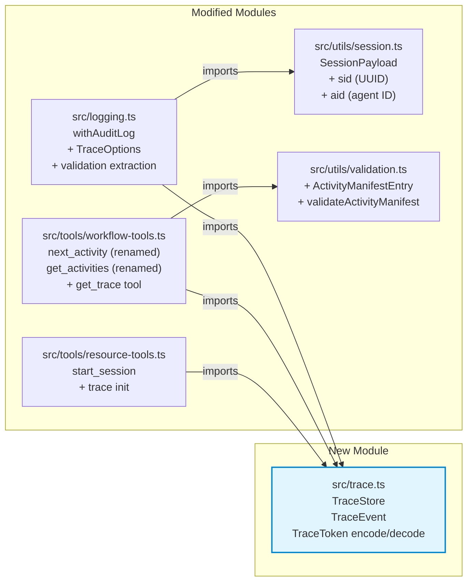
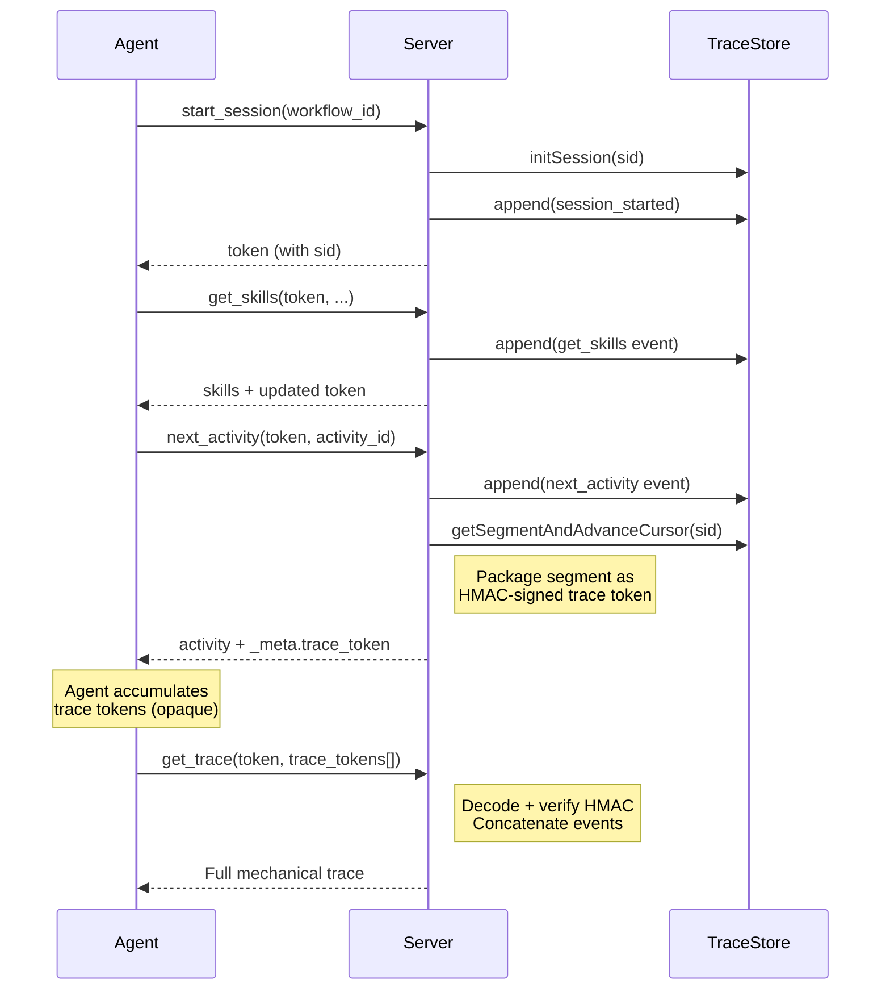

# Architecture Summary

**Work Package:** Execution Traces for Workflows (#63)  
**Created:** 2026-03-25

---

## System Context

## Package Diagram — New and Modified Modules

## Key Flow: Trace Token Lifecycle

## Changes Summary

| Component | Before | After |
|-----------|--------|-------|
| **Tool names** | `get_activity`, `next_activity` | `next_activity` (commit), `get_activities` (query) |
| **Session token** | 7 fields (wf, act, skill, cond, v, seq, ts) | 9 fields (+ sid, aid) |
| **withAuditLog** | stderr JSON logging only | + optional trace capture + validation extraction |
| **Server state** | Fully stateless | + in-process TraceStore (Map-based) |
| **New tool** | — | `get_trace` (trace token resolution) |
| **Manifests** | step_manifest only | + activity_manifest with advisory validation |
| **Test count** | 151 | 187 (+36) |
