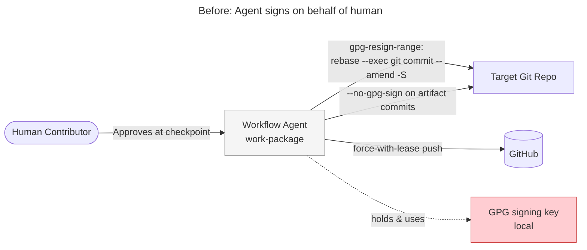
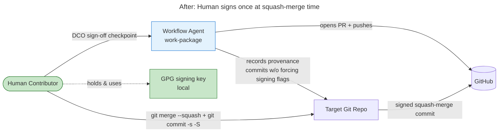
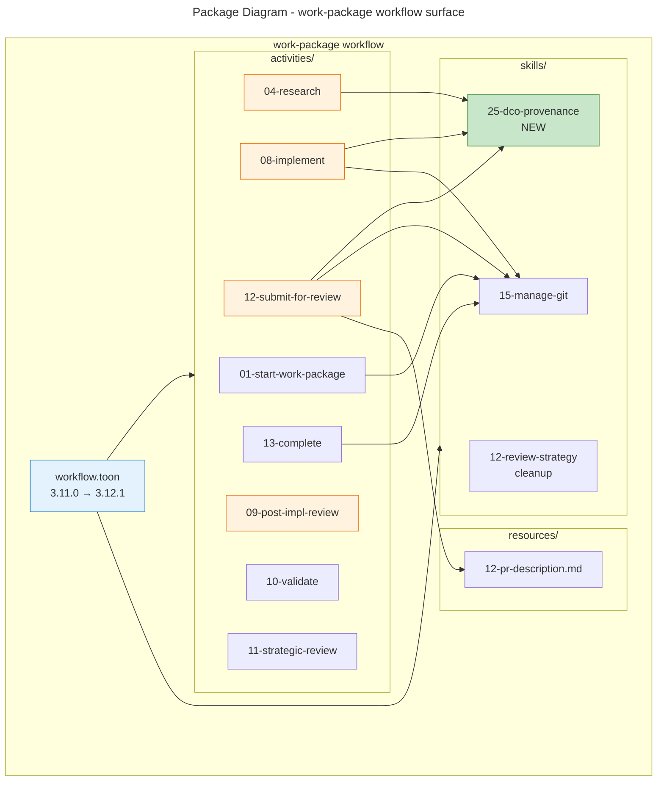
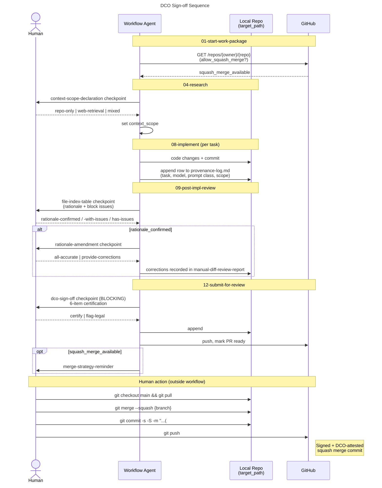

# Architecture Summary — DCO Policy Compatibility

**Work Package:** DCO Policy Compatibility
**Issue:** PR #109 / driving policy: DCO-Safe Agentic Coding Policy
**Date:** 2026-05-19
**Author:** strategic-review worker

---

## Executive Summary

This work package realigns the `work-package` workflow with the DCO-Safe Agentic Coding Policy. The previous design had the AI agent re-sign every commit on the human's behalf and force-push the rewritten history — a posture that produced GPG-signed commits but inverted the DCO's intent (the agent, not the human, was the source of the attestation). This change relocates attestation to a single, deliberate human action: a local squash-merge with `-s -S`. The agent's new job is to record provenance and gate submission on a human DCO sign-off; it never signs commits on the human's behalf.

The result is a workflow that produces a single auditable signed merge commit at integration time, a per-work-package provenance log, and explicit human attestation checkpoints — all without the agent ever holding the human's signing identity.

---

## System Context

The work-package workflow runs inside the Workflow Orchestration MCP Server and drives the AI agent through the lifecycle of one work package. The agent interacts with the human contributor (who holds the GPG key and DCO identity), the target Git repository (where the feature branch and PR live), GitHub (issues, PRs, and the squash-merge setting), and local Git tooling (commit, sign-off, GPG signing).

### Before

### After

The attestation surface moves from the agent to the human, and from per-commit rewrites to a single merge commit.

---

## Package Structure

This is a TOON-data change inside the workflow definition; no MCP server source code is touched. The change spans the work-package workflow's three asset layers — workflow definition, activities, and skills — plus one resource.

**Colour key:**
- Green: new module
- Orange: substantially modified activity
- Blue: workflow root
- Grey (default): touched but small change

The new `dco-provenance` skill (25) is the architectural addition. It owns the provenance-log schema, attestation recording, and context-scope classification — the surface the activities reference.

---

## DCO Sign-off Flow

The new attestation path is a sequence of agent-driven recordings followed by a single human signing action.

The agent records four kinds of provenance: (1) the merge-strategy capability at start, (2) the context scope at research, (3) per-task generation records at implementation, (4) the rationale confirmation at post-impl-review. The human's DCO sign-off at submit time gates push, and the local squash-merge produces the auditable signed artefact.

---

## What Changed

### Components Added

| Component | Description |
|-----------|-------------|
| `skills/25-dco-provenance.toon` | New skill owning provenance-log schema, attestation recording, and context-scope classification. |
| `activities/01-start-work-package`::`detect-merge-strategy` step | GitHub API call to detect `allow_squash_merge`; sets `squash_merge_available`. |
| `activities/04-research`::`declare-context-scope` step + `context-scope-declaration` checkpoint | Classifies research provenance scope. |
| `activities/08-implement`::`provenance-log.md` artifact + `log-provenance` step | Per-task provenance record. |
| `activities/09-post-impl-review`::`rationale-confirmed` / `rationale-confirmed-with-issues` options + `rationale-amendment` checkpoint | Captures rationale confirmation as the human's provenance statement. |
| `activities/12-submit-for-review`::`dco-sign-off` step+checkpoint + `instruct-merge-strategy` step + `merge-strategy-reminder` checkpoint | Human DCO attestation gate; merge guidance. |
| `resources/12-pr-description.md`::`## AI Assistance` section | PR-body block summarising provenance for reviewers. |
| `skills/15-manage-git`::`code-commits` / `detect-merge-strategy` / `squash-merge-instruction` protocols | Co-authored-by guidance; merge-strategy detection; local squash-merge instruction. |

### Components Removed

| Component | Description |
|-----------|-------------|
| `activities/10-validate`::`scan-commit-signatures-for-strategic` | Pre-strategic GPG preflight scan. |
| `activities/11-strategic-review`::`unsigned-commits-prompt` checkpoint + `resign-unsigned-pr-commits` step | Strategic-review GPG resign flow. |
| `activities/12-submit-for-review`::`verify-commit-signatures` step | `manage-git::gpg-resign-range` invocation. |
| `skills/15-manage-git`::`gpg-resign-range` protocol | Per-commit GPG re-sign-by-rebase recipe. |
| `skills/15-manage-git`::`--no-gpg-sign` mandate on artifact commits | Forced unsigned artifact commits. |
| `skills/12-review-strategy`::`commit-signatures` protocol block | Orphan block referring to removed step + variable (cleanup commit). |
| `workflow.toon` variables: `unsigned_commits_in_pr`, `resign_unsigned_commits_requested`, `unsigned_commit_list_summary` | Supporting variables for the removed resign flow. |

### Variable Surface

| Direction | Variable | Purpose |
|-----------|----------|---------|
| Added | `squash_merge_available` | Drives merge-strategy routing |
| Added | `context_scope` | Provenance scope of research sources |
| Added | `rationale_confirmed` | Drives `rationale-amendment` checkpoint condition |
| Removed | `unsigned_commits_in_pr` | Was preflight signal |
| Removed | `resign_unsigned_commits_requested` | Was resign consent |
| Removed | `unsigned_commit_list_summary` | Was checkpoint message data |

Net: variable count rebalanced; surface no longer carries the resign machinery.

---

## Impact

### Stakeholders

| Stakeholder | Impact | Notes |
|-------------|--------|-------|
| Human contributors | Medium | New blocking DCO sign-off checkpoint at submit; new local squash-merge step replacing GitHub-UI merge for signed result. |
| AI agent runtime | Medium | One new skill, one new artifact (`provenance-log.md`), three new checkpoints. No new external integrations beyond an existing `gh api` call. |
| Reviewers (PR readers) | Low–Medium | PR descriptions now include an `## AI Assistance` block summarising provenance. |
| Engineering managers | Low | Audit trail is now a single signed squash commit per work package, plus a structured provenance log. |
| Legal / OSS program | Positive | The `flag-legal` option on the DCO sign-off checkpoint and the explicit attestation record give legal a documented escalation path. |

### System Dependencies

| System | Relationship | Impact |
|--------|--------------|--------|
| GitHub REST API | Upstream (read) | New call: `gh api repos/{owner}/{repo} --jq '.allow_squash_merge'`. Same auth as existing `gh` calls. |
| Local GPG agent | Downstream (human-only) | Workflow no longer invokes GPG on the agent's behalf. Human's signing setup must be working at squash-merge time. |
| Workflow MCP server | Hosting | No code or schema changes; data-only update. |

---

## Risks & Mitigations

| Risk | Likelihood | Impact | Mitigation |
|------|------------|--------|------------|
| Human forgets to use `-s -S` at squash-merge time. | Medium | Medium | Non-blocking `merge-strategy-reminder` checkpoint at submit emits the literal command block. |
| Repo does not allow squash merges. | Low | Low | `detect-merge-strategy` sets `squash_merge_available=false`; reminder checkpoint is gated by that variable and does not fire. Branch commits land as-is. |
| `provenance-log.md` becomes stale across resumes. | Low | Low | `log-provenance` step runs inside the per-task forEach loop; append-only schema means resume-mode workers detect existing rows and skip. |
| Activities/README.md drift (stale references to removed surface). | Documented | Low | Hand-maintained doc deferred out of scope; tracked as separate finding (S2). |

---

## Future Considerations

- **`activities/README.md` regeneration pass.** Hand-maintained doc currently drifts in multiple sections; a small work package can replace stale references in one pass (finding S2).
- **Per-assistant identity mapping.** `skills/15-manage-git`'s `code-commits` protocol currently lists Claude's `Co-authored-by` identity inline. Other assistants would benefit from a structured identity table when more harnesses are supported.
- **PR-body `## AI Assistance` automation.** Currently rendered from variables at submit time; a future pass could verify the block survives PR-body edits through `update-pr::verify-body`.

---

## Related Documents

- [01-design-philosophy.md](01-design-philosophy.md) — Problem classification + complexity decision
- [06-wp-plan.md](06-wp-plan.md) — 13-task breakdown
- [09-code-review.md](09-code-review.md) — Code-review findings (incl. C1 inverted condition)
- [10-validation-record.md](10-validation-record.md) — Validator + typecheck + vitest results
- [11-strategic-review-1.md](11-strategic-review-1.md) — This activity's findings
