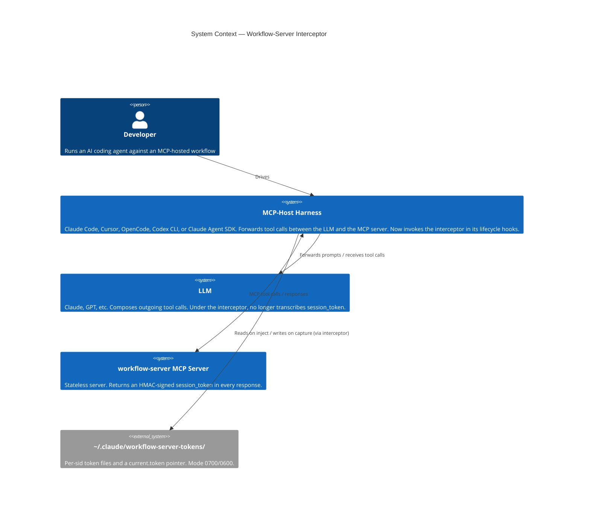
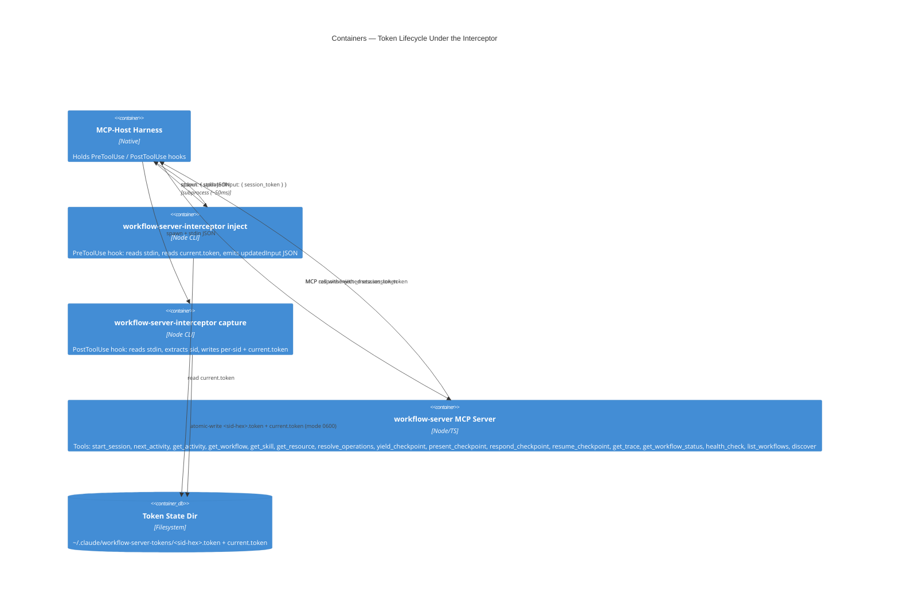
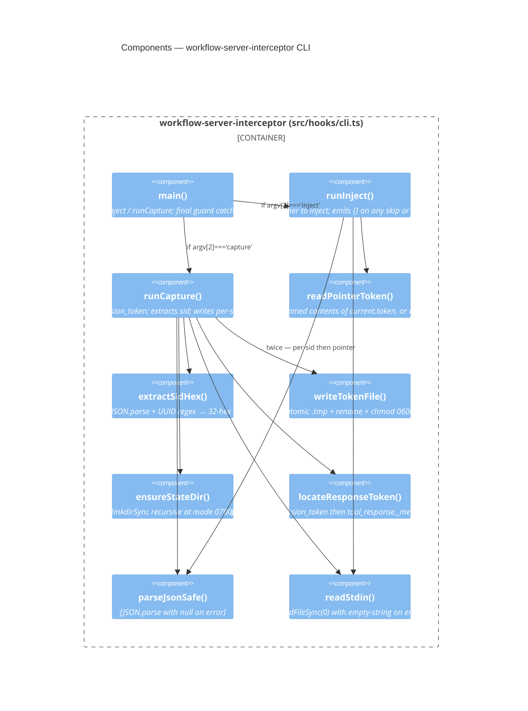
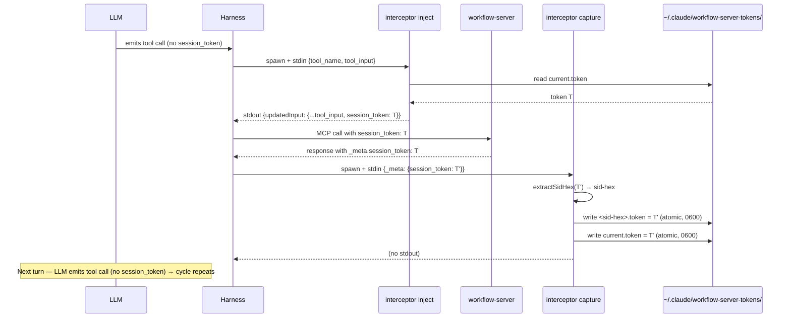

# Architecture Summary — feat/112-interceptor-cli

**Activity:** post-impl-review (architecture-summary step)
**Date:** 2026-05-13
**Audience:** Management / cross-team stakeholders

---

## What changed

A new `workflow-server-interceptor` CLI ships as a `bin` entry of
`@m2ux/workflow-server`. When wired into an MCP-host harness's
lifecycle hooks (Claude Code, Cursor, OpenCode, Codex CLI, Claude
Agent SDK), it captures the workflow-server `session_token` from
each response and injects it into the next outgoing call's
arguments. The LLM never has to retype the ~480-character HMAC-signed
token, eliminating a class of "signature verification failed" errors
that previously halted long workflows mid-step.

A redundancy-cleanup pass folded into the same PR retires the
compensating mechanisms in the workflow-server that existed
specifically to discipline the LLM into correct token handling:

- The dual-parameter shape on `present_checkpoint` and
  `respond_checkpoint` (accepting both `session_token` and
  `checkpoint_handle`) collapsed to a single `session_token`
  parameter (BREAKING CHANGE).
- `session_token` and `checkpoint_handle` are now redacted from
  the audit log.
- Tool descriptions, the HMAC-failure error message, and the README
  acknowledge the interceptor as the recommended fix.
- The meta-workflow's `workflow-engine` skill softened four
  token-handling rules to "applies when running without an
  MCP-client interceptor", removed one moot rule, updated one rule
  to reference the renamed field, and added one new rule
  (`explicit-session-on-resume`) for the parent-resume-after-sub-agent
  boundary.

The companion tier-C work (CBOR codec, SessionStore, state_hash
modules) on the `enhancement/session-token-size-optimization` branch
was reverted; the branch is closed (no PR) since tier-C never
reached main.

---

## C4 — System Context

---

## C4 — Containers

---

## C4 — Components (interceptor)

---

## Token lifecycle — sequence

---

## Boundaries and invariants

| Invariant | Enforced by | Test |
|-----------|-------------|------|
| `session_token` never appears in audit log | `redactParams` in `src/logging.ts:27-33` | TC-30, TC-31, TC-32b |
| `checkpoint_handle` never appears in audit log | `redactParams` (same set) | TC-31 |
| Audit redaction is shallow (other params preserved) | `redactParams` clones top-level only | TC-32, TC-32c |
| Token files always mode `0600` | `writeTokenFile` opens with `0o600`, chmods twice | TC-13, TC-27 |
| State dir always mode `0700` | `ensureStateDir` calls `mkdirSync({mode: 0o700})` | TC-14 |
| Atomic write (no torn writes) | `.tmp` + `renameSync` | TC-17, TC-26 |
| sid extraction failure → pointer-only capture | `extractSidHex` returns null; `runCapture` writes only pointer | TC-18, TC-18b, TC-18c |
| Inject never clobbers agent-supplied token | skip-branches at cli.ts:188-195 | TC-04, TC-05 |
| Inject always skips `start_session` | skip-branch at cli.ts:183-186 | TC-03 |
| CLI never exits non-zero | unconditional `process.exit(0)` in `main()` | TC-10, TC-24, TC-25 |
| Collapsed API: `checkpoint_handle` no longer in schema | Zod input schemas in workflow-tools.ts | TC-33, TC-34, TC-35a, TC-35b, TC-35c |
| Collapsed API: response field renamed to `session_token` | response-body construction in `present_checkpoint` / `respond_checkpoint` | TC-33, TC-34 |
| Meta-workflow operations use `session_token` parameter binding | submodule commit `161ff0d` | Test helper `resolveCheckpoints` (mcp-server.test.ts:66-75) exercises this via runtime calls |

---

## Risks and mitigations (summary)

| Risk | Severity | Mitigation |
|------|----------|-----------|
| Concurrent workflow-server sessions race on `current.token` | Low | Per-sid files survive; manual recovery documented; v2-graceful path |
| ~50ms per-call cold-start cost | Low | Accepted v1 trade-off; native build deferred |
| Wire-format change breaks sid extraction | Low | Graceful fallback to pointer-only; tested |
| External consumer breaks on collapsed API | Low | Approved breaking change; release notes |
| Cross-session boundary correctness depends on agent discipline | Low | New `explicit-session-on-resume` meta-rule |
| Hook script absent / mis-installed | Low | Failure-safe default = status quo (LLM transcribes) |

---

## Status

Implementation complete. Manual diff review pending user input.
Test count exceeds plan target. No critical or major issues. Two
informational drifts (api-reference doc staleness, cross-session
integration test deferral) — both documented and either fixable in a
small follow-up or accepted by plan scope.
