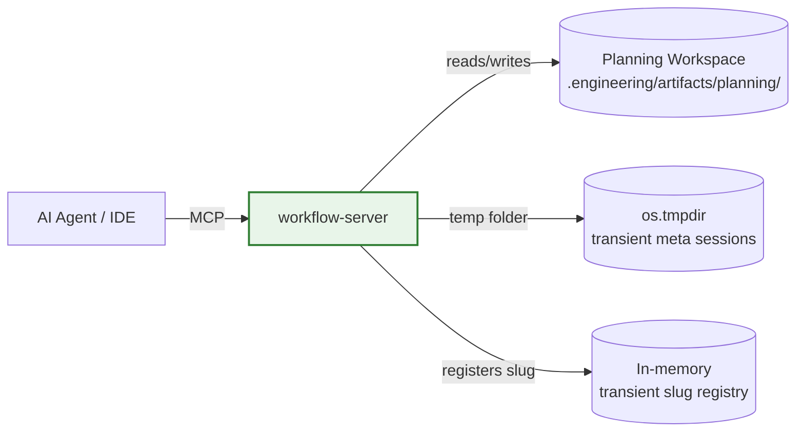
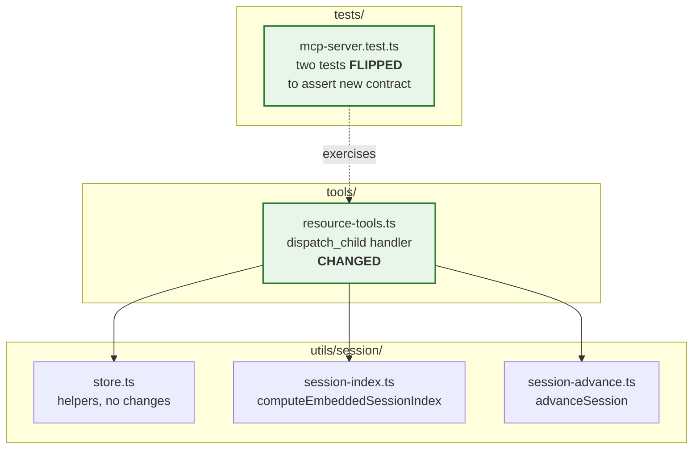
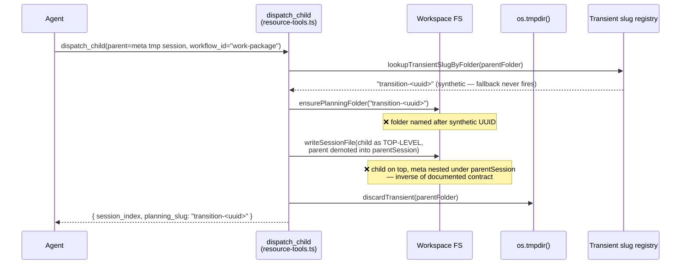
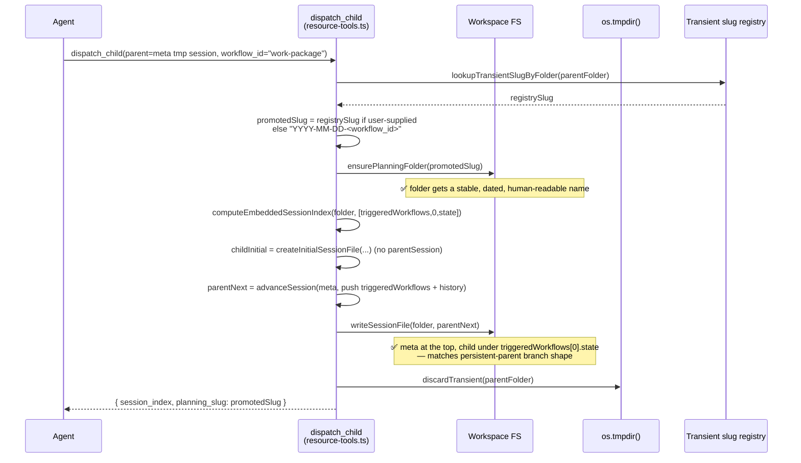

# Architecture Summary — Fix Work Package Transition Folder Defect

**Audience:** Engineering management and reviewers who need a high-level grasp of impact, scope, and risk without reading the diff.

**Source commit:** `e5c323d` on `fix/work-package-transition-folder-defect` · **PR:** [#121](https://github.com/m2ux/workflow-server/pull/121)

---

## Impact at a glance

| Dimension | Assessment |
|---|---|
| **Architectural impact** | Low — single function branch, no module-boundary changes, no schema changes |
| **Surface area changed** | 2 files (`src/tools/resource-tools.ts`, `tests/mcp-server.test.ts`) |
| **Risk** | Low — the new transient-parent branch was rewritten to *mirror* the long-existing persistent-parent branch, which has its own regression coverage |
| **Backwards-compat concern** | None — fix is forward-only; pre-existing on-disk records are not migrated and there is no consumer of the buggy shape outside the two flipped tests |
| **Operational impact** | Removes an audit-trail and discoverability defect in the planning directory (transient UUIDs no longer leak into permanent folder names) |

---

## System context

The workflow-server is an MCP server that mediates between AI agents and a structured set of workflow definitions. The change is entirely inside the `workflow-server` process; no external surface (transport, agent client, on-disk schemas) is modified.

The shaded box (`workflow-server`) contains the change. The arrows show the actors and stores involved in the `dispatch_child` call path; the change does not introduce or remove any of these edges, only corrects what the server writes along the **Workspace** edge during a specific call shape.

---

## Package view — what changed inside the server

Two server-internal modules participate. The fix lives entirely in `tools/resource-tools.ts`; the helpers it now calls (`computeEmbeddedSessionIndex`, `advanceSession`, `writeSessionFile`, `discardTransient`, `ensurePlanningFolder`) were already imported and exercised by the parallel persistent-parent branch.

No new helpers, no new imports, no new module boundaries. The fix is purely a corrected sequence of calls inside one if-branch of one handler.

---

## Before vs after — the load-bearing flow

The defect was in the `parentIsTransient` branch of `dispatch_child`. Before the fix the child was written as a new top-level file with the meta parent demoted into a `parentSession` field. After the fix the parent is promoted onto disk as the top-level record under a stable, dated folder name, and the child is embedded under `triggeredWorkflows[0].state` — matching the shape the persistent-parent branch has always produced.

### Before — buggy contract

### After — documented contract

The post-fix flow is **structurally identical** to the persistent-parent branch elsewhere in the same handler, with two intentional deltas: (1) the workspace folder is materialised here because a transient parent never had one, and (2) the original tmp folder is discarded once the new file is durable. Both deltas are commented in the source.

---

## Narrative — why this matters

**Operationally.** The planning workspace is the durable audit trail for in-flight and completed work. Before the fix, every new work package created via the meta-bootstrap path left a folder named `transition-<uuid>` on disk, with no human-readable hint of what it was for. Reviewers had to open `session.json` to identify the work package. Across many sessions the workspace also accumulated clutter that slowed debugging and audit reviews. After the fix, folders are named `YYYY-MM-DD-<workflow-id>` (or the explicit slug if one was supplied), which is the convention already used everywhere else in the workspace.

**Contractually.** The server's own documentation (`workflow-engine::handle-sub-workflow`) states that a dispatched child is embedded under `parent.triggeredWorkflows[N].state`, with the parent staying at the top of the file. The bug had inverted that invariant for the meta-bootstrap path specifically, while the same handler produced the correct shape for every other parent. The fix restores a single, uniform on-disk shape across all dispatch shapes — which is what downstream tooling (`get_workflow_status`, `get_trace`, planning-folder readers) was already written to expect.

**Risk.** The new branch mirrors the persistent-parent branch in structure, helpers, and call ordering. Those persistent-parent code paths have four pre-existing tests that were left untouched and continue to pass — they regression-guard the helpers the new branch also depends on. The two tests that were flipped were the ones that locked in the buggy shape; flipping them to the documented shape is the explicit deliverable of the work package.

**Scope discipline.** Two files, +105/-40, no new helpers, no schema change, no migration. One documented behaviour-preserving refinement in the slug-derivation step (treating synthetic `transition-<uuid>` slugs from the registry as "no slug supplied", so the dated fallback fires). The refinement is the only deviation from the plan and is explicitly called out in both the README and the post-implementation review.

---

## Outstanding items for future consideration

One **Informational** observation was carried forward from the post-implementation review (finding F1):

The synthetic-slug guard `registrySlug.startsWith('transition-')` couples the `dispatch_child` site to the slug-minting convention owned by `start_session`. If the convention ever changes, this guard silently misclassifies. A future change in this area could either (a) skip registering synthetic slugs in the by-slug map at all, restoring `??`-style fallback semantics, or (b) extract an `isSyntheticTransientSlug` predicate next to the minting site. Neither refactor is justified in isolation; recording here so it surfaces when the area is next touched.

No Critical, Major, or Minor items. No follow-up tasks created.
