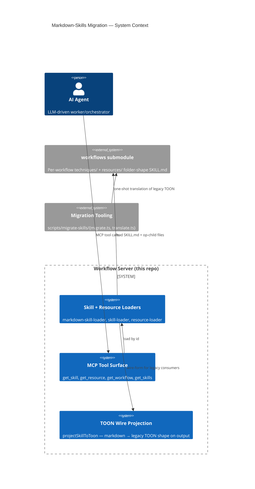
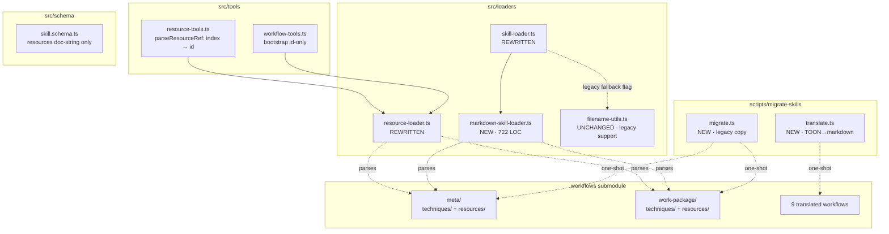
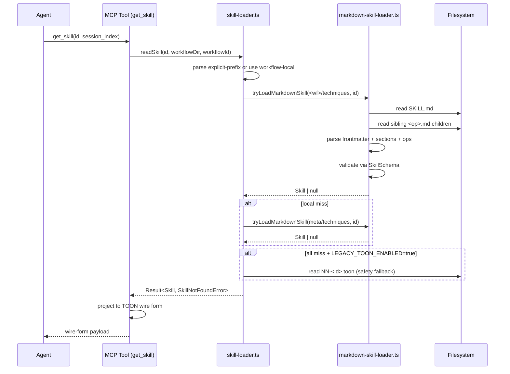

# Architecture Summary — Markdown Skills Migration

**Activity:** `post-impl-review` (session `SUQLKL`)
**Date:** 2026-05-29
**Audience:** management stakeholders, downstream consumers, future migrators

## Impact at a glance

| Dimension | Before | After |
|---|---|---|
| On-disk source-of-truth shape | TOON-encoded files under `<workflow>/skills/NN-<slug>.toon` and `<workflow>/resources/NN-<slug>.{md,toon}` | Markdown folder-shape under `<workflow>/{techniques,resources}/<slug>/SKILL.md` (+ optional sibling `<op>.md` children) |
| Identifier contract | Numeric prefix `NN-<slug>` doubling as ordering + lookup key | Text-only slug; numeric prefixes deprecated; folder name is the canonical id (also frontmatter `name:`) |
| Authoring medium | TOON projection rules + structured fields | Plain markdown with H2-section conventions and YAML frontmatter |
| Loader topology | `skill-loader.ts` + `resource-loader.ts` directly parsing TOON | Both loaders route through a new `markdown-skill-loader.ts` and project TOON on the wire only |
| Wire format (tool output) | TOON | **Unchanged** — `projectSkillToToon` re-renders markdown-sourced skills in the legacy TOON wire form for `get_skill` / `get_skills` / `get_workflow` preambles |
| Cross-workflow shared layer | `meta/` workflow with same TOON shape | `meta/` workflow with the same markdown shape; workflow-local → `meta` precedence enforced explicitly (the cross-workflow scan-all fallback is gone) |
| Migration scope | — | 11 workflows (`meta`, `work-package`, plus 9 translated by `scripts/migrate-skills/translate.ts`); ~170 SKILL.md files |

## System context diagram (Mermaid)

## Package-level diagram (Mermaid)

## Sequence — skill load (post-migration)

## Risk and scope summary

- **Risk level:** LOW. Public API surface (`readSkill`, `readSkillRaw`, `readResource`, `readResourceStructured`, `listResources`, `listWorkflowsWithResources`) preserved. GitNexus impact analysis confirmed no breaking downstream callers.
- **Behavioural change:** None on the wire — markdown-sourced skills are projected back to TOON via `projectSkillToToon`. Existing tool clients see byte-equivalent payloads (modulo accidental key-ordering shifts the projector normalises).
- **Authoring surface change:** Significant. Contributors now author markdown rather than TOON; the rationale (per the work-package plan) is improved human readability and parity with the planning-folder markdown they already write.
- **Migration safety:**
  - Legacy TOON branch is retained behind `SKILL_LOADER_LEGACY_TOON=true` as a roll-back safety net (assumption A-007; removed in Phase C).
  - Numeric-prefix lookup is gone (the F1 remediation) — id-only is the canonical contract.
  - All 11 workflows migrated; tests pass at 329/333 (4 skipped, no regressions).

## Stakeholder-facing summary

The migration replaces a specialised on-disk text format (TOON) with plain markdown for the workflow-server's per-workflow knowledge. Agents continue to receive the same wire payload they received before — a TOON-projection layer renders markdown skills back into the legacy shape on output. Contributors who previously had to learn TOON syntax in order to edit a workflow's skill or resource now edit the same markdown they already use for planning artifacts. The change is internal to the workflow-server and its workflow-content submodule; no public protocol or tool surface has changed.

## What is *not* changed

- The MCP tool protocol surface (tool names, input schemas, output shape).
- The session-state and workflow-state on-disk shapes.
- Activity definitions (`.toon`) and workflow definitions (`workflow.toon`) — these are intentionally out of scope; only **skills** (now "techniques") and **resources** were migrated.
- The TOON-encoded wire payload shape that agent consumers parse.
