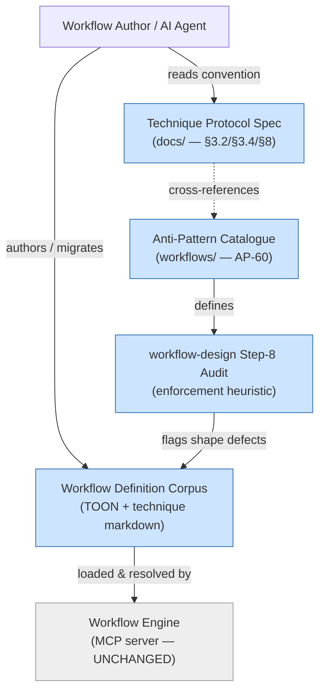

# Architecture Summary — Issue #128: Canonical Identifier Naming Convention

**Work Package:** Issue #128
**PR:** [#129](https://github.com/m2ux/workflow-server/pull/129) (draft)
**Date:** 2026-06-07
**Audience:** Management / stakeholders

---

## Architectural Impact: **Low (minimal summary)**

This work package introduces **no new modules, no dependency-structure change, and no public-interface change**. It is a **documentation and workflow-definition** change: it adds one naming-convention rule to the authoring specification and the anti-pattern catalogue, wires that rule into the existing workflow-design audit, and brings a small number of existing identifiers into conformance. No server source code, runtime behaviour, API surface, or data shape is altered.

Per the architecture-summary technique guidance, a change this minor warrants a **minimal summary noting low architectural impact** rather than a full diagram set. A single system-context diagram is included below to show *where* the change lands; no package or sequence diagrams are warranted because module structure and execution flows are unchanged.

## What Changed, Architecturally

The system's authoring guidance has three coordinated surfaces. This change touches all three so they stay consistent, but adds no new surface:

1. **Normative specification** (`docs/technique-protocol-specification.md`) — the human-readable rule (§3.2 naming structure, §3.4 rule-name assertion, §8 authoring-rules summary).
2. **Machine-readable catalogue** (`workflows/.../anti-patterns.md`) — the new AP-60 entry, the audit-checkable form of the same rule.
3. **Enforcement heuristic** (`workflows/.../workflow-design.md` step-8 audit) — where authors/agents apply AP-60 when creating or modifying workflows.

The remaining edits are **conformance migrations** of existing identifiers (one boolean rename propagated across its definition and read sites, one designator-binding fix, five rule-slug renames) — text substitutions inside already-defined workflow files, consumed by the workflow engine via exact-string designator resolution.

## System Context

*Shaded nodes are documentation/definition surfaces touched by this change. The workflow engine (server source) is unchanged — it neither validates nor enforces the convention; enforcement is the authoring-time audit heuristic.*

## Scope and Risk

- **Scope:** 14 files (1 spec doc, 13 workflow-definition/catalogue files). Broad but shallow — most identifiers already conformed; only genuinely-deviating ones were migrated.
- **Risk:** Low. The single behavioural-adjacent change (the `squash_merge_supported` boolean rename) was applied schema-first and verified complete by grep-parity across all binding surfaces; the one silent-binding defect that previously existed (`{lens-name}` failing to resolve) is fixed. The convention's only residual limit — its audit cannot certify *meaning*, only *shape* — is structural, documented, and assigned to author responsibility.
- **Public interface:** Unchanged. No external API, MCP tool signature, or consumer contract is affected.
