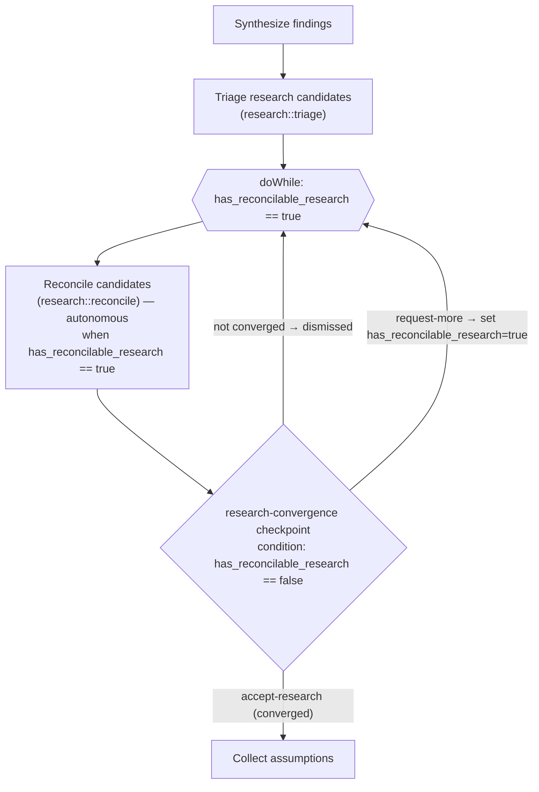

# Research Reconciliation — Design & Scope

> work-package workflow · 2026-07-08 · Draft
> Update-mode change to `work-package` v3.17.0, research activity v2.8.0.

## Problem

The "further research required" mechanism in `activities/04-research.yaml` is sub-optimal:

1. **No full picture.** The `research-findings` checkpoint ("Here are the combined findings… Proceeding in 30s") and its `research-focus` follow-up never enumerate *which* items are candidates for further research, and never say whether a candidate is *reconcilable* (more research can close it) or *irreconcilable* (research cannot). The user must reconstruct the picture unaided.
2. **"Further research" does not loop.** Selecting *Need Further Research* sets `needs_further_research: true`, but no loop consumes it — after `research-focus` the flow proceeds straight to `document`. The `research` technique is never re-run. It is a dead toggle.
3. **No termination logic.** There is no "continue while reconcilable candidates remain; stop when none or only irreconcilable remain" — just a manual boolean the user flips.

## North star (user intent)

> Any time the further-research question is asked, the user needs a full picture of what items are candidates for further research and whether they are reconcilable. Deep research should continue **automatically** while outstanding, **reconcilable** candidates remain, and should end **only** when none — or only irreconcilable items — remain.

## Chosen model — dedicated research-gap triage

Mirror the proven **assumption-reconciliation** pattern already in this same activity (`while has_resolvable_assumptions`), applied to research gaps instead of code assumptions:

- **Candidate** = an open research gap surfaced by `synthesize` (an unanswered technical/library/pattern question, an unresolved contradiction between sources, a best-practice question).
- **Reconcilable-by-research** = further knowledge-base / web research could close it.
- **Irreconcilable** = research cannot close it: it needs stakeholder input, project-specific/operational facts, a runtime/environment unknown, a design judgement, or is out of scope. Each irreconcilable candidate records its **handoff target** (stakeholder → the existing assumption interview; code-answerable → the existing assumption-reconciliation loop; out-of-scope → recorded only).

The two loops stay complementary: research-reconciliation closes research-answerable gaps; the existing assumption-reconciliation closes code-answerable gaps; the interview closes stakeholder gaps.

## Control flow

**Why a `doWhile` with a condition-gated checkpoint:** the checkpoint step lives inside the loop but its `condition` is `has_reconcilable_research == false`, so it is dismissed (`condition_not_met`) on every non-converged pass — research continues **automatically**, no prompt. It fires **only at convergence**, presenting the full triaged inventory. `accept-research` leaves the gate false so the loop exits; `request-more` sets it true so the loop re-enters and researches the user-directed item. This satisfies all three requirements with one interaction at the end (matching the autonomous ethos of `review-assumptions::reconcile`'s `no-user-interaction` rule).

### Trace of every case
| Initial triage | Behaviour |
|---|---|
| reconcilable candidates exist | loop researches + re-triages each pass, **no prompt**, until convergence; then one full-picture checkpoint |
| only irreconcilable / none | reconcile skipped (`when` gate); checkpoint fires immediately with the full picture |
| user picks `request-more` | gate set true → loop re-enters → researches directed item → converges → checkpoint again |

## Scope manifest

**Modify**
1. `workflow.yaml` — add vars `research_candidates` (array), `has_reconcilable_research` (boolean, default false); remove dead `needs_further_research`; bump 3.17.0 → 3.18.0.
2. `activities/04-research.yaml` — remove `research-findings` + `research-focus` checkpoints; add `triage-research-candidates` step, `research-reconciliation` doWhile loop (body: `reconcile-research-candidates` + `research-convergence` checkpoint); bump 2.8.0 → 2.9.0.
3. `techniques/research/TECHNIQUE.md` — declare shared `research_candidates` output shape; bump 2.0.0 → 2.1.0.
4. `activities/README.md` — update research mermaid diagram.
5. `techniques/README.md` — list the two new research ops.
6. `resources/README.md` — add the research-reconciliation resource row.

**Create**
7. `techniques/research/triage.md` — `research::triage`: enumerate + classify candidates → `research_candidates`, `has_reconcilable_research` (autonomous, first pass).
8. `techniques/research/reconcile.md` — `research::reconcile`: targeted further research on reconcilable candidates, re-triage, converge (autonomous; `no-user-interaction`; classify/converge rules modelled on `review-assumptions/reconcile.md`).
9. `resources/research-reconciliation.md` — candidate-log integration shape, reconcilable/irreconcilable statuses, and convergence scorecard (modelled on `assumption-reconciliation.md`).

**Non-destructive check:** the only removals are the two broken checkpoints and the dead `needs_further_research` variable (grep-confirmed referenced nowhere else). All are flagged above.

## Isolation

All workflows-submodule edits will be made in a **dedicated worktree** on a feature branch (never the main `workflows` checkout), validated there, and committed there only on explicit approval.
