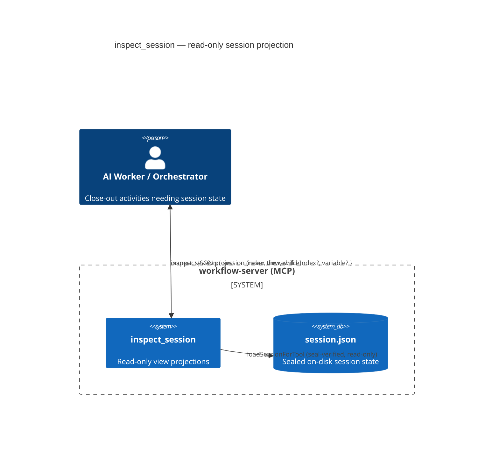

# Architecture Summary — `inspect_session` (#193)

> architecture-summary · session-inspection-tool (#193) · 2026-07-12

## Impact, Scope, and Risk

**Low architectural impact — additive, read-only.** The change adds one MCP tool (`inspect_session`) to the existing tool registry. It introduces no new subsystem, no new dependency, and no state mutation: it reuses the established sealed session-read path (`loadSessionForTool`) and the existing `navigatePath` utility, then applies pure, side-effect-free projection functions over the loaded `SessionFile`. Tool count moves from 16 to 17 within the same five-concern grouping (registered under the "Session" concern).

Because the tool only reads and is not gated on an active checkpoint, it does not participate in the workflow state machine or the checkpoint/transition flow — it sits alongside them as an observability surface.

## System Context

The tool replaces ad-hoc inline `python3 -c` reads of `session.json` (observed 8× in one run) with a first-class, schema-versioned projection. Callers supply only a `session_index` and a `view`; the server owns the projection logic, eliminating per-call schema re-discovery and the associated permission prompts.

## Affected Component

Single module: `src/tools/workflow-tools.ts` — seven pure `project*` functions plus the `inspect_session` registration. Parity with the normative reference (`tests/fixtures/inspect-session/inspect_session.py`) is enforced by test TC-08. No other subsystem is touched; docs and generated site-data are propagated to match the new tool.

## Risk

Minimal. Read-only path with no mutation, integrity still verified via the sealed load, out-of-range `child_index` surfaces the standard `NOT_FOUND` message. Full per-view + parity + read-only-invariance test coverage (9 cases). No migration or backward-compatibility concern — the tool is purely additive.
