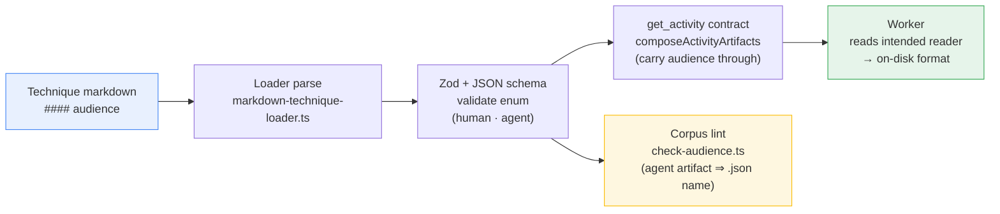

# Architecture Summary

> summarize-architecture · #224 V4 — audience attribute · PR #227 (feat/224-v4-audience-attribute) · 2026-07-14

## Architectural Impact: Low

This change adds one **optional, additive contract field** (`audience: human | agent`) to technique output declarations. It introduces no new module, subsystem, service, or boundary, and changes no execution flow. Every existing technique definition continues to load unchanged (absent ⇒ `human`). A full C4 diagram set is not warranted; a single system-context diagram plus the impact narrative is the proportionate summary.

## What Changed, at a Glance

The `audience` attribute threads additively through the surfaces that already carry an output's `#### artifact` declaration — the same path a technique output takes from authored markdown to the worker. No surface is added; each existing surface gains one field.

The system's external boundary is unchanged: the MCP server still delivers activity/technique contracts to a worker agent over the same tool surface. The only new observable is that a delivered output contract may now carry an `audience` field.

## Scope and Rationale

Drawn from the [design philosophy](02-design-philosophy.md): output declarations previously could not state whether an artifact's reader is a human or an agent, so format could not follow function and every artifact defaulted to prose. `audience` lets a declaration say who reads an artifact — and, for `agent`, that it is JSON on disk. This unblocks the downstream RC4 verbosity-reduction work (converting agent-state artifacts to compact structured data), which is why the field is delivered and lint-guarded now even though the corpus has zero adoption yet.

## Impact and Risk

| Aspect | Assessment |
|--------|------------|
| Architectural impact | Low — one optional field on an existing declaration; no new component or boundary |
| Backward compatibility | Full — the field is optional; all existing definitions validate and load unchanged |
| Blast radius | Contained — the one non-trivial code change (`parseEntrySubsections` single→array reserved keys) has exactly two callers, both migrated in the same diff |
| Runtime behaviour | None on its own — the field is an informational contract annotation plus a name-only corpus guard; JSON serialization at write time is scoped to a later increment (V5) |
| Migration | None required — additive optional field; no persisted-shape change |

## Deferred (V5)

Per-artifact JSON *field schemas* for specific agent artifacts (assumptions-log, findings-classification, etc.) and write-time content validation are a later increment. V4 states *who reads* an artifact and *that* an agent artifact is JSON; it does not fix the shape of any payload or enforce content format at write time. The structural analysis (see [code-review.md](09-code-review.md#structural-analysis)) records this boundary precisely: the guard can only ever check declarations at corpus-lint time, so instance-content validation belongs to V5's shape-ownership scope.
