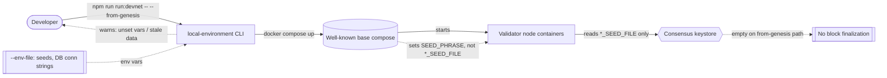
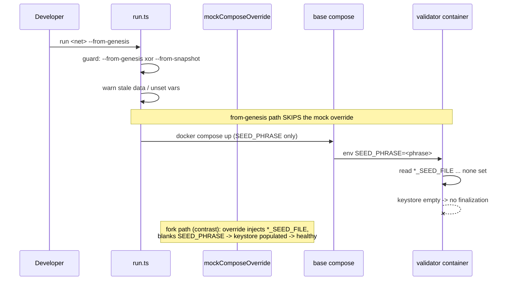

# Architecture Summary — PR #1807 (local-env from-genesis bring-up)

> Review midnight-node PR #1807 · head `98dd8e11` · 2026-07-15 · for stakeholders

## Scope and impact

**Low architectural impact.** PR #1807 restores a *developer-tooling* capability: the `local-environment` CLI can again bring a well-known test network up "from genesis" (block 0) instead of only forking from a snapshot. The change is confined to the standalone `local-environment/` TypeScript CLI plus documentation and one CI-workflow comment. It adds no runtime code to the node itself, no on-chain logic, no storage or migration surface. Affected components: the CLI's `run` command (one new bring-up branch), its option/type declarations, and operator-facing docs.

The one material risk is not architectural complexity but a **cross-boundary contract mismatch**: the tool hands the node validator seeds through a channel (`SEED_PHRASE`, an inline phrase) the node does not read (it reads seed *file paths*, `*_SEED_FILE`). On the from-genesis path this leaves validator keystores empty, so the network comes up but never finalizes. This is the review's sole merge blocker (see code review CR-1 / structural analysis SA-1); it is a design decision about *where seed provisioning lives*, not a coding error inside the diff.

## System context

## Bring-up path selection

The two diagrams together show the risk precisely: the **fork path** (unchanged, working) routes seeds through `mockComposeOverride`, which sets `*_SEED_FILE` and blanks `SEED_PHRASE`; the **new from-genesis path** bypasses that override, so only the unread `SEED_PHRASE` reaches the node.

## Risk assessment for merge

| Dimension | Assessment |
|-----------|------------|
| Blast radius | Contained to the `local-environment` dev tool; no node/runtime/on-chain code changed. |
| Correctness | One Critical: from-genesis networks silently do not finalize (CR-1). All other findings are Minor/Nit. |
| Test coverage | The tool package has no automated tests; the new path is untested (TR-1/TR-2). |
| CI | Green at head `98dd8e11` — the earlier red `Local Environment Tests` failure was resolved by a `main` merge and is stale. |
| Recommendation | Request changes until the seed-provisioning contract is resolved (or the from-genesis docs/flag are gated on real seed-file provisioning). Documentation and CI clarifications are sound and mergeable. |

Scope and rationale draw on `02-design-philosophy.md` and the comprehension artifact `15-local-environment-tooling.md`; this summary is deliberately minimal per the low architectural impact of the change.
