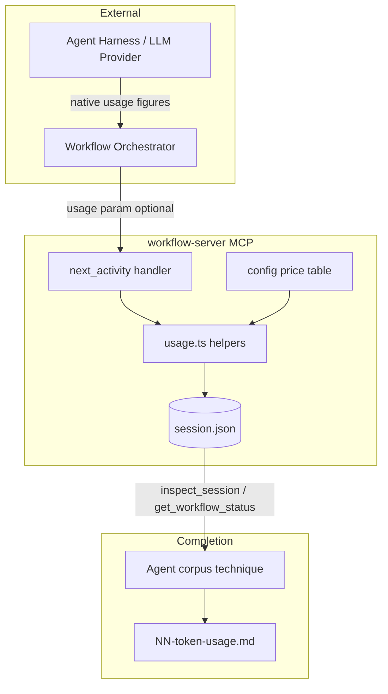
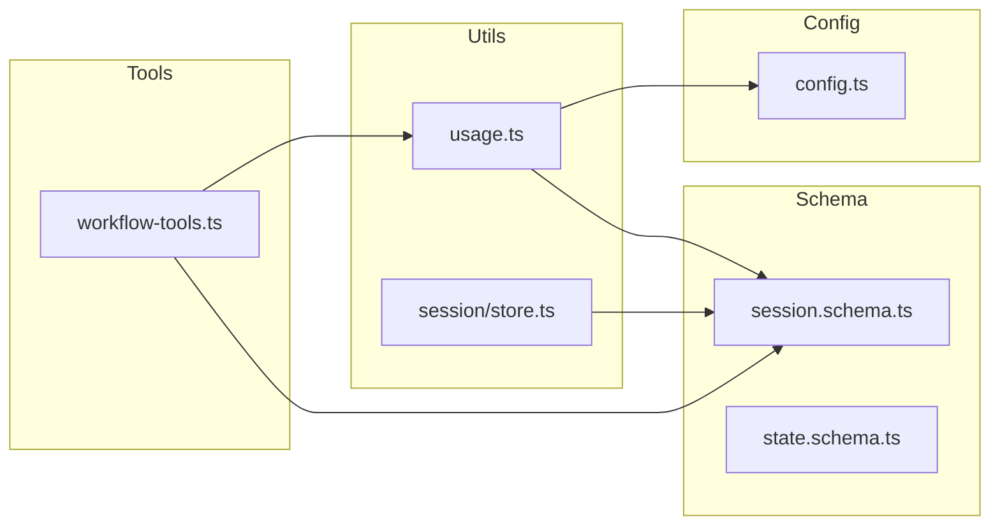
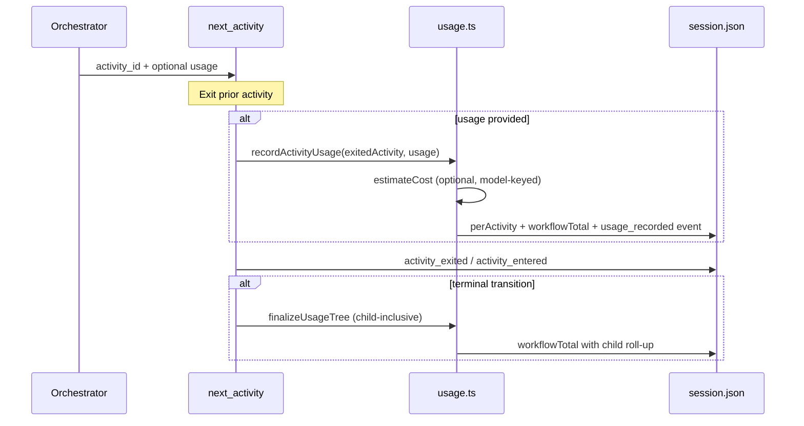

# Architecture Summary — Token Use Tracking (#232)

> Stakeholder-facing overview · PR #233 · Issue #232

## Impact

Adds optional token-usage capture and cost estimation to the workflow-server without changing existing caller contracts. Workflows that omit the `usage` param behave identically to today. The change touches the session persistence model, one MCP tool (`next_activity`), config, and read projections — not the workflow corpus (corpus changes for populating `usage` and rendering completion artifacts remain separate).

**Stakeholder note:** Token **metrics** are harness-agnostic (generic counts relayed by any orchestrator). **Cost estimation** currently defaults to an Anthropic-seeded price table — a deployment concern, not a metrics constraint.

## System Context

## Package View

## Key Flow — Usage Capture at Activity Transition

## Risks

| Risk | Level | Mitigation |
|------|-------|------------|
| Wrong relayed usage corrupts durable record | Medium | Zod validation; no server fabrication; provenance stamp (`model`, `priceTableVersion`) |
| Anthropic-centric cost defaults | Low (design) | Metrics independent; cost degrades to `null`; operator can extend price table |
| Attribution to exited activity only | Low | Accepted v1; workflow total arithmetically correct |

## Scope Statement

Server-side v1 delivers durable token metrics + optional cost estimate in `session.json`. Human-facing artifact rendering and orchestrator populate instructions are corpus-side companions documented in the implementation analysis (IA-1, IA-2).
