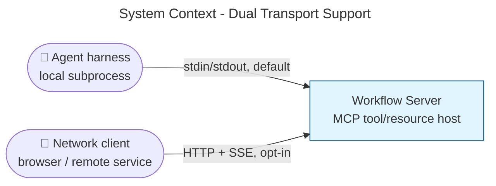
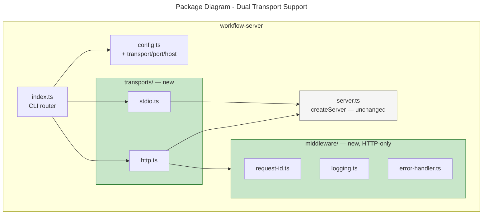
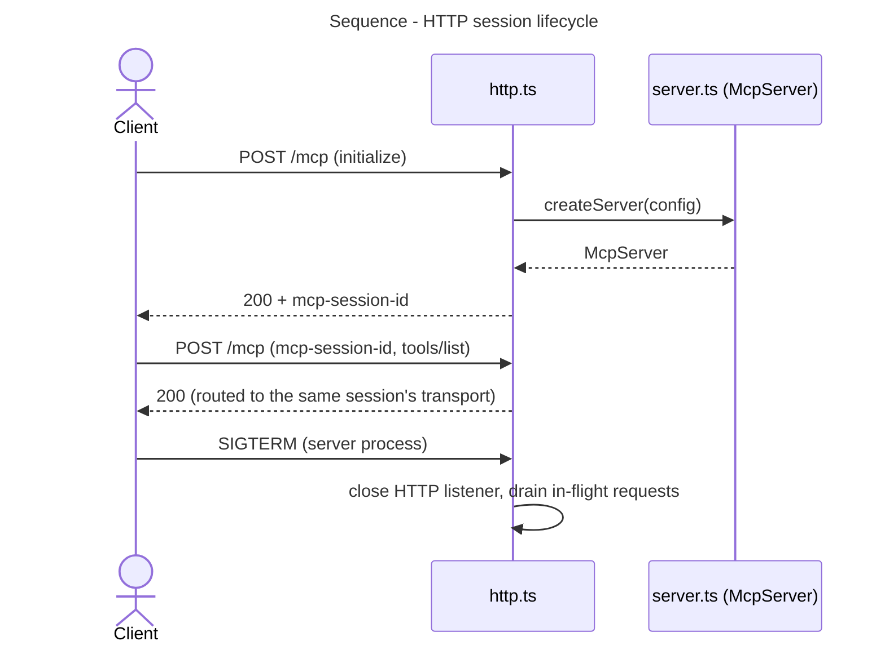

# Architecture Summary

> Dual Transport Support · issue skipped · updated 2026-07-20

## Executive Summary

The workflow server previously spoke only stdio, which requires an agent harness to run it as a local subprocess. It now supports an opt-in HTTP transport alongside stdio, selected with `--transport=http`, so browser-based clients, shared team deployments, and future containerized/cloud rollouts can reach it over a network — with stdio remaining the default and behaviorally unchanged.

## System Context

*Both arrows reach the identical `McpServer` — the transport is the only thing that differs between them.*

## Package Structure

## Key Flows

## What Changed

| Component | Change Type | Description |
|-----------|-------------|-------------|
| `src/config.ts` | Modified | Adds `transport`/`port`/`host` (optional fields) and their CLI/env resolution, following the existing `--workspace` precedence pattern |
| `src/index.ts` | Modified | Reduced to a CLI router: `loadConfig` then dispatch to the selected transport |
| `src/transports/stdio.ts` | Added | The original `main()` body, moved verbatim |
| `src/transports/http.ts` | Added | Express app: `/health`, `/ready`, `/mcp` (`StreamableHTTPServerTransport`, one session per client), graceful shutdown |
| `src/middleware/*.ts` | Added | Request-id propagation, structured request logging, shared JSON error shape — HTTP-only |
| `package.json` | Modified | `express` + `@types/express` (runtime/dev); `supertest` (dev, tests only); `dev:http`/`start:http` scripts |

## Impact

### Who Is Affected

| Stakeholder | Impact | Notes |
|-------------|--------|-------|
| Existing stdio integrators | None | `transport` defaults to `stdio`; behavior unchanged |
| Operators wanting network access | High (positive) | New opt-in `--transport=http` path with health/readiness endpoints |

## Risks & Mitigations

Planning-time risks and this review's one deferred finding are tracked in the [work package plan](06-work-package-plan.md#dependencies--risks) and the [deferred-items register](06-deferred-items.md) — no new risk surfaced beyond those already recorded there.

## Future Considerations

See the [deferred-items register](06-deferred-items.md) (D-1: HTTP authentication/authorization; D-2: session resumability, multi-process sharing, idle-session eviction).

## Related Documents

[Work package plan](06-work-package-plan.md) · [Design philosophy](02-design-philosophy.md) · [Code review](09-code-review.md) · [Change block index](10-change-block-index.md)
