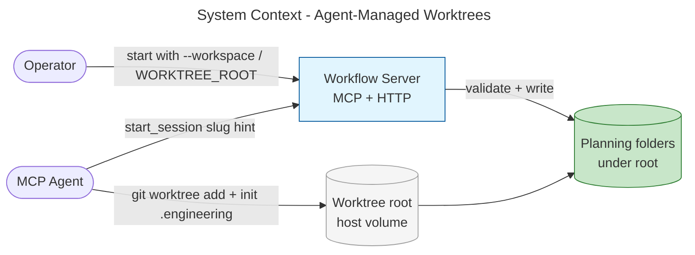
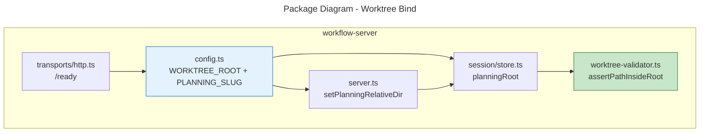
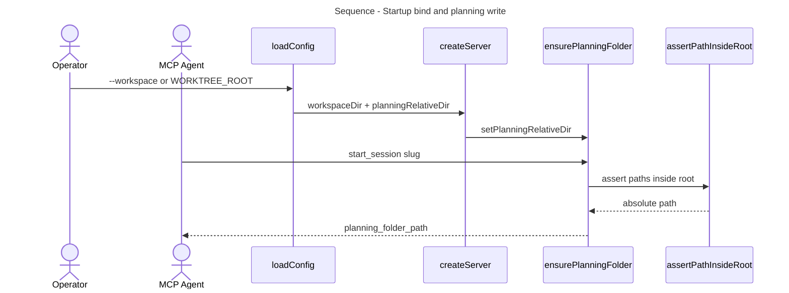

# Architecture Summary

> architecture-summary · Phase 1 agent-managed worktree architecture · issue skipped · 2026-07-21 · activity-worker

## Executive Summary

Operators and agents bind the workflow server to a required worktree root at startup. Agents create Git worktrees and initialise `.engineering` under that root; the server derives planning paths, validates containment, and writes artifacts. This keeps the container thin and isolates planning per project.

## System Context

## Package Structure

## Key Flows

## What Changed

### Components Added/Modified

| Component | Change Type | Description |
|-----------|-------------|-------------|
| `src/worktree-validator.ts` | Added | Path containment for write paths |
| `src/config.ts` | Modified | `WORKTREE_ROOT` alias; `PLANNING_SLUG` |
| `src/utils/session/store.ts` | Modified | Injectable planning relative dir; containment on ensure |
| `src/server.ts` | Modified | Apply planning slug at createServer |
| `src/transports/http.ts` | Modified | Document `/ready` root semantics |
| Docker / docs | Added/Modified | Container bind + SETUP agent lifecycle + MCP examples |

### Key Changes

- **Required root:** Server starts only with a worktree root; `/ready` checks that path
- **Configurable planning slug:** Default monorepo path; override via `PLANNING_SLUG` without changing `planningRoot` call sites
- **Workflows bind:** `--workflow-dir` / `WORKFLOW_DIR` (default `./workflows`)
- **Agent lifecycle:** Agents create worktrees; server validates and writes

## Impact

### Who Is Affected

| Stakeholder | Impact | Notes |
|-------------|--------|-------|
| MCP agents | High | Must create worktrees and init `.engineering` before writes |
| Operators | High | Must supply `--workspace` / `WORKFLOW_WORKSPACE` / `WORKTREE_ROOT` |
| Maintainers | Medium | `planningRoot` signature stable (CRITICAL blast radius contained) |

## Risks & Mitigations

Planning risks: [plan](06-work-package-plan.md#dependencies--risks).

## Related Documents

- [Requirements](03-requirements-elicitation.md)
- [Work package plan](06-work-package-plan.md)
- [Design philosophy](02-design-philosophy.md)
- [Code review](09-code-review.md)
- PR [#267](https://github.com/m2ux/workflow-server/pull/267)
