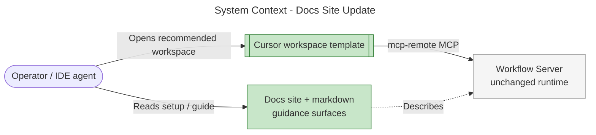

# Architecture Summary

> architecture-summary · Update the Docs Site · PR #293 · 2026-07-25 · activity-worker  
> Minimal summary: documentation-only change; no runtime architecture impact.

## Executive Summary

This work package refreshes workflow-server’s published documentation and onboarding spine so operators and IDE agents follow one accurate path: install transport → deploy/checkout under `HOST_PROJECTS_ROOT` → open the example Cursor workspace → `discover` / `start_session`. No MCP server, storage, or workflow-engine behavior changes.

## System Context

Published guidance and the example workspace are what changed (highlighted). The server process and its tool surface are unchanged.

## What Changed

### Components Added/Modified

| Component | Change Type | Description |
|-----------|-------------|-------------|
| Onboarding spine (`setup` / `http` / `stdio` / getting-started) | Modified | Single Cursor-workspace path; `HOST_PROJECTS_ROOT` checkout model |
| Example Cursor workspace | Modified | Mirrors live multi-root workspace + discover-first rules |
| Docs site pages / generator ledes | Modified | Removes brittle inventory claims; authoring hub polish |
| Drift test suite | Added | CI guards for identity, vocabulary, tallies, ghost paths |

### Key Changes

- **One recommended IDE path:** Copy/open the example workspace instead of hand-rolling MCP JSON as the primary story.
- **Stable layout formula:** Product checkout under `$HOST_PROJECTS_ROOT/<repo>/` with nested planning and worktrees.
- **Drift resistance:** Automated tests fail the build when known stale claim classes return on guarded surfaces.

## Impact

### Who Is Affected

| Stakeholder | Impact | Notes |
|-------------|--------|-------|
| New operators | Medium | Clearer first-session path |
| IDE agent users | Medium | Rules and examples match live auth (`session_index`) |
| Server runtime / API consumers | Low | No behavior change |

## Risks & Mitigations

Planning risks: see [work-package-plan.md](work-package-plan.md). No net-new post-implementation architectural risks. Residual: root README may still carry an inventory tally until a future README pass ([code-review.md](code-review.md) INFO-1).

## Future Considerations

See [deferred-items.md](deferred-items.md).

## Related Documents

- [design-philosophy.md](design-philosophy.md)
- [requirements-elicitation.md](requirements-elicitation.md)
- [code-review.md](code-review.md)
