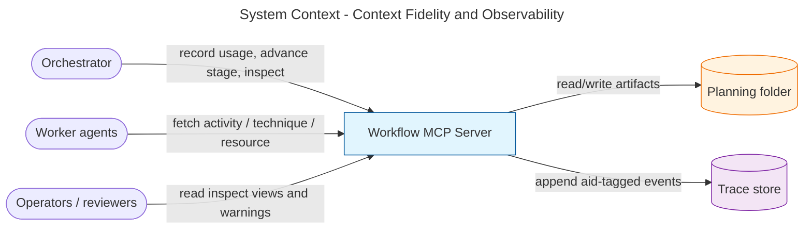
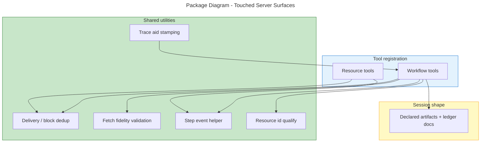
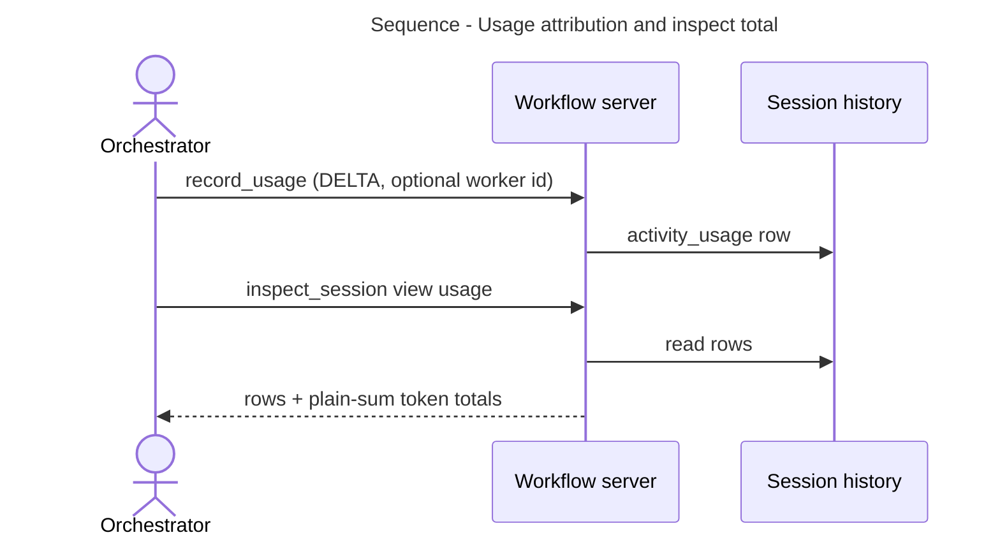
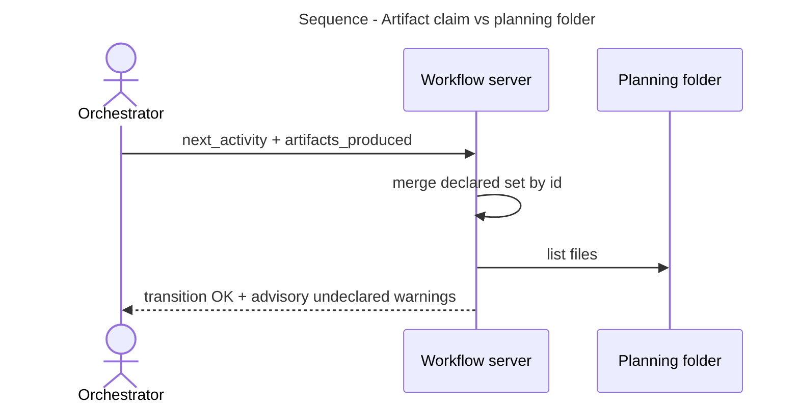
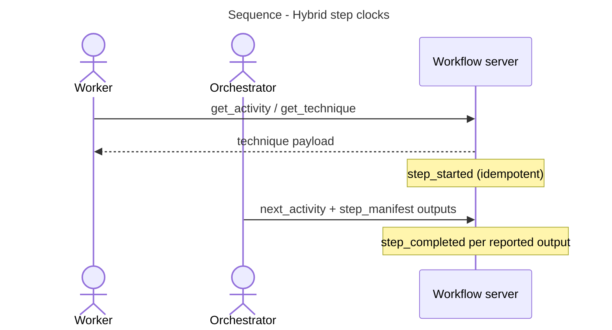
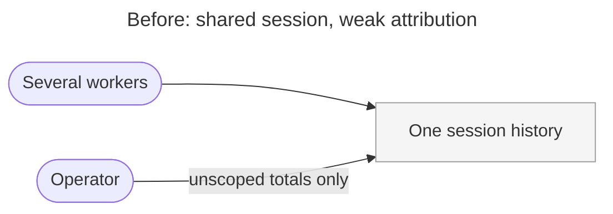
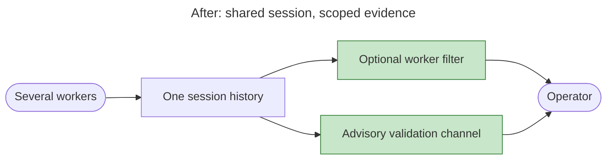

# Architecture Summary

> architecture-summary · Context Fidelity and Observability · #365 · 2026-07-31 · post-impl-review agent

## Executive Summary

This work makes the workflow server honest about four everyday questions: which planning files a stage actually produced, how many tokens a run (or a single worker) used, whether repeated standard wording is paid for twice, and whether diagnostics can name the worker and step involved. Nothing about a successful happy-path run changes shape for operators — evidence becomes filterable and advisory warnings appear when claims and disk disagree.

## System Context

The server remains the single coordination point. Workers still cannot self-measure token cost; the orchestrator still records usage. What is new is optional worker identity on that record, run-level token totals, planning-folder reconciliation warnings, richer delivery collapse for shared wording, and finer diagnostic events.

## Package Structure

## Key Flows

## What Changed

### Components Added/Modified

| Component | Change Type | Description |
|-----------|-------------|-------------|
| Usage inspect view | Modified | Per-dispatch rows plus arithmetic token totals; optional worker filter |
| Usage recording | Modified | Optional worker identity on each DELTA row |
| Planning transition | Modified | Accumulates declared artifacts; warns on undeclared folder files |
| Technique delivery | Modified | Collapses more shared preamble wording across sibling techniques |
| Trace and history | Modified | Worker identity on events; filterable reads; step start/complete markers |
| Resource linking | Modified | Cross-workflow bare refs resolve; broken refs warn without failing the fetch |

### Key Changes

- **Trust in saved planning files:** Undeclared files are named before staging discipline relies on them.
- **Readable run spend:** Token totals are a plain sum of known fields; money/price stays out of this package.
- **Cheaper repeated wording:** Shared contract prose collapses when already delivered to that worker.
- **Debuggable multi-worker runs:** Traces and history can be narrowed to one worker; one worker’s fetch does not prove another did the work.

## Before & After

### Before

### After

## Impact

### Who Is Affected

| Stakeholder | Impact | Notes |
|-------------|--------|-------|
| Orchestrator authors | Medium | May pass worker id on usage and stage advance; should surface validation warnings |
| Worker authors | Low | Same tools; step clocks appear without new worker APIs |
| Operators / reviewers | High | Can split multi-worker spend and see undeclared files |
| External inspect clients | Medium | Usage view is an object with rows and totals |

### System Dependencies

| System | Relationship | Impact |
|--------|--------------|--------|
| Planning folder on disk | Downstream of workers | Diffed against declared artifact ids |
| Trace store | Downstream of tool calls | Events carry worker aid when known |

## Risks & Mitigations

Planning risks: see [work-package plan](06-work-package-plan.md). No net-new post-implementation risks beyond optional client shape adoption for the usage view.

## Future Considerations

See [deferred-items register](deferred-items.md) and [follow-ups](follow-ups.md).

## Related Documents

- [Requirements](03-requirements-elicitation.md)
- [Work package plan](06-work-package-plan.md)
- [Change block index](10-change-block-index.md)
- [Code review](10-code-review.md)
- [Test suite review](10-test-suite-review.md)
- [Structural analysis](10-structural-analysis.md)
- Issue [#365](https://github.com/m2ux/workflow-server/issues/365) · PR [#366](https://github.com/m2ux/workflow-server/pull/366)

