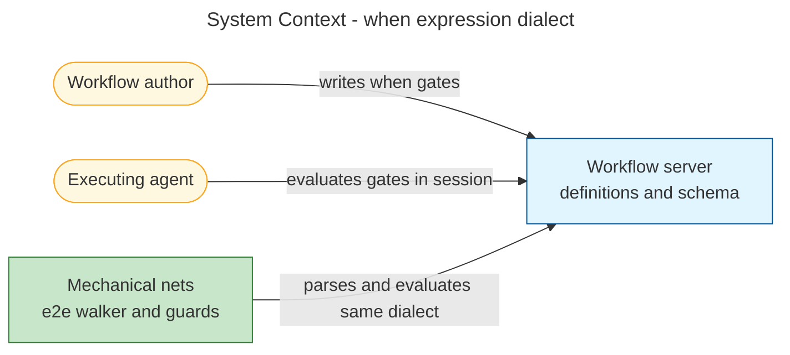
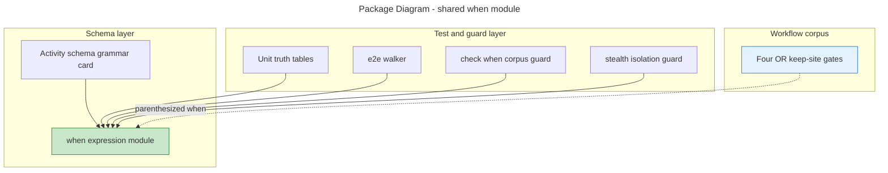
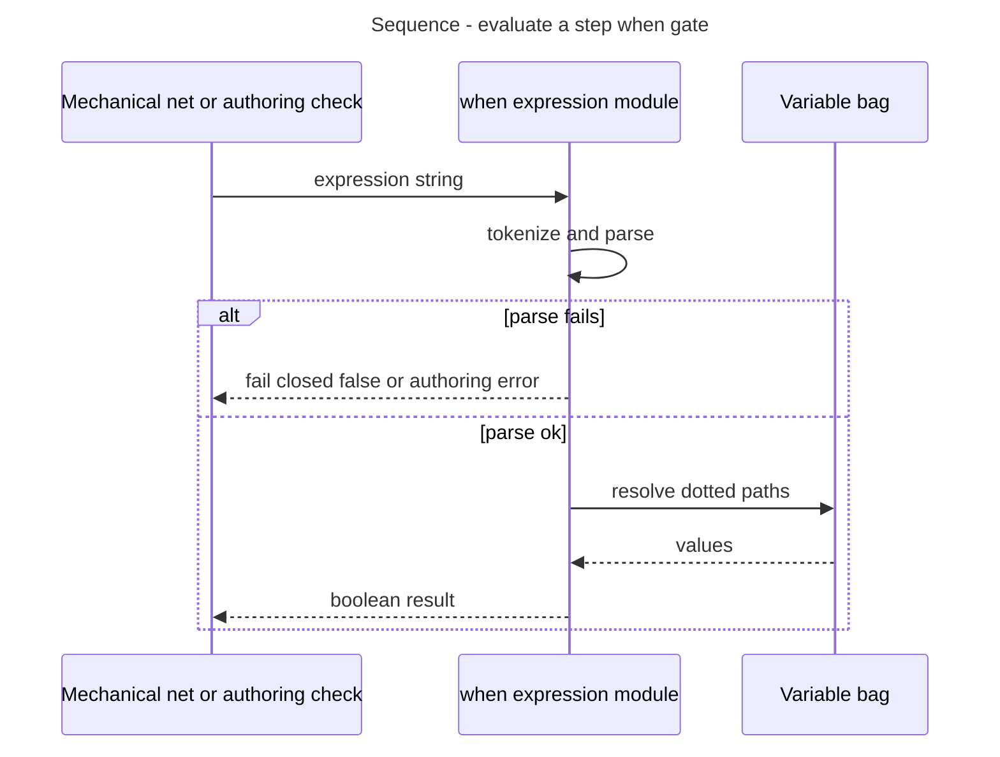
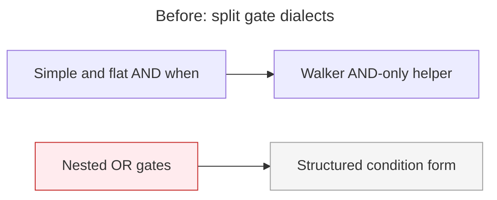
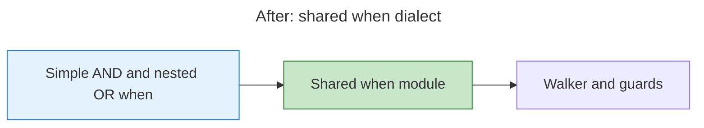

# Architecture Summary

> architecture-summary · when expressions parentheses and precedence · #379 when expressions: \|\|, parentheses, and precedence before OR step-gate migration · 2026-08-01 · post-impl-review worker

## Executive Summary

Workflow authors can now write nested boolean step gates (`&&`, `||`, parentheses) in the same inline `when:` dialect used for simple comparisons. A single shared evaluator backs tests and guards so OR-shaped gates no longer need the older structured form for the four production keep-sites. Agents still decide gates in production; mechanical nets fail closed on invalid expressions.

## System Context

Authors, the workflow-server product, and automated checks all share one expression meaning.

## Package Structure

## Key Flows

## What Changed

### Components Added/Modified

| Component | Change Type | Description |
|-----------|-------------|-------------|
| when expression module | Added | Shared parse, evaluate, and authoring rules |
| e2e walker | Modified | Uses shared evaluator; invalid gates skip the step |
| Corpus guard | Added | Fails CI when `when:` strings are invalid or mix operators without parentheses |
| Stealth isolation guard | Modified | Uses shared parse/eval; stays conservative on parse failure |
| Four workflow keep-sites | Modified | Nested OR gates expressed as parenthesized `when:` |
| Activity schema text | Modified | Documents full grammar and fail-closed mechanical behaviour |

### Key Changes

- **One dialect:** Parentheses and operator precedence are defined once and reused.
- **Safer OR migration:** Nested OR keep-sites match prior structured trees under the same bag states.
- **Authoring guardrails:** Mixed `&&` and `||` without parentheses are rejected before merge.

## Before & After

### Before

### After

## Impact

### Who Is Affected

| Stakeholder | Impact | Notes |
|-------------|--------|-------|
| Workflow authors | Medium | Can write nested boolean `when:` gates with parentheses |
| Agent operators | Low | Production evaluation remains agent-side; grammar card aligns docs |
| Maintainers / CI | Medium | New corpus check and unit suite lock the dialect |

## Risks & Mitigations

Planning risks: [plan](06-work-package-plan.md). No net-new post-implementation risks beyond the intentional fail-closed change for mechanical nets (invalid expressions skip rather than pass through).

## Future Considerations

Follow-ups: [deferred-items register](deferred-items.md). Broader structured-condition migration and multi-agent harness authority remain out of this package.

## Related Documents

- [Design philosophy](02-design-philosophy.md)
- [Work package plan](06-work-package-plan.md)
- [Test plan](06-test-plan.md)
- [Code review](09-code-review.md)
- Issue [#379](https://github.com/m2ux/workflow-server/issues/379) · PR [#383](https://github.com/m2ux/workflow-server/pull/383)
