# Runner — proposal

> Work package for [#523](https://github.com/m2ux/workflow-server/issues/523) · 2026-08-28 · server at
> `c99d9da2`, `workflows` branch at `0cebc48f`

## Executive summary

A workflow definition is a structure: an ordered list of steps, conditions deciding which of them run,
loops that repeat a body, and named endings that decide where control goes next. That structure has
exactly one correct reading. Today an agent does the reading, guided by instructions the server ships
alongside the definitions, and afterwards reports what it did so the server can check the report.

This proposes a **runner**: a program that reads the structure, and asks an agent only to carry out the
things that are genuinely prose — a technique's protocol, a judgement, a piece of writing. The server
stops grading reports and starts reproducing decisions: it accepts a change to a run only when it
independently arrives at the same one.

It aims at three things, in ascending order of importance.

**Efficiency.** Fewer, larger, better-timed deliveries, and the removal of roughly 33,000 characters per
hand-off that exist only to tell an agent how to interpret a structure.

**Determinism.** The same definitions, the same values and the same answers produce the same sequence of
prompts. That is currently not true and cannot be asserted.

**Fidelity.** Today the system's own documentation describes seven enforcement layers, of which **two
refuse a call and five only record a warning** — and it lists eight things it cannot verify at all, most
of which reduce to the same sentence: the agent is the one reporting, so the report is what gets checked.
The runner's central contribution is not another check. It is removing the agent's ability to misreport,
by never giving it the structure to misreport about.

The result is that correctness stops being something checked after the fact and becomes a property of
the arrangement. An agent that never receives the structure cannot depart from it.

Three companion documents carry the working: [investigation.md](investigation.md) for what the code and
corpus do today, [protocol-verification.md](protocol-verification.md) for three reviewed designs of the
interaction and the claims they overturned, and [cost-model.md](cost-model.md) for the measurements that
fix how much work is handed over at a time.

## The participants

Five take part in a run, plus two supporting pieces.

| Participant | Responsibility | New? |
|---|---|---|
| **User** | Answers decisions that need a person. Sees progress. | No |
| **Runner** | Reads the structure. Decides conditions, drives repetition, resolves each step's inputs, composes prompts, and reports every step. | **Yes** |
| **Server** | Holds the session, resolves definitions, reproduces every reported transition, and refuses what it cannot reproduce. | No, but its job changes |
| **Worker** | Does the run's work. A context that spans an activity or more, receiving one technique per turn: reads prose, exercises judgement, writes content, returns values. | No, but its job narrows |
| **Host agent** | Invokes the runner, spawns workers with the prompts it composes, and carries a rendered question to the person and an option back. Decides nothing. A [later layer](#the-runner-as-host) removes it entirely. | No, but its job narrows sharply |
| Harness | Hosts the agents and exposes spawning to them as a tool. | No |
| Session store | The run's values, decisions and history, sealed. | No |

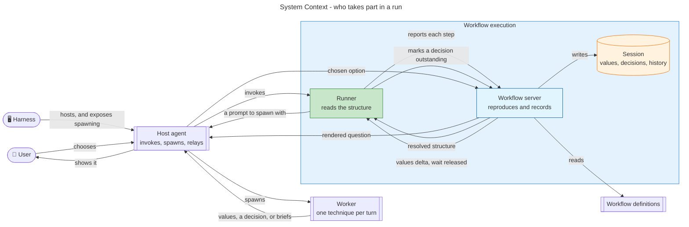

Green marks the new component. Everything else exists.

## Use cases

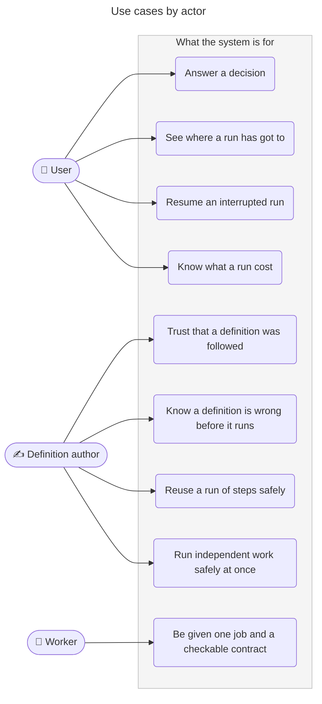

## User stories

**As a user**

- I want to be asked a question only when the run genuinely needs my judgement, so that I am not
  interrupted by something the structure already determines.
- I want a question to arrive without a fresh agent context being established purely to ask it, so that
  asking me something is cheap.
- I want to see which step a run is on, so that I can tell progress from a stall.
- I want an interrupted run to continue from where it stopped rather than from the start of the activity,
  so that I am not asked the same question twice and work is not repeated — and so that losing an agent
  context costs one step rather than one activity.
- I want to know what a run cost, per activity, so that existing accounting keeps working.

**As a definition author**

- I want a wrong reference or an unparseable condition to fail when the definitions load, so that I find
  out at authoring time rather than mid-run.
- I want the checks that hold a step's declared inputs to a producer to work step by step rather than
  activity by activity, so that a mistake is localised.
- I want to know that what ran is what I wrote, so that a run is evidence about the definition rather
  than about the agent that read it.
- I want a step that was skipped to have been skipped because its condition was false, not because an
  agent overlooked it, so that a run tells me something about my conditions.
- I want two runs of the same definition, given the same answers, to ask the same questions, so that a
  change in behaviour means a change in the definition.
- I want to reuse a run of steps without copying it, so that a change lands in one place. *(This is
  [#520](https://github.com/m2ux/workflow-server/issues/520); a runner walks the tree that proposal
  resolves.)*
- I want work to run at the same time only where something has established that it is independent, so
  that concurrency is a property of the definition rather than a hope.

**As a worker**

- I want to receive a technique's prose, its rules, and the values I need, so that I can do the work
  without interpreting a structure.
- I want to be told exactly which values I owe back, so that "done" is checkable rather than a matter of
  opinion.
- I want a way to raise a decision the definition did not anticipate, so that unexpected work has
  somewhere to go.

## Architecture

### Container view

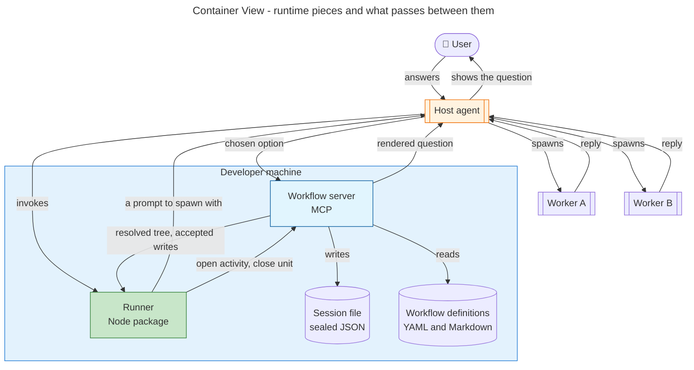

The runner has no line to the person. It marks a decision outstanding on the server and waits, and the
question travels to the person through the host agent — see
[How a decision reaches a person](#how-a-decision-reaches-a-person) below. That is the arrangement this
proposal introduces; a [later layer](#the-runner-as-host) gives the runner
the channel and takes the agent off the path.

The two working links have opposite grains. Runner-to-server is one local process addressing another, so
it may be as chatty as it likes. The link to a worker is expensive — an exchange costs roughly what
18,800 characters of fresh content costs, and establishing a fresh context costs 23,000 to 42,000 tokens
— so it stays coarse and carries prose. That asymmetry is the whole design; the reasoning is in
[cost-model.md](cost-model.md). The third link, carrying a question to the person, is neither: it is rare,
small, and paced by a human.

Note that the runner does not reach a worker directly. It composes the prompt and the host agent spawns
with it, for the reason set out next.

### What the runner is, and who spawns a worker

Spawning is an agent capability, not a program's. A harness exposes it as a tool in an agent's tool list
— one invokes an `Agent` call, another a `Task` call, and the corpus resolves which by harness kind. So
the server has never spawned anything, and a runner cannot either by merely existing. Workers already
spawn workers this way: the technique taking a list of briefs and a concurrency limit is bound as an
ordinary step at 22 sites, and the worker running that step holds the primitive because it *is* an agent
inside the harness.

That leaves two coherent arrangements, and they settle more than spawning.

**Runner as a tool.** An agent invokes the runner. When work is to be handed out the runner returns a
composed prompt, that agent spawns with it and hands the reply back. The agent decides nothing, composes
nothing and tracks nothing — it holds a primitive the runner lacks. Harness-agnostic and needs no
credentials; the cost is that every dispatch round-trips through its context.

**Runner as a host.** The runner sits at the top and spawns directly, through a harness's programmatic
interface, a model API, or a command-line agent as a subprocess. It then necessarily holds the channel to
the person too, because no agent is above it to relay one. Credentials and the harness-specific spawn
layer become the runner's, and the guarantees that need an agent off the path become available.

**The two questions are one question.** Whether the runner spawns, and whether it talks to the person,
both turn on whether it sits under an agent or above them all. **This proposal introduces the runner as a
tool**, and [the later layer](#the-runner-as-host) makes it a host — which
is why that layer is not merely a change of channel but a change of what the runner is.

Handing out one piece of work therefore looks like this. The [key flows](#key-flows) later on draw the
runner prompting a worker as a single step; this is what that step actually contains.

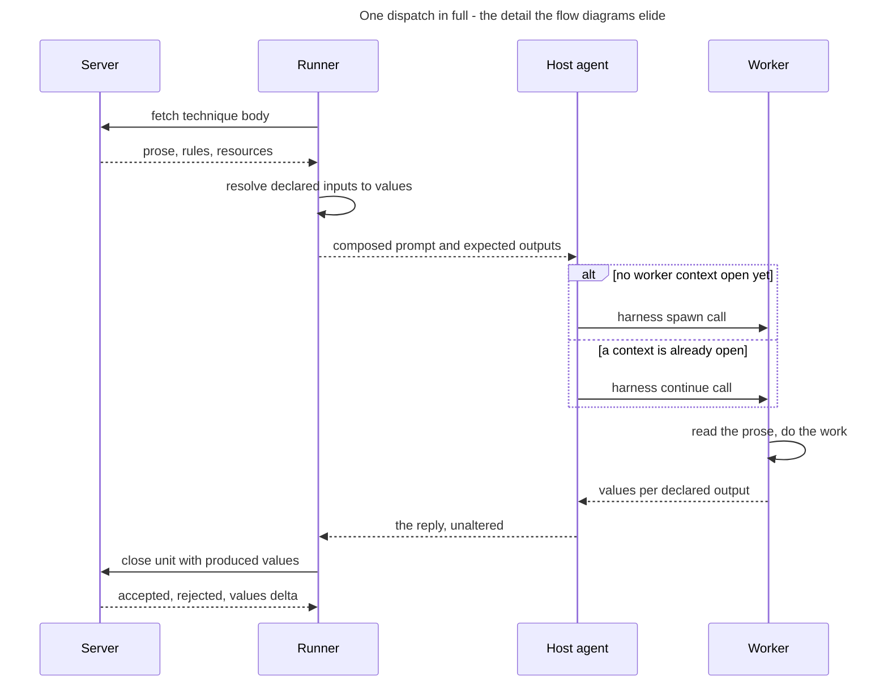

Two things this makes visible. The host agent appears twice and does nothing either time except carry
something it did not compose and cannot alter — which is why it is a proxy rather than a tier. And the
branch is the reason a worker is a *context spanning an activity or more* rather than one per technique:
the corpus already distinguishes spawning an agent from continuing one, and a fresh context for each of
611 technique steps would multiply the largest cost in the system fivefold.

### How a decision reaches a person

**Every conversation with the person is agent-mediated, and stays that way under this proposal** — a
[later layer](#the-runner-as-host) changes it, and this section describes
what holds until then. The dispatch model states the constraint as a rule: the user-facing agent is the
only one that talks to the person, and it presents every question a run raises. So the runner does not
acquire a channel to the person by existing, and the arrow between them in the diagrams above is a
statement about where a question *originates*, not about how it travels.

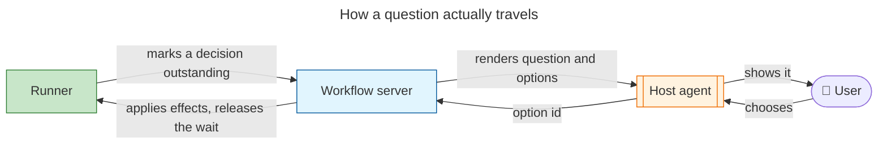

The runner never presents anything. It marks a decision outstanding and waits; the server already holds
exactly one outstanding decision at a time and already renders it with its consequences resolved; and the
host agent carries it to the person and carries an option back. Presentation is a front end's
concern, not the runner's, and the runner stays headless.

**What changes is what the mediating agent is able to do.** Today that agent reads the definition, decides
whether the decision's condition applies, composes the question, may dismiss it on its own say-so, and
reports an outcome. Under the runner it becomes a courier: the question is server-rendered, the option set
is closed, dismissal is verified against the session values rather than taken on trust, and the existing
minimum response interval and auto-advance timers still apply. What it could fabricate shrinks from
everything about the decision to which of *n* fixed options a person chose.

That is a real narrowing and it is worth having, but it is not elimination. **Whether a person actually
saw a decision remains at *detected*, not *unrepresentable*** — an agent remains on the path of the
answer, and the trace records the interaction for review afterwards, exactly as it does now.

**One design consequence for this work.** Build the decision channel as an interface with a single
implementation — the agent-relayed one above — rather than as inline calls. It costs nothing now, and it
is what lets the channel be replaced later without touching anything else. A later layer does exactly
that, and raises the guarantee in the process:
[the runner as the decision channel](#the-runner-as-host).

### Where each responsibility sits

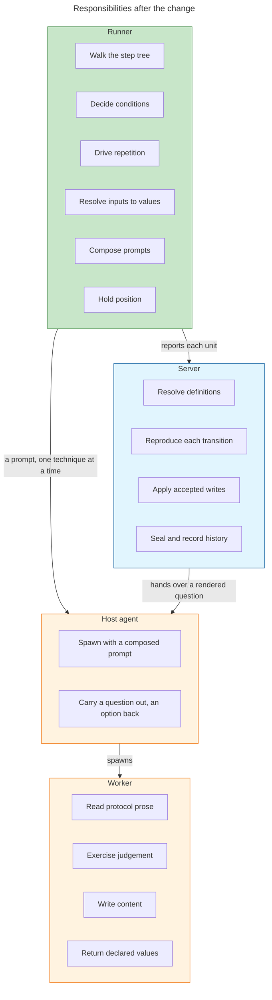

The line between runner and agent is the technique's declared signature. Everything above it is
structure; everything below it is prose. Nothing crosses.

### What becomes of the agent hierarchy

Work is currently handed down a chain of three agent tiers: a user-facing agent that talks to the person
and spawns an orchestrator, an orchestrator that reads the workflow and spawns workers, and workers that
execute an activity's steps. The runner takes the middle tier's *judgement*, but not its spawning, which
has to stay with an agent. So it is worth being exact about what happens to each tier and to the
orchestration workflow that describes them.

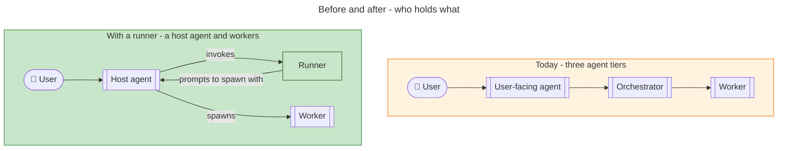

**The orchestrator tier loses its judgement and keeps only a primitive.** Its technique bundle reads as a
job description for the runner: dispatching an activity, resuming a worker, deciding whether to continue
a batch, and the driving loop itself all become code. Handling a sub-workflow survives as the existing
child-session mechanism, which is session-level nesting and untouched by this. The conduct rules written
for an orchestrator go, being guidance for decisions no agent makes any more.

What cannot become code is the spawn itself, so the tier does not vanish outright at this stage — it
collapses upward into the agent that talks to the person, which is left holding two primitives and no
decisions: spawning, and relaying a question. **This document calls that combined role the host agent**,
since facing the user is no longer the whole of its job. The [later
layer](#the-runner-as-host) removes even that.

**The orchestration workflow splits three ways.** It is not demoted to a lower tier — most of it is
setup and teardown around a loop the runner now *is*.

| Its activities | Under a runner |
|---|---|
| Discover a session, initialise it, resolve the target | Stay ordinary activities. Real work with side effects, executed by the runner like any other workflow's, with techniques dispatched to agents |
| Dispatch the client workflow | **Ceases to exist.** This activity is the orchestrator loop |
| End the workflow | Splits. The close-out work stays; the edge that routes back into the loop is control the runner owns |

**Why the tier disappears rather than merging.** The dispatch model gives the reason the hierarchy exists:
one agent cannot run a whole workflow well, because talking to the person, tracking where a long run has
got to, and doing the work are three different jobs, and an agent doing all three fills its context with
material irrelevant to whichever it is currently doing. Three concerns, three tiers. The runner does not
isolate the middle one better — it stops it being agent work at all, because tracking position becomes a
cursor in a program rather than a job needing context.

**And the remaining agents change in kind, not just in number.** Today each tier holds partial state and
passes summaries down and reports up; that chain of stateful actors *is* the hierarchy. A worker
receives a prompt, returns values, and holds nothing — no position, no server access, no memory of the
run. So the arrangement stops being a delegation chain and becomes a program with stateless calls, which
is a larger change than flattening.

One consequence to tidy up when this lands: the worker conduct rule forbidding calls to the control-plane
tools becomes unenforceable advice, since a worker has no server access to misuse. It should be
deleted rather than left standing.

## The contracts

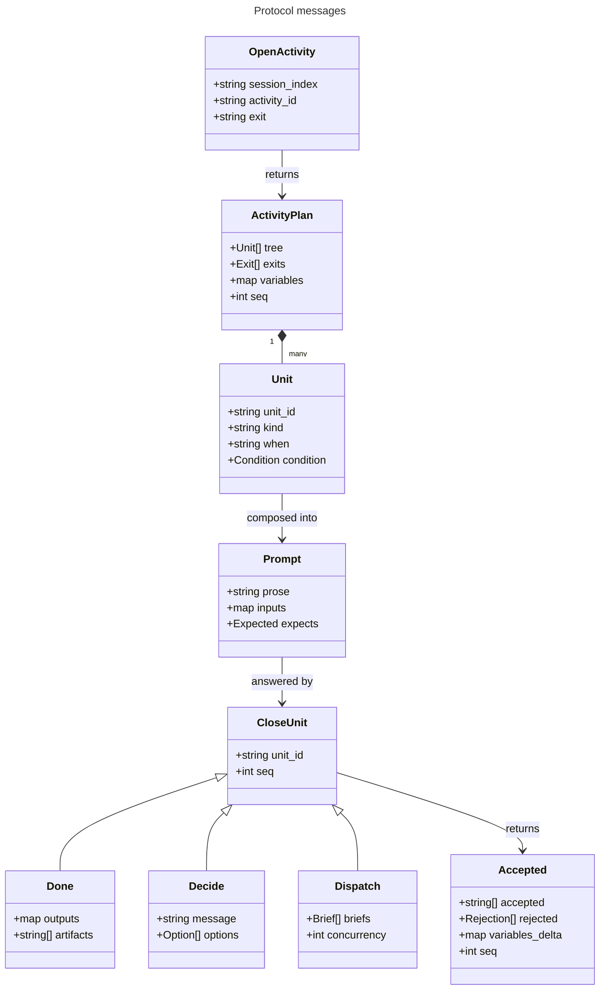

A reply from an agent takes one of three shapes, and the third is not optional — a technique taking a
list of worker briefs is bound as an ordinary step at 22 sites across 8 activity files, each preceded by
a step that composes those prompts at run time from domain material no runner could derive.

| Reply | Carries | Why it exists |
|---|---|---|
| `done` | Values per declared output, artifact paths | The ordinary case |
| `decide` | A question and options | Work admitted part-way through a run that the definition could not anticipate |
| `dispatch` | Worker briefs and a concurrency limit | The corpus composes its own fan-out prompts |

## Designed for a later formal language

A future direction for the project is to replace the YAML mechanics with a dedicated TypeScript-like
language giving a strict formal reading of activity mechanics. That migration is not proposed here and
this design carries **no compatibility obligation toward it** — no dual-format support, no migration
path, nothing held open in case. But it costs nothing to build the runner so that such a migration is a
change of one layer rather than a rewrite, and it is worth saying what that requires.

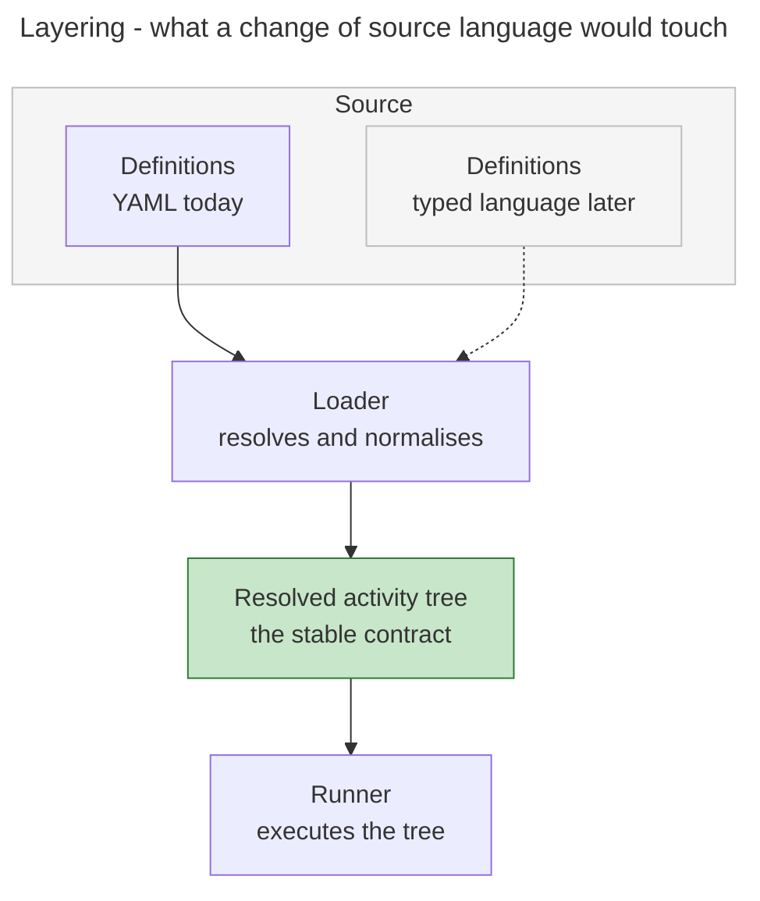

**The runner never sees source.** It receives a resolved tree as data and has no parser, no file access
and no knowledge of the notation the tree came from. The stable contract is the tree, not the file
format. This falls out of the protocol as already designed — the alternative, where the runner loads
definitions itself, was rejected for a different reason — but it should be held deliberately rather than
enjoyed by accident, because it is the whole of what makes a later change of language cheap.

**The runner is the operational semantics.** A formal language needs a definition of what each construct
means: when a loop stops, what an absent value does to a comparison, in what order inputs resolve, what
happens when a required one does not. Today those answers are distributed across prose, a test harness
and the reading habits of agents. The runner collects them into one executable definition — so a typed
language would be a better *surface syntax* for semantics the runner has already fixed, rather than a new
thing needing semantics of its own.

Three consequences follow for how the runner is built:

1. **Conditions travel as trees, not strings.** A verified design already recommends the server ship
   condition expressions rather than verdicts. Keep them structured on the wire, and a language that
   emits typed expressions natively needs no adapter.
2. **The loader resolves surface ambiguity; the runner never meets it.** Anything undecidable only
   because of how YAML writes it belongs on the loader's side of the boundary — whether a bare string is
   a literal or a reference, which of two token grammars applies, an artifact prefix derived from a
   filename's position. A typed language would not create these problems, so the runner should not be
   built to cope with them.
3. **Nothing positional survives into the tree.** Document order is a property of a text file. Where
   order matters it should be explicit in the tree, so that meaning does not depend on how the source
   happened to be laid out.

**Building the runner settles what a formal language would have to settle anyway.** Four ambiguities in
the current mechanics have no single correct reading today, and the runner cannot be written without
choosing: where a repeat-until loop keeps its continuation condition, whether an absent value makes a
comparison false or unanswerable, whether a bare binding is a literal or a reference, and whether a step
identifier is unique within its activity. Each is a semantic question a formal reading would have to
answer, so answering them now is not a detour — it is the same work, done earlier and against a running
system rather than a specification.

## What this buys

### Efficiency

The saving is not in sending less per delivery — the server already withholds every step whose condition
reads false, so there is no waste to reclaim. It is in answering the conditions that cannot be answered
at delivery time, and handing over the next unbroken run of steps in one go. That collapses 23 to 84
separate fetches on the reference path, worth 108,000 to 395,000 tokens, and retires the
instructions-on-how-to-drive that ride on every hand-off. The full reasoning, and the three exchange
rates it rests on, are in [cost-model.md](cost-model.md).

### Determinism

A prompt becomes a pure function of the definitions and the resolved input values. Nothing about a
prompt depends on which agent asks, when it asks, or what it has in context. Two consequences follow that
are not available today: a prompt can be fingerprinted, so a divergence between two runs is detectable
rather than invisible; and the same definitions with the same answers produce the same sequence of
prompts, so a run becomes evidence about the definition rather than about the agent that read it.

This is also what makes the existing content-reuse machinery work properly. Today the record of
already-sent content keys on the technique while hashing text that carries position-dependent annotation,
so the same technique at two positions hashes differently and is sent twice. Strip the annotation and the
body is corpus-pure.

**A further uplift is available and is deliberately not proposed here.** A runner is only as deterministic
as the amount of the workflow that is expressed as structure, and a good deal of genuinely mechanical
content currently sits in technique prose where nothing can reach it — a technique whose name says it runs
a loop, bound at four sites; 137 places a technique invokes another from inside its own prose; the same
file-writing routine reproduced at 21 of them. Each of those is control flow, and each would move from
convention to enforceable if it were expressed structurally. With a runner walking the structure and
[#520](https://github.com/m2ux/workflow-server/issues/520) giving a run of steps a name and a home, that
content would for the first time have somewhere to go — the destination is usually smaller than an
activity, which is the wrong size twice over given a guard forbids one opening with a decision and each
one costs a hand-off.

That migration is a separate activity and is out of scope for this proposal. It is named here because it
sets the ceiling: the runner determines how much of what *is* structural runs deterministically, and the
migration determines how much becomes structural in the first place.

### Fidelity — the point of the exercise

Enforcement has strengths, and it is worth naming them so a proposal can say which one each guarantee
sits at.

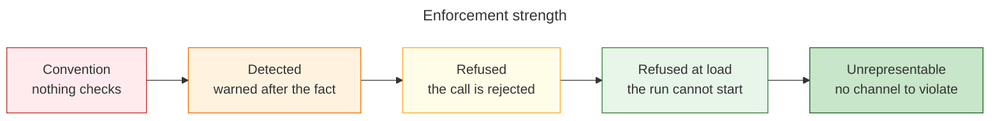

Most of what the documentation calls enforcement sits at **Detected**. A drifting agent is visible rather
than stopped, and a confused one may ignore the warning. The runner's method is not to add checks at that
level but to move guarantees up the ladder — and the largest moves land at **Unrepresentable**, because a
guarantee an agent has no channel to violate needs no enforcement at all.

#### Guarantees that get stronger

Each row is a limitation the fidelity documentation states in its own words.

| Guarantee | Today | With a runner | How |
|---|---|---|---|
| The steps that ran are the steps that were meant to run | Detected — the manifest validates that the agent *reported* each step, not that it performed it | **Unrepresentable** | The runner hands out each unit and receives each reply, so there is no self-report to check. The manifest concept disappears rather than improving. |
| A condition's truth decided the branch | Convention — the server checks a claimed outcome maps to the target, but "cannot verify whether the condition is actually true" | **Refused** | The runner evaluates against values the server holds, and the server re-derives every reported transition and rejects what it cannot reproduce. Needs per-step write authority. |
| A conditional decision was genuinely inapplicable when dismissed | Convention — "relies on agent honesty"; the server checks only that a condition field exists | **Refused** | One evaluation of the condition against the session values. Available today, independent of the runner. |
| A person actually saw a decision | Convention — "an agent could wait the minimum time and then submit a fabricated response" | **Detected** while an agent relays; **refused** once the runner holds the channel | Relayed, an agent stays on the path of the answer, but what it can fabricate shrinks from composing the question and dismissing the decision to returning one identifier from a closed set. Over a chat platform no agent is on the path at all — see [the later layer](#the-runner-as-host). |
| A repeated call is distinguished from a fresh one | Detected — visible in the trace afterwards | **Refused** | Position is recorded per step and is authoritative, so a repeat is a no-op or a refusal rather than a second execution. |
| Steps ran in declared order | Detected — a relative-order comparison over a self-report | **Unrepresentable** | Order is the runner's walk. There is nothing to compare. |
| An iteration bound was respected | Convention — "iteration is executed and bounded entirely by the agent" | **Refused** | The runner drives repetition and holds the count. |
| Warnings are acted on | Convention — "a confused agent may ignore validation warnings" | **Refused** | The consumer is a program, and the server refuses rather than warns where it can reproduce the answer. |
| What happened is recorded faithfully | Detected — the semantic trace "relies on agent discipline" | **Refused**, partly | Which steps ran, which conditions held, which options were chosen and which values changed all become mechanical. The prose describing an output stays the agent's. |

#### Guarantees that are newly possible

These do not exist at any strength today.

| New guarantee | Level | How |
|---|---|---|
| A step's declared inputs were all resolved before it ran | **Refused** | An input that resolves to nothing refuses before dispatch. Today it reaches an agent annotated as unresolved and the agent improvises. |
| A step returned exactly what it declared | **Refused** | The reply is checked against the declared output identifiers, remap destinations and types. Today a step's report is one free-text string checked for non-emptiness, and nothing joins "this step declares an output" to "the session gained it". |
| A declared artifact exists, under the declared name | **Refused** | The runner owns naming and placement; the agent returns content. |
| Every value a step reads has a producer before it | **Refused at load** | The existing analysis moves from activity granularity to step granularity, which becomes possible once step order is authoritative. |
| A condition is well-formed | **Refused at load** | Move the parse check into the loader. The corpus is at zero failures, so this is free now and dearer later. |
| Two runs of the same definition asked the same questions | **Refused** | Prompts are fingerprintable, per Determinism above. |
| Work that ran in parallel was safe to parallelise | **Refused** | Concurrency is declared and checked rather than assumed — and the check found that a naive reads-and-writes test would wrongly clear 231 adjacent step pairs whose real dependency is shared state on disk. |

#### How far shape checking reaches, and what it does not settle

The runner checks that a reply has the parts it declared. How much that establishes depends on how much
the declaration says, and the corpus is uneven about it. Measured over 575 technique files declaring 730
outputs:

| Declaration | Count | Settled mechanically |
|---|---|---|
| Output has a prose description | **730 of 730** | No — prose against prose |
| Output declares named sub-members | **78** (241 members) | **Yes** — member presence and shape |
| Output declares an artifact filename | 149 | **Yes** — existence and name conformance |
| Output is machine-read, so serialised as JSON | 19 | **Yes** — parses, and carries the declared members |
| Technique declares a capability statement | 562 of 575 | No — prose |

Only 11% of outputs declare their structure, so for most of them the runner can establish that a value
came back under the right name and nothing more. **That percentage is the lever**: every output that gains
declared sub-members moves out of agent judgement into mechanical checking at no runtime cost, and it is
corpus work that needs nothing from this proposal.

What shape checking cannot settle is whether the content says what it was supposed to say. A runner makes
it possible to close part of that gap — because it holds the declaration and the returned content
together in one place, it could dispatch a second agent, in its own context, to judge one against the
other and return a typed verdict. That would be an independent check rather than a self-report, and it is
a real strengthening, though the honest description is pseudo-verifiability: trust moves to a dedicated
agent rather than disappearing, and correlated blind spots, the absence of ground truth and the survival
of plausible-but-wrong content all remain.

**That capability is unlocked by this work but is not part of it.** It is named because it changes what
the ceiling looks like, and because the declaration-widening above is worth starting whether or not it is
ever built.

#### What stays unenforceable, honestly

Three things remain outside reach, and none of the work proposed here changes them:

- **Whether a technique's protocol was followed.** The runner establishes that a technique ran and
  returned what it declared, never which branch it took inside, and it cannot resume one part-way.
- **Whether returned content says what it should.** Shape is checkable; meaning is not. This is the gap a
  qualifying agent could narrow, and the reason that capability is worth naming even though it is not
  built here.
- **Whether a judgement was sound.** That is the work an agent is for, and no amount of checking replaces
  it.

The trace's survival across a server restart is also untouched, though that is a storage matter rather
than a fidelity one.

The shape of the improvement is worth stating plainly: nothing here makes an agent more trustworthy. It
narrows what an agent is trusted *with* — from "read this structure and tell us what you did" down to
"carry out this one thing and return these named values" — and only the second is a claim the server can
check.

## Key flows

Each sequence below shows the runner prompting a worker as a single step. That is shorthand for the
exchange drawn in full under [what the runner is, and who spawns a
worker](#what-the-runner-is-and-who-spawns-a-worker): the runner composes the prompt, the host agent
spawns or continues a worker with it, and hands the reply back unaltered. It is elided here because it is
identical in every flow and would add the same lane to each without changing what happens — and it
becomes literal only under [the later layer](#the-runner-as-host), where the runner spawns
for itself.

### Executing a run of steps

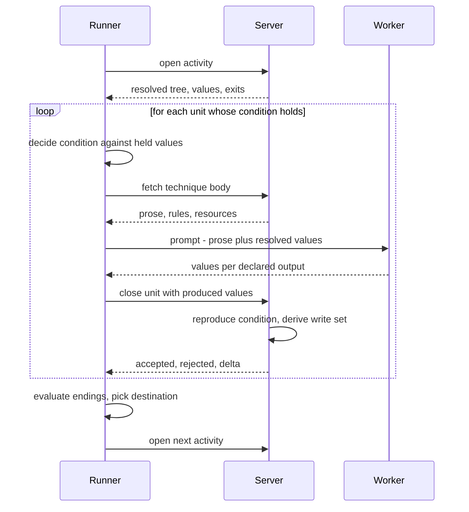

### A decision that reaches the user

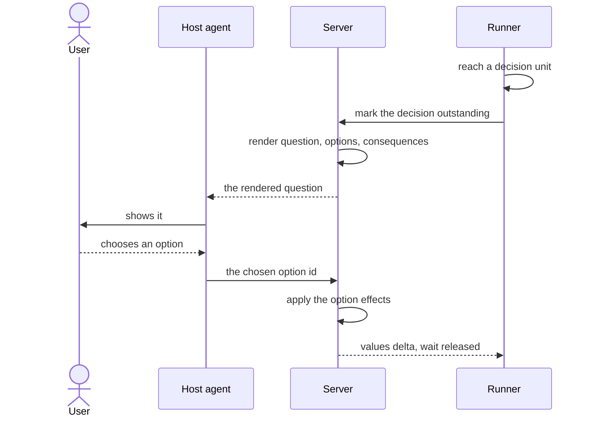

The runner composes nothing here and the host agent decides nothing: the question is rendered by
the server from the definition, and what comes back is one identifier from a closed set. The agent is on
this path only until the [later layer](#the-runner-as-host), which replaces
it with a channel the runner holds.

No worker context is established, which is why the rule forbidding an activity from opening with a
decision can go — that rule exists because asking a question currently costs a whole worker context, and
here it costs a turn in a context that already exists.

### Fan-out, where the agent composes the briefs

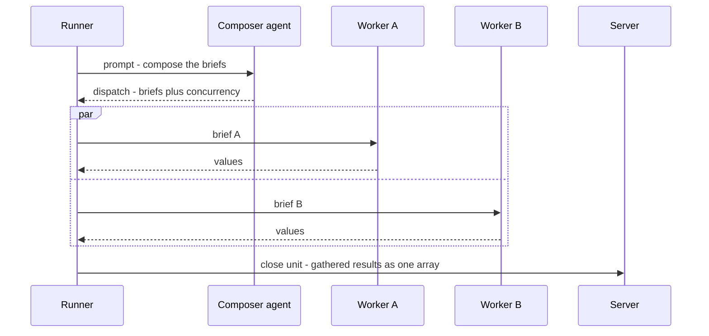

Results gather into one declared name in one call. Writing a value per iteration under an indexed name
is not expressible, because no value-path reader in the system handles brackets.

### Resuming after interruption

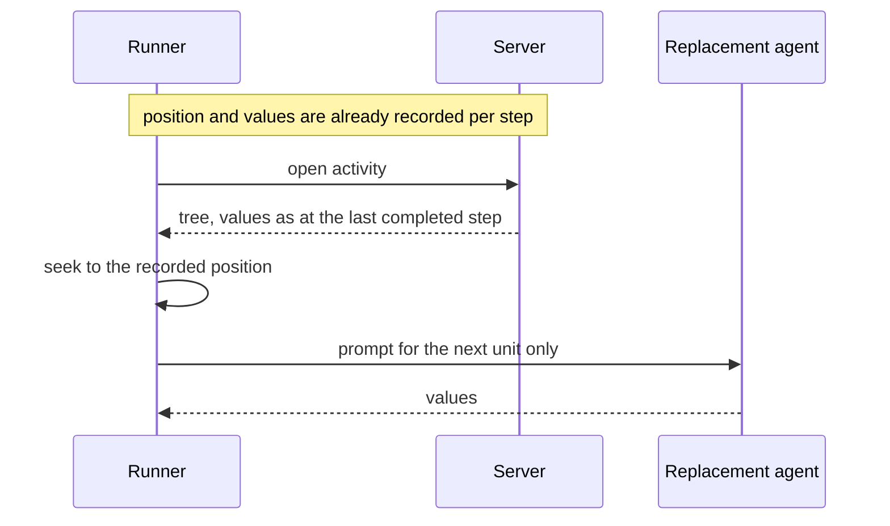

Today a replacement re-enters the whole activity and crosses already-answered decisions by replaying
recorded answers. With position recorded per step, the decision is never re-reached, and replay shrinks
back to genuine re-entry.

### The lifecycle of one unit

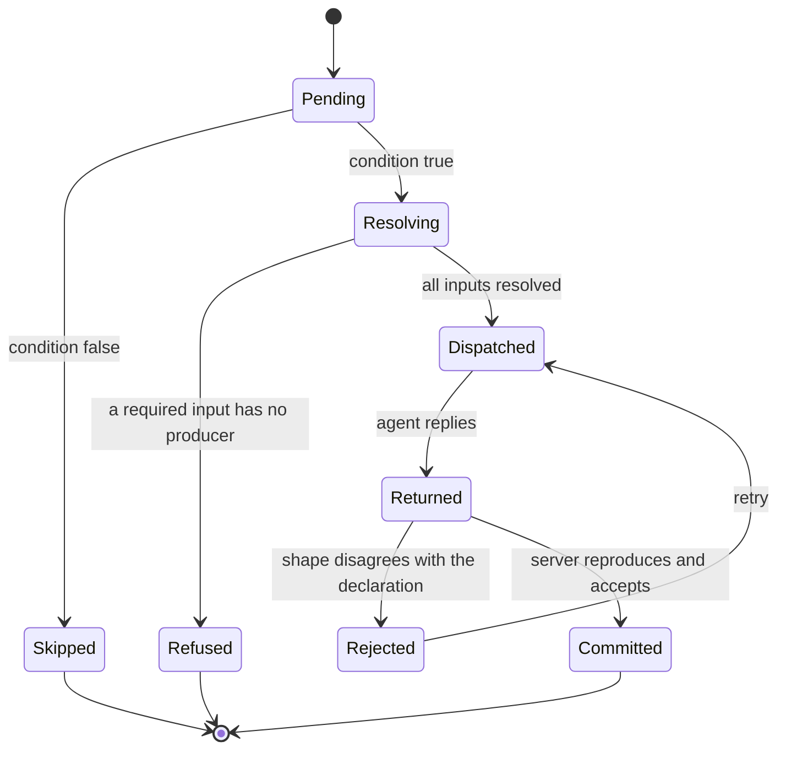

`Refused` is the state that does not exist today. An input that resolves to nothing currently reaches an
agent marked unresolved, and the agent improvises.

## What the runner is not allowed to do

- **Parse a technique's protocol.** It is prose, and 436 of the corpus's 2,459 protocol bullets carry
  control flow of their own, so a call is all-or-nothing: the runner establishes that a technique ran and
  returned what it declared, never which branch it took inside.
- **Spawn a worker.** Spawning is a tool in an agent's tool list, not an interface a program can call, so
  the runner composes a prompt and the host agent spawns with it. This holds until
  [the later layer](#the-runner-as-host).
- **Author every prompt.** Twenty-two sites compose their own.
- **Run two decisions at once.** One decision is outstanding per session; two members of a fan-out cannot
  both escalate without a keyed map.
- **Make dispatch finer.** The gain is that the server decides where a coarse boundary falls, not that
  boundaries multiply.
- **Take on the environment.** Validation instructions ask the host whether a tool is authenticated or a
  key is available. Whether the runner shells out or delegates is unresolved — see
  [protocol-verification.md](protocol-verification.md).
- **Parse a definition file.** It receives a resolved tree and has no parser and no notion of the source
  notation, which is what keeps a later change of language confined to the loader.

## Delivery stages

Each is useful alone and assumes nothing after it.

| Stage | Lands | Fidelity gained | Depends on |
|---|---|---|---|
| 1. Correct and widen | Stale documentation fixed; the condition guard covers endings, nested directories and validation targets; an unparseable condition fails the load; the unused early-exit field deleted | A condition is well-formed — **refused at load** | — |
| 2. Server answers | A dismissed decision is verified against the values rather than taken on the agent's word; an activity's ending is computed and reconciled | Dismissal honesty and branch truth move from convention to **refused** | 1 |
| 3. Binding resolution | A bare supplied value always means a literal and a reference is always braced, migrated across 193 sites; the two placeholder grammars unified on the dotted form; a guard for both | Input resolution stops being a heuristic — **refused at load** | — |
| 4. Write authority | A step's declared outputs land when the step finishes, and the session store gains an index or cache so per-step writes are affordable | Makes branch truth checkable at all; unblocks the rest | — |
| 5. Position and repetition | A durable cursor with a frame per loop; something that drives iteration | Repeat calls and iteration bounds — **refused**; order becomes **unrepresentable** | 4 |
| 6. The runner | The three calls, prompt composition, the three-shaped reply, artifact writing, and the commit and progress techniques dispatched at each boundary | Step execution becomes **unrepresentable**; input resolution and return shape **refused** | 3, 4, 5 |
| 7. The runner as host *(later)* | The runner spawns workers directly and reaches the person over a chat platform, so no agent sits above it | Decision presence rises from **detected** to **refused**, third-party attested | 6 |

Stage 2 is where the conceptual step happens, and it is worth doing for its own sake: it is the first
time a server verdict overrules an agent's claim. Stage 4 is the load-bearing one — until a step's
outputs land when the step finishes, most conditions cannot be decided by anyone but the agent that
produced them, and the fidelity argument has no purchase. Stages 3 and 4 are independent of each other
and both precede the runner.

### One dependency that has to be discharged before stage 6

A technique's protocol prose sometimes tells the reader to apply another technique. There are **137 such
references across 75 files**, and the loader resolves none of them. Today that works because a worker can
fetch what it is told to apply. Under the runner it does not: a worker receives prose and values and has
no server access, so it reaches an instruction to apply something and has nothing to apply. This is
already documented in the loader, which notes that a technique named inside another's protocol has no
delivery path of its own — which is why nine such references are hand-listed into the core orchestrator
set as a workaround. At 137 that workaround does not scale, and the failure is functional rather than
untidy: the worker improvises the invocation.

There are two shapes for resolving it, and they are not exclusive.

**Resolve a closure into the prompt.** The runner follows each inline reference and includes what it
names, transitively. Needs a depth and cycle policy, and it changes the prompt-size arithmetic the
[cost model](cost-model.md) rests on, since a prompt now carries an unknown number of additional bodies.

**Turn them into steps.** An invocation written in prose becomes a step in the structure, which is what
[#520](https://github.com/m2ux/workflow-server/issues/520) exists to make possible — the shared run of
steps gets a name and a home, and the caller references it instead of describing it. Twenty-one of the
137 are the identical artifact-writing invocation and are already removed by the artifact decision above,
since a technique declaring an artifact now says where its output belongs and the runner writes it.

**What decides the split is unmeasured.** Nobody has broken the remaining 116 down by kind. They are
likely to divide between mechanical sub-tasks that convert cleanly, compositional cases where one
technique applies another per item and wants a routine holding a loop, and cross-cutting references that
are closer to *consult this* than *invoke this* and should not be converted at all. That breakdown decides
how much converts and therefore how much closure resolution the runner still needs — possibly none,
possibly a bounded amount for the residue.

**So a census of the 137 by kind is a prerequisite**, and it is cheap. It sharpens #520's scope and the
runner's prompt design at the same time.

### Where the routine work sits

[#520](https://github.com/m2ux/workflow-server/issues/520) is independent of the runner in both
directions: routines resolve at load into ordinary steps, so today's agent-driven execution handles the
result unchanged, and the runner walks a resolved tree without caring how a step got there. It should
still land **before** the runner, for three reasons. It isolates risk, validating a new definition
construct against an execution path that is stable rather than one changing underneath it. It pays off
alone, retiring the shared-checkpoint mechanism whether or not a runner ships. And it discharges part of
the inline-invocation dependency above, which the runner would otherwise have to solve in flight.

One cost to accept knowingly: the routine design splices bodies both as objects and into the raw text
delivered to an agent. The runner never delivers activity text, so that second implementation is built
for an arrangement that is ending and is deleted at stage 6 — and while it lives, the two implementations
have to agree on every generated identifier.

## Future features

This work unlocks or cheapens several things it does not deliver. They are gathered here so the scope
boundary is visible in one place; each is also discussed where it bears on the design.

| Feature | What it turns on | Discussed under |
|---|---|---|
| **The runner as host** — dispatching workers itself and holding the channel to the person | Dispatch primitives the runner can call, and a chat transport | Below |
| **Migrating mechanical content out of technique prose** | [#520](https://github.com/m2ux/workflow-server/issues/520) giving a run of steps a home, plus a corpus pass | [Determinism](#determinism) |
| **Qualifying returned content against its declaration** | A second agent per checked output, and wider structural declarations | [Fidelity](#fidelity--the-point-of-the-exercise) |
| **A typed language for activity mechanics** | A loader that emits the same resolved tree | [Designed for a later formal language](#designed-for-a-later-formal-language) |

The first is the largest and is set out below. The other three need nothing from the runner beyond what
this proposal already builds.

### The runner as host

Once the runner owns decisions, the agent above it can be removed altogether. The runner becomes the top
of the stack: it spawns workers directly — through a harness's programmatic interface, a model API, or a
command-line agent as a subprocess — and it holds the channel to the person itself, over a chat platform
such as Slack where it posts the rendered question and reads the reply.

The two halves arrive together because they are the same change. An agent sits above the runner today for
exactly one reason, that it holds a spawn primitive the runner lacks; remove that reason and there is
nothing left for it to relay either.

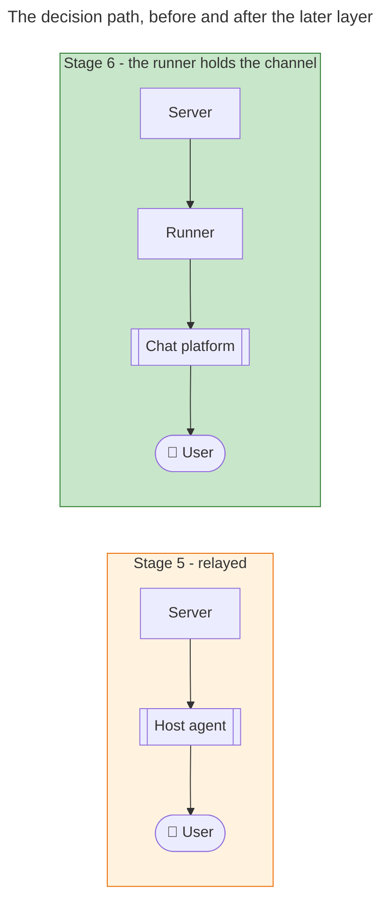

**Why it is worth a layer of its own.** It lands better than a terminal would, not merely equal to it. A
chat platform supplies an authenticated identity and a timestamp from a system neither the runner nor any
agent controls, so the record stops being "an agent reports that a person chose this" and becomes "this
account replied at this time", attested by a third party. That is the strongest human-presence guarantee
available in any arrangement considered here.

**What it retires beyond what stage 5 reaches.** The runner alone already removes the lower hops — a
decision becomes a unit the runner handles, and workers never encounter one. This layer removes the last
hop, and with it three things stage 5 leaves standing: the host agent itself, which existed only to hold
a spawn primitive and relay a question; the pause-and-resume machinery that exists because a run stops at
every gate for an answer an agent owns; and the session-wide freeze of five tools while a decision is
outstanding, whose only purpose is to stop other agent contexts progressing and which protects nothing
once no agent is in the path.

It also collapses a cost stage 5 pays silently: with no agent above the runner, a prompt and its reply no
longer round-trip through that agent's context on their way to a worker.

**What it costs.** Four things, and none is a configuration detail.

- **The first outbound dependency.** The system is local and inbound-only today: no network client
  anywhere in the server, and both transports serve rather than call. This adds credentials to hold and
  an availability dependency in the decision path.
- **The spawn layer becomes the runner's.** Three operations — start an agent, start several
  concurrently, continue an existing one — across four harness implementations plus a generic fallback
  are prose an agent interprets today. Absorbing them turns the runner into a harness of its own, which
  is a gain in determinism and a loss in portability.
- **An authorisation model where none is needed today.** "The person at the keyboard" is implicit
  authorisation. A chat message from *someone* is not a message from *the stakeholder*, so a run needs a
  binding to whoever may answer for it.
- **A change in what a run is.** It stops being a process and becomes something that may span days. The
  durable position record from stage 4 makes that possible, but the runner has to be able to exit and
  resume rather than block.
- **Timers that become real.** Thirty-one of the corpus's thirty-two soft decisions carry a
  thirty-second auto-advance interval, tuned for somebody watching. Against a person who is not at their
  desk those become genuine timeouts, and the intervals want reviewing before this ships rather than
  after.

**What it requires that does not exist yet: dispatch primitives the runner can call.** Today the runner
composes a prompt and an agent spawns with it, because spawning is a tool in an agent's tool list. For
the runner to be host it needs a programmatic way to start a worker, continue one, and start several at
once — the same three operations the corpus abstracts as prose, implemented as code. At minimum that
means Claude Code and Cursor, since those are the harnesses the corpus already carries rules for, and
each needs its own implementation against whatever interface it exposes rather than a shared one.

Two consequences worth recording now. The runner stops being harness-agnostic: portability becomes a
matter of how many implementations it carries, where today it inherits whatever the hosting agent runs
under. And it acquires credentials, which is the same boundary the chat transport crosses — so both
halves of this layer turn the runner from a local process with no secrets into one that holds them.

**The fork to settle first.** Is the runner the intermediary for decisions only, or for the whole
conversation? Decisions-only leaves two channels to the person and no clear answer to where they should
look. Whole-conversation is cleaner — the runner becomes the front door, the host agent role
largely disappears, and the orchestration workflow's client-dispatch activity collapses into the runner —
but it is a much larger change and it makes the runner a product surface rather than an execution
component.

Either way this changes **where a run lives**. Today a run is bound to one machine and one editor session.
Over chat it could be started from a channel, outlive the machine that began it, and be answered by
somebody other than whoever started it. That is arguably a better product; it is also a product decision
and not only an architectural one.

## Decisions

Eight questions were settled on 2026-08-30, recorded as seven entries since two of them resolved
together: when a step's outputs land, who authors a prompt, whose condition verdict counts, what becomes
of the orchestration workflow, who commits, when the binding migration happens, and who writes artifacts.
Three questions remain open and block nothing.

Each is recorded with its reasoning in [decisions.md](decisions.md).

## Companion records

- [decisions.md](decisions.md) — what was settled about the design, what remains open, and why.
- [investigation.md](investigation.md) — what the code and the corpus do today, how it was measured, and
  what a runner does not fix.
- [protocol-verification.md](protocol-verification.md) — three reviewed designs of the interaction, and
  the claims they withdrew. **Read before acting on anything here.**
- [cost-model.md](cost-model.md) — the measurements fixing how much work is handed over at a time.
- [attestation.md](attestation.md) — why the runner carries no signature.
