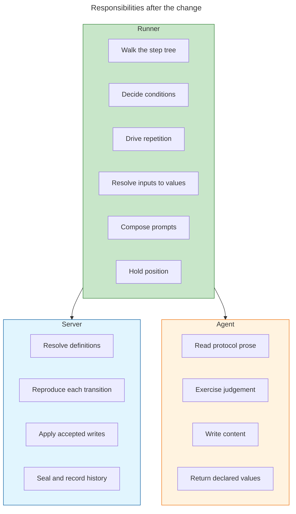
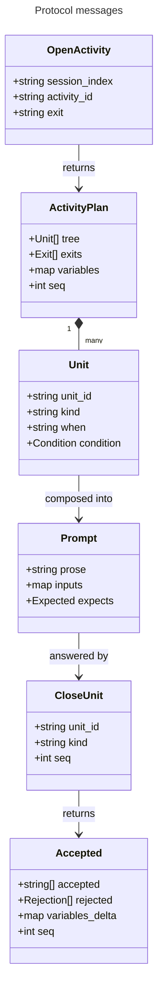
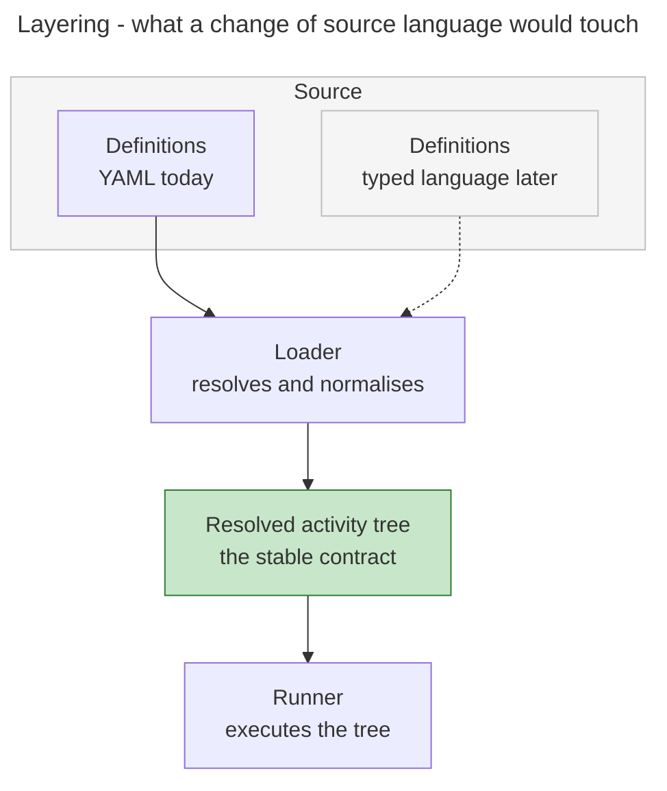
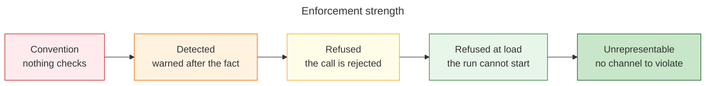
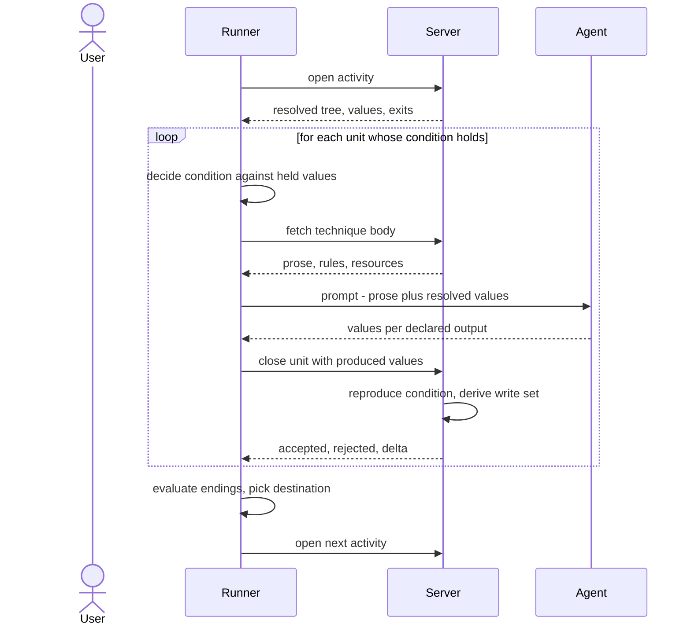
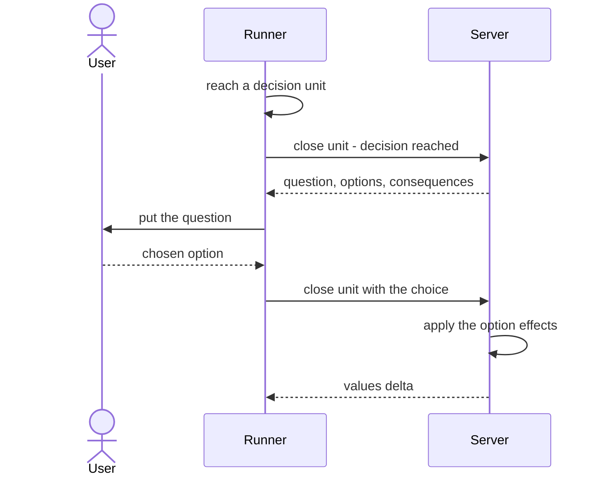
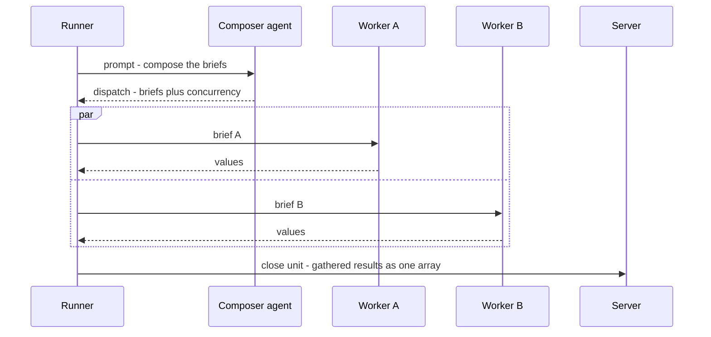
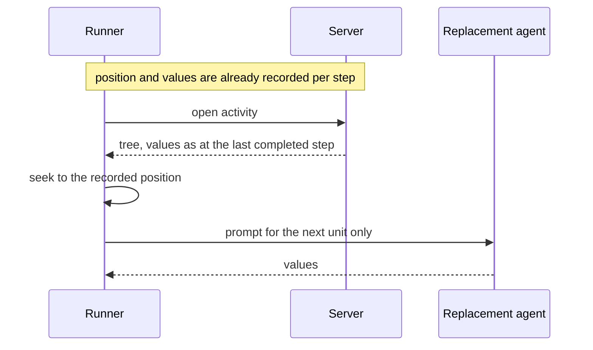
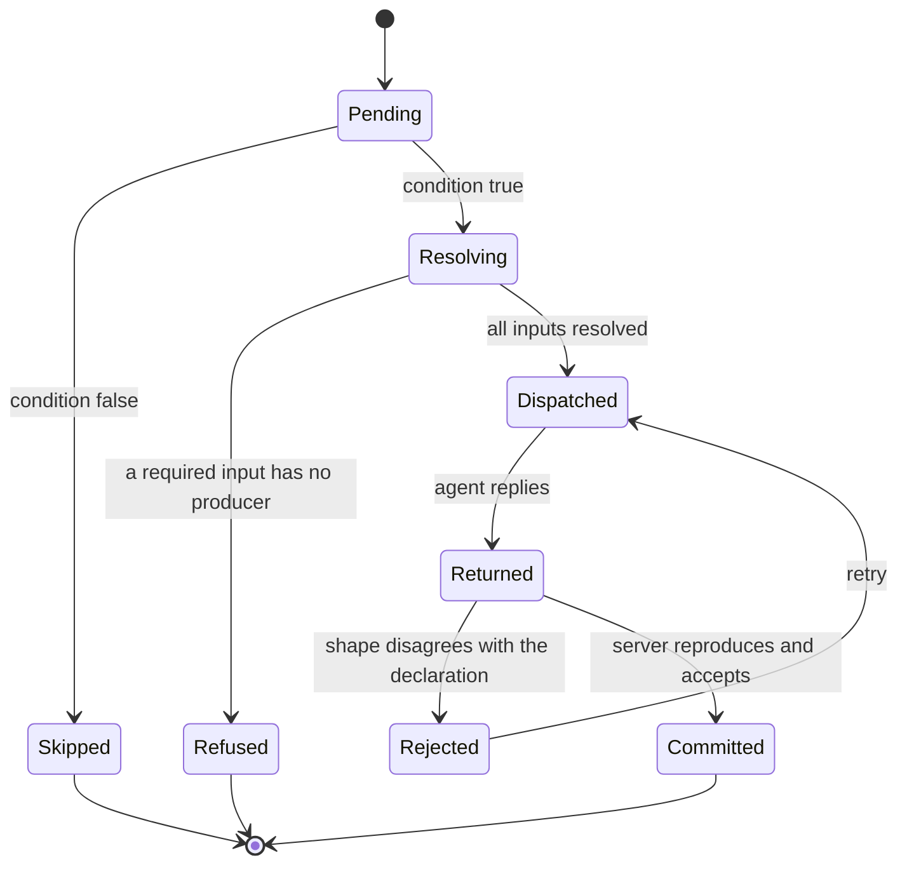

# Runner — proposal

> Work package for [#523](https://github.com/m2ux/workflow-server/issues/523) · 2026-08-28 · server at
> `c99d9da2`, `workflows` branch at `0cebc48f`

## Executive summary

A workflow definition is a structure: an ordered list of steps, conditions deciding which of them run,
loops that repeat a body, and named endings that decide where control goes next. That structure has
exactly one correct reading. Today an agent does the reading, guided by instructions the server ships
alongside the definitions, and afterwards reports what it did so the server can check the report.

This proposes a **runner**: a program that reads the structure, and asks an agent only to carry out the
things that are genuinely prose — a technique's protocol, a judgement, a piece of writing. The server
stops grading reports and starts reproducing decisions: it accepts a change to a run only when it
independently arrives at the same one.

It aims at three things, in ascending order of importance.

**Efficiency.** Fewer, larger, better-timed deliveries, and the removal of roughly 33,000 characters per
hand-off that exist only to tell an agent how to interpret a structure.

**Determinism.** The same definitions, the same values and the same answers produce the same sequence of
prompts. That is currently not true and cannot be asserted.

**Fidelity.** Today the system's own documentation describes seven enforcement layers, of which **two
refuse a call and five only record a warning** — and it lists eight things it cannot verify at all, most
of which reduce to the same sentence: the agent is the one reporting, so the report is what gets checked.
The runner's central contribution is not another check. It is removing the agent's ability to misreport,
by never giving it the structure to misreport about.

The result is that correctness stops being something checked after the fact and becomes a property of
the arrangement. An agent that never receives the structure cannot depart from it.

Three companion documents carry the working: [investigation.md](investigation.md) for what the code and
corpus do today, [protocol-verification.md](protocol-verification.md) for three reviewed designs of the
interaction and the claims they overturned, and [cost-model.md](cost-model.md) for the measurements that
fix how much work is handed over at a time.

## The participants

Four take part in a run, plus two supporting pieces.

| Participant | Responsibility | New? |
|---|---|---|
| **User** | Answers decisions that need a person. Sees progress. | No |
| **Runner** | Reads the structure. Decides conditions, drives repetition, resolves each step's inputs, composes prompts, and reports every step. | **Yes** |
| **Server** | Holds the session, resolves definitions, reproduces every reported transition, and refuses what it cannot reproduce. | No, but its job changes |
| **Agent** | Carries out one technique: reads prose, exercises judgement, writes content, returns values. | No, but its job narrows |
| Harness | Starts the runner; establishes agent contexts on request. | No |
| Session store | The run's values, decisions and history, sealed. | No |

Green marks the new component. Everything else exists.

## Use cases

## User stories

**As a user**

- I want to be asked a question only when the run genuinely needs my judgement, so that I am not
  interrupted by something the structure already determines.
- I want a question to arrive without a fresh agent context being established purely to ask it, so that
  asking me something is cheap.
- I want to see which step a run is on, so that I can tell progress from a stall.
- I want an interrupted run to continue from where it stopped rather than from the start of the activity,
  so that I am not asked the same question twice and work is not repeated.

**As a definition author**

- I want a wrong reference or an unparseable condition to fail when the definitions load, so that I find
  out at authoring time rather than mid-run.
- I want the checks that hold a step's declared inputs to a producer to work step by step rather than
  activity by activity, so that a mistake is localised.
- I want to know that what ran is what I wrote, so that a run is evidence about the definition rather
  than about the agent that read it.
- I want a step that was skipped to have been skipped because its condition was false, not because an
  agent overlooked it, so that a run tells me something about my conditions.
- I want two runs of the same definition, given the same answers, to ask the same questions, so that a
  change in behaviour means a change in the definition.
- I want to reuse a run of steps without copying it, so that a change lands in one place. *(This is
  [#520](https://github.com/m2ux/workflow-server/issues/520); a runner walks the tree that proposal
  resolves.)*

**As an operator**

- I want independent work to run at the same time only when something has established that it is
  independent, so that concurrency is a property rather than a hope.
- I want to know what a run cost, per activity, so that existing accounting keeps working.
- I want a replacement agent to pick up mid-activity, so that losing a context costs one step rather than
  one activity.

**As an agent**

- I want to receive a technique's prose, its rules, and the values I need, so that I can do the work
  without interpreting a structure.
- I want to be told exactly which values I owe back, so that "done" is checkable rather than a matter of
  opinion.
- I want a way to raise a decision the definition did not anticipate, so that unexpected work has
  somewhere to go.

## Architecture

### Container view

Two links, two grains. Runner-to-server is one local process addressing another, so it may be as chatty
as it likes. Runner-to-agent is expensive — an exchange costs roughly what 18,800 characters of fresh
content costs, and establishing a fresh context costs 23,000 to 42,000 tokens — so it stays coarse and
carries prose. That asymmetry is the whole design; the reasoning is in [cost-model.md](cost-model.md).

### Where each responsibility sits

The line between runner and agent is the technique's declared signature. Everything above it is
structure; everything below it is prose. Nothing crosses.

## The contracts

A reply from an agent takes one of three shapes, and the third is not optional — a technique taking a
list of worker briefs is bound as an ordinary step at 22 sites across 8 activity files, each preceded by
a step that composes those prompts at run time from domain material no runner could derive.

| Reply | Carries | Why it exists |
|---|---|---|
| `done` | Values per declared output, artifact paths | The ordinary case |
| `decide` | A question and options | Work admitted part-way through a run that the definition could not anticipate |
| `dispatch` | Worker briefs and a concurrency limit | The corpus composes its own fan-out prompts |

## Designed for a later formal language

A future direction for the project is to replace the YAML mechanics with a dedicated TypeScript-like
language giving a strict formal reading of activity mechanics. That migration is not proposed here and
this design carries **no compatibility obligation toward it** — no dual-format support, no migration
path, nothing held open in case. But it costs nothing to build the runner so that such a migration is a
change of one layer rather than a rewrite, and it is worth saying what that requires.

**The runner never sees source.** It receives a resolved tree as data and has no parser, no file access
and no knowledge of the notation the tree came from. The stable contract is the tree, not the file
format. This falls out of the protocol as already designed — the alternative, where the runner loads
definitions itself, was rejected for a different reason — but it should be held deliberately rather than
enjoyed by accident, because it is the whole of what makes a later change of language cheap.

**The runner is the operational semantics.** A formal language needs a definition of what each construct
means: when a loop stops, what an absent value does to a comparison, in what order inputs resolve, what
happens when a required one does not. Today those answers are distributed across prose, a test harness
and the reading habits of agents. The runner collects them into one executable definition — so a typed
language would be a better *surface syntax* for semantics the runner has already fixed, rather than a new
thing needing semantics of its own.

Three consequences follow for how the runner is built:

1. **Conditions travel as trees, not strings.** A verified design already recommends the server ship
   condition expressions rather than verdicts. Keep them structured on the wire, and a language that
   emits typed expressions natively needs no adapter.
2. **The loader resolves surface ambiguity; the runner never meets it.** Anything undecidable only
   because of how YAML writes it belongs on the loader's side of the boundary — whether a bare string is
   a literal or a reference, which of two token grammars applies, an artifact prefix derived from a
   filename's position. A typed language would not create these problems, so the runner should not be
   built to cope with them.
3. **Nothing positional survives into the tree.** Document order is a property of a text file. Where
   order matters it should be explicit in the tree, so that meaning does not depend on how the source
   happened to be laid out.

**Building the runner settles what a formal language would have to settle anyway.** Four ambiguities in
the current mechanics have no single correct reading today, and the runner cannot be written without
choosing: where a repeat-until loop keeps its continuation condition, whether an absent value makes a
comparison false or unanswerable, whether a bare binding is a literal or a reference, and whether a step
identifier is unique within its activity. Each is a semantic question a formal reading would have to
answer, so answering them now is not a detour — it is the same work, done earlier and against a running
system rather than a specification.

## What this buys

### Efficiency

The saving is not in sending less per delivery — the server already withholds every step whose condition
reads false, so there is no waste to reclaim. It is in answering the conditions that cannot be answered
at delivery time, and handing over the next unbroken run of steps in one go. That collapses 23 to 84
separate fetches on the reference path, worth 108,000 to 395,000 tokens, and retires the
instructions-on-how-to-drive that ride on every hand-off. The full reasoning, and the three exchange
rates it rests on, are in [cost-model.md](cost-model.md).

### Determinism

A prompt becomes a pure function of the definitions and the resolved input values. Nothing about a
prompt depends on which agent asks, when it asks, or what it has in context. Two consequences follow that
are not available today: a prompt can be fingerprinted, so a divergence between two runs is detectable
rather than invisible; and the same definitions with the same answers produce the same sequence of
prompts, so a run becomes evidence about the definition rather than about the agent that read it.

This is also what makes the existing content-reuse machinery work properly. Today the record of
already-sent content keys on the technique while hashing text that carries position-dependent annotation,
so the same technique at two positions hashes differently and is sent twice. Strip the annotation and the
body is corpus-pure.

**A further uplift is available and is deliberately not proposed here.** A runner is only as deterministic
as the amount of the workflow that is expressed as structure, and a good deal of genuinely mechanical
content currently sits in technique prose where nothing can reach it — a technique whose name says it runs
a loop, bound at four sites; 137 places a technique invokes another from inside its own prose; the same
file-writing routine reproduced at 21 of them. Each of those is control flow, and each would move from
convention to enforceable if it were expressed structurally. With a runner walking the structure and
[#520](https://github.com/m2ux/workflow-server/issues/520) giving a run of steps a name and a home, that
content would for the first time have somewhere to go — the destination is usually smaller than an
activity, which is the wrong size twice over given a guard forbids one opening with a decision and each
one costs a hand-off.

That migration is a separate activity and is out of scope for this proposal. It is named here because it
sets the ceiling: the runner determines how much of what *is* structural runs deterministically, and the
migration determines how much becomes structural in the first place.

### Fidelity — the point of the exercise

Enforcement has strengths, and it is worth naming them so a proposal can say which one each guarantee
sits at.

Most of what the documentation calls enforcement sits at **Detected**. A drifting agent is visible rather
than stopped, and a confused one may ignore the warning. The runner's method is not to add checks at that
level but to move guarantees up the ladder — and the largest moves land at **Unrepresentable**, because a
guarantee an agent has no channel to violate needs no enforcement at all.

#### Guarantees that get stronger

Each row is a limitation the fidelity documentation states in its own words.

| Guarantee | Today | With a runner | How |
|---|---|---|---|
| The steps that ran are the steps that were meant to run | Detected — the manifest validates that the agent *reported* each step, not that it performed it | **Unrepresentable** | The runner hands out each unit and receives each reply, so there is no self-report to check. The manifest concept disappears rather than improving. |
| A condition's truth decided the branch | Convention — the server checks a claimed outcome maps to the target, but "cannot verify whether the condition is actually true" | **Refused** | The runner evaluates against values the server holds, and the server re-derives every reported transition and rejects what it cannot reproduce. Needs per-step write authority. |
| A conditional decision was genuinely inapplicable when dismissed | Convention — "relies on agent honesty"; the server checks only that a condition field exists | **Refused** | One evaluation of the condition against the session values. Available today, independent of the runner. |
| A person actually saw a decision | Convention — "an agent could wait the minimum time and then submit a fabricated response" | **Unrepresentable** | The runner puts the question through the harness. No agent context is involved in a decision at all, so there is no agent to fabricate one. |
| A repeated call is distinguished from a fresh one | Detected — visible in the trace afterwards | **Refused** | Position is recorded per step and is authoritative, so a repeat is a no-op or a refusal rather than a second execution. |
| Steps ran in declared order | Detected — a relative-order comparison over a self-report | **Unrepresentable** | Order is the runner's walk. There is nothing to compare. |
| An iteration bound was respected | Convention — "iteration is executed and bounded entirely by the agent" | **Refused** | The runner drives repetition and holds the count. |
| Warnings are acted on | Convention — "a confused agent may ignore validation warnings" | **Refused** | The consumer is a program, and the server refuses rather than warns where it can reproduce the answer. |
| What happened is recorded faithfully | Detected — the semantic trace "relies on agent discipline" | **Refused**, partly | Which steps ran, which conditions held, which options were chosen and which values changed all become mechanical. The prose describing an output stays the agent's. |

#### Guarantees that are newly possible

These do not exist at any strength today.

| New guarantee | Level | How |
|---|---|---|
| A step's declared inputs were all resolved before it ran | **Refused** | An input that resolves to nothing refuses before dispatch. Today it reaches an agent annotated as unresolved and the agent improvises. |
| A step returned exactly what it declared | **Refused** | The reply is checked against the declared output identifiers, remap destinations and types. Today a step's report is one free-text string checked for non-emptiness, and nothing joins "this step declares an output" to "the session gained it". |
| A declared artifact exists, under the declared name | **Refused** | The runner owns naming and placement; the agent returns content. |
| Every value a step reads has a producer before it | **Refused at load** | The existing analysis moves from activity granularity to step granularity, which becomes possible once step order is authoritative. |
| A condition is well-formed | **Refused at load** | Move the parse check into the loader. The corpus is at zero failures, so this is free now and dearer later. |
| Two runs of the same definition asked the same questions | **Refused** | Prompts are fingerprintable, per Determinism above. |
| Work that ran in parallel was safe to parallelise | **Refused** | Concurrency is declared and checked rather than assumed — and the check found that a naive reads-and-writes test would wrongly clear 231 adjacent step pairs whose real dependency is shared state on disk. |

#### How far shape checking reaches, and what it does not settle

The runner checks that a reply has the parts it declared. How much that establishes depends on how much
the declaration says, and the corpus is uneven about it. Measured over 575 technique files declaring 730
outputs:

| Declaration | Count | Settled mechanically |
|---|---|---|
| Output has a prose description | **730 of 730** | No — prose against prose |
| Output declares named sub-members | **78** (241 members) | **Yes** — member presence and shape |
| Output declares an artifact filename | 149 | **Yes** — existence and name conformance |
| Output is machine-read, so serialised as JSON | 19 | **Yes** — parses, and carries the declared members |
| Technique declares a capability statement | 562 of 575 | No — prose |

Only 11% of outputs declare their structure, so for most of them the runner can establish that a value
came back under the right name and nothing more. **That percentage is the lever**: every output that gains
declared sub-members moves out of agent judgement into mechanical checking at no runtime cost, and it is
corpus work that needs nothing from this proposal.

What shape checking cannot settle is whether the content says what it was supposed to say. A runner makes
it possible to close part of that gap — because it holds the declaration and the returned content
together in one place, it could dispatch a second agent, in its own context, to judge one against the
other and return a typed verdict. That would be an independent check rather than a self-report, and it is
a real strengthening, though the honest description is pseudo-verifiability: trust moves to a dedicated
agent rather than disappearing, and correlated blind spots, the absence of ground truth and the survival
of plausible-but-wrong content all remain.

**That capability is unlocked by this work but is not part of it.** It is named because it changes what
the ceiling looks like, and because the declaration-widening above is worth starting whether or not it is
ever built.

#### What stays unenforceable, honestly

Three things remain outside reach, and none of the work proposed here changes them:

- **Whether a technique's protocol was followed.** The runner establishes that a technique ran and
  returned what it declared, never which branch it took inside, and it cannot resume one part-way.
- **Whether returned content says what it should.** Shape is checkable; meaning is not. This is the gap a
  qualifying agent could narrow, and the reason that capability is worth naming even though it is not
  built here.
- **Whether a judgement was sound.** That is the work an agent is for, and no amount of checking replaces
  it.

The trace's survival across a server restart is also untouched, though that is a storage matter rather
than a fidelity one.

The shape of the improvement is worth stating plainly: nothing here makes an agent more trustworthy. It
narrows what an agent is trusted *with* — from "read this structure and tell us what you did" down to
"carry out this one thing and return these named values" — and only the second is a claim the server can
check.

## Key flows

### Executing a run of steps

### A decision that reaches the user

No agent context is established. This is why the rule forbidding an activity from opening with a
decision can go: that rule exists only because asking a question currently costs a whole context.

### Fan-out, where the agent composes the briefs

Results gather into one declared name in one call. Writing a value per iteration under an indexed name
is not expressible, because no value-path reader in the system handles brackets.

### Resuming after interruption

Today a replacement re-enters the whole activity and crosses already-answered decisions by replaying
recorded answers. With position recorded per step, the decision is never re-reached, and replay shrinks
back to genuine re-entry.

### The lifecycle of one unit

`Refused` is the state that does not exist today. An input that resolves to nothing currently reaches an
agent marked unresolved, and the agent improvises.

## What the runner is not allowed to do

- **Parse a technique's protocol.** It is prose, and 436 of the corpus's 2,459 protocol bullets carry
  control flow of their own, so a call is all-or-nothing: the runner establishes that a technique ran and
  returned what it declared, never which branch it took inside.
- **Author every prompt.** Twenty-two sites compose their own.
- **Run two decisions at once.** One decision is outstanding per session; two members of a fan-out cannot
  both escalate without a keyed map.
- **Make dispatch finer.** The gain is that the server decides where a coarse boundary falls, not that
  boundaries multiply.
- **Take on the environment.** Validation instructions ask the host whether a tool is authenticated or a
  key is available. Whether the runner shells out or delegates is unresolved — see
  [protocol-verification.md](protocol-verification.md).
- **Parse a definition file.** It receives a resolved tree and has no parser and no notion of the source
  notation, which is what keeps a later change of language confined to the loader.

## Delivery stages

Each is useful alone and assumes nothing after it.

| Stage | Lands | Fidelity gained | Depends on |
|---|---|---|---|
| 1. Correct and widen | Stale documentation fixed; the condition guard covers endings, nested directories and validation targets; an unparseable condition fails the load; the unused early-exit field deleted | A condition is well-formed — **refused at load** | — |
| 2. Server answers | A dismissed decision is verified against the values rather than taken on the agent's word; an activity's ending is computed and reconciled | Dismissal honesty and branch truth move from convention to **refused** | 1 |
| 3. Write authority | A step's declared outputs land when the step finishes | Makes branch truth checkable at all; unblocks the rest | — |
| 4. Position and repetition | A durable cursor with a frame per loop; something that drives iteration | Repeat calls and iteration bounds — **refused**; order becomes **unrepresentable** | 3 |
| 5. The runner | The three calls, prompt composition, the three-shaped reply | Step execution and decision presence become **unrepresentable**; input resolution and return shape **refused** | 3, 4 |

Stage 2 is where the conceptual step happens, and it is worth doing for its own sake: it is the first
time a server verdict overrules an agent's claim. Stage 3 is the load-bearing one — until a step's
outputs land when the step finishes, most conditions cannot be decided by anyone but the agent that
produced them, and the fidelity argument has no purchase.

## Open decisions

Ordered by what blocks what. The first three constrain the schema or the session file.

1. **Do a step's declared outputs enter the session when the step finishes?** The majority of conditions
   depend on it, and nothing else can be settled first.
2. **Does the runner author every prompt, or only some?** Twenty-two sites compose briefs as domain work.
   Whether a worker-composed brief is a first-class prompt with a different author or an opaque string
   the runner relays shapes the whole protocol.
3. **Which condition verdict is authoritative** — the three-valued delivery check or the plain
   evaluators — and does the runner receive expressions or verdicts?
4. **What becomes of the orchestration workflow?** Its five activities *are* the orchestration procedure,
   and the runner subsumes them. Nobody has priced removing it, the bootstrap call, or the guard that
   protects it. This is the largest unpriced item.
5. **Who commits, and who writes the progress table?** The runner retires the driver and reassigns none
   of this.
6. **Sequence the bare-string migration** — 193 sites — ahead of the runner, or inbound resolution is a
   coin flip on 85% of bindings.
7. **Unify the two token grammars** on the dotted form. Prerequisite for both input resolution and
   artifact naming, and it fixes an existing silent mis-report at 17 sites.
8. **Decide the artifact path**: retire the 45 artifact-writing steps in favour of a declared
   destination, or accept that artifact bodies round-trip through the runner.

## Companion records

- [investigation.md](investigation.md) — what the code and the corpus do today, how it was measured, and
  what a runner does not fix.
- [protocol-verification.md](protocol-verification.md) — three reviewed designs of the interaction, and
  the claims they withdrew. **Read before acting on anything here.**
- [cost-model.md](cost-model.md) — the measurements fixing how much work is handed over at a time.
- [attestation.md](attestation.md) — why the runner carries no signature.
