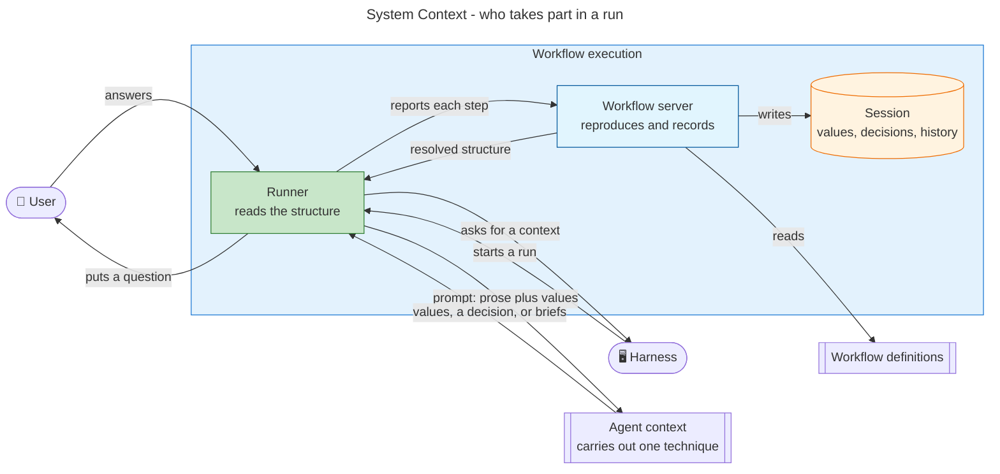
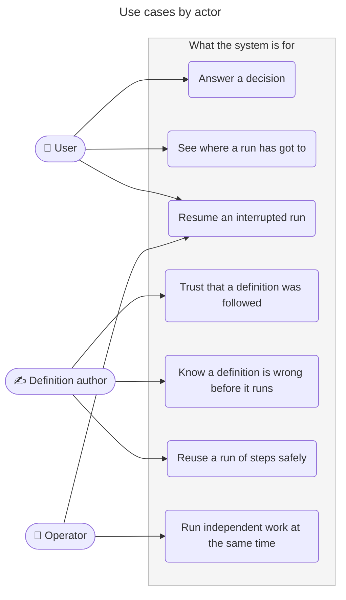
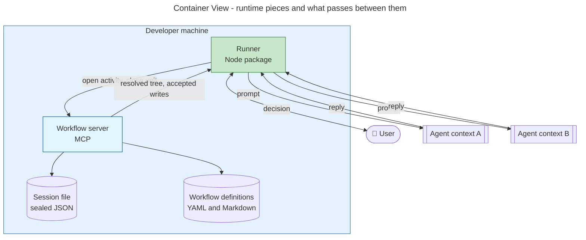
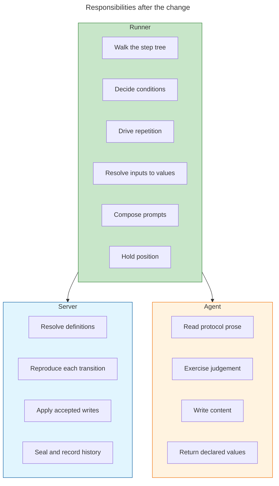
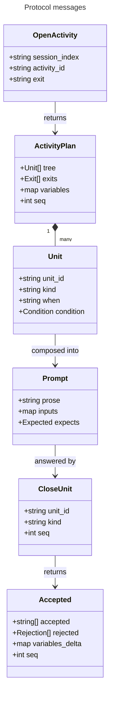
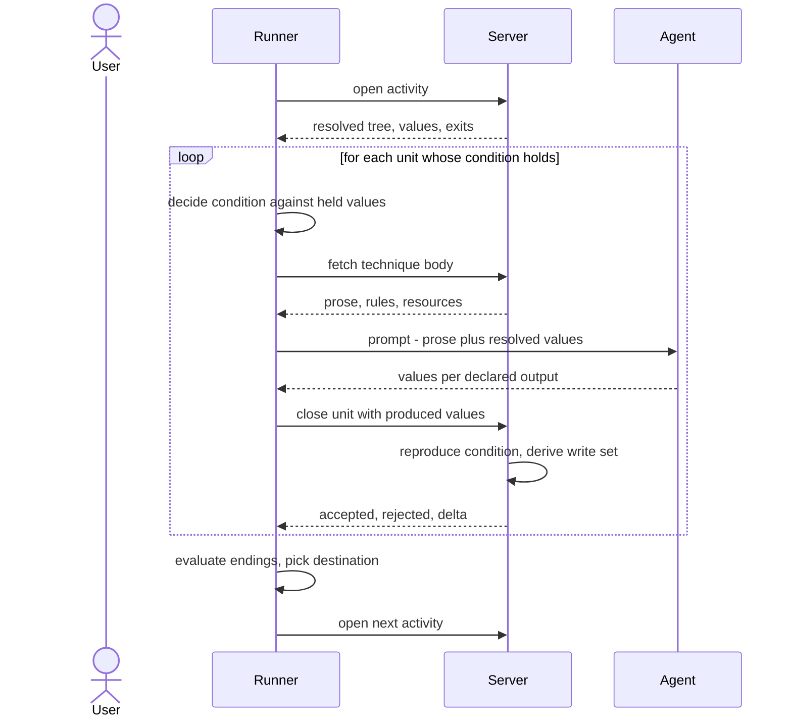
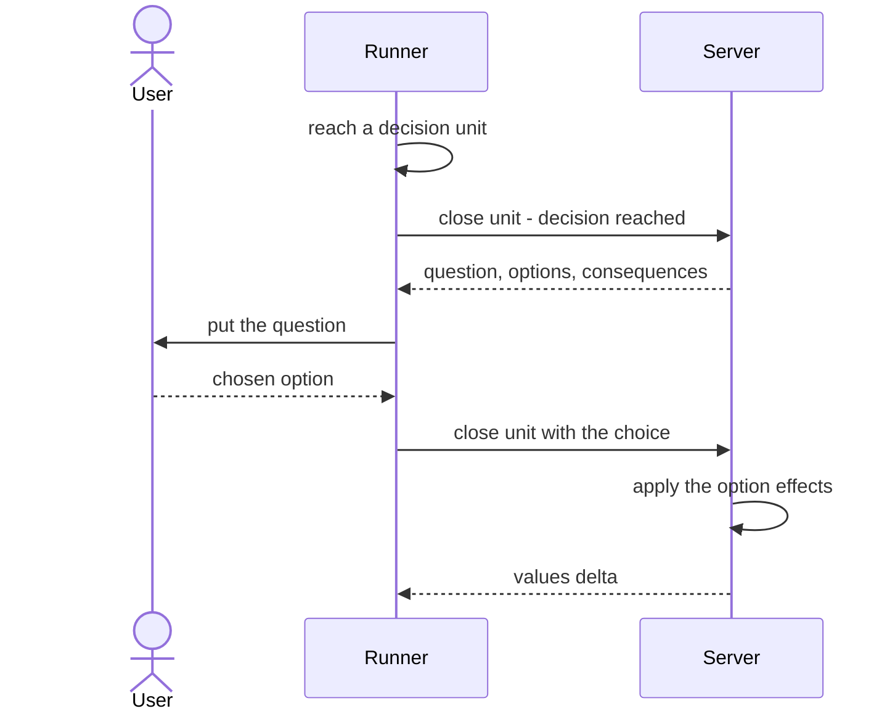
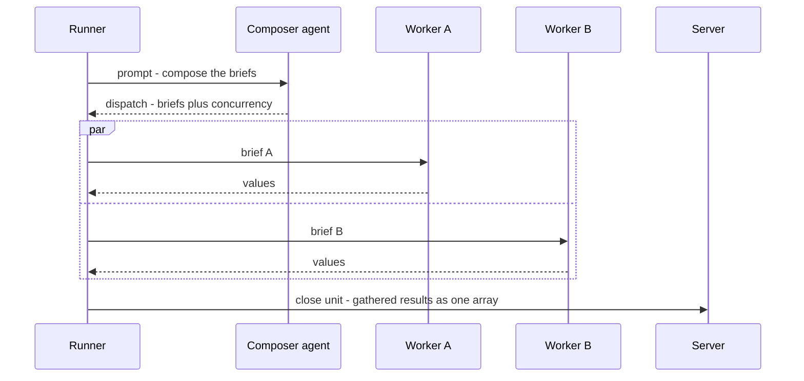
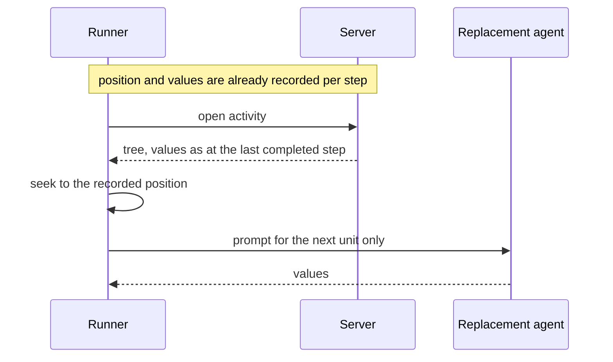
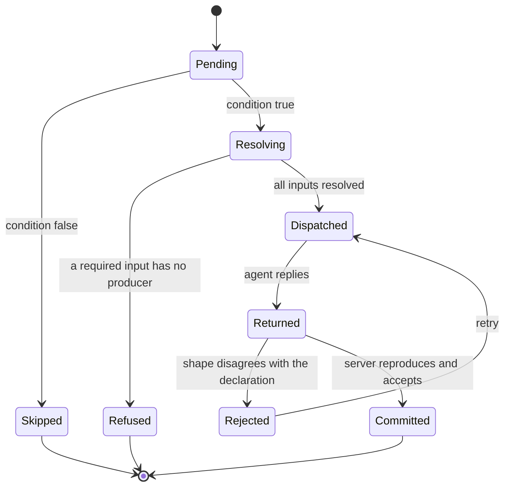

# Runner — proposal

> Work package for [#523](https://github.com/m2ux/workflow-server/issues/523) · 2026-08-28 · server at
> `c99d9da2`, `workflows` branch at `0cebc48f`

## Executive summary

A workflow definition is a structure: an ordered list of steps, conditions deciding which of them run,
loops that repeat a body, and named endings that decide where control goes next. That structure has
exactly one correct reading. Today an agent does the reading, guided by instructions the server ships
alongside the definitions, and afterwards reports what it did so the server can check the report.

This proposes a **runner**: a program that reads the structure, and asks an agent only to carry out the
things that are genuinely prose — a technique's protocol, a judgement, a piece of writing. The server
stops grading reports and starts reproducing decisions: it accepts a change to a run only when it
independently arrives at the same one.

The result is that correctness stops being something checked after the fact and becomes a property of
the arrangement. An agent that never receives the structure cannot depart from it.

Three companion documents carry the working: [investigation.md](investigation.md) for what the code and
corpus do today, [protocol-verification.md](protocol-verification.md) for three reviewed designs of the
interaction and the claims they overturned, and [cost-model.md](cost-model.md) for the measurements that
fix how much work is handed over at a time.

## The participants

Four take part in a run, plus two supporting pieces.

| Participant | Responsibility | New? |
|---|---|---|
| **User** | Answers decisions that need a person. Sees progress. | No |
| **Runner** | Reads the structure. Decides conditions, drives repetition, resolves each step's inputs, composes prompts, and reports every step. | **Yes** |
| **Server** | Holds the session, resolves definitions, reproduces every reported transition, and refuses what it cannot reproduce. | No, but its job changes |
| **Agent** | Carries out one technique: reads prose, exercises judgement, writes content, returns values. | No, but its job narrows |
| Harness | Starts the runner; establishes agent contexts on request. | No |
| Session store | The run's values, decisions and history, sealed. | No |

Green marks the new component. Everything else exists.

## Use cases

## User stories

**As a user**

- I want to be asked a question only when the run genuinely needs my judgement, so that I am not
  interrupted by something the structure already determines.
- I want a question to arrive without a fresh agent context being established purely to ask it, so that
  asking me something is cheap.
- I want to see which step a run is on, so that I can tell progress from a stall.
- I want an interrupted run to continue from where it stopped rather than from the start of the activity,
  so that I am not asked the same question twice and work is not repeated.

**As a definition author**

- I want a wrong reference or an unparseable condition to fail when the definitions load, so that I find
  out at authoring time rather than mid-run.
- I want the checks that hold a step's declared inputs to a producer to work step by step rather than
  activity by activity, so that a mistake is localised.
- I want to know that what ran is what I wrote, so that a run is evidence about the definition rather
  than about the agent that read it.
- I want to reuse a run of steps without copying it, so that a change lands in one place. *(This is
  [#520](https://github.com/m2ux/workflow-server/issues/520); a runner walks the tree that proposal
  resolves.)*

**As an operator**

- I want independent work to run at the same time only when something has established that it is
  independent, so that concurrency is a property rather than a hope.
- I want to know what a run cost, per activity, so that existing accounting keeps working.
- I want a replacement agent to pick up mid-activity, so that losing a context costs one step rather than
  one activity.

**As an agent**

- I want to receive a technique's prose, its rules, and the values I need, so that I can do the work
  without interpreting a structure.
- I want to be told exactly which values I owe back, so that "done" is checkable rather than a matter of
  opinion.
- I want a way to raise a decision the definition did not anticipate, so that unexpected work has
  somewhere to go.

## Architecture

### Container view

Two links, two grains. Runner-to-server is one local process addressing another, so it may be as chatty
as it likes. Runner-to-agent is expensive — an exchange costs roughly what 18,800 characters of fresh
content costs, and establishing a fresh context costs 23,000 to 42,000 tokens — so it stays coarse and
carries prose. That asymmetry is the whole design; the reasoning is in [cost-model.md](cost-model.md).

### Where each responsibility sits

The line between runner and agent is the technique's declared signature. Everything above it is
structure; everything below it is prose. Nothing crosses.

## The contracts

A reply from an agent takes one of three shapes, and the third is not optional — a technique taking a
list of worker briefs is bound as an ordinary step at 22 sites across 8 activity files, each preceded by
a step that composes those prompts at run time from domain material no runner could derive.

| Reply | Carries | Why it exists |
|---|---|---|
| `done` | Values per declared output, artifact paths | The ordinary case |
| `decide` | A question and options | Work admitted part-way through a run that the definition could not anticipate |
| `dispatch` | Worker briefs and a concurrency limit | The corpus composes its own fan-out prompts |

## Key flows

### Executing a run of steps

### A decision that reaches the user

No agent context is established. This is why the rule forbidding an activity from opening with a
decision can go: that rule exists only because asking a question currently costs a whole context.

### Fan-out, where the agent composes the briefs

Results gather into one declared name in one call. Writing a value per iteration under an indexed name
is not expressible, because no value-path reader in the system handles brackets.

### Resuming after interruption

Today a replacement re-enters the whole activity and crosses already-answered decisions by replaying
recorded answers. With position recorded per step, the decision is never re-reached, and replay shrinks
back to genuine re-entry.

### The lifecycle of one unit

`Refused` is the state that does not exist today. An input that resolves to nothing currently reaches an
agent marked unresolved, and the agent improvises.

## What the runner is not allowed to do

- **Parse a technique's protocol.** It is prose, and 436 of the corpus's 2,459 protocol bullets carry
  control flow of their own, so a call is all-or-nothing: the runner establishes that a technique ran and
  returned what it declared, never which branch it took inside.
- **Author every prompt.** Twenty-two sites compose their own.
- **Run two decisions at once.** One decision is outstanding per session; two members of a fan-out cannot
  both escalate without a keyed map.
- **Make dispatch finer.** The gain is that the server decides where a coarse boundary falls, not that
  boundaries multiply.
- **Take on the environment.** Validation instructions ask the host whether a tool is authenticated or a
  key is available. Whether the runner shells out or delegates is unresolved — see
  [protocol-verification.md](protocol-verification.md).

## Delivery stages

Each is useful alone and assumes nothing after it.

| Stage | Lands | Depends on |
|---|---|---|
| 1. Correct and widen | Stale documentation fixed; the condition guard covers endings, nested directories and validation targets; an unparseable condition fails the load; the unused early-exit field deleted | — |
| 2. Server answers | A dismissed decision is verified against the values rather than taken on the agent's word; an activity's ending is computed and reconciled | 1 |
| 3. Write authority | A step's declared outputs land when the step finishes | — |
| 4. Position and repetition | A durable cursor with a frame per loop; something that drives iteration | 3 |
| 5. The runner | The three calls, prompt composition, the three-shaped reply | 3, 4 |

Stage 2 is where the conceptual step happens: a server verdict overruling an agent's claim.

## Open decisions

Ordered by what blocks what. The first three constrain the schema or the session file.

1. **Do a step's declared outputs enter the session when the step finishes?** The majority of conditions
   depend on it, and nothing else can be settled first.
2. **Does the runner author every prompt, or only some?** Twenty-two sites compose briefs as domain work.
   Whether a worker-composed brief is a first-class prompt with a different author or an opaque string
   the runner relays shapes the whole protocol.
3. **Which condition verdict is authoritative** — the three-valued delivery check or the plain
   evaluators — and does the runner receive expressions or verdicts?
4. **What becomes of the orchestration workflow?** Its five activities *are* the orchestration procedure,
   and the runner subsumes them. Nobody has priced removing it, the bootstrap call, or the guard that
   protects it. This is the largest unpriced item.
5. **Who commits, and who writes the progress table?** The runner retires the driver and reassigns none
   of this.
6. **Sequence the bare-string migration** — 193 sites — ahead of the runner, or inbound resolution is a
   coin flip on 85% of bindings.
7. **Unify the two token grammars** on the dotted form. Prerequisite for both input resolution and
   artifact naming, and it fixes an existing silent mis-report at 17 sites.
8. **Decide the artifact path**: retire the 45 artifact-writing steps in favour of a declared
   destination, or accept that artifact bodies round-trip through the runner.

## Companion records

- [investigation.md](investigation.md) — what the code and the corpus do today, how it was measured, and
  what a runner does not fix.
- [protocol-verification.md](protocol-verification.md) — three reviewed designs of the interaction, and
  the claims they withdrew. **Read before acting on anything here.**
- [cost-model.md](cost-model.md) — the measurements fixing how much work is handed over at a time.
- [attestation.md](attestation.md) — why the runner carries no signature.
