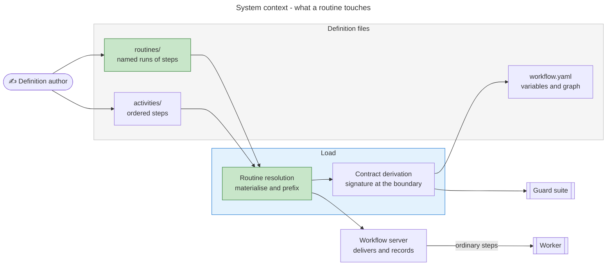
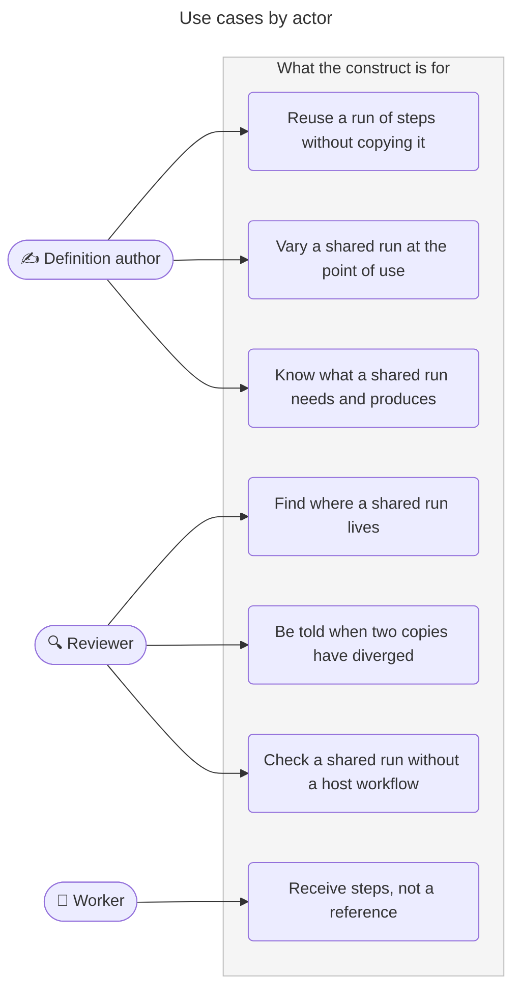
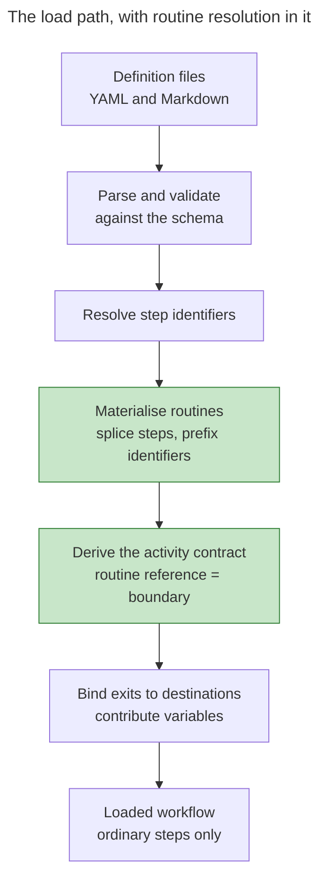
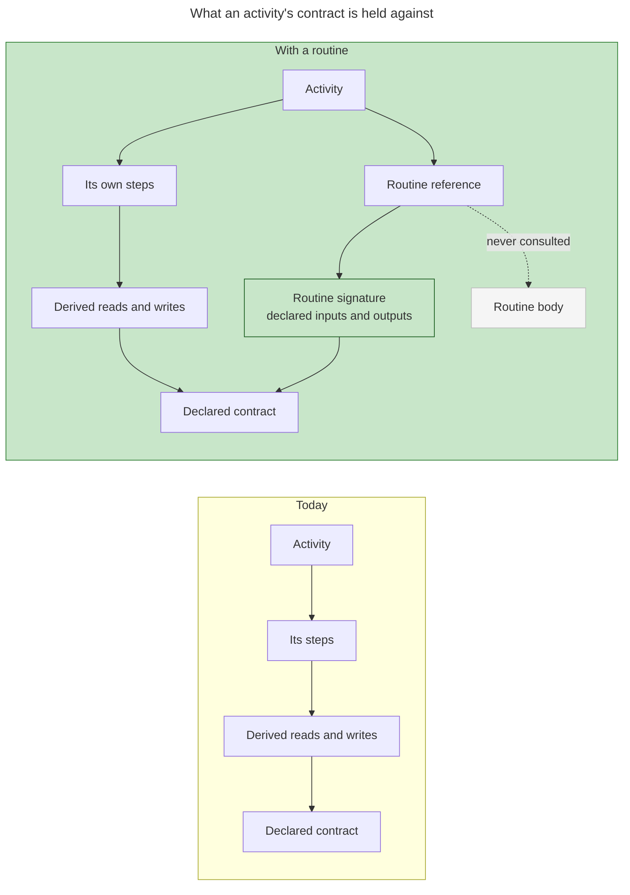
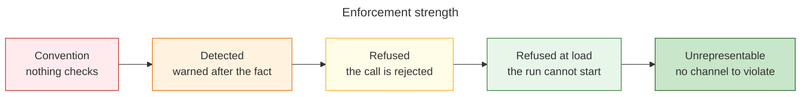
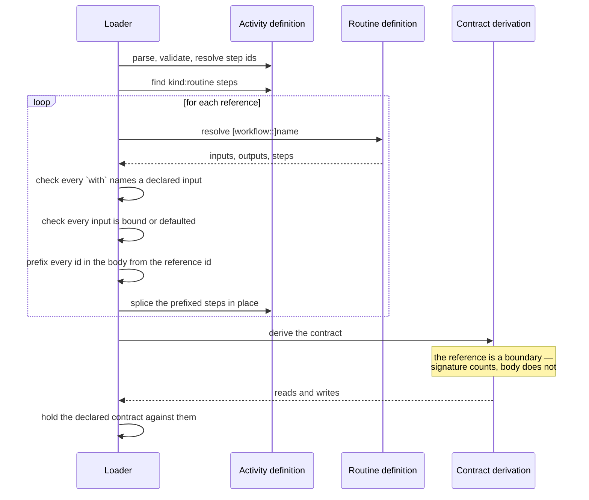
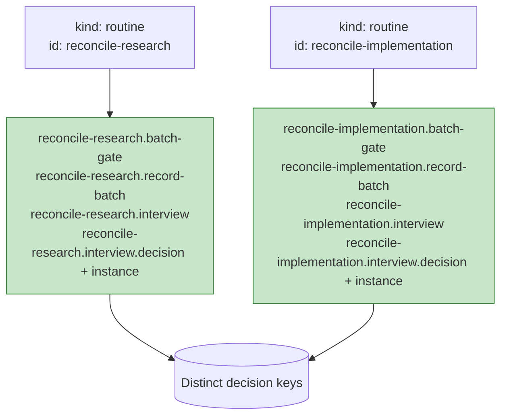
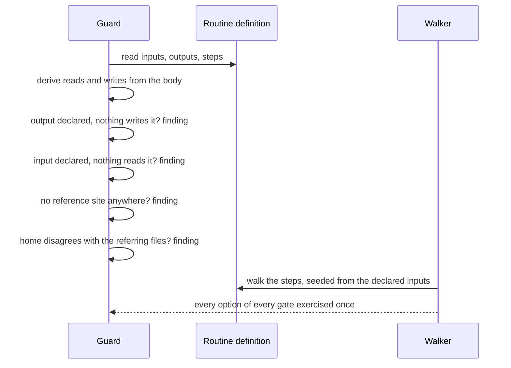
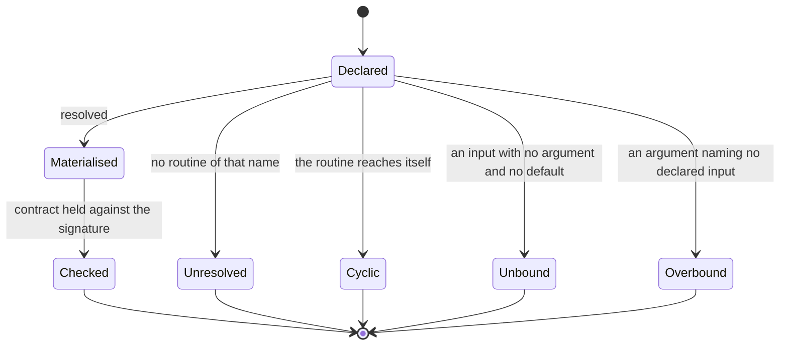

# Routines — proposal

> Work package for [#531 W3](https://github.com/m2ux/workflow-server/issues/531), from
> [#520](https://github.com/m2ux/workflow-server/issues/520) · 2026-09-03 · server at `4740f4d6`,
> `workflows` branch at `131e2942`
>
> **The design stands; parts of the evidence under it do not.** Between 2026-09-06 and 2026-09-07 the
> corpus and the server moved: the loop continuation field landed, the convergence loop moved out of
> its technique and onto activity steps at seven sites, six of this work's eleven findings were
> fixed, and two content decisions were settled in the corpus. Measurements re-based in place are
> marked **Re-based 2026-09-07**. [gap-review.md](gap-review.md) is the pass that checked every
> load-bearing claim in this folder against the running system at `f315b772` / `b5e54574`, and it
> carries the twelve gaps that remain. **Read it before planning any stage.**

## Executive summary

An activity's steps already nest. A loop's body is itself a list of steps, and the server walks it,
checks it and delivers it exactly as it does the list above. What a run of steps cannot be is
**named** — so it cannot be referred to from anywhere else, and where two activities need the same
run, each carries its own copy.

This proposes a **routine**: a named run of steps that declares what it needs and what it produces.
An activity refers to a routine by name and supplies its arguments at the point of use. The server
materialises the routine's steps into the referring activity when the definitions load, so everything
downstream — the step manifest, artifact composition, the guard suite, the end-to-end walker — sees
ordinary steps.

The name is chosen to fit the vocabulary. A routine is a fixed run of actions, and the word collides
with nothing the schema already uses; every other candidate does. "Sequence" is how the schema
already describes an activity's own steps, "group" and "operation" belong to techniques, and
"fragment" names the mechanism this replaces.

It aims at three things, in ascending order of importance.

**One home for a shared run.** One run — announce, gate, record, then walk the items one at a time —
is reproduced in four activities. The four copies have drifted in ten independent ways, and nothing
reports any of it, because the one guard that polices duplication compares single gate bodies and
single rule texts and nothing anywhere compares a *sequence* of steps against another sequence.

**A contract at the boundary.** The run's seven variables are declared four times over, once per host
activity, for 28 declarations. At two of the four hosts that is seven of eight declared writes — an
activity whose contract mostly describes a run it shares with three siblings is not describing
itself. A routine declares that signature once, and each host declares only what it supplies.

**A home for control flow that has just arrived as structure.** *(Re-based 2026-09-07.)* Mechanical
structure with nowhere to go used to sit inside a technique's protocol, where nothing could reach it:
a technique whose Capability said it ran iterations until concerns converge, bound at seven step
sites, its protocol a loop and its parameters an iteration mode and a safety ceiling — every one of
them a construct the step schema already has.

On 2026-09-06 the corpus moved that loop where it belongs, deleting the technique and writing the
loop onto activity steps at all seven sites under `pass-orchestration-in-technique`. So the prose is
gone and the third motivation is now the first one again, measured harder: **six of the seven
activities carry a byte-identical 32-line loop block** — one SHA across all six, domain names and
adversarial perspectives included — and the seventh a 75-line variant of it. 192 lines of duplicated
structure, drift-free on the day it landed, with nothing in the guard suite comparing step sequences
to keep it that way.

Companion documents carry the working: [investigation.md](investigation.md) for what the code and
the corpus do today, [drift-census.md](drift-census.md) for the four copies compared side by side,
[conversion-trial.md](conversion-trial.md) and [conversion-rerun.md](conversion-rerun.md) for a real
conversion and its execution, [continuation-condition.md](continuation-condition.md) for where a loop
keeps its continuation test, [placement.md](placement.md) for where a routine lives,
[agent-interpretation.md](agent-interpretation.md) for what the agent walking a materialised routine
has to compose for itself while there is no runner, and [gap-review.md](gap-review.md) for what this
folder owes before planning starts.

**The design is executable and has been executed.** Two activities are converted and materialised
through a prototype implementing this specification, validated against the activity schema, and put
through the real contract derivation: both leave behind ordinary activities and derive exactly the
contract they declare, one of them checked against a live activity file authored for nothing in
particular. [conversion-rerun.md](conversion-rerun.md) records the run and what it does not cover.

## The participants

Six take part, and the routine changes what four of them see.

| Participant | Responsibility | Changes? |
|---|---|---|
| **Definition author** | Writes a shared run once and refers to it with arguments at each site | **Yes** |
| **Loader** | Resolves a routine reference, materialises its steps into the referring activity, and prefixes every identifier inside it | **Yes** |
| **Contract derivation** | Treats a routine reference as a boundary: the routine's signature counts, its body does not | **Yes** |
| **Guard suite** | Loses seven fragment rules, gains four routine rules, walks `routines/` as a second definition directory, and can check a routine's contract with no host workflow | **Yes** |
| Worker | Receives ordinary steps and cannot tell one came from a routine | No |
| Server, at run time | Delivers, gates, yields and records steps as it does today | No |



Green marks what is new. Everything else exists.

## Use cases



## User stories

**As a definition author**

- I want to reuse a run of steps without copying it, so that a change lands in one place.
- I want to vary a shared run where it genuinely differs — the text of a prompt, which options a gate
  offers — without forking it, so that a small difference costs a parameter rather than a copy.
- I want to know what a shared run needs before I refer to it, so that I find a missing value at
  authoring time rather than mid-run.
- I want the run's variables declared where the run lives, so that my activity's contract describes
  my activity.
- I want two references to one run in one activity to record their decisions separately without my
  inventing a naming scheme, so that correctness is not a matter of my remembering to prefix.
- I want a workflow file to hold routing and policy, not one activity's variable names.

**As a reviewer**

- I want a shared run to have one obvious home, so that finding it does not depend on knowing who
  wrote it first.
- I want a divergence between two uses of one run to be a load failure or a guard finding, not
  something I have to notice by reading four files side by side.
- I want a run's declared signature checked against what its steps actually do, so that a stale
  declaration is caught rather than believed.

**As a worker**

- I want to receive steps, with their identifiers already resolved, so that nothing about how a
  definition was assembled reaches me.

## The construct

### The definition

A routine lives in a `routines/` directory beside `activities/`, one file per routine, with no
position number because it holds no place in an order. It declares `inputs` — named parameters with
optional defaults, the shape a technique's inputs already take — and `outputs`, each an **output id**
carrying a full variable declaration: type, description and default. Its `steps` are the ordinary
step list, so a routine may contain technique, action, checkpoint, loop and routine steps.

A routine also declares **internals**: names its body's steps pass between themselves and that never
leave. The convergence run has one — the challenge pass hands its findings to the fold, and nothing
else ever sees them. The assumption run has two: the presentation the batch gate displays, and the
loop's current item. Between them those two occupy eight write declarations across four activities
today, for values that never cross an activity boundary.

An internal's materialised name carries **both the host activity and the reference site**,
underscore-joined — `implement_reconcile_assumptions_assumption_presentation`. A step identifier only
has to be unique within its activity, but a variable name shares one flat namespace across the whole
workflow, so prefixing an internal from the reference site alone puts the same name in every activity
that uses the routine. An internal never enters the workflow's variable set.

**An internal declares an id and a description, and nothing else** — no type, no default, no value
set, because it never enters the workflow's variable set and so nothing merges, seeds or type-checks
it. That is the standing the variable schema already gives a name written by an earlier step of the
same activity; an internal is that, scoped to a run rather than an activity. It may be a loop's item
variable and it may hold a collection. It may not go undeclared: a body naming anything outside the
three categories fails the load, and so does a declared internal nothing writes or nothing reads.

The corpus consequence is a subtraction — `challenge_findings` is a declared activity-level write at
six sites today, so applying this rule removes six declarations rather than adding any.

Inside a routine, its input, output and internal ids are **the names in scope**. A routine has no
free variables: every name its body reads or writes is one of the three, which is what makes the
signature a contract and the body checkable on its own. The one carve-out is an artifact filename
template, which the worker interpolates at run time from the technique's own outputs and which the
definition never reads.

```yaml
# work-package/routines/assumption-reconciliation.yaml
id: assumption-reconciliation
version: 1.0.0
name: Assumption Reconciliation
description: Gate residual open assumptions, record the batch answer, then interview individually on request.

inputs:
  - id: gate_message
    description: Text presented at the batch gate, naming the phase whose assumptions these are.
  - id: decision_space
    description: Which option set the per-item gate offers.
    default: resolve-or-defer

outputs:
  - id: has_deferred_assumptions
    type: boolean
    description: Whether any assumption was deferred to stakeholder review.
  - id: needs_individual_interview
    type: boolean
    description: Whether the batch gate selected individual drill-down.
  - id: assumption_outcome
    type: string
    description: The outcome the deciding gate gave the assumption under discussion.

internals:
  - id: assumption_presentation
    description: The judgement-augmentation context the batch gate presents.
  - id: current_assumption
    description: The assumption under discussion during the individual interview.

steps:
  - kind: checkpoint
    id: batch-gate
    message: "{gate_message}"
    options: [...]
  - kind: technique
    id: record-batch
    technique: review-assumptions::record
    when: needs_individual_interview != true
  - kind: loop
    id: interview
    loopType: forEach
    variable: current_assumption
    over: open_assumptions
    maxIterations: 20
    when: needs_individual_interview == true
    steps:
      - kind: technique
        id: present
        technique:
          name: review-assumptions::interview
          inputs: { assembly_mode: interview }
      - kind: checkpoint
        id: decision#{current_assumption.id}
        options: [...]
      - kind: technique
        id: record
        technique: review-assumptions::record
```

### The reference site

A `kind: routine` step names the routine, binds its inputs under `with`, and binds its outputs to
session variables under `outputs`. It carries the site gates every step kind carries, and nothing
about routing.

```yaml
  - kind: routine
    id: reconcile-assumptions
    routine: assumption-reconciliation
    with:
      gate_message: "Open assumptions remain after research ({assumption_review_presentation}). Accept the agent's positions, defer all, or interview individually."
    outputs:
      assumption_outcome: assumption_outcome
    when: has_open_assumptions == true
```

`with` admits the same scalar union a technique step's `inputs` admits — string, number or boolean —
so a collection argument is a JSON string, as it already is at every step binding in the corpus. A
braced value is a reference and a bare value is a literal; a routine reference is a new binding site
with no legacy, so it adopts that reading from the start rather than joining the 193-site migration
that is settling it elsewhere.

`outputs` maps an output id to the session variable its value lands under, exactly as a technique
step's `outputs` remap does. **This is what lets one routine serve two domains that name the same
fact differently** — the corpus has such a run waiting, whose seven sites bind the same three outputs
to five different names.

An output a reference site does not bind is **dropped from the materialised bindings**: it produces
no write and contributes no variable. A routine output that may be left unbound says so in its
declaration; leaving an unmarked one unbound is a load failure. Falling back to the output's own id
here — the rule a technique step's unremapped output follows — would put a routine's internal name
into the session bag.

A routine name resolves as `[workflow::]name` — a qualified name in that workflow only, a bare name
against the referring workflow and then the shared home. That is the resolution the existing shared
gate reference already implements, and a borrowed activity resolves against its **source** workflow
rather than its borrower, exactly as today. **The shared home is therefore `meta`**, because that is
what a bare technique path already falls back to: referencing a routine the way the corpus references
a shared technique gives the corpus one resolution rule rather than two.

### A routine may reference another routine

A routine step is legal inside a routine. Nesting is what lets the same run be reused both wrapped in
a loop and on its own: the convergence run needs both forms, six sites wanting the loop and the
seventh wanting a single pass inside a loop its activity owns. The alternatives are two copies of one
body, or one body behind a parameter that switches its loop off — the two shapes a routine exists to
remove.

A reference cycle is a load failure, and depth is bounded by cycle detection rather than by a limit.
Prefixes compose: `converge-assumptions.pass.iteration.challenge`.

## Architecture

### Where materialisation sits



Materialisation runs **after** identifiers are resolved, so a prefix has something to attach to, and
**before** the contract is derived, so the derivation still meets the reference and can treat it as a
boundary. Getting that order wrong erases the signature the whole design rests on.

### Materialisation is a substitution

A routine's input and output ids are the names in scope inside its body, so materialising it into an
activity is a rename: a loop testing `convergence_flag` has to end up testing whatever the reference
site bound that output to. Splicing and prefixing alone would leave the body reading names that exist
nowhere.

Materialisation therefore rewrites every field of the body that can name a variable — gates,
condition blocks, a loop's collection and item variable, a checkpoint's identifier template and
message, an option's effect names and values, a technique binding's input and output maps, an
action's target, message and value, a body step's technique name, and **a nested routine reference's
own `with` and `outputs` maps**. The last is easy to miss and expensive to miss: left unsubstituted,
an inner routine's declarations are collected under names local to the outer one and leak into the
host activity's variable declarations.

**It rewrites whole binding values, not the tokens inside them.** A body writes `"{input_id}"` to
mean *the value of this parameter*, and which kind of value that is depends on the reference site:

| Argument at the reference site | `"{input_id}"` materialises as |
|---|---|
| A reference — `"{comprehension_artifact}"` | `"{comprehension_artifact}"`, braces kept |
| A literal — `open_questions` | `open_questions`, braces dropped |
| Absent, or a default of nothing | the binding is **omitted** |

In longer text a reference keeps its braces and a literal contributes its characters. Rewriting the
token root instead would emit `"{open_questions}"` for a literal argument — a reference to a variable
nothing writes.

**The field list is exactly the set the contract derivation already walks.** The implementation is
that traversal inverted: where the derivation reads names out of those fields, materialisation
rewrites them. Building the second on the first is the cheapest way to keep the two from disagreeing,
and a disagreement between them is a step whose gate reads a variable nobody writes.

Two properties are requirements rather than conveniences. The substitution is **simultaneous**, or a
binding mapping `a → b` and `b → c` renames some occurrences twice. And the raw-text delivery path
performs the same substitution on YAML text, which is what makes the second representation described
below the most expensive part of the mechanism.

### Higher-order parameters

An input may be declared `kind: technique`, meaning its value is a technique reference substituted
into a body step's `technique:` field. Substitution happens before the derivation, so each reference
site yields a concrete path and every signature resolves. The price is stated rather than hidden:
**a routine whose body binds a technique by parameter has no signature of its own.** Its contract is
derivable per reference site and not in isolation, so the guard holding a routine's declaration
against its body runs once per reference site for such a routine, and the isolated-checking
guarantee below carries that qualifier.

**The corpus has no site for it, so it is out of the first version's scope.** This section read "the
corpus needs this: the convergence run takes the analysis it performs as a parameter, binding one
technique at six sites and another at the seventh", which was true of a technique deleted on
2026-09-06. Re-derived from the landed structure, the shared body is the challenge pass and the
analysis sits outside it — and the six sites that share the analysis share the same operation.
Nothing binds a technique by parameter. [re-derivation.md](re-derivation.md) carries the working.

The design reasoning stands and is recorded, and what changes is the qualifier: with no routine
binding a technique by parameter, **three guarantees stop carrying an exception** — every routine's
contract is derivable in isolation, every routine is walkable from its declared inputs, and the
artifact check runs once per routine rather than once per site.

### How far the new step kind reaches

A `kind: routine` step exists between parsing and materialisation and nowhere else. That is the whole
of its blast radius, and it is deliberate: the corpus's step kinds are tested in **57 places across
19 files, every one a positive comparison, with no exhaustive switch anywhere**, so a kind that
survived materialisation would compile clean everywhere and be handled nowhere.

The shared traversal does not save it. `flattenActivitySteps` is documented as the single traversal
every step consumer routes through, and nine files use it — but it recurses into exactly one thing, a
loop's body. A compound kind it does not know is walked as a leaf, **silently**. Eight further walks
recurse independently, each with the same limit.

So the design does not widen a walk that runs after materialisation; there is nothing there to widen.
Three places do need to know the kind, and all three sit before or beside materialisation:

| Where | Why |
|---|---|
| Identifier resolution | A reference step's id is the prefix, so it must be resolved before the body is spliced |
| Materialisation itself | The one place that consumes the kind |
| The routine's own guard | Derives a routine's contract from its body, with no host activity in sight |

An exhaustiveness assertion over the step kinds is worth adding in the same change, so that the next
kind is a compile error rather than a silent skip. That is a small hardening of ground this proposal
stands on rather than part of what it delivers.

### Two representations, and the one that is temporary

The shared gate mechanism resolves twice today, because two delivery paths need it: once in the
parsed object graph, so tool payloads and the guards see a full step; and once in the **raw YAML
text**, because `get_activity` hands the worker the original file. A routine inherits both.

The textual half grows: today it replaces one `ref:` line with a body, and it will have to replace a
whole step block, nested steps and all, at the right indentation. The existing guard rule requiring a
checkpoint step to write its `id:` before its `ref:` exists precisely because the textual path is
line-oriented and the object path is not.

**This is the largest cost in the proposal and it is paid knowingly.** The runner never delivers
activity text, so the textual implementation is written for an arrangement that is ending. While it
lives, the two implementations have to agree on every generated identifier, and that agreement is the
thing to test hardest — a disagreement shows up as a worker reading a step the server does not
believe exists.

Measured on the four host activities, materialising the seven shared gate bodies already takes 28,154
characters of source to 34,717 delivered — 6,563 more, 23.3%.

The source shrinks. One run currently occupies 138 lines across the four activity files plus the 51
lines of shared gate bodies at the workflow root: **189 lines of source describing one run**, against
roughly 85 for a routine file and four reference steps.

Materialisation puts the delivered form back, so **the mechanism itself changes the delivered payload
by nothing**, and nobody should expect a delivery saving from it. What does move the payload is a
*convergence* decision: adopting the one site's gated announcement over the three ungated ones puts a
gate on a step whose own activity produces the variable it reads, so the gate has no answer at
delivery time and the step drops out of the eager bundle. Measured across the converted corpus that
is 5,263 characters moving from eager delivery to a later fetch, and one more unanswerable gate at
two of the sites. It is a deferral, not a saving, and it is the drift decision's price rather than
the routine's.

### The contract boundary



The derivation walks an activity's steps and accumulates what each kind reads and writes: a loop
contributes its collection, its break condition and its item variable; a technique contributes its
resolved signature; a gate contributes its identifier template, its message tokens and its options'
effects. A routine reference contributes a **declared** signature — its inputs, less those a `with`
binding satisfies with a literal, count as the referring activity's reads, and its outputs count as
its writes.

**A technique step contributes a declared signature already.** `readSignature` composes the bound
operation with its container contracts and reads the inputs and outputs the technique file declares;
it never inspects a body, there being no mechanical body to inspect. So the boundary itself is not
new, and two differences are what a routine adds to it. The first is that a declared signature
becomes **checkable against the thing it describes** — an output nothing writes and an input nothing
reads are findings only where the body is steps. The second is that the boundary becomes **tight**: a
technique's delivered prose leaks its `{token}`s into the referring activity's reads, which is how
one clause about open questions puts `has_open_questions` in the contract of all seven activities
binding the technique, whereas a routine has no free variables and contributes only what it declares.

That is the single change to the derivation, and it is the whole of what a routine buys over any
arrangement that shares a body without a signature. It is also what collapses 28 variable
declarations to seven: the outputs are full declarations, they live with the routine, and they are
contributed to the including workflow's variable set through the referring activity — the same path
an activity's own writes already take.

### Identifier hygiene

Every identifier inside a materialised routine is prefixed with the reference step's identifier,
using a full stop as the separator. The example above yields `reconcile-assumptions.batch-gate`,
`reconcile-assumptions.record-batch`, `reconcile-assumptions.interview`, and inside the loop
`reconcile-assumptions.interview.decision#{current_assumption.id}`.

A full stop is the only separator available. `#` is taken — it is the per-iteration discriminator,
and the server splits a checkpoint id on the first one to find its base definition, so a prefix using
it would swallow the discriminator. `::` is the technique-path separator.

Two references to one routine in one activity are therefore collision-free by construction. **That
case does not occur in the corpus today**: step identifiers are scoped per activity, a checkpoint
response is keyed on the activity and the checkpoint together, and no activity refers to either
shared gate body more than once. The hand-written site prefixes on the four batch gates buy legibility
in a trace rather than disambiguation.

What is load-bearing today is the other half — the per-iteration discriminator on a gate inside a
loop, which is reached many times within one activity and would otherwise replay the first answer.
The mechanism generates both, and only one of them has a case in the corpus to prove it against.

### Where a routine lives

A routine's home is **the workflow that owns the activity files referring to it**. One owner, and the
routine lives there; two or more, and it lives in the shared home. Placement is computed, so an
author never chooses it and a guard enforces it.

**A referrer is an activity file or another routine, closed transitively.** Nesting makes the rule
partial otherwise: a routine referred to only by other routines has no referring activity file, and
the rule returns nothing. So a routine's referrers are the activity files referencing it plus the
referrers of every routine referencing it. The same closure decides whether a routine declares an
artifact, which is what limits it to one reference per activity — read at one level, that limit is
evaded by wrapping.

The obvious rule — count the workflows that reference it — does not survive the corpus. Twenty-one
activities appear in more than one workflow's graph, and one workflow borrows thirteen activities
from another, including all four hosts of the assumption run. Counting graph membership would
therefore compute the shared home for the most workflow-specific run in the corpus. The full
reasoning is in [placement.md](placement.md).

## What this buys

### Enforcement strength

Enforcement has strengths, and it is worth naming them so a proposal can say which one each guarantee
sits at.



A routine's contribution is at the two right-hand levels, and most of it at the far right: a
divergence between two copies of a run is not detected better, it stops being expressible.

#### Guarantees that get stronger

| Guarantee | Today | With a routine | How |
|---|---|---|---|
| Two uses of one run agree on their steps | **Convention** — nothing compares step sequences anywhere in a 35-script, 6,749-line guard suite | **Unrepresentable** | There is one body. Ten measured differences across four copies have nowhere to live. |
| Two uses of one run agree on their gates | Detected — an inline copy of a declared gate body is a guard finding | **Unrepresentable** | The gate is inside the routine, and a use site cannot restate it. |
| A shared run's variables are declared once | Convention — 28 declarations of 7 variables, held consistent by review | **Refused at load** | The outputs are the routine's declaration, contributed through the reference. Two declarations of one name that disagree already fail the load. |
| A shared body lives somewhere sensible | Convention — it lives where it was first declared | **Refused at load** | Placement is computed from referring files and a guard enforces it. |
| Two references to one gate in one activity record separately | Convention — nothing in the corpus does it, and nothing would stop it colliding | **Unrepresentable** | The mechanism prefixes from the reference site. Untested against the corpus, which contains no such case. |
| A workflow file holds routing, not one activity's state | Convention — the shared gate bodies name five of one activity's variables | **Unrepresentable** | A routine holds them, beside the steps that write them. |

#### Guarantees that are newly possible

These do not exist at any strength today.

| New guarantee | Level | How |
|---|---|---|
| A shared run's declared signature matches what its steps do | **Refused at load** | Derive the contract from the routine's own body and compare against its declaration. An output nothing writes, and an input nothing reads, are each findings. |
| A shared run is checkable with no host workflow | **Refused at load** | A routine's body is derivable on its own, seeded from its declared inputs. Today a shared gate is only ever checked through whichever workflows happen to import it. **Qualified**: a routine binding a technique by parameter is checkable per reference site instead. |
| A shared run's writes are visible to the producer index | **Refused at load** | An output binding is a write the derivation can see. Today a run writing caller-named variables is invisible to it — measured at 20 parameter bindings, 7 with no declared write anywhere. |
| Every option of every gate in a shared run is exercised | **Detected** | The walker gains a routine-level entry, so coverage stops depending on which host activities a walk happens to reach. |
| An argument names a parameter that exists | **Refused at load** | A `with` binding naming an undeclared input, and an unbound input with no default, each fail the load. |
| A shared run has a use | **Refused at load** | A routine with no reference sites fails, mirroring the finding an unreferenced shared gate body already produces. |

#### What stays outside reach

- **Whether two runs that differ *should* differ.** The mechanism converges what is shared. Two of
  the ten measured differences are genuine questions about what the run should do — where the record
  pass belongs, and what the per-item gate asks — and a person answers those. See
  [drift-census.md](drift-census.md).
- **Whether a technique's protocol does what it says.** A routine names a run of steps. Prose stays
  prose.
- **Whether a shared run is the right run.** Naming a run makes a bad one reusable.

### What it makes cheap

The nesting a routine needs is already in place. A loop step holds a nested step list, and identifier
scoping, the flattening walk, artifact composition and the manifest check all handle nesting already
— so a materialised routine presents them nothing they have not seen. Artifact prefixes need no rule
of their own either: a routine has no position and therefore no prefix, and its artifacts land under
the referring activity's.

**Dispatch cost is unchanged**, and this is worth stating explicitly. A routine runs inside the
referring activity's existing hand-off. Establishing a fresh worker context is measured at 23,000 to
42,000 tokens, and re-dispatch accounted for about 31% of a measured 4.1-million-token run — both
figures from the runner cost model in `2026-08-28-runner-execution-protocol/cost-model.md`. So the
alternative, promoting the shared run to an activity four activities route through, would cost four
extra hand-offs whose only content is a gate and two record passes. The guard forbidding an activity
to open with a decision says the same thing in the other direction, and cites the same 31%: a
dispatch that only asks a question is the most expensive way to ask one.

**The retirement is enforced rather than trusted.** An unreferenced shared gate body is already a
hard finding, so the two bodies this converts are deleted rather than orphaned.

## Key flows

### Loading an activity that refers to a routine



### Two references to one routine in one activity



A checkpoint response is keyed on the activity and the checkpoint identifier together, so two
un-prefixed copies of one gate in one activity would replay the first answer at the second. The
prefix is what makes the second reference safe, and the mechanism supplies it.

### Checking a routine on its own



### The lifecycle of one reference



Every terminal state but `Checked` is a load failure. None is a warning: a routine that half-resolves
would deliver a worker a step nobody declared.

## What a routine is not allowed to do

- **Take a place in the graph.** It is not a transition destination, never a workflow's first or last
  node, and it declares no outcome. Every activity that would refer to one declares a single ending,
  so nothing in the corpus could receive an outcome.
- **Cost a hand-off.** A routine runs inside the referring activity's dispatch. This is the reason it
  is its own kind of definition rather than a way of reaching an existing activity.
- **Replace a child workflow.** A routine is the sub-activity construct. A child workflow exists to
  get a separate session, and that mechanism keeps its role.
- **Reach itself.** A reference cycle among routines is a load failure. Nesting is allowed; recursion
  is not.
- **Own an artifact prefix.** Prefixes are computed from an activity's filename position and a
  routine has none.
- **Read a name it does not declare.** No free variables, with artifact filename templates carved
  out — the worker interpolates those at run time and the definition never reads them.
- **Vary its own steps by anything but a declared input.** A run of steps that needs to differ
  structurally between two sites is two runs.

## Delivery stages

Each is useful alone and assumes nothing after it.

| Stage | Lands | What it buys | Depends on |
|---|---|---|---|
| 0. The continuation field — **landed** | `continueWhile` on the loop step; `condition` removed from it; `breakCondition` scoped to the `forEach` early exit; 19 loops re-keyed; a loop-shape guard | Six `doWhile` bodies run; 17 body steps become eligible for eager delivery; a routine can own a loop | — |
| 1. See the drift | A guard comparing step sequences across activities, reporting a run repeated at two or more sites with any difference between the copies | The ten differences stop being invisible. Useful with or without the rest — and it is what proves the migration converged | — |
| 2. Settle the run | Four recorded decisions: the log pass after the interview, two answers at the per-item gate, the run once per run at two sites, the announcement guarded on review mode alone — plus the one-line seed that last one needs | The migration knows what it is converging on, and one activity's worth of duplicated run disappears. No code | 1 |
| 3. The construct | The `routines/` directory, the `kind: routine` step, resolution, materialisation, identifier prefixing, and the load failures | A routine can be declared, referred to and materialised | — |
| 4. The boundary | The contract derivation treats a reference as a boundary; a routine's signature is checked against its own body; placement is computed and enforced | The contract and placement guarantees, and isolated checking | 3 |
| 5. Migrate the run | The four copies converge onto one routine; the two shared gate bodies and the fragment mechanism retire, taking seven guard rules with them | The drift is gone and the mechanism it replaces is deleted rather than left standing | 2, 4 |
| 6. Converge the convergence loop | The seven hand-written copies converge onto two routines — the loop and the pass it iterates — nested so the six assumptions sites take the loop and the comprehension site takes the pass alone inside its own loop | 192 lines of byte-identical structure become one body with a signature; the copies stop being able to drift | 5 |

Stages 1 and 2 need no schema and no code path, and they are where the behavioural risk lives — the
migration changes what happens at live sites whichever way the content decisions go, and two of them
moved a measurable amount of delivered content.
Stage 3 is the load-bearing one.

**The dependency column names only stages.** The prerequisites the simulations proved — the
absent-default merge change among them — appear nowhere in it. Those have since landed, so the
column is complete as it stands rather than short; what is left of the omission is that a reader
cannot tell from the table which prerequisites were paid.

**Stage 0 stood alone and paid for itself, and it has landed.** *(Re-based 2026-09-07.)* A routine
that owns a `while` loop has to say "repeat while this holds", and the only field that used to be
available was `condition`, which the schema documented as an entry gate and which both mechanical
readers treated as one. The consequence reached well past routines: six of the eight top-level
`doWhile` loops in the corpus did not run their body, because the continuation test was taken at
entry and both evaluators read an unbound variable as false, and 17 further body steps were excluded
from eager delivery for the same reason. `continueWhile` now carries the continuation test and
nothing else does — [continuation-condition.md](continuation-condition.md) carries the options that
were weighed and the acceptance criteria. Nothing remaining depends on it.

It landed with one deliberate difference from what this folder proposed: **`breakCondition` was kept
rather than deleted**, re-described as the early exit belonging to item iteration and forbidden by
the loop-shape guard on a `while` or `doWhile`, which already decide each pass in `continueWhile`.
The field is still at zero sites, so the measurement behind the finding holds and only its
disposition changed. For a routine it is one more field: a body's `forEach` may carry an early exit,
so `breakCondition` is one of the fields materialisation substitutes over.

### Acceptance criteria

Stage 0's are in [continuation-condition.md](continuation-condition.md), met. The rest are below.
Two of stage 3's come from [agent-interpretation.md](agent-interpretation.md), which carries their
reasoning.

**One criterion applies to every stage that changes a definition, and it is stated once here:
a migration that changes behaviour at a live site is walked before merge, and each changed site's
observed outcome is compared against what its recorded disposition said would happen.** This is
stage 0's precedent — six `doWhile` bodies that had never run in a recorded walk were required to be
reviewed rather than accepted on a green suite — and stages 2, 5 and 6 each change live behaviour.

**Stage 1 — See the drift**

- [ ] A guard reports any run of two or more consecutive steps that appears in two or more activity
      files with any difference between the copies, matching on step kind and binding and ignoring
      identifiers and site gates.
- [ ] It recurses into loop bodies. The census's own search saw top-level sequences only; the
      corrected search in [measure/](measure/) finds 26 maximal windows against the census's
      fourteen, five of them nested, and the guard reproduces that count.
- [ ] A window contained in a longer shared window over the same file set is not reported separately.
- [ ] It runs from a baseline of the windows present when it lands, and the baseline can only fall.
      A hard zero is wrong here: the drift is what stages 5 and 6 remove, and the guard has to be
      useful before they do.
- [ ] The windows the register classes provisional pending B6 are reported with that status rather
      than suppressed.

**Stage 2 — Settle the run**

- [ ] Each of the census's ten differences carries a recorded disposition: converged with no
      decision, converged by a decision naming what the run now does and which site changes, or
      already converged in the corpus.
- [ ] The rows that change behaviour at a live site name the site and the change — row 1 at two
      sites, rows 5 and 6 at two.
- [ ] No definition changes. The deliverable is the disposition record and the one-line seed the
      announcement decision needs, which has landed.

**Stage 3 — The construct**

- [ ] `routines/` has its own discovery pass and its own generated JSON schema, and the schema
      generator has a verifying variant, so a forgotten regeneration fails continuous integration
      instead of surfacing as a spurious authoring error.
- [ ] Every terminal state of the reference lifecycle but `Checked` fails the load, with a message
      naming the routine, the reference site and the reason. None is a warning.
- [ ] Substitution is simultaneous and covers every field in the list, a nested reference's `with`
      and `outputs` and a `forEach`'s `breakCondition` included. A test asserts that a binding
      mapping `a → b` and `b → c` renames each occurrence exactly once.
- [ ] Materialisation runs after identifier resolution and before contract derivation, and a test
      fails if the order is swapped.
- [ ] An exhaustiveness assertion over the step kinds fails to compile when a kind is added.
- [ ] The textual splicer emits an explicit prefixed `id:` on every step it splices, nested bodies
      included, so `injectResolvedStepIds` has nothing to match inside a materialised routine.
- [ ] The differential test runs both paths over every activity in the corpus on every run, comparing
      parsed objects field for field — and comparing as **text** the fields a worker acts on
      directly: a checkpoint's `message` and `id`, an option's `label` and `effect`, a step's `when`,
      a loop's `over` and `continueWhile`.
- [ ] Delivery is byte-identical for every activity that carries no routine.

**Stage 4 — The boundary**

- [ ] The derivation treats a reference as a boundary: the signature counts and the body is never
      consulted.
- [ ] A routine's declared signature is held against its own body. An output nothing writes, an
      input nothing reads, and an internal that is read but not written or written but not read each
      fail the load.
- [ ] A routine binding a technique by parameter is checked once per reference site, and every
      statement of the isolated-checking guarantee carries that qualifier.
- [ ] Placement is computed and enforced, with a referrer being an activity file or another routine,
      closed transitively — and the artifact-declaration check uses the same closure.
- [ ] Every guard that reads an activity file sits in a recorded column. The authored-form guards
      walk `routines/`; `check-variable-model` resolves a routine's effects against the routine's
      declared outputs and internals; the guards that have to move onto the loader have moved.
- [ ] The walker gains a routine-level entry, seeded from the declared inputs, and a routine binding
      a technique by parameter is walked per reference site instead.
- [ ] A routine with no reference site anywhere fails the load.

**Stage 5 — Migrate the run**

- [ ] The four copies reference one routine. The `fragments` block is gone from
      `work-package/workflow.yaml`, seven fragment rules are deleted, and `duplicate-checkpoint`
      keeps its rule with its remedy naming a routine.
- [ ] Each of stage 2's dispositions is observable in the result.
- [ ] The eight write declarations for the run's two internals are gone from the four hosts, and the
      names that change direction rather than disappearing — `assumption_outcome` becoming a read at
      a dropped site — are declared as they now behave.
- [ ] The full guard suite and the walker pass over the migrated corpus, not over a scratch copy.
- [ ] The delivery baseline is re-recorded, and the change in bundled characters at each site is
      reviewed against the measured prediction rather than accepted by regeneration.
- [ ] Walked before merge, per the criterion above.

**Stage 6 — Converge the convergence loop**

- [ ] The two routines' signatures are the ones in [re-derivation.md](re-derivation.md), taken from
      the landed loop block rather than from the conversion artifacts, and every output id conforms
      to the id-shape rules.
- [ ] Six sites reference the outer routine with no arguments; the comprehension site references the
      challenge pass from inside its own loop, binding three of its four outputs.
- [ ] The four output remaps each site carries today survive as reference-site bindings, so no
      domain loses the name it uses.
- [ ] The two stages are sequenced against each other at `07-assumptions-review` and
      `08-implement`, where the assumption run and the convergence loop are one contiguous six-step
      run.
- [ ] `challenge_findings` is an internal, and its six activity-level write declarations are removed.
- [ ] The byte-identical block exists once. The stage-1 guard's baseline falls by the windows this
      removes, and does not fall by any others.
- [ ] The full guard suite and the walker pass, the delivery baseline is re-recorded and reviewed,
      and the migration is walked before merge.

## Designed for the typed language

The redesign record already states what a routine becomes under a typed definition language: a typed
function returning steps, parameterised at the call site and checked against its signature. Inputs
with defaults are parameters, outputs as full variable declarations are a return type, and
materialisation at load is inlining.

This proposal carries **no compatibility obligation** toward that language — no dual format, nothing
held open. But it costs nothing to build the construct so the later migration is a change of surface
syntax rather than a redesign, and three things make that true.

1. **The signature is declared, not inferred.** A function's type is written down. Everything that
   depends on the boundary — the contract check, isolated checking, the placement rule — reads the
   declaration and never the body.
2. **Materialisation is a load-time transformation with no run-time trace.** Nothing downstream knows
   a routine existed, so the day the language emits steps directly, the mechanism is deleted rather
   than adapted.
3. **Nothing about a routine is positional.** No ordering number, no filename-derived prefix, no
   document-order dependency. Document order is a property of a text file.

**Building this settles what the language would have to settle anyway**: whether a shared run
declares its interface or has one derived, how a call site names its arguments, how a nested scope
generates identifiers, and where a shared definition lives. Each is a question a formal reading has
to answer, so answering them now against four real reference sites, with the drift in front of you,
is the same work done earlier and against a running system.

## Future features

This work unlocks or cheapens several things it does not deliver.

| Feature | What it turns on | Discussed under |
|---|---|---|
| **Migrating mechanical content out of technique prose** | A destination for a run of steps, plus a corpus pass classifying which inline invocations are runs | [Executive summary](#executive-summary), and the census in [investigation.md](investigation.md) |
| **The fan-out, commit-and-publish and audit-and-persist routines** | The construct itself; three further workflows have shared runs waiting | [drift-census.md](drift-census.md) |
| **Pairing a producing step with the write that persists it** | One technique is bound at 42 step sites — the most-bound in the corpus by a factor of nearly three — almost always after the step that produced what it writes | Below |
| **A shared run with an outcome** | An activity that could receive one; none exists today | [What a routine is not allowed to do](#what-a-routine-is-not-allowed-to-do) |

The third is the largest and the least explored. `write-artifact` at 42 sites is the corpus telling
something about itself: a step that produces content and a step that persists it are one unit almost
everywhere they appear, and a routine is the first construct able to say so. It is named here rather
than proposed, because the right shape for it may be a technique declaring where its output belongs
rather than a routine pairing two steps — a decision the runner work already takes from the other
direction.

**And the 42 needs re-counting before it is read as a constituency.** Finding B6 in
[findings-register.md](findings-register.md) records five audit operations that declare an artifact,
persist it in their own protocol, report its path as an output — and have a caller writing the same
filename through `write-artifact` a second time. Where a pairing turns out to be a technique that
already persists plus a caller that persists again, the run has no reason to be named at all, and
the sites it accounted for come off the total. Settling B6 is therefore the first step of exploring
this, not a separate errand — and B6 currently has no issue to be settled under, having been
measured after both of this work's issues closed.

## How a routine meets the rest of the system

Ten interfaces between the construct and the system around it, each with the position it takes.

### The guard suite

**A guard reads the form it audits.** A guard checking how a definition is *written* reads it as
written; a guard checking how a run *behaves* takes the loader's materialised activities. One
sentence classifies every guard the suite has and every guard it gains.

| Reads the file as written | Reads the materialised activity |
|---|---|
| `check-fragments` — shared-body references the loader resolves away | `check-checkpoint-entry` — is a decision the first thing a fresh worker meets |
| `check-when-expression` — does an authored gate parse | `check-decision-order` — the order decisions are reached |
| `check-set-action-values` — is a value braced or bare | `check-review-mode-gating` — how gating behaves in review mode |
| `check-self-composed-set` — a value built from its own target | `check-binding-fidelity` — has a value a producer before it |
| `check-self-provisioned-input` — a step's input naming its own target | |
| `check-description-hygiene` — authored prose | |
| `check-activity-technique-overlap` — a redundant authored listing | |

`check-harness-adapter-set` reads variable values rather than steps and is unaffected by either.

**The table above covers eleven guards plus the harness-adapter one. Nineteen open activity files,
out of a suite that is now thirty-seven scripts.** The eight the table does not reach, each with the
column it belongs in:

| Guard | Column | Walks `routines/`? |
|---|---|---|
| `check-variable-model` | Authored — see below | **Yes**, as its own name scope |
| `check-loop-shape` | Authored. Materialisation rewrites a loop's field *contents*, never which fields are present, so the shape is the same in both forms — and it is what an author declared | **Yes.** A routine body holds loops, and an unbounded `while` in a shared definition propagates to every reference site |
| `check-activity-technique-overlap` | Authored, and **not sufficient there** — see below | **Yes** |
| `check-checkpoint-presentation` | Authored. It audits rule buckets against the engine's presentation contract, and a routine declares no rules | No |
| `check-all-refs` | Materialised. It already resolves through the real loader | n/a |
| `check-artifact-guides` | Materialised. It already loads workflows, and it is what holds a routine body's artifact-declaring technique to a creation guide | n/a |
| `check-audience` | Materialised. Named in the prose above and absent from the table | n/a |
| `check-pinned-corpus-paths` | Neither. It audits this repository's TypeScript for corpus path literals, not definitions | No |

Two guards named as unclassified in the first pass of this review do not belong here at all:
`check-inherited-inputs` and `check-identifier-qualification` read technique markdown, not activity
files. The second is still relevant to a routine — a routine's input, output and internal ids are
symbol ids, and `VariableNameSchema` enforces the same qualified-noun rule on the YAML side — but it
is not a classification question.

**One guard's column does not fix it, and it gains routine awareness instead.**
`check-activity-technique-overlap` is hard-zero: an activity's top-level `techniques[]` list may not
re-list a technique any of its steps binds, "top-level steps or loop steps". Read as written, an
overlap a *routine* introduces is invisible — the activity lists a cross-cutting technique, the
routine binds it as a step, and neither file shows the redundancy. Read through the loader it would
audit generated bindings, which the classification's own principle rules out. So it stays in the
authored column and **its overlap test resolves a reference step to the routine's own step
bindings**, keeping the rule hard-zero over content an author wrote. It is the one place the
authored/materialised split is not by itself sufficient, and it is settled that way rather than
carried.

- **`check-variable-model` reads routine files as written, resolving effects against the routine's
  own declarations.** Its `setvariable-undeclared` rule is hard-zero and requires a checkpoint
  option's `setVariable` to name a workflow variable; a routine body's gate names a routine *output
  id* or an *internal*, which become a bag name only through materialisation. So every gate in every
  routine violates it as authored, by construction. The classification's own principle settles which
  way to fix that: `setVariable` is a field an author writes, and routing the guard through the
  loader would have it audit generated names — the failure the `check-set-action-values` case was
  used to rule out. So the guard stays in the first column and gains a name scope: inside a
  `routines/` file, a declared output or internal satisfies `setvariable-undeclared`, and a workflow
  variable does not, because a routine has no free variables. Its other four rules follow the same
  scope — `setvariable-type-mismatch` and `setvariable-outside-value-set` check a target that is an
  output and stay silent on an internal, which declares no type; `default-type-mismatch` checks a
  routine input's default against its declared type, outputs having none; and `exists-on-defaulted`
  extends to an `exists` gate on a defaulted input, which is constant for the same reason.
- **Six guards consume the loader today**, not four: `check-audience`, `check-stealth-isolation`,
  `check-activity-variables`, `check-session-contract`, `check-all-refs` and
  `check-artifact-guides`. None of the four in the right-hand column above is among them, so that
  column states where four guards *should* sit, and moving each one there is unscoped work. The two
  loader consumers named nowhere have no assigned side, though `check-all-refs` is one of the four
  the converted-corpus sweep reported failing.

`check-checkpoint-entry` is the case that forces the second column: it forbids a checkpoint as an
activity's first step, and the assumption routine's first step is a checkpoint, so a reference in
first position would evade the rule entirely against unexpanded text. The first column is forced
just as hard in the other direction — `check-set-action-values` exists because `value: initialActivity`
and `value: "{initialActivity}"` are a character apart, and that is the one field substitution is
guaranteed to rewrite. Routing it through the loader would have it audit generated text and report
clean over ground it never read.

The first column needs no loader. It needs `routines/` as a **second definition directory to walk**,
applying its existing rules to routine bodies as first-class files — less work than routing it
through the loader, not more.

### The variable declaration

A routine's outputs are contributed to the workflow variable set through the referring activity, and
the loader injects them into that activity's `variables.writes` during materialisation, so one home
holds the type and the meaning. Three properties make that work, and all three are load-bearing:

- **A routine output declares an id, a type and a description, and no default.** A default is a seed
  applied at session creation, which is a property of the variable rather than of a run that writes
  it mid-flight. A routine declaring one is claiming to seed a variable it does not own, and the
  claim collides with the owner's the moment the two disagree.
- **Binding an output to a name puts that name in the workflow's variable set**, which is the point
  — and the obligation that follows lands wherever the name is produced, including activities that
  reference no routine. Converting the convergence run promotes `assumptions_log`, a name declared
  nowhere in the corpus today, and one activity that is not a reference site owes a declaration as a
  result.
- **Injection fires only where the referring activity does not already declare the bound name.**
  Replacing an existing declaration puts two defaults for one variable into the merge.
- **The merge treats an absent default as no opinion, and a declaration carrying one wins.** Today it
  compares an absent default as `null` and reports disagreement with any present one, so a
  no-default declaration would fail the load on contact with the corpus. Two lines.

Under those three, injecting the convergence routine's outputs at all seven of its reference sites
merges the work-package workflow with **zero contradictions**, and every variable keeps the default
its owner declares. The copy supplies **12 declarations across the seven sites** — `assumptions_log`
and `has_resolvable_assumptions` at each of the six assumptions sites, and nothing at the
comprehension site, whose author already declares every name the routine binds. Where an author has
declared the name by hand the copy is a no-op; where nobody has, it is what makes an invisible write
visible.

**The comparison of declared writes against derived writes still runs over copied declarations, and
it is not circular.** The two sides travel by different routes: the copy comes from the routine's
signature, and the derived side comes from walking the expanded steps and reading every technique
they bind. A disagreement means the expansion produced something the signature did not promise.
Running it over the converted comprehension activity reports three names — `has_open_assumptions`,
`has_resolvable_assumptions` and `open_assumptions` — which is the fold technique's over-declaration
described under the migration, caught by a check that was supposed to be checking itself.

### Discovery and generation

A routine lives at `routines/<name>.yaml`, without a position number. Activity discovery requires a
numeric filename prefix, so routines get their own discovery pass, their own generated JSON schema,
and their own place in `get_workflow`. The schema generator has no verifying variant, so a forgotten
regeneration passes continuous integration while authors see spurious errors on valid definitions —
worth fixing alongside, since this adds a third generated schema to forget.

### Sessions in flight

A checkpoint response is keyed on the activity and the checkpoint identifier together, and a session
pins only the workflow's semantic version. Prefixed identifiers change every key the migration
touches, so a run that crosses the migration finds no recorded answer for a renamed gate and asks
again; orphaned responses stay as dead data. **This is accepted and stated rather than mechanised.** A
definition change is a definition change, and a key-mapping table would be permanent server cruft for
a one-off rename.

### Artifact names

An artifact filename is the host activity's numeric prefix and the technique's bare filename, and a
routine has no prefix of its own, so two references to one artifact-declaring routine in one activity
would write one filename twice. **A routine whose body declares an artifact may be referenced at most
once per activity**; a second reference fails the load. A routine declares an artifact when its own
body binds a technique declaring one **or when any routine it references does** — read at one level
the limit is evaded by wrapping the declaring routine in one that declares nothing.

Whether a routine declares an artifact is a property of the **reference site**, not of the routine: a
body binding its analysis by parameter declares two artifacts where that parameter resolves to the
comprehension deep-dive and none where it resolves to the assumptions reconcile. So this check runs
per reference site, alongside the contract check, for the same reason.

### Delivery budget

Materialised routine steps are eager-bundling candidates and count against the per-activity budget; a
routine referenced twice contributes its techniques twice. **Measured before ruled on** — the
migrations land, the delivery baseline is re-recorded, and the change in bundled characters decides
whether anything is needed.

### Load order

Identifiers are populated first, so a prefix has something to attach to. Shared gate bodies resolve
next, so a routine body containing a `ref` step is whole before it is spliced. Routines resolve last,
against the activity's source workflow, and the contract derivation runs after that. Identifier
population happens **per definition** — a routine's own body has its ids filled within the routine's
scope before prefixing, and uniqueness is re-checked in the merged scope afterwards.

### The raw-text representation

The textual path is built, and a differential test runs both paths over every activity in the corpus,
**parses what the text path produced, and compares the resulting object field for field** against
what the object path built. That ignores layout, indentation and comment placement — the things the
text path preserves on purpose — while catching any structural or naming divergence, including a step
spliced at the wrong nesting depth, which is the failure a line-oriented splicer is most prone to.

A prototype splicer locating a routine step by its own indentation, expanding it and re-indenting the
result round-trips to an object identical to the object path's, for a routine step nested inside a
loop body — the hardest position in the corpus. Delivery stays byte-stable for the activities that
carry no routine, and the implementation is deleted when the runner stops delivering activity text.

Two criteria come from the consumer rather than the representation, because until the runner lands
the consumer is an agent reading the text — [agent-interpretation.md](agent-interpretation.md)
carries the reasoning.

- **The splicer emits an explicit prefixed `id:` on every step it splices**, nested bodies included.
  `injectResolvedStepIds` derives an id textually from a `- technique:` line that carries none, and
  it knows nothing of a routine prefix, so a spliced step without an authored id would otherwise
  arrive unprefixed in the text and prefixed in the object graph.
- **The fields a worker acts on straight out of the text are compared as text.** A checkpoint's
  `message` and `id`, an option's `label` and `effect`, a step's `when`, a loop's `over` and
  `continueWhile`. Everything else keeps the field-for-field comparison, whose tolerance for layout
  is what makes it right for structure and blind to a template a reader would take differently.

### Versioning

A routine carries a version of its own, and nothing relates it to the versions of the activities
referring to it. Changing a shared run leaves every referring activity's version standing still —
the property the shared gate mechanism already has, with more content behind it.

### The walker

The walker gains a routine-level entry: it walks a routine's steps against a variable set seeded from
its declared inputs, so every option of every gate inside it is exercised once rather than only
through whichever host activities a walk happens to reach.

**A routine binding a technique by parameter cannot be walked this way**, for the same reason its
contract is not derivable in isolation: the body's `technique:` field holds a parameter until a
reference site supplies it. Such a routine is walked per reference site, from that site's arguments,
and the isolated entry covers the rest.

## Decisions

Settled: what kind of thing a routine is and what it is not — neither an activity nor an extension of
the technique — what it is called, what an activity's contract is held against, when materialisation
runs and what it does, how a binding value is substituted, what happens to an unbound output, how
identifiers are generated, what a routine output is, what an internal declares, whether a routine may
reference another, whether its body may read undeclared names, whether a technique may be a parameter
and whether that parameter carries a declared bound, how arguments are written, where a loop keeps
its continuation test, where a routine lives and what counts as a referrer, whether it returns an
outcome, what happens to its artifacts, which guards read which form, and what becomes of the
mechanism it replaces.

Open: how long a generated identifier may be, and whether a name inside a routine belongs to a scope
or to a mangled global. They are one question at two depths, neither blocks the construct, and both
want the identifier measurements re-taken against the re-derived signature before they are answered.

Each is recorded with its reasoning in [decisions.md](decisions.md). Five of the settled entries
carry a 2026-09-06/07 marker where the corpus or the server has moved since, one of them a content
question the corpus answered the other way; [gap-review.md](gap-review.md) is the pass that found
them, with the four specification questions it settled and the five pieces of work it leaves.

## Companion records

- [decisions.md](decisions.md) — what was settled about the design, what remains open, and why.
- [investigation.md](investigation.md) — what the code and the corpus do today, how it was measured,
  and what a routine does not fix.
- [drift-census.md](drift-census.md) — the four copies compared, the corpus-wide search that found
  them, and the two differences a person has to decide. **Read before converging the sites.**
- [conversion-trial.md](conversion-trial.md) — one activity and its technique converted against this
  specification, and the edges the conversion exercises. **Read before implementing materialisation.**
- [conversion-rerun.md](conversion-rerun.md) — that conversion executed through a prototype, the real
  schema and the real contract derivation, with the surface it covers and the surface it does not.
  **Read before writing the substituter.**
- [continuation-condition.md](continuation-condition.md) — where a loop keeps its continuation test,
  the six do-while loops the current arrangement stops from running, and the field that fixes it.
- [placement.md](placement.md) — where a routine lives, and the reference-counting rule that does not
  survive the corpus.
- [agent-interpretation.md](agent-interpretation.md) — what the agent walking a materialised routine
  composes for itself while there is no runner: the checkpoint instance id it assembles by hand, the
  third textual injector, and the two acceptance criteria that follow. **Read before writing the
  textual splicer.**
- [findings-register.md](findings-register.md) — eleven defects this work found in the corpus and the
  server, none of which needs a routine to fix, with where each one now stands. Raised as
  [#593](https://github.com/m2ux/workflow-server/issues/593) for the definitions and
  [#594](https://github.com/m2ux/workflow-server/issues/594) for the engine, both closed; two
  findings survive them.
- [gap-review.md](gap-review.md) — every load-bearing claim in this folder checked against the
  running system, and the twelve gaps that remain: six where the corpus moved under the evidence,
  three of guard-suite scope, three of specification the design settled in prose and never wrote
  down. **Read before planning any stage.**
- [re-derivation.md](re-derivation.md) — the convergence run's signature taken again from the landed
  loop block: two routines, no capability parameter, and an outer routine with no inputs at all.
  **Read instead of the conversion artifacts' signature.**
- [measure/](measure/) — the measurements kept runnable, so a figure can be re-taken rather than
  rebuilt from prose. The repeated-run search lives here, and stage 1 promotes it to a guard.
- [conversion/](conversion/) — the simulated conversion artifacts: two routines, the converted host
  activity, and one excerpt showing the other reference form. The signature they carry predates the
  deletion of the technique they convert — see [gap-review.md](gap-review.md) gap 3.

## Provenance

[#520](https://github.com/m2ux/workflow-server/issues/520) was closed on 2026-08-31 and absorbed into
the typed-execution initiative, where it survives as **W3 of [#531](https://github.com/m2ux/workflow-server/issues/531)**
with the convergence loop as W4. Its verbatim body is kept under
`2026-08-31-typed-execution-redesign/absorbed/issue-520-routine.md`.

Two prerequisites this design found are raised separately, because both stand alone and both improve
the corpus whether or not routines ship:
[#593](https://github.com/m2ux/workflow-server/issues/593) for the definitions that misdescribe what
they do, and [#594](https://github.com/m2ux/workflow-server/issues/594) for the loop continuation
test and the declaration-comparison rule.

This proposal is the design at the grain of the substrate that exists today: a schema construct, a
loader change and one change to the contract derivation, deliverable before the definition structure
is named and independent of anything that walks it. Where it disagrees with #520 — the size argument
for a separate construct, the placement rule, and the state of the mechanism it replaces, whose rule
half has already retired — the disagreement is recorded in place with the measurement behind it.
