# Parallel activities — proposal

> Feature · Created 2026-09-09 · **Status:** In Progress

> Work package for · 2026-09-09 · server at `e03cf7c5`, `workflows` branch at `f3733709`

> **Note:** effort estimates are agentic (AI-assisted) development time plus separate human review time.

## 🎯 Executive Summary

A workflow's graph says, for each activity, where each of its outcomes leads. Today each outcome leads to exactly one place, so independent work runs in series even when none of it shares inputs. This work package lets a destination name several branches — different activities, or one activity once per collection element — and continues from a single join after the last branch returns.

## Problem Overview

A workflow is a piece of work broken into named stages. Each stage is an activity, and the graph says where each of that activity's outcomes leads. Today each outcome leads to exactly one place — one next activity, or the end of the run. Independent pieces of analysis that share no inputs still occupy the walk one after another, and repeating the same activity over many items happens inside a single worker.

The cost is time and visibility. A run that could finish when the last of several independent pieces returns instead waits in a line. Someone watching the session sees one next step, not a set of open branches, so a fan in flight looks like a stall. The work package exists so a destination can name several branches, each with its own worker, and the walk continues from one join once the last branch returns.

## Solution Overview

*Placeholder — a later step replaces it.*

## 📊 Progress

| # | Item | Description | Estimate | Status |
|---|------|-------------|----------|--------|
| 1 | Start work package | Issue, branch, worktree, planning folder | 20-40m | ✅ |
| 2 | [Design philosophy](02-design-philosophy.md) | Problem classification, workflow path | 15-30m | ✅ |
| 3 | [Assumptions log](02-assumptions-log.md) | Tracked assumptions across activities | 10-15m | ✅ |
| 4 | [Codebase comprehension](15-codebase-comprehension.md) | Persistent knowledge under comprehension/ | 20-45m | ✅ |
| 5 | [Requirements elicitation](03-requirements-elicitation.md) | Scope, success criteria, boundaries | 30-60m | ⬚ |
| 6 | [KB research](04-kb-research.md) | Knowledge-base and web synthesis | 20-45m | ⬚ |
| 7 | [Implementation analysis](05-implementation-analysis.md) | Baselines, gaps, measurement | 20-45m | ⬚ |
| 8 | [Work package plan](06-work-package-plan.md) | Tasks, estimates, dependencies | 20-45m | ⬚ |
| 9 | [Test plan](06-test-plan.md) | Test cases, coverage strategy | 15-30m | ⬚ |
| 10 | [Deferred items](deferred-items.md) | Out-of-scope deferral register | 5-10m | ⬚ |
| 11 | [Follow-ups](follow-ups.md) | In-task follow-ups register | 5-10m | ⬚ |
| 12 | Assumptions review | Converge open assumptions | 20-40m | ⬚ |
| 13 | Implementation | Code changes per plan | 1-4h | ⬚ |
| 14 | [Provenance log](08-provenance-log.md) | Per-task AI-assistance provenance | 5-15m | ⬚ |
| 15 | Lean-coding audit | Ponytail lean lens on the change | 15-30m | ⬚ |
| 16 | [Code review](09-code-review.md) | Consolidated review findings home | 15-30m | ⬚ |
| 17 | [Lean change](09-lean-change.md) | Applied lean simplifications record | 10-20m | ⬚ |
| 18 | Post-implementation review | Quality review before validation | 30-60m | ⬚ |
| 19 | [Change block index](10-change-block-index.md) | Indexed diff hunks for review | 5-10m | ⬚ |
| 20 | [Code review method](10-code-review-method.md) | What the code review walked and swept | 5-10m | ⬚ |
| 21 | [Test suite review](10-test-suite-review.md) | Test quality and coverage | 10-20m | ⬚ |
| 22 | [Test suite review method](10-test-suite-review-method.md) | Suite baseline, coverage map, sweeps | 5-10m | ⬚ |
| 23 | [Structural analysis](10-structural-analysis.md) | Prism L12 structural findings | 15-30m | ⬚ |
| 24 | [Architecture summary](10-architecture-summary.md) | Stakeholder architecture overview | 15-30m | ⬚ |
| 25 | Validation | Build, test, lint verification | 15-30m | ⬚ |
| 26 | [Strategic review](12-strategic-review-1.md) | Scope/minimality series (`strategic-review-{n}`) | 15-30m | ⬚ |
| 27 | [Strategic review method](12-strategic-review-1-method.md) | Scope, conformance, minimality and delivery passes | 5-10m | ⬚ |
| 28 | Submit for review | PR review lifecycle / stealth push | 30-60m | ⬚ |
| 29 | [Close-out](14-COMPLETE.md) | Deliverables, limitations, retrospective; ADR when owed | 10-20m | ⬚ |
| 30 | [Token usage](14-token-usage.md) | Session token and cost summary | 5-10m | ⬚ |
| 31 | [Session trace](14-session-trace.md) | Lean mechanical execution trace | 5-10m | ⬚ |

**Status:** ⬚ pending · 🟡 in progress · ✅ complete · ❌ blocked · ⊘ cancelled / N/A

## 🔗 Links

| Resource | Link |
|----------|------|
| GitHub Issue | [#671](https://github.com/m2ux/workflow-server/issues/671) |
| PR | [#672](https://github.com/m2ux/workflow-server/pull/672) |

## Introduction

A workflow is a piece of work broken into named stages, carried out by agents rather than by a program. Each stage is an **activity**: its own file, holding an ordered list of steps to work through and a set of named outcomes it can end on. An activity is also the unit of dispatch — an orchestrating agent hands one activity to a worker, waits for it to finish, and reads back which outcome it reached. Deciding what runs next is the job of the **graph**, a table in the workflow's own file that binds each activity's outcomes to the activity each one leads to. An activity therefore says only what happened; the graph says where that goes, which is why one activity can sit in two workflows and be routed differently by each.

## Executive summary

A workflow's graph says, for each activity, where each of its outcomes leads. Today each outcome leads to exactly one place — one activity id, or the sentinel that ends the run — so a workflow with three independent pieces of analysis to do must do them one after another even though none of them reads the others' output, and a workflow with the same piece of work to do over twenty submodules must walk them inside a single worker.

This proposal lets a destination say two more things.

- It may **name one activity together with a collection**, which runs that activity once per element of the collection, one worker to each, each worker handed its own element. This is an **instance fan**.
- Or it may **name several members**, which runs all of them together. A member is either an activity to run once or an instance fan of its own, so one destination can open a set of workers that is part different activities and part repeats of one.

Either shape is a **fan**. Its members are **branches**. They rejoin at whatever destination their own exits already point at — that destination is the **join**, nothing declares it, and the run enters it once, after the last branch returns. What is in flight is a list on the session record, the **frontier**: one entry on an ordinary walk, one per branch while a fan runs.

Each branch lands its whole set of outputs in a slot of its own under a key derived from its activity id, so two branches cannot overwrite each other's values, and an activity that needs them combined binds a step that gathers them. Keeping outputs apart until something combines them is a rule the corpus already applies to work units inside one activity; here it applies to activities inside one graph.

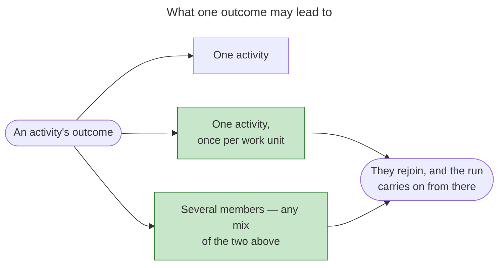

Green is what this adds. The first row is every edge in the corpus today and is unchanged.

It aims at four things.

### 1. Independence and repetition become routing facts

"These three analyses do not read each other" and "do this once per work unit" are statements about where a run goes next, and the graph is the single home for that. Without a way to say them there, an author reaches for fan-out inside an activity, which costs the parallel work its own activity identity. Every binding of the corpus's fan-out vocabulary sits inside an activity, where the parallel branch cannot execute.

### 2. The barrier is read off the bindings

There is no join node, no join keyword and no barrier bookkeeping. One call retires the returning branch and enters the destination if and only if the frontier is then empty, so the only call that can enter the join is the one that empties it. Entering early is unrepresentable rather than refused, and a crashed and resumed orchestrator re-derives the same barrier from the session file with no extra state.

### 3. The purchase is wall clock, and the arithmetic is negative

A fan pays a whole further delivery for every branch past the first, so it costs more tokens than the sequential walk it replaces — substantially more for instances, where the alternative pays one delivery for the whole loop. What it buys is that long reasoning passes run inside one response turn instead of sequential dispatch round trips, and that an in-context loop piling N passes into one unbounded context becomes N bounded ones. That is correctness and latency, not efficiency, and [the cost](#the-cost-stated-honestly) carries the measured figures.

### 4. The sequential path is unchanged

A union accepts every existing string, no load rule keys off a destination's type, and every fan rule is vacuous until a fan is authored, so every existing workflow loads byte-identically. On an ordinary walk the frontier holds one entry and the destination is entered by the call that retires it — today's behaviour, reached by the same code rather than by a special case.

### What shapes the rest of the document

Four facts cut across everything below.

| | |
|---|---|
| **Execution is agent-led** | The orchestrator emits several agent dispatches in one turn; the server validates, records and projects. There is no mechanical runner, and a runner is a [future direction](#future-features) rather than part of this design |
| **A refused call inside a fan is repeated, not reported** | Several branch workers taking their activity at once can be told to repeat the call. That is an ordinary outcome rather than a fault, so a fan's acceptance does not require that no refusal appears |
| **The width bound has one home** | How wide a fan may open is capped once, for the server. A destination may state a tighter cap of its own, with a reason, so moving the general bound does not mean editing every fan |

Fan-out is owned by the graph: the workflow binds an outcome to several activities, or to one activity and a collection, and the orchestrator executes that fan on the activity's behalf.

## The participants

Eight take part, and a fan changes what six of them see.

| Participant | Responsibility | Changes? |
|---|---|---|
| **Definition author** | Binds an exit to one activity, to a list of activities, or to one activity with the collection to run it over; keeps a fanned activity gate-free and off the checkout | **Yes** |
| **Loader** | Parses the destination union, derives each fan's branches, join and branch key from the graph object alone, and fails the load on any of its rules | **Yes** |
| **Transition tool** | Resolves the retiring activity, retires it, removes it from the frontier, enters the destination only when the frontier empties, and reports the barrier | **Yes** |
| **Activity delivery** | Serves a worker the activity it names, refuses a name the frontier does not hold, and overlays the one-value projection an instance reads its element at | **Yes** |
| **Orchestrator** | Applies the concurrent dispatch operation: one enter call, one identity and one prompt per branch, one spawned batch in one turn, one retiring call per branch | **Yes** |
| **Worker** | Runs one activity, reports bare names in its envelope, and cannot tell a fan from an ordinary dispatch beyond the id it was given | No |
| **Guard suite** | Flattens every destination form, intersects over arrivals rather than predecessors, checks reads and writes at member grain, and decides the artifact case | **Yes** |
| **Session store** | Compare-and-swap against the bytes a call read, `STALE_WRITE` on a mismatch, canonical ordering and the seal | One key — the canonical ordering that names the frontier. The compare-and-swap a fan depends on is built and unchanged |

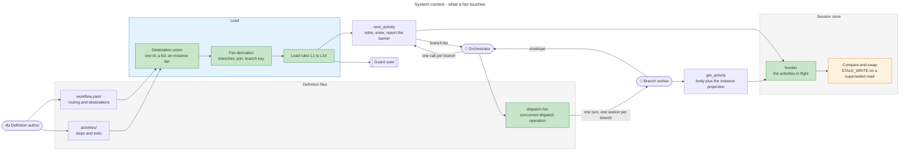

Green marks what is new. The session record's write path is in amber: a fan depends on it. Everything else exists.

## Use cases

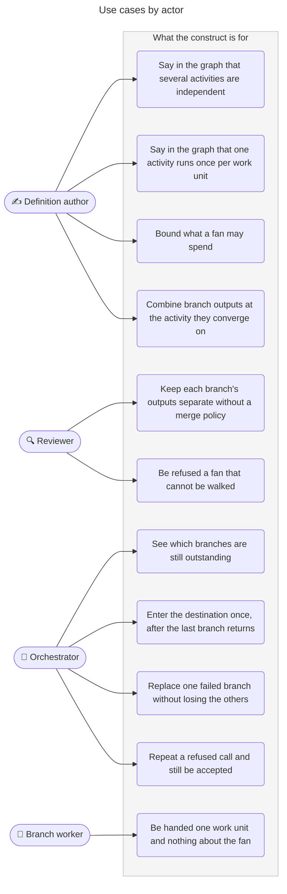

## User stories

### As a definition author

- I want to say in the graph that three analyses are independent, so that the routing file carries the fact rather than a chain whose order I did not mean to assert.
- I want to say in the graph that one activity runs once per element of a collection, so that the work units come from the run and not from a width I authored.
- I want each branch to be a real activity, so that it keeps its own exits, its own artifacts commit, its own usage figure and its own row in the plan's progress table.
- I want the collection named and its members left out of the routing file, so that nothing about a work unit lives in the graph.
- I want the meeting point derived from the bindings I already wrote, so that there is no second place to state where a fan converges and nothing to keep in agreement.
- I want each branch's outputs to land under a key I never spell, so that two branches cannot collide by writing the same name and I do not have to invent a namespace.
- I want to declare a tighter ceiling than the default only where the work needs one, with the reason written down, so that the bound has one home in server configuration and moving it does not mean editing every fan.
- I want a malformed fan to fail the load with a message naming my fix site, so that I find it while authoring rather than mid-run.

### As a reviewer

- I want the rules about a fan's shape to live in exactly one place, so that a graph a guard rejects cannot be the graph a session starts on.
- I want a read of a branch output by its bare name reported, so that "no branch writes a shared name" is a property of the system rather than a habit an author remembers.
- I want a gather that names a member no branch produces, and a member no join gathers, each reported at member grain under the family names already in the registry, so that no new ledger appears.
- I want a read at the meeting point checked as satisfied on every arrival, so that a name only one branch writes is not reported falsely and a genuinely unwritten read inside a branch still is.
- I want two branches that would resolve one artifact filename reported before anything runs, because that one is data loss rather than hygiene.
- I want the token figures presented as a floor and the per-instance payload named as a substitution, so that I read the premium as the lower bound it is.

### As an orchestrator

- I want one call to retire the exiting activity and open every branch, so that entering a fan cannot half-happen.
- I want the branch list handed back to me, so that I never compute a width from a collection I would otherwise have to read for that purpose alone.
- I want to emit every branch's dispatch in one turn and have the turn not resume until each returns, so that joining the envelopes is a fact of the turn and nothing polls, times out or is scheduled.
- I want each return to tell me which branches are still outstanding and, on the last, the destination it entered, so that waiting is a reading rather than something I have to remember to do.
- I want a refused call to be one I repeat with the same arguments and still be accepted, so that several branch workers taking their activity at once is an ordinary outcome and not a fault I have to design around.
- I want one branch whose result is not an envelope to be replaceable on its own, so that a failure costs one branch and the returned siblings' committed work stands.
- I want no gate to arrive from inside a fan, so that I am never asked a question I cannot answer until the turn is already over.

### As a branch worker

- I want to name the activity I was dispatched for and be refused if the session is not on it, so that I am never quietly served a sibling's body.
- I want my one work unit delivered as one value at one name, whole, so that I read a structured unit by ordinary dotted path exactly as a loop body reads its current item.
- I want to report my outputs at their bare names, so that nothing about my position in the graph reaches my envelope and my activity's contract still describes my activity.
- I want to learn nothing about the fan's width, because a worker reasoning about how many siblings it has is reasoning about something that is not its business.

## What a fan does

A destination is what an activity's outcome leads to. Today it leads to one place; a fan is a destination that leads to several at once, and everything below is the behaviour that follows from that.

### The forms an outcome may take

The graph is an object keyed by activity id, whose value is an object keyed by exit id, whose value is one destination. Every exit every activity declares is bound there, or the workflow does not load — which is what lets one workflow borrow another's activity and route it differently, because the borrower binds the exits itself. A destination now takes one of three forms, and the form alone says how many workers the run opens.

| Authored form | What the run does | Workers |
|---|---|---|
| `assumptions-review` — an activity id | Enters that activity | One |
| `__terminal__` — the sentinel | Ends the run without landing on an activity | None |
| `[research, codebase-comprehension, implementation-analysis]` — a list of at least two ids | Runs those activities together, one worker to each | One per id |
| `{ activity, over, variable }` — an object | Runs one activity once per element of the collection `over` names, each instance reading its own element at `variable` | One per element |

The last two are **fans**. A fan's members each run in a worker of their own, all dispatched in one turn, and the run enters the single activity all of their own exits name once the last of them returns. The first fan form names several *different* activities; the second names one activity and the collection of work units to run it over. Naming a collection rather than its members is what keeps data out of the routing file: the graph carries the collection's name, and nothing about a work unit is authored in `workflow.yaml`.

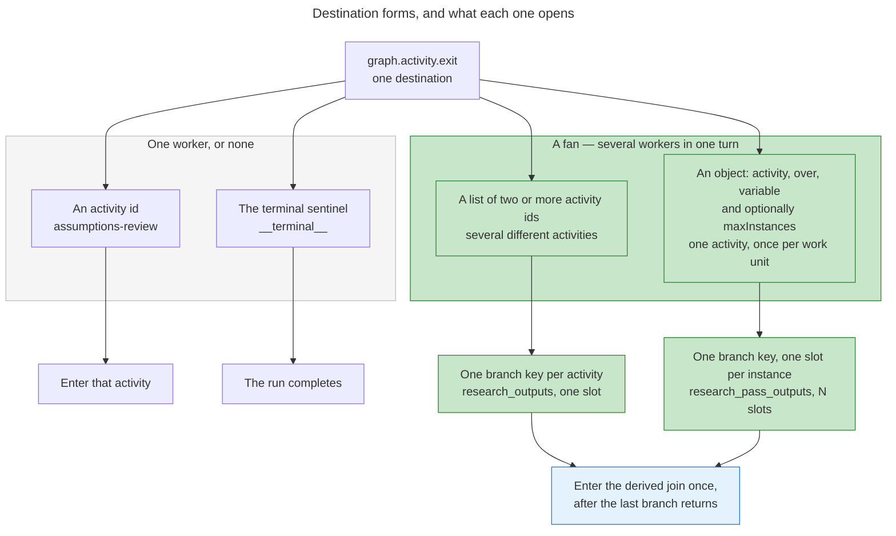

Green marks what is new. The plain destination and the sentinel are what the graph carries today, and they behave identically.

### A fan of several activities

Three pieces of analysis that read none of each other's output run at once, one worker to each, and meet where their exits already converge:

```yaml
# workflows/work-package/workflow.yaml
graph:
 plan-prepare:
 done: [research, codebase-comprehension, implementation-analysis]
 research:
 done: assumptions-review
 codebase-comprehension:
 done: assumptions-review
 implementation-analysis:
 done: assumptions-review
 assumptions-review:
 approved: implement
```

Read plainly: finishing `plan-prepare` starts all three of `research`, `codebase-comprehension` and `implementation-analysis`. `research` works the knowledge base and external sources and lands its findings and its open assumptions. `codebase-comprehension` reads the checkout and lands its comprehension document and its open questions. `implementation-analysis` weighs approaches against the requirements and lands its own assumptions. Each of the three declares one exit, and each binds it to `assumptions-review`. The server reads those three bindings, sees they agree, and takes `assumptions-review` as the destination the fan converges on. It enters `assumptions-review` when the third branch returns and not before.

Nothing in the three activity files says they are fanned. Each is an ordinary activity with ordinary exits, and each is borrowable into a workflow that routes it sequentially — the fan is a routing fact, and routing facts live in the graph.

### A fan of one activity over a collection

The other shape is one activity, several units of work: several research passes that differ by the topic each is handed and by nothing else. The graph names the activity, the collection, and the name each instance reads its own element at.

```yaml
# workflows/research-sweep/workflow.yaml
graph:
 scope-research:
 scoped:
 activity: research-pass
 over: research_topics
 variable: research_topic
 # Tighter than the server's ceiling: a pass reads whole documents, and the
 # activity that combines them re-pays every pass's payload to write one report.
 maxInstances: 3
 research-pass:
 researched: combine-research
 combine-research:
 insufficient: scope-research
 settled: plan-prepare
```

The collection is an ordinary variable, written by the activity whose exit fans:

```yaml
# workflows/research-sweep/activities/02-scope-research.yaml
id: scope-research
variables:
 reads:
 - requirements
 - problem_statement
 writes:
 - name: research_topics
 type: array
 description: The topics this sweep researches, one per pass — each an object carrying a slug `id`, the question it answers and the sources to prefer.
exits:
 - id: scoped
 isDefault: true
```

The activity the fan runs declares the per-instance parameter among the names it needs its workflow to supply, which is that activity's ordinary contract on its including workflow:

```yaml
# workflows/research-sweep/activities/03-research-pass.yaml
id: research-pass
variables:
 reads:
 - research_topic
 - problem_statement
 - planning_folder_path
 writes:
 - name: topic_findings
 type: object
 description: What this pass found for its topic — sources, practices, risks — with the topic's id carried through.
exits:
 - id: researched
 isDefault: true
```

Worked through, with a collection holding three topics.

**Entering.** The scoping activity returns on its `scoped` exit, and the transition call names the destination exactly as the graph gives it. The server reads the collection out of the bag, finds three elements, derives an id for each, refuses if anything is wrong, materialises the output container with three empty slots in the collection's order, puts three entries on the frontier, and hands the orchestrator that branch list.

**Running.** The orchestrator mints three identities, composes three prompts and spawns the batch in one turn. Each worker loads its activity by naming its own entry and is served the same activity body plus a small server-computed block carrying the one value it is working on, bound at the name the destination gave: instance one reads `research_topic` as the first topic, instance two the second.

**Returning.** Each worker finishes and reports; its transition call names its own entry, so the server knows which slot to write. The first two returns retire their entry and enter nothing, each told the meeting point and which instances are still out. The third return empties the frontier, so that call — and only that call — enters `combine-research`, which reads the container whole and hands it to the ordered-collection gather with the fan's own collection as the ids it expects.

Nothing in the graph names an individual instance. Nothing in the activity file says it is fanned. The worker never learns the width, and the orchestrator never computes it.

The parameter's name lives in exactly two places — the destination that supplies it and the activity that reads it — and one load rule keeps them in agreement. It is **not** declared in the workflow file's own variable list: that would put it in the set the guard treats as workflow-owned, which is both skipped by the unwritten-read check and seeded into the availability lattice, so a read of the parameter anywhere else in the workflow would be silently satisfied. Instead the guard treats it the way it already treats server-supplied names — available to the activity the fan runs, unwritten for every other activity — so a stray reader is reported natively with no new guard family.

The name is authored rather than derived from the activity id for two reasons pulling the same way. No operation's own input id will ever be an activity's name with a suffix, and the binding contract makes same-name binding the zero-data path with a rename as the exception, so a derived name would erode implicit binding at every consuming step forever. And a derived name makes the activity fan-only: outside a fan nothing writes it, so the guard reports the read and the activity cannot be reused sequentially. The agreement rule that pays for the authored name is one load rule, and it is the only policing needed — a second fan of the same activity handing the element at a different name fails it, because the activity declares one read for its element.

**A construct that runs several workers has to sit where the routing is decided.** The corpus already holds a complete fan-out vocabulary — a scatter-gather operation with a parallel mode, a dispatch-workers operation, five borrowable pattern activities — and fifteen bindings of it across seven definition files, every one inside an activity executed by a dispatched worker that holds no agent-dispatch tool. The construct that runs several workers has to sit where the run's routing is decided, which is the graph. Fan-out is owned by the graph: the workflow declares the fan and the orchestrator executes it on the activity's behalf.

**And it is not a loop step wearing a graph's clothes.** It borrows the loop's vocabulary deliberately — the loop's own header states its division of labour as the collection and the item — but a loop step *contains* its body as a list of steps, and a destination *names* an activity the graph already contains and already routes. There is no continuation test, no early exit, no nesting, no body.

### A fan of several activities, some of them over collections

A list's members are not all of one kind. A member is either an activity to run once or an instance fan to run one activity once per element of a collection, so a single destination can open a set of workers that is part heterogeneous and part repeated.

The shape a research stage wants is the plain case: one pass over the knowledge base, one over the codebase, and one per topic on the open web, all in the same turn.

```yaml
# workflows/research-sweep/workflow.yaml
graph:
 scope-research:
 scoped:
 - knowledge-base-research
 - codebase-analysis
 - activity: web-research
 over: research_topics
 variable: research_topic
 knowledge-base-research:
 surveyed: combine-research
 codebase-analysis:
 surveyed: combine-research
 web-research:
 surveyed: combine-research
 combine-research:
 done: __terminal__
```

With three topics in `research_topics` that destination opens five workers in one turn: one for each singleton member and three for the instance-fan member. The frontier holds five entries — `knowledge-base-research`, `codebase-analysis`, and `web-research` instance-qualified three ways — and the join is entered by whichever of the five retirements empties it.

Each member lands its outputs under its own branch key, so `knowledge_base_research_outputs` and `codebase_analysis_outputs` are objects while `web_research_outputs` is a container of three slots in the collection's order. The meeting point reads all three by name. Nothing about the mixture reaches a worker: each is dispatched for one activity and, where its member is an instance fan, handed one element at the name that member declares.

**A destination expands to one flat set of branches, and a member is never itself a list.** An instance-fan member is a leaf: it expands to N branches of one activity, every one of which returns to the same join, so it adds branches to the flat set without adding a barrier. A list member would be different in kind — its own members would have to converge somewhere before the outer fan could complete, which is a second barrier nested inside the first. That is what the member type excludes: it admits an activity id or an instance fan and nothing else, so nesting is unrepresentable rather than refused, and the arity rule stays one rule — a list carries two or more members.

**Ceilings and parameters are per member.** Two instance-fan members of one list may run different activities over different collections at different widths, and each is checked against the activity it runs. What no list may do is name one activity twice, whether as a bare id or as the activity an instance-fan member runs, because two members over one activity would derive one branch key and write one container.

### The join

A fan's members each bind their own exits in the graph like any other activity's, and they all bind to the same single destination. That shared destination is the **join**, and it is read back off the bindings rather than declared: the graph already says where `research` goes when it finishes, and that is the fact the barrier needs. For an instance fan the agreement is free — all instances of one activity share that activity's exit bindings, which the graph holds keyed by activity id, so N instances have one join by construction. The single derivation of a fan's shape lives beside the graph validation in `src/loaders/workflow-loader.ts`, reads the graph object and nothing else, and is what the load validates against, what the reachability analysis is handed and what the transition handler routes on.

The run enters the join once, when the last branch returns. Three mechanisms the design would otherwise need are absent because of the shape, and each absence is the point:

| Absent | Why it is not needed |
|---|---|
| A join node | The join is the destination the branches already name |
| A join keyword | A keyword would be a second home for that fact, able to disagree with the bindings |
| Barrier bookkeeping in the graph | The barrier is a predicate over what the session holds in flight |

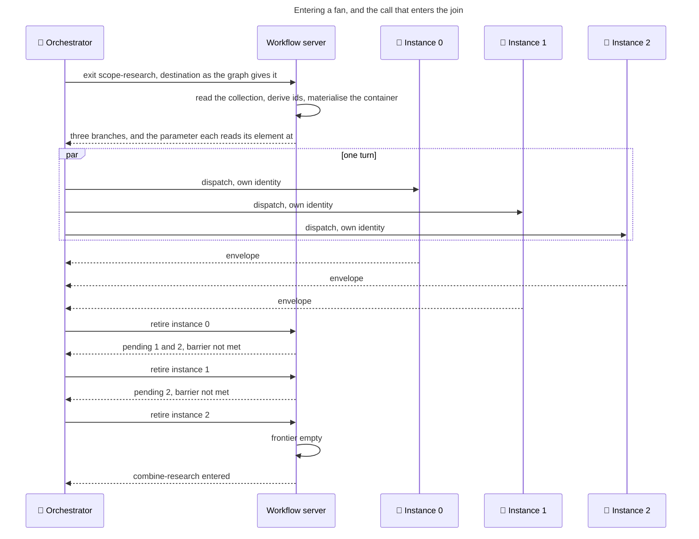

The turn does not resume until every dispatched worker has returned, so joining the envelopes is a fact of the turn: nothing polls, nothing times out, nothing is scheduled. The store is the other half, because the only call that can enter the join is the one that empties the frontier — early entry is unrepresentable rather than refused, and a crashed and resumed orchestrator re-derives the barrier from the session record with no extra state.

### What each branch lands, and how a join reads it

#### The key is derived from the activity id

Each member of a fan lands its whole set of outputs under a key of its own, so two members cannot overwrite each other's values by writing the same name. Take the activity's id, replace every hyphen with an underscore, append `_outputs`: `research` becomes `research_outputs`, `codebase-comprehension` becomes `codebase_comprehension_outputs`, `research-pass` becomes `research_pass_outputs`. It lives once, as `branchKey` in `src/schema/workflow.schema.ts`.

#### The read form takes the index

A join reads `{research_pass_outputs.0.result.topic_findings}`, and both read walkers handle the numeric segment with no change, verified by execution: each splits a literal path and bracket-indexes after a type guard an array satisfies, and the gate tokeniser starts an identifier on a letter or underscore and continues on letters, digits, underscores and dots, so a numeric segment is consumed inside the identifier and never reaches the numeric-literal branch. An indexed comparison parses to one node carrying the full indexed path; the path extractor returns full indexed paths including two-digit indices; evaluation is true at the filled slots and false at the empty one and out of range. The path extractor feeds the guard's read collector through a head-taking helper, so the guard already resolves an indexed reference to its container.

A distinct-activity fan's join can spell its reads, because N is authored:

```yaml
 - kind: technique
 id: gather-branch-assumptions
 technique:
 name: review-assumptions::reconcile
 inputs:
 research_assumptions: "{research_outputs.0.result.open_assumptions}"
 comprehension_questions: "{codebase_comprehension_outputs.0.result.open_questions}"
 analysis_assumptions: "{implementation_analysis_outputs.0.result.open_assumptions}"
 outputs:
 reconciled_assumptions: open_assumptions
```

An instance fan's join cannot, because its width is a run-time collection length and there is no indirection in the placeholder grammar and no dialect expressing "for each member of this container". So it hands the container whole to the operation that walks it, with the fan's own collection as the ids it expects:

```yaml
 - kind: technique
 id: gather-topic-findings
 technique:
 name: orchestration-patterns::gather-results
 inputs:
 dispatched_results: research_pass_outputs
 expected_ids: research_topics
 - kind: technique
 id: combine-research
 technique:
 name: research-sweep::combine
 inputs:
 topic_findings: "{gathered_results.items}"
 outputs:
 research_document: research_document
```

Two renames and one dotted projection — the sanctioned deviation forms, no new construct, no new operation. The expectation list binds the fan's own collection unchanged, so no derived bag name carries it to the join: the graph names the collection and the join reads the collection, one home. Order is preserved by construction, the slot being the collection's own position. And completeness is structurally constant here: the destination is entered only on the call that empties the frontier, so no expected id can be missing at the join. A join therefore gathers the container and does not author an index at all.

Nothing merges. The join declares the branch keys among its reads, which is what puts them in the guard's namespace, and there is no implicit way to read a member because the bare name no longer lands — so "a join that needs a combined value binds a step that gathers it" is structural rather than a rule an author must remember. This is the corpus's own `isolation-then-combine` rule raised from work units inside one activity to activities inside one graph: per-branch outputs are never auto-bound into the parent bag by scalar name, and combination happens exclusively in the combine phase. The declaration merge **adds** the container and does not replace the members, so members keep their declared types, value sets and starting values; the container's own declared type is an array in both fan forms, and it carries no starting value, or the rule against gating a defaulted variable on existence makes every existence gate on the container constant.

### Where a fan may not go

A fan is a routing construct, and most of what it forbids is forbidden because a branch runs in a worker of its own, in a turn that cannot pause.

#### A branch reaches no decision gate

A session holds one outstanding question at a time and every other tool call is gated while it is held, so one branch's gate would stop its siblings mid-activity — and the orchestrator could not answer it anyway, since the turn does not resume until every branch has returned.

#### A branch always returns to its fan

It does not fan again, does not route an exit back onto itself, and is never the terminal sentinel, because a branch that never returns leaves the fan with no last branch to release its destination. It declares at least one exit, since the join is read off those bindings and nothing else declares it, and every branch's exits name the same destination — branches that disagree converge nowhere and the fan has no join. A fan does not converge on the sentinel either, because the destination is entered once after the last branch returns and there is nothing to enter at the end of a run. Nor is a branch the activity the fan comes from, or the join one of its own branches: both would ask one activity to be in flight and waited on at the same moment.

#### Every branch is distinct and legally named

No activity is named twice in one fan, and a branch's derived key is a legal variable name and unique in the workflow. An instance fan's collection is a name this workflow's merged variable set contains, its parameter is a name the fanned activity declares among its reads, and any index a downstream activity authors into its container is below the fan's ceiling.

#### A fanned activity stages nothing in the checkout

A fan's branches share one working tree and one git index, and a commit derives its paths from that tree's status, so no branch can attribute its own change.

Two further limits are about what a branch writes rather than where it goes. Two branches of one fan must not resolve one artifact filename, which is the one-artifact-two-producers case met at fan grain: a fan branch declares no artifact and the join writes the document, or, where a branch genuinely must persist one, its artifact name carries the fan's parameter as a token so each instance's file is its own logical artifact. And an activity that writes an unprefixed shared register or appends to an append-ordered log is not a candidate for fanning at all: both surfaces lose rows silently under concurrency, and that is a criterion for choosing which activity to fan rather than a rule to police.

Each of these is carried at a definite strength — a parse error, a load failure, a refusal at the tool boundary, an unrepresentable state, or a guard finding — and the enforcement table later gives one row per invariant with the message it reports. The gate ban and the commit ban are both instances of an instruction reaching a role that cannot act on it, and both are settled at load rather than left for a worker to discover.

## How a fan is structured

The behaviour above is carried by one schema change and two derivations. Nothing else is added: the graph keeps its shape, the activities keep theirs, and every fact a fan needs at run time is derived from the destination the graph already holds.

### The destination schema

All three forms live in one file, `src/schema/workflow.schema.ts`, declared beside the graph type together with the derivations that are decidable from a destination alone. There is no new module: the terminal sentinel stays where it is in `src/loaders/workflow-loader.ts`, and the fan derivation that needs it lives in that same file, so nothing moves and no import cycle is created.

```ts
// src/schema/workflow.schema.ts

/**
 * A destination that runs one activity once per element of a collection: an instance fan.
 * `activity` is the activity every instance runs; `over` names the collection in the variable bag,
 * whose length when the fan is entered is the fan's width; `variable` is the name each instance
 * reads its own element at; `maxInstances` narrows the server's own ceiling where this destination
 * wants a tighter bound, so an over-long collection refuses the fan-enter rather than spending its
 * dispatches. The graph carries the collection's NAME and not its members, so nothing about a work
 * unit enters the routing file. The key the instances' outputs land under is derived from the
 * activity id, so a reader of the graph, the server and the guards spell it the same way and a
 * worker is never told it.
 */
export const InstanceFanSchema = z.object({
 activity: z.string().describe(
 'The activity every instance of this fan runs. One activity: its instances differ by the element each is handed and by nothing else.',
 ),
 over: z.string().describe(
 'The collection in the variable bag this destination runs the activity once per element of, by name or by a dotted path into a named value (`work_units`, `execution_plan.steps`). Read when the fan is entered, so its length is the fan\'s width.',
 ),
 variable: VariableNameSchema.describe(
 'The name each instance reads its own element at. The activity this fan runs declares it among the names it needs its workflow to supply; name it as the consuming operation\'s own input id so no step needs a rename.',
 ),
 maxInstances: z.number().int().min(
 2,
 'a fan admits at least two instances; an exit that leads to one run of one activity names that activity',
 ).optional().describe(
 'Optional. The widest fan this destination admits, declared only where the work wants a tighter bound than the server\'s configured ceiling and with the reason stated. Either bound refuses the fan-enter for a wider destination, naming the bound that applied and the width it saw. Each instance beyond the first costs a whole further delivery of this activity.',
 ),
}).strict();
export type InstanceFan = z.infer<typeof InstanceFanSchema>;

/**
 * Exit bindings: activity id → exit id → destination. A destination names one activity, lists
 * several, or names one activity together with the collection to run it over. Either fan runs its
 * members together, one worker to each, and the run enters the single activity all of their own
 * exits name once the last of them returns — so the barrier is read off the bindings the graph
 * already carries and nothing declares it separately. A destination of TERMINAL_SENTINEL ends the
 * run without landing on an activity. Every exit every activity in the workflow declares is bound
 * here; an unbound exit, an unknown exit and an unknown destination each fail the load, so the
 * graph and the activities cannot drift apart.
 */
/**
 * One member of a list destination: an activity to run once, or an instance fan to run one
 * activity once per element of a collection. Both expand to branches of the one flat set that
 * converges on the destination's join. A member is never itself a list, so a nested barrier is
 * unrepresentable rather than refused.
 */
export const FanMemberSchema = z.union([z.string(), InstanceFanSchema]);
export type FanMember = z.infer<typeof FanMemberSchema>;

export const DestinationSchema = z.union(
 [
 z.string(),
 z.array(FanMemberSchema).min(
 2,
 'a fan names at least two members; an exit that leads to one activity names that activity, and an exit that runs one activity over a collection names the activity with that collection',
 ),
 InstanceFanSchema,
 ],
 {
 errorMap: () => ({
 message:
 'a destination is an activity id, `__terminal__`, a list of at least two members — each an activity id or an instance fan — or a single instance fan: an object naming `activity`, the `over` collection it runs once per element of, and the `variable` each instance reads its element at, optionally with `maxInstances`',
 }),
 },
);
export type Destination = z.infer<typeof DestinationSchema>;

export const GraphSchema = z.record(z.record(DestinationSchema));
export type Graph = z.infer<typeof GraphSchema>;

/** The activities one binding can send the run to, flattened across every member of a list. */
export const destinationTargets = (destination: Destination): string[] =>
 Array.isArray(destination) ? destination.flatMap(memberTargets)
: typeof destination === 'string' ? [destination]
: [destination.activity];

/** The activity one list member runs. */
export const memberTargets = (member: FanMember): string[] =>
 typeof member === 'string' ? [member] : [member.activity];

/** Whether a destination runs several workers together, in any of the fan forms. */
export const isFan = (destination: Destination): destination is FanMember[] | InstanceFan =>
 typeof destination !== 'string';

/** Every instance fan a destination carries — none, itself, or those among a list's members. */
export const instanceFans = (destination: Destination): InstanceFan[] =>
 Array.isArray(destination) ? destination.filter((m): m is InstanceFan => typeof m !== 'string')
: typeof destination === 'string' ? []
: [destination];

/** The instance fan a destination is, or undefined for a plain destination or a list. */
export const instanceFan = (destination: Destination): InstanceFan | undefined =>
 typeof destination === 'object' && !Array.isArray(destination) ? destination : undefined;

/**
 * The bag key an activity's outputs land under when the graph runs it as a branch of a fan: its id
 * in snake case with `_outputs` appended. Derived from the id alone, so the server, the guards and
 * a reader of the graph spell it the same way and a worker is never told it.
 */
export const branchKey = (activityId: string): string => `${activityId.split('-').join('_')}_outputs`;
```

**`over` is deliberately not regex-constrained**, because the load does the stronger check — the collection's head has to be a name this workflow's merged variable set contains — and a grammar constant here would be a second home for a grammar the `variable-binding` operation already states. `variable` is *typed* rather than checked, which makes a bare-word parameter a parse error and removes the need for a grammar rule of its own. The `.strict()` is load-bearing for authoring feedback: an unrecognised key is what tells an author the output key is derived rather than authored.

**Both arity messages are load-bearing, and so is the union's error map.** The array member's own message surfaces for a one-element list and for an empty list. The `maxInstances` message surfaces for a declared ceiling of one. The error map covers everything that matches no member far enough to raise a field error, and without it every one of those renders as `Invalid input`. The map and the member messages do not fight: a member's own message wins where the parser matches that branch furthest, and the map covers the rest.

| Authored | Rendered |
|---|---|
| `scoped: [research-pass]` | the array member's own message — the error map does not suppress it |
| `scoped: []` | the same message |
| `scoped: 42` | the union error-map message |
| `scoped: [[a, b]]` | the union error-map message |
| `scoped: { activity: x, over: y }` | the union error-map message — **which is why the map enumerates all three required fields**; a partial object matches no member far enough to surface a field error |
| `scoped: { activity: x, over: y, variable: z, maxInstances: 1 }` | the `maxInstances` field message, because that member matched furthest |
| `scoped: { …, unit: q }` | `Unrecognized key(s) in object: 'unit'` — which is what tells an author the output key is derived rather than authored |

Keeping arity in the schema rather than restating it in the loader is Encode Constraints as Structure. A one-element list is a plain destination spelled a second way, and a ceiling of one is a plain edge spelled a third, which One Authoritative Home forbids.

**The operative width bound lives in server configuration**, beside the other delivery-policy defaults in `src/config.ts`, so it has one home and can move without editing every fan:

```ts
// src/config.ts

/**
 * Fan width policy. A destination opens at most this many branches once every member is flattened
 * — the bare members plus each instance-fan member's collection length — unless it declares a
 * tighter `maxInstances` of its own; a wider destination refuses the fan-enter. Each branch is a
 * whole further delivery of an activity and a further harness establishment, which is what the
 * bound is against.
 */
export const DEFAULT_FAN_MAX_BRANCHES = 4;
```

It sits with `DEFAULT_BATCH_MAX_ACTIVITIES`, `DEFAULT_BATCH_HEADROOM_FRACTION` and `DEFAULT_BUNDLE_CHARS_PER_TOKEN`, is env-overridable as they are, and has an in-code fallback so a config built without it still bounds a fan. A destination declares `maxInstances` only to be tighter than that default, and says why. **The cost figure behind the bound is a floor.** No measured figure exists for a fanned activity's payload, so anything derived from the standalone activity benchmark is a substitution and a lower bound — The bound should be revisited against measured figures rather than against these.

The graph field's description is the one piece of text that reaches every reader — the orchestrator's workflow summary, the generated JSON schema, and the published site — so the semantics belong there and are written out rather than left to the implementer:

```ts
 graph: GraphSchema.optional().describe("The workflow's shape: for each activity, where each of its exits leads. This is the single home for the routing — an activity names outcomes, the workflow names destinations, so a borrowed activity sits in this graph without its lending workflow having a say. A destination naming one activity sends the run there, and `__terminal__` ends the run. A destination naming several activities runs them together, one worker to each. A destination naming one activity together with the collection to run it over runs one worker per element of that collection, each handed its own element at the name the destination gives; the graph names the collection, so the width is that collection's length when the fan is entered. Any destination is bounded by the server's ceiling, or by a tighter `maxInstances` an instance fan declares, measured against the branches it opens once every member is flattened. Either fan lands each branch's outputs in its own slot under the branch's own derived key, and the run enters the single activity all of the branches' own exits name, once, after the last of them returns. Omitted only by a workflow whose activities declare no exits."),
```

### The generated JSON schema

`schemas/workflow.schema.json` is generated by `npm run build:schemas` and never hand-edited: the zod file above is the only place a form of a destination is authored, and every other representation follows from it. Under the reference strategy the workflow schema is generated with, the nested destination becomes:

```json
"graph": {
 "type": "object",
 "additionalProperties": {
 "type": "object",
 "additionalProperties": {
 "anyOf": [
 { "type": "string" },
 { "type": "array", "items": { "type": "string" }, "minItems": 2 },
 {
 "type": "object",
 "properties": {
 "activity": { "type": "string", "description": "The activity every instance of this fan runs...." },
 "over": { "type": "string", "description": "The collection in the variable bag this destination runs the activity once per element of..." },
 "variable": {
 "anyOf": [
 { "type": "string", "pattern": "<QUALIFIED_DATA_ID_PATTERN>" },
 { "type": "string", "enum": ["<EXEMPT_DATA_IDS>"] }
 ],
 "description": "The name each instance reads its own element at...."
 },
 "maxInstances": { "type": "integer", "minimum": 2, "description": "Optional. The widest fan this destination admits..." }
 },
 "required": ["activity", "over", "variable"],
 "additionalProperties": false
 }
 ]
 }
 },
 "description": "<the describe text above>"
}
```

Both the array's item schema and the object's properties are non-empty, so the generated-schemas test that fails on an empty subschema under an `items` key stays green. The site's schema page picks the new description up through `npm run build:site`; its row renderer never recurses into an `additionalProperties` subschema, so the nested destination type is not rendered there and needs no further work.

**Corpus impact of the widening: none.** At the pinned corpus commit the graphs hold 17 workflows, 109 activities bound, 207 graph edges, 18 of them terminal, 0 list-valued and 0 object-valued. A union accepts every existing string, no load rule keys off a destination's JavaScript type, and every fan rule is vacuous until a fan is authored. Every existing workflow loads byte-identically.

### The branch key

#### Derived from the activity, not declared in the graph

The key a member lands its outputs under is **derived from the activity that member runs**, not declared in the graph, for three structural reasons. A declared key would be a second name for the branch that has to be kept in agreement with the activity id, and two fans could spell one activity's key differently — One Authoritative Home. It would be unknowable to a worker, because the control-plane ban keeps a worker out of the workflow summary, so it would have to travel as per-dispatch data the envelope contract does not carry. And it would be forgeable: a derived key cannot be mistyped, so the agreement between a fan and its join's declared reads is mechanical rather than authored — Encode Constraints as Structure.

#### The suffix is what makes the derivation total

A variable name must be a snake-case noun phrase of at least two words, or a listed bare-word exemption. `codebase_comprehension` passes on its own; `research` is one word and would need an exemption entry for every single-word fanned activity id in the corpus. One uniform suffix removes that list, and a plural item-noun collection name is the shape the catalog already sanctions. Hyphens are excluded because the bag-name grammar excludes them and because any symbol binding to session state is snake-case.

### The container

#### The shape it takes

**The container is a dense array, materialised at the enter, written positionally.** Each slot carries its unit's id and that instance's reported values; a slot no instance filled carries no result.

```
challenge_pass_outputs:
 - { id: "stakeholder-gap", result: { perspective_findings: [...] } }
 - { id: "rejected-paths", result: null }
 - { id: "evidence-strength", result: { perspective_findings: [...] } }
```

The index is uniform — always present, including slot zero for a fan of distinct activities, where each branch has exactly one instance. Without uniformity a combine activity's read form would depend on the fan's shape, so an activity borrowed into two workflows would need different reads in each.

#### Dense, and pre-filled at the fan enter

Getting this wrong corrupts the session record, and it is verified by execution rather than by inspection. A *sparse* array — which is what a positional write at slot two into a fresh empty array produces when branches retire out of order — canonicalises with each hole rendered as an empty string between commas, and reparsing that output fails with an unexpected-token error: invalid JSON, sealed and written by the atomic writer, unreadable on reload. An *object with numeric keys* avoids that and loses order, because the canonicaliser sorts keys lexicographically at any depth other than the top, so an eleven-instance fan persists as zero, one, ten, two — breaking the rule that a gathered collection is in work-unit order so the combine step is deterministic. A *dense array* preserves index order through canonicalisation.

So the container is materialised at the fan enter as N slots, each carrying its unit's id and no result. That buys four things at once.

1. Order survives the seal, and an out-of-order retirement is a positional write into an existing slot rather than a hole.
2. A slot no branch filled reads as **absent** to both dotted-path evaluators — verified: a not-exists gate is true for an empty slot, true for a member of an empty slot, and true for an out-of-range index; an exists gate is true for a present member.
3. **A second entry of the same fan resets the container rather than appending into the previous entry's slots.** Two fans containing one activity share its branch key, and variable writes assign rather than merge, which is the only behaviour consistent with there being no merge policy. Stated positively: a branch key holds one slot per branch the fan entered, in collection order; a slot no branch filled holds no result; entering a fan materialises the container afresh, and a join that needs an earlier entry's values gathers them into a name of its own at that entry.
4. It is already the shape the ordered-collection gather declares for its input — an array of id-and-result pairs in input order, with missing ids appearing with no result — so the join binds that operation with no adaptation.

The pre-fill goes through the existing variable-write path as one call and one event, with a fourth write-source value naming a fan enter, so the history distinguishes the server's own materialisation from a worker's report. It assigns the container whole, so it is not a merge, and it is not a branch's write.

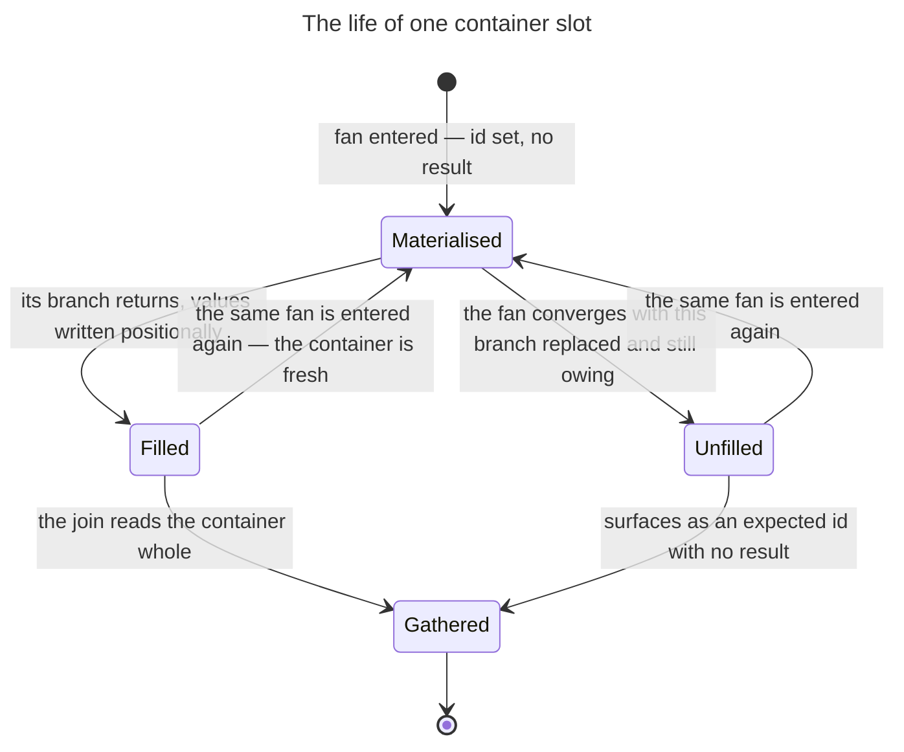

An unfilled slot is a real reading, and a wanted one: the gather's manifest marks it empty, which is exactly what a replaced branch that returned nothing should look like.

### The domain model

Every noun the rest of this document uses is now on the table, so it is worth seeing them together before the mechanics.

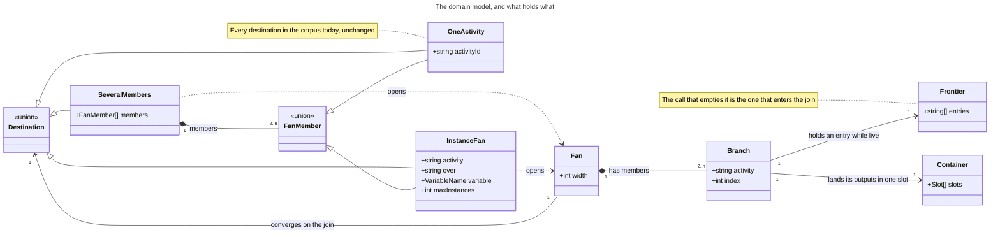

`maxInstances` is the only optional field; the join is a destination reached through the branches rather than a field anything declares.

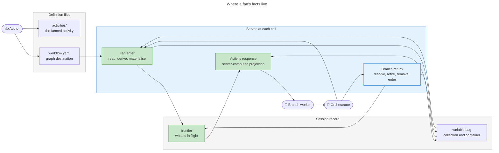

Green marks what is new. The graph, the bag, the activity files and both agent roles exist.

## How a fan runs

A fan is entered by one call, carried by several workers at once, and closed by whichever of them returns last. Carrying that takes one new field in the session record, one new rule in the transition handler and one new block on the activity response; everything else a fan needs is derived at the moment it is needed, from the graph the handler already holds and from the collection already in the variable bag. This section follows the sequence through those four surfaces in the order a fan touches them.

### The session record

**What a session is on is a list, because more than one thing can be in flight.** `src/schema/session.schema.ts` holds the activities in flight as a frontier:

```ts
// src/schema/session.schema.ts
 /**
 * The activities in flight. One entry on an ordinary walk; one per branch while a graph fan runs.
 * A destination the graph fans is entered once, after the last of its branches returns, so this
 * holds either a single activity or the branches of exactly one fan — every exit of a branch binds
 * to its fan's join, so a branch cannot open a fan of its own. Empty between the last branch
 * retiring and the join being entered, and after the run completes.
 */
 frontier: z.array(z.string()).default([]),
```

#### Nothing else goes on an entry

Nothing else goes on one, and each of the three things that might are refused for a reason that survives contact with both fan forms. A per-entry join is a copy of a graph fact the handler already loads — and for an instance fan it is doubly redundant, because every instance of one activity shares that activity's exit bindings, which the graph reads keyed by activity id, so N instances have one meeting point by construction. A per-entry timestamp is a copy of the entry event already in the history. A per-entry worker identity forces a distinct call outcome for a replacement worker, which branch replacement gets for free without one: a replacement names the same entry, which the frontier still holds, so it needs no re-binding call.

#### One entry is one string, and an instance of a fan qualifies it

An entry for one instance is `challenge-pass#1`. The corpus already owns that spelling and it was introduced for exactly this shape: a checkpoint inside a loop body is defined once and reached many times, so the loader yields it as a base id, a separator and an instance discriminator, and resolves an instance-qualified id back to its base definition. The separator's home generalises to serve both populations, in `src/loaders/workflow-loader.ts`:

```ts
// src/loaders/workflow-loader.ts
/**
 * The separator between a base id and its per-instance discriminator. One definition reached
 * several times — a checkpoint inside a loop body, an activity the graph fans over a collection —
 * is named `<baseId>#<instance>` so that each reach is a distinct id: a distinct checkpoint
 * response key, a distinct frontier entry, a distinct history event, a distinct usage row. The
 * base is what matches the single definition.
 */
export const INSTANCE_SEPARATOR = '#';

/** The base id — the portion before the per-instance discriminator, if any. */
export function baseId(qualifiedId: string): string {
 const i = qualifiedId.indexOf(INSTANCE_SEPARATOR);
 return i === -1 ? qualifiedId : qualifiedId.slice(0, i);
}

/** A fan instance's index, where the discriminator is one. */
export function instanceIndex(qualifiedId: string): number | undefined {
 const i = qualifiedId.indexOf(INSTANCE_SEPARATOR);
 if (i === -1) return undefined;
 const raw = qualifiedId.slice(i + 1);
 return /^\d+$/.test(raw) ? Number(raw) : undefined;
}
```

The existing checkpoint base helper retires into `baseId` — three call sites in the loader and the validation module, plus one test import. No compatibility alias.

#### The discriminator is the index, not the work unit's own id

The discriminator is the index rather than the unit's own id, on three counts. Uniqueness: a run-time collection with two elements sharing an id would produce two identical frontier entries, reintroducing mid-run the exact ambiguity a composite removes. Order: the slot is the collection's own position, so a gathered collection is in work-unit order with nothing sorting it. Range: an authored index in a combine activity's expression can be compared at load against the fan's effective ceiling, which a run-time id cannot. The unit's id is still derived and still used — it names the container slot, the gather's manifest row and the artifact filename — as a datum inside the slot rather than as the designator of it. The entry designates a slot; the projection carries the parameter.

#### A string entry keeps the change small where the risk is

The resolver reads a list of distinct strings unamended: a call naming the bare activity of a three-instance fan matches nothing, and a call naming `challenge-pass#1` matches exactly one entry. Beyond what the frontier itself requires, the marginal edit is nil across the session schema, the resolver, the record store's canonical key ordering, the resource tools and the logging module. The legacy converter is the one exception, and only because it writes the position field by name: it follows the rename, and it converts a legacy folder holding no session file, which is not what a pre-frontier record is. No new tool parameter appears anywhere: the instance rides the value of parameters the transition and delivery calls already take, and the usage call is untouched, its activity parameter being already described as the activity a figure is attributed to whether or not the session is still on it, and stored verbatim.

**The reach of the change is one field's contents, not one field's type.** Every history event's activity field is a plain string, and a composite lands in it unchanged, so everything already reading that field goes on reading it — a longer string, not a new shape. That is the whole argument for a string entry.

**The protection for the readers that do not follow is tests, not types.** Composite ids reach five validators and one header, and two of them fail silently rather than noisily.

| Reader | What a composite id does to it | How it closes |
|---|---|---|
| Reported-exit validator | Looks the destination up in the graph, misses, finds an empty binding list and returns no finding — the check is disabled, not wrong | Graph lookup takes the base |
| Transition validator | The same silent disable | Graph lookup takes the base |
| Step-manifest validator | Returns `cannot validate manifest: activity not found` | Base fallback in the activity lookup |
| Activity-manifest validator | Warns that a manifest references an unknown activity on every instance return | Membership test base-normalises in place |
| Worker's routing block | Comes back empty, leaving the worker unable to report its exit | Base fallback in the activity lookup |
| Technique-fetch validator | Scopes correctly on the composite | Keeps the composite, deliberately |

Two edits close all six, and both mirror a base-fallback convention already sitting one screen away in the same file:

```ts
// src/loaders/workflow-loader.ts
/**
 * Get an activity from a workflow by ID. An exact id match wins; otherwise an instance-qualified
 * id (`<baseId>#<instance>`) resolves to its base definition, so N instances of one fanned activity
 * share one definition while being recorded, validated and accounted for distinctly.
 */
export function getActivity(workflow: Workflow, activityId: string): Activity | undefined {
 return workflow.activities?.find(a => a.id === activityId)
 ?? workflow.activities?.find(a => a.id === baseId(activityId));
}
```

and, in the exit-bindings reader, the graph lookup takes the base. The two silent readers each carry a test that proves them live rather than merely quiet: a fan-instance transition whose reported exit is not bound is *refused*.

#### One resolver, one home

One resolver answers the question every one of those sites asks, added beside the existing session view in `src/utils/session/resolver.ts`:

```ts
// src/utils/session/resolver.ts
/**
 * The activity a call belongs to: the one it names, when the frontier holds it. Undefined
 * otherwise — including when a call names none and the frontier is not empty, which is not a
 * single-entry convenience but the case that must refuse. Inferring the sole entry would let a
 * second advance off an already-retired activity resolve against whatever the frontier then held
 * and record it complete before its first step. So the caller refuses rather than guessing, and a
 * guess would also serve one branch another branch's activity.
 */
export function heldActivity(state: SessionFile, named: string | undefined): string | undefined;
```

The frontier is the run's only cursor: a scalar kept beside the list would be a second home for the run's position. The change reaches the schema, the resolver, the canonical key ordering in `src/utils/session/store.ts` — which feeds the seal — and every reader in `src/tools/workflow-tools.ts`, `src/tools/resource-tools.ts` and `src/logging.ts`, which between them account for the tree's sixty-six references to the run's position. The single-slot outstanding-decision field is untouched, and the session-level exit field is untouched: its stated meaning is the exit the last completed activity took, and after three branch returns it holds the last branch's, which is that.

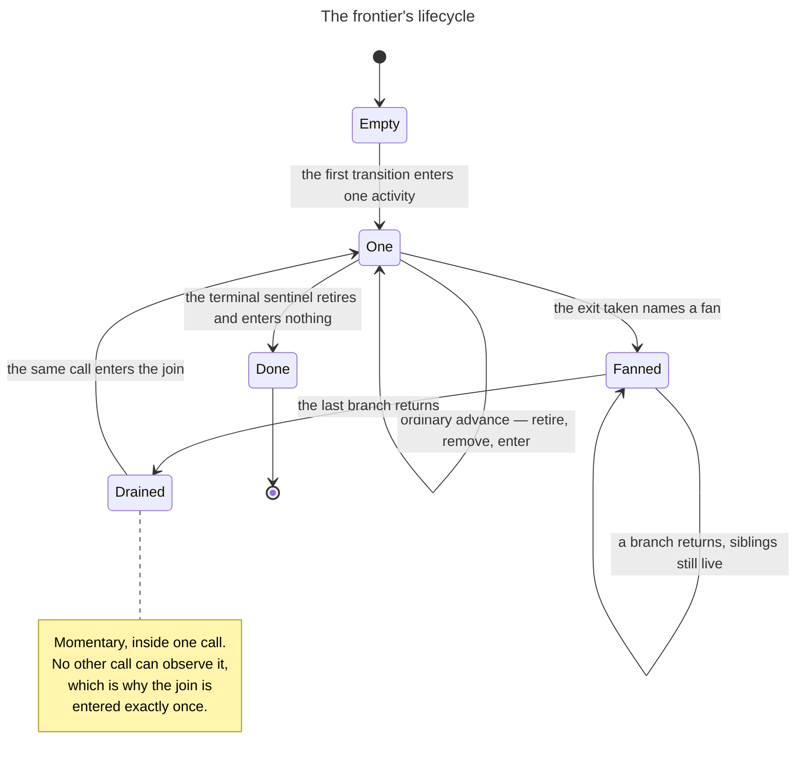

`Drained` is the whole barrier: it exists for the span of the call that produced it, and the same call enters the join.

### One transition rule, four behaviours

**The transition call takes the destination exactly as the graph names it, and says which activity it is exiting.** `next_activity` in `src/tools/workflow-tools.ts` widens one parameter and adds one:

```ts
// src/tools/workflow-tools.ts
 activity_id: z.union([z.string(), z.array(z.string()).min(2), InstanceFanSchema]).describe(
 'Where the run goes next: an activity id, `__terminal__`, or — where the graph fans the exit taken — the destination exactly as the graph names it, which for one activity run over a collection is that object. Returning a branch of a running fan, this is the activity the fan converges on: the server enters it once, when the last branch returns.',
 ),
 from_activity: z.string().optional().describe(
 'The activity this call is exiting — the one `exit`, `step_manifest`, `variables_changed` and `artifacts_produced` belong to, instance-qualified (`challenge-pass#1`) where the graph runs that activity once per element of a collection. Required whenever anything is in flight, which is every call but a session\'s first, so a call always names the activity it is returning rather than leaving the server to infer it. Omitted only on that first call, when the frontier is empty.',
 ),
```

#### The handler resolves in one rule

1. **Resolve the retiring activity.** Named and in the frontier: that one. Named and absent: refuse. Unnamed with an empty frontier: the first call of a session, and nothing is retired. Unnamed with anything at all in the frontier: refuse. There is no sole-entry fallback, and that absence is load-bearing — see below.
2. **Check the destination it names.** Where the retiring activity is a branch of a fan, `activity_id` is the meeting point the graph derives from the branches' own exit bindings, and a disagreement is refused before anything is written. Off an activity the graph does not fan, nothing is compared.
3. **Retire it.** Record the exit event, add it to the completed set, set the session exit, apply its reported variable writes under its branch key where the graph fans it, emit one step-completed event per manifest entry, record the activity outcome — all attributed to the retiring activity, exactly as the exiting activity is attributed today.
4. **Remove it from the frontier.**
5. **Enter `activity_id` if and only if the frontier is now empty.** A fan destination materialises the container, pushes every branch and emits one entry event each. A single activity pushes one and runs the terminal check. The terminal sentinel retires and does not push: the completed status is the record.
6. **Otherwise enter nothing** and report the barrier reading.

Step 1 is an exact string comparison over a list of distinct strings. That is how the retire step finds its entry — not by scanning for a matching activity and disambiguating, but because the id the call names is unique in the frontier by construction.

**Four behaviours fall out of that rule rather than being cases in it.**

| Shape | Frontier before the call | What the call does | Frontier after |
|---|---|---|---|
| Ordinary advance | one activity | retires it; step 5 always fires, so behaviour is identical to today | one activity, or empty at the sentinel |
| Fan enter | the fan's source, as the sole entry | retires the source, reads the collection, materialises the container, pushes every branch | one entry per branch |
| Mid-fan return | several branches | retires the named branch, enters nothing, reports the barrier | one fewer branch |
| Last return | one branch | retires it, which empties the frontier, so the same call enters the join | the join |

The same rule closes a hazard that would otherwise need its own prohibition, and it closes it because the exiting activity is named rather than inferred: a second advance off an activity already retired names an activity the frontier no longer holds, and is refused. Inferring it from a single-entry frontier would reopen the hazard rather than close it — the second call would resolve against whatever the frontier then held and retire an activity no worker had walked, recording it complete before its first step. So the requirement is what does the work here, not the order of the steps. The `one-advance-per-activity` rule in `continue-batch` stays: it tells an orchestrator what to do, where the refusal tells it afterwards what went wrong.

#### Refusals, verbatim

The first two close the two ambiguous positions of step 1 for an instance fan; the third closes them for a fan of distinct activities; the fourth closes a transition off a fanning exit that does not say which exit it took.

```
Cannot exit 'challenge-pass': the session is on three instances of it. In flight: challenge-pass#0, challenge-pass#1, challenge-pass#2. Pass from_activity naming the instance this call is returning, activity and instance together.

Cannot exit 'challenge-pass#4': the session is not on it. In flight: challenge-pass#1, challenge-pass#2. An instance index comes from the branch list the fan-enter returned; report the mismatch rather than retrying with another index.

Cannot advance: 3 activities are in flight (research, codebase-comprehension, implementation-analysis). Pass from_activity naming the branch this call is returning; the destination is entered once, when the last one does.

Activity 'plan-prepare' binds exit 'done' to a fan, so 'exit' is required on this transition to say which destination it takes.
```

**The barrier reading rides every fan-related response in one shape**, naming the destination and what is still outstanding: `_meta.barrier = { destination: 'assumptions-review', pending: ['implementation-analysis'], met: false }`, and `met: true` with an empty pending list on the call that enters the join. For an instance fan the pending list names slots: `_meta.barrier = { destination: "combine-challenges", pending: ["challenge-pass#2"], met: false }`.

#### Six sites in the handler follow the resolved retiring activity

Four are gated on it being present, so leaving them unrepointed would silently disable them for every branch return: step-manifest validation, technique-fetch fidelity validation, the missing-manifest advisory, and the reported-exit check. Two more resolve the exiting activity for the batch reading and stamp the trace segment — and the trace payload stamps the **retiring branch**, not the target, or all three branch segments would carry the join's id. Where an instance retires, the resolved composite is what the exit event, the completed-activities append, the step-completed events and the trace stamp all carry; the reported-values wrap lands at the branch key and the slot index taken from the entry; the recorded exit field holds the last instance's exit, which is that field's stated meaning after a fan; and the usage rule gains one clause naming an instance, because each instance is a separate dispatch with its own harness establishment and one figure for the base id would make the number unattributable.

#### Two payload sites stop interpolating a destination directly

— a checkpoint option's stated consequence and the immediate-exit message. The compiler catches neither, because an array stringifies happily into `whose next target is 'research,codebase-comprehension,implementation-analysis'`. In `src/utils/validation.ts` the reported-exit check is satisfied when the requested activity is among the destination's targets and compares set-wise on a fan enter, and the transition-order check flattens. Both are advisory, so leaving them unwidened produces a spurious warning on every single fan transition, which is how an orchestrator learns to stop reading that channel — the same reachability-of-instruction concern a check for.

### The barrier is unrepresentable, not refused

**There is no barrier-met call and no join-enter call, so entering the join early is not refused — there is no way to express it.** The only call that can enter the join is the one that empties the frontier. Single entry after the last return is therefore a property of the store rather than of an orchestrator remembering to wait, and the barrier reading is a reading rather than a verdict. This is Encode Constraints as Structure taken as far as it goes here, and it is the strongest available realisation of implicit convergence: the meeting point is derived from the branches' own exit bindings, so nothing declares it and nothing can disagree with it.

**A crashed and resumed orchestrator re-derives the same barrier from the session file with no extra state**, because the frontier holds slot names rather than worker identities. That is also what keeps branch replacement free: a replacement names the same entry, which the frontier still holds, so it needs no re-binding call, and whichever report arrives first retires the entry while the second is refused as holding no open branch. A frontier keyed on the bare activity id would not hold that property for an instance fan — an abandoned instance's late report would resolve against "an entry holding this activity" and could retire a different slot, landing one instance's outputs under another's key.

### The fan enter

**On the call that enters a fan the server holds both the graph and the bag, so it derives everything and refuses before spending anything.** It reads the collection the destination names, takes its length as the fan's width, derives one id per element — the element itself where elements are slug strings, the element's `id` field where they are objects — checks the width against the effective ceiling, materialises the output container with one empty slot per element in collection order, puts one instance-qualified entry per slot on the frontier, and hands the orchestrator that branch list.

**The ceiling has one home, it bounds the flattened branch count, and a destination may tighten it.** The bound lives in server configuration beside the batching bounds, so it moves without editing every fan. What it is measured against is the number of branches the destination opens once every member is flattened — the bare members plus, for each instance-fan member, its collection's length — so all three destination forms answer to one number and a mixed destination's total is covered by construction. The enter already computes that count to build the frontier, so the check costs a comparison. A destination declares `maxInstances` only to sit tighter than the default, with a stated reason; where none is declared the default applies, and a refusal names whichever bound it was along with the width it saw.

The enter refuses on the collection's shape as well as on the width, and the run-time refusals below carry each message verbatim: a width over the effective ceiling, an empty collection, a collection that is not an array, an element from which no id can be derived, and two elements sharing one id. Each closes a failure that would otherwise be silent, and the ceiling refusal has an upstream contract to point at: the work-unit decomposition operation takes an effort cap, declared at its group level as a positive integer bounding how many workers a pattern may spawn for one invocation, so this refusal is what makes that contract enforced rather than merely honoured.

**The enter materialises the container before any branch is dispatched**, as N slots each carrying its unit's id and no result. It is dense and pre-filled for the reasons the container's own shape gives, and materialising it up front is what makes an out-of-order retirement a positional write into an existing slot rather than a hole.

**The response carries the derivation the orchestrator would otherwise compute**, so nothing downstream reads a collection for the purpose of counting it:

```json
"fan": {
 "activity": "challenge-pass",
 "variable": "challenge_perspective",
 "over": "challenge_perspectives",
 "branches": ["challenge-pass#0", "challenge-pass#1", "challenge-pass#2"]
}
```

### How one value reaches one instance

**An instance cannot spell its own read, and that is a property of the grammars rather than a preference.** The shared variable bag is one flat record for the whole session and writes assign flat entries, so N instances cannot read different values at one bare bag name unless something puts a different value there per instance. The obvious construction — hand an instance its position and let it project its own element out of the collection — does not run: the placeholder grammar admits literal path segments only, so a nested placeholder is unmatchable; the bag-name grammar admits literal segments only; the structured condition compares a literal name against a literal value; and the `when` dialect tokenises a literal path. There is no indirection operator in any of the four. Handing an instance a number therefore buys it nothing.

**A per-index bag key is unavailable for the same reason, one step later.** Writing each unit under its own indexed name before dispatch is mechanically easy — it is the same single write site the container already occupies — but the read address then carries the index, and the activity body is one file every instance shares. An indexed read is authored once, so it is the same read in every instance. The write is expressible and the read is not.

**The composed prompt is unavailable because it is the wrong channel.** Prior-activity context reaches a worker as state, not as prose in its stub, and a fact a worker needs that no variable carries is a missing declaration rather than a licence to inline. Riding the prompt would also leave the activity body unbound: the body's placeholders and gates resolve through the binding precedence, and the prompt appears nowhere in it.

**So the parameter is a server-computed projection on the activity-load response, at one bare name.** That response already carries exactly this class of value for exactly this reason. The artifact prefix is there because it is computed from the activity's filename and is not in the raw definition; the routing block is there because the routing a worker is asked to report is unresolvable from the body alone. The fan parameter is the third member of that set — derived server-side, unreachable from the body, needed by one context only. There is already a precedent for a step binding a server-supplied value that is not a bag entry: the artifact-writing operation's prefix input is documented as server-provided and bound as an ordinary input.

The header gains one block, mirrored on the response metadata:

```
session_index: 3
artifact_prefix: 07
fan_instance:
 variable: challenge_perspective
 instance: 1
 value: rejected-paths
exit_destinations:
 challenged: combine-challenges
```

`value` is the element **whole**, so a structured element reaches the instance as one value and the body projects fields off it by ordinary dotted read — exactly what a loop body already does with its current item. One value at one name, without forbidding structure. No count is reported: it has no structural reader, and a worker that reasons about the fan's width is reasoning about something that is not its business.

**Two homes declare the name and one rule keeps them in agreement.** The destination declares it, because the fan is the thing that supplies it; the activity the fan runs declares it among the names it needs its workflow to supply, which is that activity's ordinary contract on its including workflow. `workflows/meta/techniques/variable-binding.md` gains one sentence in its input precedence, between the step's own deviations and the bag: an activity the graph runs as one instance of a fan resolves that fan's parameter from the block its own delivery carried.

**One line inside the load handler carries the projection into the eager-bundling decision.** That decision reads the bag as it stands at the moment of delivery, so the projection is overlaid there; unoverlaid, a step gated on the parameter has no answer and stays lazily fetched. It degrades rather than breaks — a slower fan, not a wrong one.

**The inspection and status tools are unchanged, and the asymmetry is stated rather than hidden.** Both serve one shape to both roles, neither takes an activity or an instance, and the orchestrator must see the un-projected bag because its state for prompt substitutions cannot be per-instance. An instance re-reading the bag through the inspection tool therefore finds the *collection*, not its own element — which is the truth about where the value lives. The projection names itself on the response it arrives with, so the asymmetry is visible rather than silent.

**Nothing writes the parameter.** The reported-values channel stays the only write path a branch has: this is a read channel and no write channel.

### The write path

**A branch's outputs land whole under a key of its own, and the wrap happens in the server.** The key is the activity's id in snake case with `_outputs` appended — `research` becomes `research_outputs`, `codebase-comprehension` becomes `codebase_comprehension_outputs` — derived from the id alone so that the server, the guards and a reader of the graph spell it the same way and a worker is never told it. The wrap happens inside the branch-return transition call, immediately before the variable writes are applied. The worker reports bare names, unchanged, exactly as `finalize-activity` already specifies. The orchestrator relays that map on the call that retires the branch. The handler already loads the workflow, so it derives the fan from the graph and lands the branch's whole reported map into its slot under the key.

```ts
// src/tools/workflow-tools.ts
 // A branch's outputs land whole under a key of its own, so two branches cannot collide by
 // construction. The key is derived from the graph this handler already loaded — never
 // supplied by a caller — which is what makes the namespace the only route a branch's values
 // have into the bag. Corpus rule: meta/techniques/scatter-gather.md#isolation-then-combine.
```

#### The write context carries the key, the index and the unit's id

`applyVariableWrites` in `src/utils/variable-seed.ts` gains one optional context field holding those three. Its per-name validation loop runs **unchanged** against the declaration map its caller supplies, and the declarations come from the retiring branch activity's **own** declared writes, read at the moment of the wrap. That is what keeps every member's declared-type and value-set warning exactly as today — a three-valued scope enumeration keeps its warning — where validating against the workflow's merged declaration map would leave every member unchecked, for precisely the activities a fan runs. Only the commit changes: instead of one assignment per name, one assignment of the whole reported map into the slot's result, with the variable-set event naming the key, the index and the member so the history says which instance a value landed in.

#### Not the worker

An operation's outputs are a bind contract stating what a value *is*, never which caller or graph position produced it. A worker that namespaced its own outputs would rename every landed output by call site, and the contract derivation reads writes off the composed operation signature and the step remap target and knows nothing about graph position, so every fanned activity's derived contract would disagree with its declaration.

#### Not the orchestrator

It can see the fan, since the workflow summary returns the graph verbatim, so it could wrap on relay. But then "no branch writes a bare name" is a habit rather than a structure, and a relay that forgets to wrap lands bare names in total silence: the write path skips both the declared-type check and the value-set check when a name has no declaration, so an unwrapped shared name from two branches simply clobbers, warning-free.

**The other two write paths out of an activity are closed rather than namespaced.** The yield tool applies its reported writes at bare names, and the checkpoint-response tool applies an option's variable effect at bare names, both keyed on the single outstanding-decision slot. The gate ban closes both, so the transition call is the only write path a branch has, and that path is wrapped. Inside a branch, names stay bare: a branch's later steps read its earlier outputs as internal reads, never through the key.

### The session store

A fan places two requirements on the session record. The record's own contract is described in [the state management model](../../../../docs/state-management-model.md).

**What a fan depends on is that every append survives.** The batch bound, the delivered-character tally and the fresh-versus-resume reading are every one of them derived from history events — activity dispatched, technique bundled, step started, resource fetched. For an instance fan a lost append is the harder loss to see: N instances append events whose activity field is identical up to the instance segment, so a lost exit event leaves a session whose frontier still holds that entry, whose container still holds an empty slot, and whose history reads exactly like a correct run of one fewer instance.

**The serialisation has to be optimistic rather than a lock**, and that is a constraint this design places on the store rather than a description of it. A per-session lock would queue the branch workers' own delivery calls behind one another, each composing a whole activity payload and then canonicalising, sealing and atomically writing it, and wall clock is the only thing a fan buys.

**One rule belongs with the dispatch operation, and it is the rule a fan adds to the store's contract.** Taking an activity records its delivery, so `get_activity` writes the session. Several branch workers taking their activity close together can therefore meet `STALE_WRITE`. That is an ordinary outcome of concurrency and not a fault: **a refused call is repeated with the same arguments, and a fan's acceptance does not require that no refusal appears in its log.** What the acceptance requires is that every branch was served, every branch's outputs landed in its own slot, and the barrier released once.

### The concurrent dispatch

#### The dispatch is bound at one site

`workflows/meta/activities/03-dispatch-client-workflow.yaml`, and only there: it is the one activity in the corpus whose steps the top-level agent executes inline, which is why it can already bind `dispatch-activity`, whose protocol spawns. `depth-1-only` in `spawn-agent` states the reason and sanctions this placement by name — a spawned agent has no dispatch primitive, parallel scatter is available only where the primitive is, and a pass whose fan-out is worth an orchestrator-owned step should be hoisted there. That is also why `orchestration-patterns::dispatch-workers` is left alone: every one of its binding sites is a client activity executed by a dispatched worker, so neither of its concurrency branches is executable there. The corpus's whole fan-out vocabulary is unreachable from every one of its call sites for exactly that reason. This design answers it at the graph layer, where the routing decision lives and where the dispatch primitive is.

#### Execution is agent-led

The orchestrator emits several agent dispatches in one turn and retires the branches in input order; the server validates, records and projects. There is no mechanical runner in this design and none is assumed. Fan-out is owned by the graph: the workflow binds an outcome to a fan and the orchestrator executes it on the activity's behalf. A runner is a future direction, not part of what ships here.

#### One operation carries the procedure, and it needs no mode

`workflows/meta/techniques/workflow-engine/dispatch-fan.md` publishes the in-progress marks once for all branches, enters the fan with one call, mints one identity per branch, composes one prompt per branch, spawns the batch, retires the branches in input order, and hands back the destination the barrier reported. Its input is the destination as the graph names it, and its steps iterate the branch list the enter call returned, so the orchestrator never computes a width from a collection it would otherwise read for that purpose alone, and the operation never learns which graph construct produced the branches. Its identity rule is load-bearing twice over: an instance fan's siblings share an activity id, so only the identity tells the delivery ledger and the batch bound them apart.

#### The wait costs nothing

The harness rule `concurrent` says to emit several agent calls in a single response turn, that the harness runs them in parallel, and to wait until every one yields or completes before treating the batch as finished; `foreground-always` makes the blocking-equivalent wait a contract rather than an option; and `spawn-concurrent` collects results in input order. A turn does not resume until every tool result returns, so joining the envelopes is a fact of the turn: nothing polls, nothing times out, nothing is scheduled. The barrier in the store is the other half, because orchestrator discipline is not enforcement.

#### What the wait costs in delivery is a floor

A fan pays a fresh delivery scope per branch, so nothing collapses to a reference marker, and the meeting point takes a further fresh context that re-pays whatever the branches collectively held. No measured figure exists for a *fanned* activity's payload, so any number derived from the standalone benchmark is a substitution and a lower bound: every figure counts eager payloads only and never a lazy fetch. The premium is re-derived against a fresh benchmark run before any prose quotes a number.

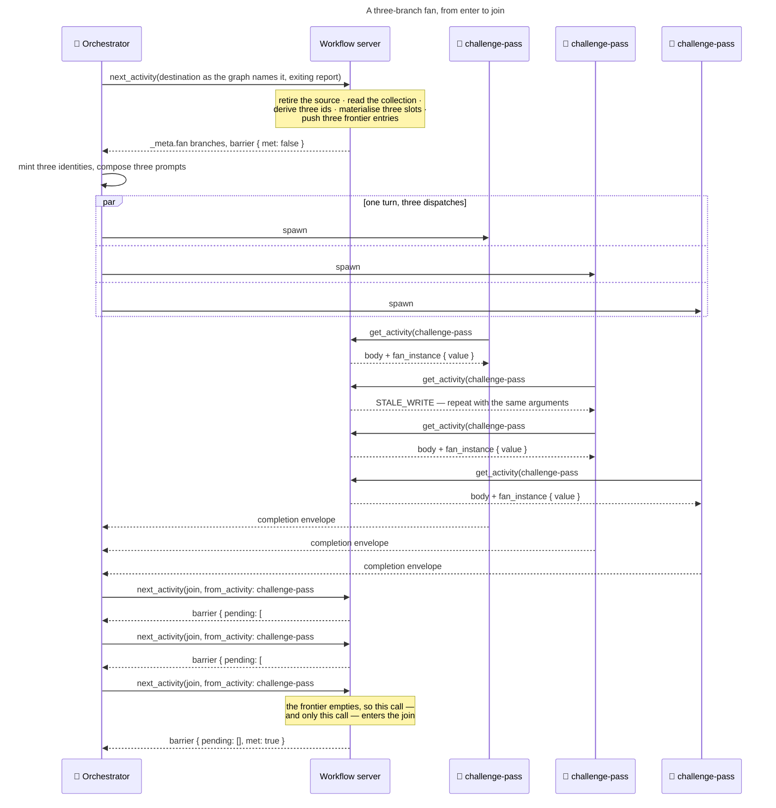

The refused delivery call is an ordinary outcome: two contexts wrote the session close together, one repeated itself, and the fan's acceptance does not turn on its absence.

## What this buys

### Enforcement strength

Enforcement has strengths, and it is worth naming them so a proposal can say which one each guarantee sits at.

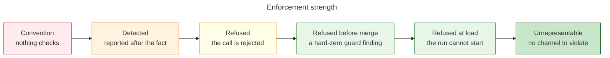

A fan's contribution is at the right-hand levels, and the two that matter most are at the far right: two concurrent writers colliding, and a destination being entered before its last branch returns, both stop being expressible rather than being caught better.

The comparison below is against the shape an author reaches for today. Concurrency is expressible in exactly one place — fan-out over work units inside a single activity, through the corpus's `scatter-gather` vocabulary — and This vocabulary is unreachable from every one of its call sites, because every binding site is an activity and an activity's steps run in a worker that holds no agent-dispatch tool. Fifteen bindings across seven definition files, none of them executable. So "today" for most rows means a rule an author honours by hand at a grain the graph cannot see.

#### Guarantees that get stronger

| Guarantee | Today | With a fan | How |
|---|---|---|---|
| Independent activities are declared independent | **Convention** — the graph types a destination as one activity, so independence is prose or an activity-internal fan-out that the workflow's own structure then contradicts | **Refused at load** | A destination is a list or a fan object. A fan whose branches name different destinations, a branch that fans again, a branch routing back onto itself and a fan converging on the terminal sentinel each fail the load, with the offending fan named as `<source>.<exit>` and the offending branch named beside it. |
| Two concurrent writers do not overwrite each other | Convention — `isolation-then-combine` in `scatter-gather` says per-unit outputs are never auto-bound into the parent bag by scalar name, and an agent honours it at work-unit grain | **Unrepresentable** | Each branch's whole reported map lands under a key derived from its activity id, server-side, inside the transition call, from the graph the handler has already loaded. A caller never supplies the key, so the namespace is the only route a branch's values have into the bag. |
| Combination happens in the combine phase | Convention | **Unrepresentable** | The bare name no longer lands, so an activity that needs the members combined must bind a step that reads them by name. There is no implicit route to a branch member. |
| A write built on a session the caller has not re-read | **Refused** — the store compares and swaps against the bytes the call read | Refused, unchanged — and a fan is the first construct that leans on it | Several branch contexts append history within one turn, and a fan's readings of its own progress are derived from those appends, so every one of them has to survive. A refused write is refused rather than silently overwritten. |
| A decision gate is not put to an operator who cannot answer | Convention — an activity fanning work out internally may hold a gate anywhere, and the general check for an instruction reaching a role that cannot act on it | **Refused at load**, plus **Refused** at the boundary | A session holds one outstanding decision at a time and every other tool call is gated while it is held, and all branches spawn in one turn that does not resume until each has returned, so a mid-branch gate is a question nobody can be asked. The load rejects a branch declaring a checkpoint step; the yield tool refuses a branch reaching for a decision no definition mentions. |
| Every declared read is satisfied however control arrived | Refused before merge — a hard-zero guard intersects each activity's predecessors | Refused before merge, preserved | Arrivals meet, not predecessors: a completed fan is one arrival contributing the union of its live branches' outgoing sets, an ordinary predecessor is its own arrival, and arrivals intersect because control still comes by exactly one. Left as a predecessor intersection the guard reports false findings on a correct fan; left unflattened it reports nothing at all, because no branch head is ever reachable. |
| One artifact has one producer | Detected in review | **Refused before merge** for a fan of several activities; **removed at source** for a fan over a collection | Two activities of one fan whose composed technique signatures resolve one literal filename are a hard-zero finding, because two activities running together resolve one filename to one file and one branch's writes would land in the other's document. For an instance fan the rule is that a branch declares no artifact and the meeting point writes the document, or every artifact name carries the fan's parameter as a token — a series the artifact writer already treats as one logical artifact per interpolated name, so the find-or-update never sees two instances as one file. |
| Fan-out is owned somewhere | Convention | **Refused at load** | Fan-out lives in the graph: the workflow declares the fan and the orchestrator executes it on the activity's behalf. The declaration is a graph destination, so the routing fact and the routing file are the same place. |

#### Guarantees that are newly possible

These do not exist at any strength today.

| New guarantee | Level | How |
|---|---|---|
| A destination naming several activities, or one activity over a collection, is expressible at all | **Refused at load** | The destination is a union of three forms, so a number, a list with a non-string member, a nested list, a partial fan object and a fan object with an unknown key each render the union's own message, and a one-element or empty list renders the array's arity message. |
| The destination is entered once, after the last branch returns | **Unrepresentable** | There is no barrier-met call and no join-enter call. One call retires the branch it names, removes it from the frontier, and enters the destination if and only if the frontier is then empty — so the only call that can enter the join is the one that empties it. A crashed and resumed orchestrator re-derives the same barrier from the session file with no extra state. |
| Entering a fan retires its source exactly once | **Unrepresentable** | One call enters every branch, so there is no second retirement to prevent. |
| At most one fan is open, so the frontier needs no fan identity | **Unrepresentable** | Every exit of every branch binds to one non-list, non-object destination, so no branch can open a fan of its own. |
| A call exits an activity the session is actually on | **Refused** | The frontier is the membership test, so a call naming an activity it does not hold is refused, and every entry in flight is named back to the caller. For an instance fan the caller names the activity and the instance together, because the activity alone is ambiguous across N branches. |
| A worker is served the activity it was dispatched for, never guessed at | **Refused** | Three refusals on the load call, the middle one naming every entry in flight. For an instance fan the response reports the instance-qualified id back, which is what makes the worker's own comparison of the id its stub bound against the id it was served effective. |
| A fan's collection is fit to fan over | **Refused** | Five refusals at the moment of entering, before a single dispatch is spent, because that is the one point at which the graph and the bag are both in hand. Neither truncating the collection nor running it in successive waves is offered as an alternative to refusing. |
| No instance writes into another instance's slot | **Unrepresentable** | The slot is the container at the resolved entry's index, and the wrap is server-side from the graph the handler already loaded. |
| A slot no instance filled is legible as absent, and the container's order is the collection's order | **Unrepresentable** | The container's shape carries both properties, and both are verified by execution rather than asserted: an unfilled slot reads as absent to each dotted-path evaluator, and array order survives the canonicaliser at every depth. |
| A second entry of the same fan does not append into the previous entry's slots | **Unrepresentable** | The materialisation assigns the container whole. |
| A fan entered on a path where its collection was never written | **Refused before merge** | The fan's collection is read by the *graph*, so the guard contributes the head of that expression as a synthetic read attributed to the branch, never the source — the claim being that the collection is available on entry to the branch. A fan over a collection nothing in the workflow writes is reported the same way. |
| A fanned activity declares the parameter its instances are handed | **Refused at load** | The load reads the fanned activity's declared inputs and refuses a parameter it does not name. Two fans of one activity disagreeing about the name each fail here, so no cross-fan comparison exists. |
| A fan's collection is a name the workflow declares | **Refused at load** | The collection is read out of the variable bag, so it is a name some activity in the graph writes. Checked at the head of the expression, so a dotted collection is checked correctly. |
| A fanned activity binds no operation a branch cannot execute | **Refused at load** | Two cases, one rule. The commit operations fail because a fan's branches share one working tree and one git index, and a commit derives its paths from that tree's status, so no branch can stage or attribute its own change. The child-workflow dispatch fails because creating a child records one activity id where a fan holds several in flight. Both are decidable from the flattened steps and each step's bound operation name, with no composed signatures. |
| An authored index into a container is below that fan's ceiling | **Refused at load**, one-sided | An index above the ceiling addresses a slot the fan can never fill, which the load can see. One-sided, because the collection's run-time length is not visible to it. |
| Every member a gather names is one its branch produces, and every member a branch produces is gathered | **Refused before merge** | The existing finding families gain member grain, so a misspelled member and an ungathered member are each reported by name. The second arm carries forward the exemption for a value an activity writes and reads back within its own steps, without which it fires dozens of times on one correct fan. |
| Nothing reads a branch output by its bare name, and a read that omits the index is reported | **Refused before merge** | The write side is re-keyed to the container plus its members, so a bare member is written by nothing. With a uniform index, a container-and-member read with no index addresses nothing and the flat walker would never find it. |
| The fan's parameter is read only by the activity the fan runs | **Refused before merge** | The parameter is ambient to its branch and unwritten everywhere else, so a stray reader is reported natively with a fan-specific detail string. Declaring it on the workflow file would make it workflow-owned, which is both skipped by the unwritten-read check and seeded into the availability lattice, so a read anywhere in the workflow would be silently satisfied. |
| A gate reachable only through a fan is still audited for a review-mode auto-advance | **Refused before merge** | The one guard that reads the graph's shape for itself is made fan-aware, so the subtree beyond a fan stays inside its reachability set. |
| Every member of a branch's reported map matches its declared type and value set | **Detected** | Today's warning, word for word. The per-name loop runs against the retiring branch activity's own declared writes, read at the moment of the wrap, so a member whose value sits outside its declared set keeps its warning. Only the commit changes. |

#### What stays outside reach

- **Whether a branch's work is genuinely independent of its siblings'.** Namespaced writes make the bag safe; the working tree is not namespaced. A fan's branches share one tree and one git index, and the load rule keeping a fanned activity out of the commit operations does not make its steps read-only on the source. That is a contract an author honours, and no guard can see it.
- **Which context a branch runs under.** Each branch runs under its own identity, distinct from its siblings' and from the session's own agent identity. Nothing refuses a shared one: the batch bound exempts a scope equal to the session's agent and a scope with no activity yet. A shared identity puts the whole fan outside the bound and delivers a reference marker to a context that never received the bytes — visible after the fact in the batch reading, and stated as a rule on the dispatch operation.
- **That a fan's usage is complete.** Every branch carries exactly one usage entry, one instance one figure, and a branch with no entry surfaces as an activity that reported nothing.
- **How wide a fan runs, as something an operator chooses.** A checkpoint's variable effect writes a scalar literal, validated against the target's declared value set, so no gate can produce a collection. The only user-facing control over a fan is whether it opens — a `when` predicate on the exit that leads to it — never how many branches it opens. A width comes from the collection an upstream activity wrote, and the bound on it is the author's declared ceiling or the configured default.
- **That the progress marks publish before the spawn, and resolve once at convergence.** One commit naming every branch before the first spawn, one persist at convergence naming every branch. Both are protocol, no more structural than for a single dispatch today, and both are forced by the working tree being indistinguishable by author.
- **That the orchestrator's slot arithmetic is right.** For a fan of several activities a membership test admits every branch, so a worker whose prompt names a sibling's activity is served that sibling's body, and the worker's own verification of its dispatched activity is the only protection. For a fan over a collection the load call is refused only if the named entry is not on the frontier, so an index that is wrong-but-present is served: the cost is duplicated work and one silently uncovered unit. Neither case is refused; both are visible after the fact.
- **Two shared writers and one append-ordered log.** The deferred-item and follow-up registers declare literal unprefixed filenames written as whole-file read-modify-writes, so two instances write one path and one instance's rows vanish without trace. The provenance log loses rows the same way, and even serialised its row order becomes the order instances happened to finish in, which its own guide states as a property a reader compares rows against. These stay criteria for which activity you fan, deliberately not mechanised: prose warning "do not also bind X" is what the canon tells you to design out, and the removal here is upstream.
- **Whether slot *k* was filled.** The lattice proves a read is satisfied on every arrival at container grain; the width is a run-time length. The load bounds an authored index against the declared ceiling, which cannot report falsely, but an index within the ceiling and beyond the collection's actual length is unreachable by any static check. The positive answer is that a meeting point does not author indices at all — it hands the container whole to the ordered gather with the fan's own collection as the expected ids.
- **A templated artifact that collides through something other than the fan's parameter.** The artifact check sees a technique that declares an artifact; a technique that writes a file without declaring one is invisible to it.
- **Whether a fan is the right construct here.** Naming parallelism in the graph makes a bad decomposition dispatchable. The arithmetic below is what an author weighs, and no check weighs it for them.

### What it makes cheap

#### Expressing independence costs a line of graph

Three activities that read none of each other's output become one destination that is a list; one activity over a collection becomes one destination that is an object naming the activity, the collection, the name each instance reads its element at, and optionally a tighter ceiling. Nothing else is authored. There is no join node, because the join is the destination the branches already name. There is no join keyword, because a keyword would be a second home for that same fact, able to disagree with the bindings. There is no barrier bookkeeping, because the barrier is a predicate over what the session holds in flight. And there is no per-branch metadata: a branch's key comes from its id, its destination from its own bindings, its identity from the dispatch, and an instance fan's width from the collection's length when the fan is entered.

#### A routing fact gains a home

The graph is the one authoritative home for where a run goes next, and "these activities are independent" is a routing fact the schema could not carry. An author who wanted it had to express it as prose or as an activity-internal fan-out — and That leaves the corpus with a complete fan-out vocabulary, fifteen bindings across seven definition files, and not one of them executable, because the depth rule puts the dispatch primitive only where the orchestrator is. That rule already ends by instructing an author to hoist a pass to the orchestrator when its fan-out is worth an orchestrator-owned step, and offers no construct for doing so. This is that construct. The workflow declares the fan, the orchestrator executes it.

**Everything downstream is a derivation rather than a declaration.**

| Fact | Derived from | So nothing has to |
|---|---|---|
| The join | Every branch's own exit bindings, read off the graph | Declare it, or keep two homes in agreement |
| A branch's output key | The activity id, in snake case with an outputs suffix | Tell a worker its key, or let two fans spell one activity's key differently |
| A fan's width | The collection's length when the fan is entered | Carry a width variable beside the collection |
| A branch's parameter | The element at its slot, projected onto the load response | Author an indexed read, which no grammar in the tree admits |
| The container's shape | One dense slot per instance, in collection order | Sort, merge or reassemble anything |

#### The gather already exists, and finally has a caller

The meeting point binds `orchestration-patterns::gather-results` with the container as its results and the fan's own collection as its expected ids — the collection, not a copy of it, so no derived bag name carries the expectation list. The operation's declared input shape is already an array of id-and-result pairs in input order with missing ids appearing without a result, which is exactly what the container is. Two renames and one dotted projection: all three sanctioned deviation forms, no new construct and no new operation. The work-unit decomposition operation gains a caller unchanged at the fan's source, its id-and-brief records being a fan's collection by construction.

#### The artifact question is already solved in the corpus, twice

Because the per-instance parameter is authored rather than derived from the activity id, the two live token-templated artifacts — one keyed on an agent designator, one on a scanner designator, both guide-mapped and green today — migrate with their templates and their guide rows untouched. A derived name would have edited each template, each input block and each guide row: three file edits per adopter, on the exact files whose greenness is the evidence.

#### Adoption is cheaper than it looks

An instance-fan adopter is a carved activity, so it satisfies the gate ban by construction and no gate has to be removed — none of the non-destructive-update burden and no decision-inventory diff transfers. At the first adopter, the continuous-integration pipeline scan, the migration *deletes* a variable: the scanner count it reads today is a second home for the width, and the width becomes the collection's length.

#### And the surfaces stay where they are

No new tool, no new envelope field, no new drive-loop gate, no new tool parameter for the instance, no new session field beyond the frontier that replaces the single current activity, no new source module, and no new guard registry entry — the new checks land inside the existing variables entry, two of them under family names that already exist.

### The cost, stated honestly

**Every branch past the first pays a whole further delivery of its activity.** A fan establishes one harness context per branch where a batched walk establishes one, and each context takes full delivery because delivery scoping keys on the calling context's identity, so nothing collapses to a reference marker.

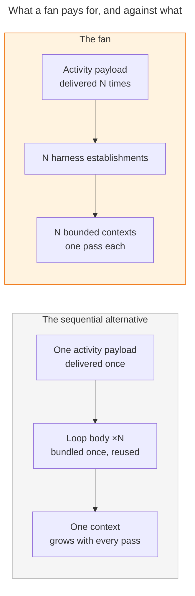

Amber marks what the fan spends. Grey is the run it is measured against.

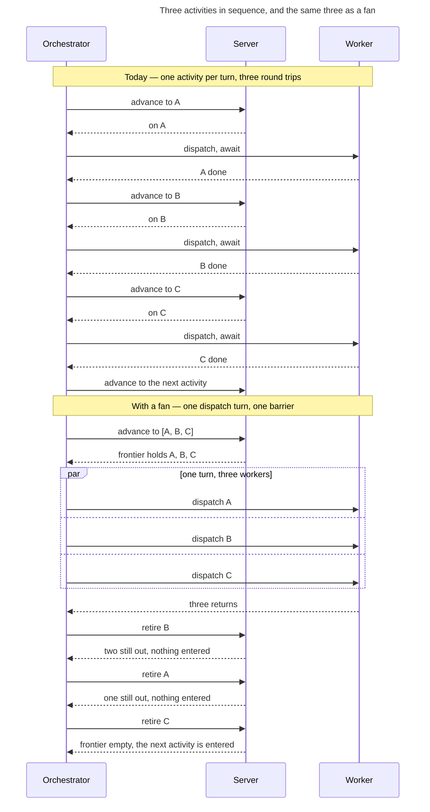

The fan replaces three sequential dispatch round trips with one turn, and the barrier costs no extra call: whichever retirement empties the frontier is the one that enters the destination. Order of return does not matter, which is why nothing has to be declared about it.

**A fan pays a whole further delivery for every branch past the first, so it costs more than the run it replaces.** For a fan of several activities the alternative is one worker walking them as a batch, which collapses what the second and later activities share. For an instance fan the alternative is cheaper still — one worker looping N times pays a single delivery, because a loop body's technique is bundled once and reused every pass — so an instance fan's premium is the activity's whole payload N−1 times over, plus N−1 fresh harness establishments. Per unit of work an instance fan is therefore the more expensive of the two forms by a wide margin.

**The width default follows that measurement, and the measurement is not this document's.** The ceiling is a server-configured number derived from the same benchmark that sets the batch cap, so it moves in one place when the benchmark is re-run rather than by editing every fan. A destination declares `maxInstances` only to be *tighter* than the default, with a stated reason; a ceiling of one is refused, because a destination whose ceiling is one is a plain edge spelled a second way. A fan's width is bounded nowhere else — the batch bound exempts a scope with no activity yet and refuses only an activity a scope already holds, so a branch scope's first delivery is always admitted whatever the width.

**So a fan is a wall-clock purchase, not an efficiency one, and this design says so plainly.** Several long reasoning passes run inside one response turn instead of several sequential dispatch round trips, and the wait is free because a turn does not resume until every tool result returns — nothing polls, nothing times out, nothing is scheduled.

**One thing it buys that a character count cannot see.** The batch budget counts characters delivered, never characters generated, so nothing bounds how much reasoning accumulates inside one worker. An in-context loop of N units piles all N passes into one context, and at the corpus's convergence loops that is up to ten passes times the unit count in a single worker. A fan converts unbounded growth in one context into N bounded contexts. That is isolate-then-combine buying correctness rather than latency, and it is the honest counterweight to the token number rather than a way around it. The meeting point is the other side of the same coin: it takes a fresh scope and re-pays whatever the branches collectively held, and a wide fan of document-shaped instances hands it every instance's payload to write one document, with no refusal to stop it.

---

## Key flows

### Loading a workflow whose graph carries a fan

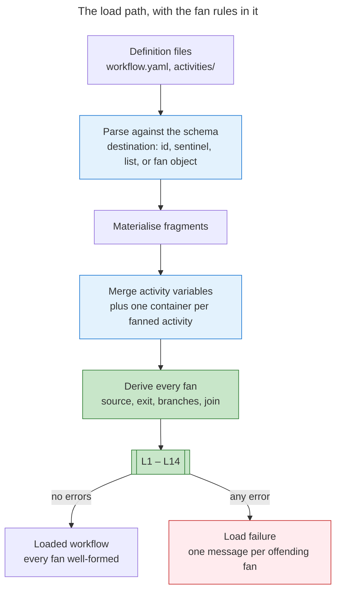

Green marks what is new. Everything else exists.

**The parse settles the shape and the load settles the meaning.** A destination that is a number, a nested list, a list with a non-string member, a partial fan object or a fan object carrying a fifth field never reaches the load: the union's error map answers all of them, and the strict object's unrecognised-key message is what tells an author the output key is derived rather than authored. A one-element or empty list gets the array member's own arity message instead, because that branch matched furthest. A ceiling of one gets the `maxInstances` field message for the same reason.

**One derivation reads the graph object and nothing else.** No activity lookup, no file access — so the loader keeps sole ownership of agreement between the graph and the activities, and the join has exactly one derivation. It yields, per fan, the source, the exit, the branches in graph order, and the destination every branch's exits name. That destination is undefined where the branches disagree, name more than one each, or name none, and an undefined join fails the load — which is why every reader downstream takes the join as a string on the load's authority.

**The load rules run in the same loop as the exit-binding completeness check, inside the same error list, and a non-empty list fails the load rather than warning.** A session cannot be walked through a graph with a hole in it. Each message names the fan as `<source>.<exit>` and names the offending branch, so the author's fix site is in the message — the convergence rule spelling out all three destinations it found, the checkpoint rule naming the checkpoint and where to move it, the operation rule naming the bound operation. Putting the fan rules there and only there is what lets every reader downstream assume a well-formed fan, and it is why the guard registry gains no entry: a malformed fan cannot be walked at all, and a guard would let a session start on a graph the guard rejects.

**Three rules a reader may expect are absent because another rule already rejects the case.** A branch that is the fan's own source is rejected by the no-nested-fan rule, since that activity's exit is the fan itself. A join that is one of its own branches is rejected by the no-self-routing rule, since that branch's exits would have to name itself. And a branch declaring a starting value for one of its writes needs no rule, because the declaration merge adds the container and keeps the members and their seeds intact. One shape that resembles these is covered by none of them and carries a rule of its own: a join that is the fan's own **source**, as against one of its own branches, satisfies the nesting, self-routing, convergence and join-is-an-activity rules together, and opens the fan again on every convergence.

### A fan of several activities, enter to join

```mermaid
---
title: A destination naming three activities, enter to join
---
sequenceDiagram
 participant O as 🤖 Orchestrator
 participant S as Workflow server
 participant B1 as Branch: research
 participant B2 as Branch: codebase-comprehension
 participant B3 as Branch: implementation-analysis

 O->>O: sync progress marks for all three, one commit
 O->>S: next_activity([research, codebase-comprehension, implementation-analysis])<br/>with plan-prepare's exit, manifest, writes and artifacts
 Note over S: plan-prepare retires once;<br/>three entries go on the frontier
 S-->>O: barrier { destination: assumptions-review, pending: 3, met: false }
 O->>O: mint three identities, compose three prompts
 par three agent calls in one turn
 O->>B1: spawn
 and
 O->>B2: spawn
 and
 O->>B3: spawn
 end
 B1->>S: get_activity(activity_id: research)
 B2->>S: get_activity(activity_id: codebase-comprehension)
 B3->>S: get_activity(activity_id: implementation-analysis)
 B1-->>O: envelope
 B2-->>O: envelope
 B3-->>O: envelope
 O->>S: next_activity(assumptions-review, from_activity: research)
 S-->>O: pending [codebase-comprehension, implementation-analysis], met: false
 O->>S: next_activity(assumptions-review, from_activity: codebase-comprehension)
 S-->>O: pending [implementation-analysis], met: false
 O->>S: next_activity(assumptions-review, from_activity: implementation-analysis)
 Note over S: the frontier empties, so this call<br/>and only this call enters the join
 S-->>O: pending [], met: true
```

The barrier is a reading on every response, never a call of its own.

**One call enters the fan and one call per branch leaves it.** The handler resolves the retiring activity, retires it — exit event, completed set, session exit, variable writes under its branch key, one step-completed event per manifest entry, the activity outcome, all attributed to the retiring branch — removes it from the frontier, and enters the target if and only if the frontier is then empty. On an ordinary walk the frontier holds one entry, so the last step always fires and behaviour is identical to today. Omitting `from_activity` while three are in flight is refused: `Cannot advance: 3 activities are in flight (research, codebase-comprehension, implementation-analysis). Pass from_activity naming the branch this call is returning; the destination is entered once, when the last one does.`

**Nothing merges at the join.** Each branch's whole reported map lands as one object under its own key — `research_outputs`, `codebase_comprehension_outputs`, `implementation_analysis_outputs` — and the join binds an ordinary technique step that reads what it needs by dotted path and produces the combined value. Inside a branch, names stay bare: a branch's later steps read its earlier outputs as internal reads, never through the key.

**Execution is agent-led throughout.** The orchestrator emits several agent dispatches in one turn; the server validates, records and projects. There is no mechanical runner, and none is assumed — the barrier lives in the store precisely because orchestrator discipline is not enforcement. Persistence is one commit naming every branch before the first branch's transition, because the branches write one working tree in one turn and a per-branch commit would attribute one branch's in-flight edits to another.

### A fan of one activity over a collection, enter to join

```mermaid
---
title: One activity, three work units, enter to join
---
sequenceDiagram
 participant O as 🤖 Orchestrator
 participant S as Workflow server
 participant I0 as Instance challenge-pass#0
 participant I1 as Instance challenge-pass#1
 participant I2 as Instance challenge-pass#2

 O->>S: next_activity({ activity, over, variable, maxInstances })<br/>with reconcile-assumptions' report
 Note over S: read challenge_perspectives from the bag;<br/>check length, type, ids, ceiling
 S->>S: materialise challenge_pass_outputs<br/>3 dense slots, ids, no results
 S-->>O: fan { activity, variable, over,<br/>branches: [#0, #1, #2] } and the barrier
 par three agent calls in one turn
 O->>I0: spawn
 and
 O->>I1: spawn
 and
 O->>I2: spawn
 end
 I0->>S: get_activity(challenge-pass#0)
 S-->>I0: activity body + fan_instance { variable, instance: 0, value }
 I1->>S: get_activity(challenge-pass#1)
 S-->>I1: activity body + fan_instance { variable, instance: 1, value }
 I2->>S: get_activity(challenge-pass#2)
 S-->>I2: activity body + fan_instance { variable, instance: 2, value }
 I0-->>O: envelope
 I1-->>O: envelope
 I2-->>O: envelope
 O->>S: next_activity(combine-challenges, from_activity: challenge-pass#0)
 S-->>O: slot 0 written; pending [#1, #2]
 O->>S: next_activity(combine-challenges, from_activity: challenge-pass#1)
 S-->>O: slot 1 written; pending [#2]
 O->>S: next_activity(combine-challenges, from_activity: challenge-pass#2)
 Note over S: frontier empties; combine-challenges is entered
 S-->>O: slot 2 written; met: true
```

The graph names the collection, never its members, and the server expands the width at the moment of entering.

**The frontier entry is still one string, and it carries the instance.** `challenge-pass#1` — a base id, the instance separator, and a discriminator, which is the spelling the corpus already uses for a checkpoint inside a loop body reached many times. Nothing else goes on an entry: a meeting point on it would copy a graph fact the handler already loads, and all instances of one activity share that activity's exit bindings by construction; a timestamp would copy an event already in the history; and a worker identity would forfeit the free replacement described below. Because the entries are distinct strings, the resolution rule needs no amendment — a call naming the bare activity matches nothing, and a call naming an instance matches exactly one entry.

**The index designates the slot; the projection carries the parameter.** The unit's own id names the container slot, the gather's manifest row and any artifact filename, but as a datum inside the slot rather than the designator of it: the index is unique whatever the collection holds, its order is the collection's order with nothing sorting it, and an authored index can be compared against the declared ceiling at load. The parameter reaches the instance as a server-computed block on the load response, beside the artifact prefix and the routing block that already travel there for the same reason — derived server-side, unreachable from the activity body, needed by one context only. The value is the element *whole*, so a structured element arrives as one value and the body projects fields off it by ordinary dotted read, exactly as a loop body does with its current item. No count is reported: a worker reasoning about the width is reasoning about something that is not its business.

**The bag an instance re-reads does not hold its parameter.** The inspection tool serves one un-projected shape to both roles, so an instance re-reading the bag finds the collection rather than its element. That is the truth about where the value lives, and the projection names itself on the response it arrives with, so the asymmetry is visible rather than silent.

**The meeting point gathers rather than addressing slots.** It hands the container whole to the ordered gather with the fan's own collection as the expected ids, and completeness is structurally constant there: the destination is entered only on the call that empties the frontier, so no expected id can be missing. The manifest's one live reading is an instance that returned with no writes, which lands an empty result and is marked empty.

### One branch of several failing to return

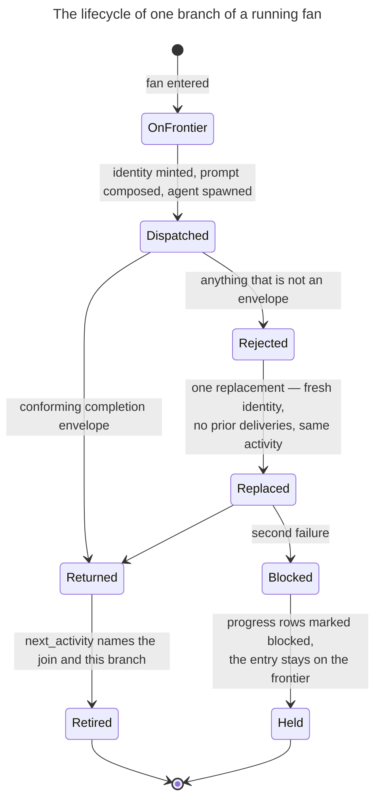

A failure costs one branch, and only that branch.

**A failure is replaced alone.** The branch's result is rejected, a new identity is minted, a prompt is composed with no prior deliveries, and one agent is spawned — one, so not the concurrent spawn. The replacement names the same activity or the same slot, which the frontier still holds, so it needs no re-binding call. That is what the frontier entry buys by naming a position rather than a worker: were an identity on the entry, a replacement would need a distinct call outcome to re-bind itself.

**The siblings that returned are untouched.** Their work is committed and their outputs landed on their own returns, so nothing is rolled back and nothing is re-run. Liveness is tested per branch against the returned batch rather than against one awaited agent, because every branch has returned something by the time a concurrent turn resumes; where the harness keeps a returned agent addressable, a branch still owing an envelope is continued under its own identity.

**A second failure advances nothing.** The blocked moment is synced onto that branch's rows and the frontier keeps the live entry, so a later resume re-derives the same barrier from the session file. The join is not entered on two branches of three: that would hand the gather a value no branch produced, and the gather either has every key it names or it does not run. Describing what a missing branch means *is* a merge policy, and there is none.

**If the abandoned worker returns after its replacement, whichever envelope arrives first retires the branch and the second is refused as holding no open branch.** That is the wanted behaviour; only the trace says which was discarded.

**A branch that cannot proceed without a decision has no conforming way to say so.** The completion contract defines two envelopes and the partial-result rule accepts only those two, so the best available report is a completion on a blocked or abort exit the activity declares; failing that the branch returns a non-envelope, takes its one replacement, and the fan surfaces blocked. For a fan over a collection that report is shared by every instance, since they run one definition: either every instance can report blocked or none can.

### A refused write mid-dispatch, and the repeat

```mermaid
---
title: A refused write, and the caller repeating itself
---
sequenceDiagram
 participant I0 as Instance challenge-pass#0
 participant I1 as Instance challenge-pass#1
 participant S as Session store

 I0->>S: get_activity(challenge-pass#0)
 I1->>S: get_activity(challenge-pass#1)
 Note over S: both calls read the same bytes
 S->>S: compare-and-swap on the bytes #0 read — match
 S-->>I0: activity body; the delivery is recorded
 S->>S: compare-and-swap on the bytes #1 read — mismatch
 S-->>I1: STALE_WRITE — repeat this call with the same arguments
 Note over I1: no automatic retry; the caller repeats, deliberately
 I1->>S: get_activity(challenge-pass#1)
 S->>S: compare-and-swap on freshly read bytes — match
 S-->>I1: activity body; the delivery is recorded
```

A refusal here is an ordinary outcome of concurrency, not a fault. Two branch workers take their activity close together, the second one's call is built on bytes the first has already superseded, and it is told to repeat itself. Nothing retries on its behalf and nothing is half-applied, because the refused call wrote nothing.

**A fan's acceptance therefore does not require that no refusal appears.** A run in which two branches each repeated a load call once is a correct run, and a criterion demanding a silent log would be a criterion against concurrency itself. What the acceptance requires is that every branch was served, every branch's outputs landed in its own slot, and the barrier released once.

**The retirements are the calmer half.** The dispatch operation retires the branches in input order, one call at a time, so the transition calls do not contend; where one is refused it is repeated identically, and because the refused call wrote nothing there is no half-applied retirement to reconcile. Every history append survives, which is what the batch bound, the delivered-character tally and the fresh-versus-resume reading are all derived from.

### A second entry of the same fan

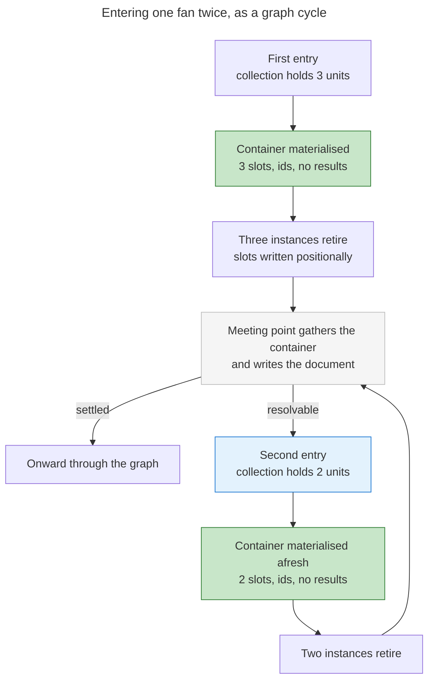

Entering a fan materialises its container afresh, so round two never lands in round one's slots.

**A branch key belongs to the activity, not to the fan.** Two fans containing one activity write the same key, and the second visit replaces the object whole — variable writes assign, they never merge, which is the only behaviour consistent with there being no merge policy. Stated positively: a branch key holds one slot per instance the fan entered, in the collection's order; a slot no instance filled holds no result; and a join that needs an earlier visit's values gathers them into a name of its own at that visit.

**The cycle is legal, and it is how a convergence loop lives in the graph.** The self-routing rule forbids a *branch* routing an exit back onto itself, because a branch runs once and returns to the join and a retry belongs inside it as a loop step. It says nothing about a meeting point routing back to a fan's source, and the corpus already carries such cycles. What a graph cycle does not carry is a declared iteration ceiling, so the replacement is ordinary state: a round counter the meeting point writes and an exit predicate over it, both of which the gate dialect already expresses.

**Two consequences worth stating.** A per-instance artifact whose name carries the fan's parameter is a series, each interpolated name its own logical artifact, created rather than matched against siblings — so a second entry re-resolves the same template and creates rather than updates. Where that is wrong, the branch declares no artifact and the meeting point writes the document. And the dry-walk budget the coverage job runs against is a property of the graph: a fan seeded from a run-time collection multiplies the branch orderings the enumerator produces, so the budget is re-measured in the adoption commit, or a short streak is reported as unreached options when the cause is the budget.

## What is enforced, and where

Execution is agent-led. The orchestrator emits several agent dispatches in one turn and the server validates, records and projects; there is no mechanical runner, so the table below is where a guarantee actually lives rather than where a runner would put it. Fan-out is owned by the graph: a graph destination declares a fan the orchestrator executes on its behalf.

**Every invariant is placed at one of six mechanisms**, and the load rules reject a malformed fan before a session can be walked through it. The guard registry gains no entry and no new family name: every new check lands inside an existing entry.

Six words describe every row. **Schema** is carried by the zod type in `src/schema/workflow.schema.ts` and surfaces as a parse error. **Load** is a failure from `validateExitBindings` in `src/loaders/workflow-loader.ts`, which runs after fragment materialisation and the variable merge and fails the load on a non-empty return. **Store** is a refusal from the session record's compare-and-swap. **Tool** is a server refusal at the boundary. **Derived** means unrepresentable, so nothing needs checking. **Guard** is a hard-zero finding inside the existing `activity-variables` registry entry. Rows marked **not structural** are contracts an actor honours, listed so no reader mistakes them for enforcement.

### The parse

| # | Invariant | What it reports |
|---|---|---|
| S1 | A destination is an activity id, `__terminal__`, a list of at least two activity ids, or an object naming one activity with the collection it runs over | The union error map: `a destination is an activity id, __terminal__, a list of at least two activity ids, or an object naming activity, the over collection it runs once per element of, the variable each instance reads its element at, and optionally maxInstances`. It is what surfaces for a number, a non-string list member, a nested list, and an object missing one of the three required fields — a partial object matches no branch far enough to surface a field error |
| S2 | A list names at least two activities | The array member's own message: `a fan names at least two activities; an exit that leads to one activity names that activity, and an exit that runs one activity over a collection names the activity with that collection`. Also for an empty list; the error map does not suppress it |
| S3 | A declared instance ceiling admits at least two instances | The `maxInstances` field message: `a fan admits at least two instances; an exit that leads to one run of one activity names that activity`. That branch matched furthest, so the field's message wins over the map |
| S4 | A fan's parameter is a legal variable name | The qualified-name message, so a bare-word parameter fails the parse and no load rule is needed for it |
| S5 | A fan carries no field outside the four | Strict-object rejection — `Unrecognized key(s) in object: 'unit'` — and `additionalProperties: false` in the generated JSON, which is what tells an author the output key is derived rather than authored |

`maxInstances` is optional, and a destination declares one only to sit tighter than the configured default. The field's description carries the cost in words and no number: each instance beyond the first costs a whole extra delivery of the fanned activity, and there is no measured figure for a fanned activity's payload to quote.

### The load rules

Every message names the fan by `<source>.<exit>` and names the offending activity, so the author's fix site is in the message.

| # | Rule | Message |
|---|---|---|
| L1 | Every branch is an activity this workflow contains | `Workflow graph sends 'plan-prepare.done' to 'reserch', which this workflow does not contain.` |
| L2 | A list names no activity twice, counting the activity each instance-fan member runs | `Workflow graph fans 'plan-prepare.done' to 'web-research' twice. Each activity in a list appears once, whether as an id of its own or as the activity an instance-fan member runs; to run one activity once per work unit, name it with the collection it runs over in a single member.` Two members over one activity would derive one branch key and write one container, so this is what keeps the keys distinct |
| L3 | No branch is the terminal sentinel | `Workflow graph fans 'plan-prepare.done' to '__terminal__'. Every branch of a fan returns to one destination, and an activity that ends the run never returns, so the fan would have no last branch to release its destination.` |
| L4 | Every branch binds at least one exit | `Activity 'research' is a branch of the fan at 'plan-prepare.done' and binds no exit, so the fan has no destination to converge on. Give it an exit bound to the activity its siblings name.` |
| L5 | No branch fans again | `Activity 'research' is a branch of the fan at 'plan-prepare.done', and its exit 'done' fans to 'deep-dive, survey'. A branch runs in one worker and returns to the join, so each of its exits names one destination.` Also rejects a branch that is the fan's own source |
| L6 | No branch routes an exit back onto itself | `Activity 'research' is a branch of the fan at 'plan-prepare.done' and its exit 'insufficient' returns to 'research'. A branch runs once and returns to the join, so a retry belongs inside the branch as a loop step.` Also rejects a join that is one of its own branches |
| L7 | Every exit of every branch names one and the same activity — **the join** | `The fan at 'plan-prepare.done' converges nowhere: 'research' and 'codebase-comprehension' send their exits to 'assumptions-review', and 'implementation-analysis' sends its to 'plan-prepare'. Bind every exit of every branch to the one activity the fan converges on, which is what the run enters when the last branch returns.` |
| L8 | The join is an activity, not the terminal sentinel | `The fan at 'plan-prepare.done' converges on '__terminal__'. A fan converges on an activity, because the destination is entered once after the last branch returns and there is nothing to enter at the end of the run.` |
| L9 | No branch declares a checkpoint step | `Activity 'research' is a branch of the fan at 'plan-prepare.done' and declares checkpoint 'research-convergence'. A session holds one outstanding decision at a time, and every tool call is gated while it is held, so a gate inside a fan stops its sibling branches. Move the gate to the activity before the fan or to the activity it converges on, or take this activity out of the fan.` An instance fan's message ends instead: `… Move the gate to the activity before the fan or to the activity it converges on. Every instance of a fanned activity runs the same definition, so there is no instance to take out of the fan.` |
| L10 | Every branch's derived key is a legal variable name, and unique in the workflow | `Activity '2nd-pass' is a branch of the fan at 'plan-prepare.done', and its branch key '2nd_pass_outputs' is not a legal variable name. A branch lands its outputs under a key derived from its activity id, so an activity that runs in a fan carries an id beginning with a lowercase letter.` |
| L11 | The fanned activity declares the fan's parameter among its reads | `Workflow graph fans 'reconcile-assumptions.converged' to 'challenge-pass' over 'challenge_perspectives', handing each instance its element at 'challenge_perspective', which 'challenge-pass' does not declare among the names it needs its workflow to supply.` Two fans of one activity disagreeing about the name fail here, so no separate cross-fan rule exists. Applied per instance-fan member, so each member of a list is checked against the activity it runs |
| L12 | The fan's collection is a name this workflow's merged variable set contains | `Workflow graph fans 'reconcile-assumptions.converged' to 'challenge-pass' over 'challenge_perspectives', which this workflow declares nowhere. A fan reads its collection out of the variable bag, so the collection is a variable some activity in this graph writes.` Checked at the head, so a dotted collection expression is checked correctly. Applied per instance-fan member |
| L13 | An authored index into a fan's container is below that fan's operative ceiling | `Activity 'combine-challenges' reads 'challenge_pass_outputs.7.result.perspective_findings'. The fan at 'reconcile-assumptions.converged' admits 4 instances, so slot 7 is never filled. Hand the container whole to a gather rather than addressing a slot the fan cannot reach.` The ceiling read is the member's own `maxInstances` where it declares one and the configured default otherwise, so members of one list may carry different ceilings. One-sided, so it cannot report falsely |
| L14 | A fanned activity binds no operation a branch cannot execute | `Activity 'challenge-pass' is fanned by 'reconcile-assumptions.converged' and binds 'workflow-engine::commit-and-persist'. A fan's instances share one working tree and one git index, and a commit derives its paths from that tree's status, so no instance can stage or attribute its own change. Move the commit to the activity before the fan or to the activity it converges on.` The same rule names the child-workflow dispatch, for its own reason: `Activity 'challenge-pass' is fanned by 'reconcile-assumptions.converged' and binds 'workflow-engine::handle-sub-workflow'. Creating a child session records one activity id and a fan holds several in flight, so the call is refused at run time — settled here rather than left for a worker to discover.` |
| L15 | The join is not the activity the fan comes from | `The fan at 'plan-prepare.done' converges on 'plan-prepare', the activity whose exit opens it. A fan reached from its own meeting point opens again on every convergence, so the graph gives it no way to finish. Converge on an activity the fan does not come from.` |
| L16 | The fan's parameter carries a name of its own | Two arms. Against the collection: `Workflow graph fans 'reconcile-assumptions.converged' to 'challenge-pass' over 'challenge_perspectives', handing each instance its element at that same name. The projection would stand where the collection stands, so an instance asking for the collection would be handed its own element.` Against the activity's writes: `… handing each instance its element at 'perspective_findings', which 'challenge-pass' also declares among its writes. The parameter is a read-only projection, so it is not a name the fanned activity writes.` |

The existing destination-existence check is the one edit to standing code: it iterates the destination's targets and keeps its message per target. Everything else joins `validateExitBindings` as a third loop after the per-activity loop that collects declared exits, inside the same error list. Putting the fan rules there and only there is what lets every reader downstream assume a well-formed fan.

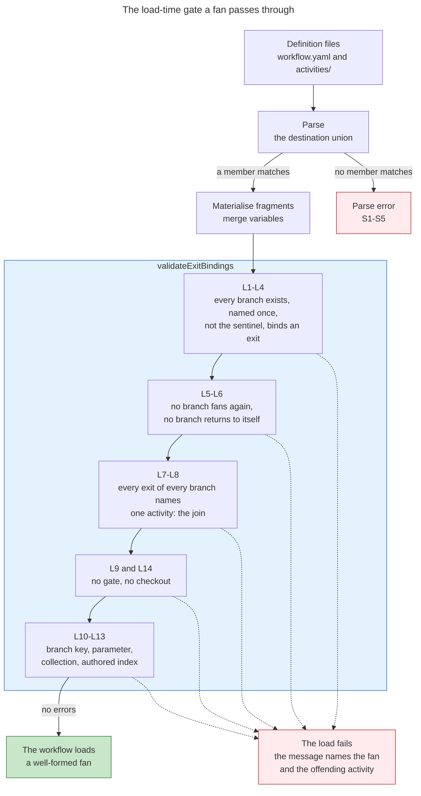

Red marks the two ways a definition does not arrive at a session. Nothing about a fan's shape is warned rather than refused, because a session cannot be walked through a graph with a hole in it.

### The run-time refusals

| # | Invariant | Where | What it reports |
|---|---|---|---|
| T1 | A fan opens no more branches than its ceiling admits, over a non-empty array whose elements carry distinct derivable ids | tool | The fan-enter refusals, below. The width is the flattened branch count, so one bound covers a list, an instance fan and a mixture of the two. The last closes three collisions at once — the artifact filename, the container slot and the gather's expectation list |
| T2 | A transition off an activity whose exit fans says which exit it took | tool | `Activity 'plan-prepare' binds exit 'done' to a fan, so 'exit' is required on this transition to say which destination it takes.` |
| T3 | A call exits an activity, or an instance, the session is actually on | tool | `Cannot exit 'challenge-pass': the session is on three instances of it. In flight: challenge-pass#0, challenge-pass#1, challenge-pass#2. Pass from_activity naming the instance this call is returning, activity and instance together.` and `Cannot exit 'challenge-pass#4': the session is not on it. In flight: challenge-pass#1, challenge-pass#2. An instance index comes from the branch list the fan-enter returned; report the mismatch rather than retrying with another index.` Closes the second-advance hazard `one-advance-per-activity` names, which is why the exiting activity is named rather than inferred from a single-entry frontier |
| T4 | A worker is served the activity it was dispatched for, never guessed at | tool | `get_activity: this session is on 'challenge-pass#1', not the 'challenge-pass#2' you were dispatched for. Report the mismatch to your orchestrator rather than retrying without activity_id.`; `get_activity: 3 activities are in flight (challenge-pass#0, challenge-pass#1, challenge-pass#2). Pass activity_id naming the one you were dispatched for, activity and instance together.`; `No activity in flight. Call next_activity first.` The same membership test serves `get_technique` |
| T5 | No undeclared gate is yielded from inside a fan | tool | `Cannot yield checkpoint 'research-convergence': 3 activities are in flight (research, codebase-comprehension, implementation-analysis), and a session holds one outstanding decision at a time — every tool call is gated while it is held, so a gate here stops your sibling branches. Finish this activity without the gate, or report the outcome one of its own exits provides.` Not redundant with L9: the tool admits a decision no definition mentions |
| T6 | A tool that writes one activity id into the record is unambiguous | tool | `Cannot dispatch a child workflow: 3 activities are in flight (research, codebase-comprehension, implementation-analysis).` From the same ambiguity helper as T5 |
| T7 | Every append several branch contexts make survives | store | The record's write is a compare-and-swap against the bytes the call read, in `src/utils/session/store.ts` and `resolver.ts`. On a mismatch nothing is written and the tool returns `STALE_WRITE`, whose message opens `CALL THIS TOOL AGAIN with the same arguments` and states that nothing was written, so the repeat is not a double-record |
| T8 | Every member of a branch's reported map matches its declared type and value set | tool, warn-only | Today's wording unchanged: `variables_changed 'context_scope': value "everything" is outside the declared value set […]; stored as written.` Validated against the retiring branch activity's own declared writes, read at the moment of the wrap, so the per-name loop in `src/utils/variable-seed.ts` runs unchanged and only the commit changes |
| T9 | A branch retirement names the meeting point the graph derives | tool | `Cannot exit 'research' to '__terminal__': the fan at 'plan-prepare.done' converges on 'assumptions-review', which is what the run enters when its last branch returns. A branch return names the activity the fan converges on.` Checked on every return rather than only the one that empties the frontier, because an unchecked name mid-fan is discarded in silence |

The fan-enter refusals, verbatim, each closing a silent failure at the one point where the graph and the bag are both in hand:

```
Cannot fan 'reconcile-assumptions.converged' to 'challenge-pass': this destination opens 24 branches and admits 4, the maxInstances it declares. Cap the collection where it is produced — `decompose-work-units` takes `effort_cap` — or raise this destination's maxInstances, knowing each instance costs a whole extra delivery of 'challenge-pass'.

Cannot fan 'reconcile-assumptions.converged' to 'challenge-pass': 'challenge_perspectives' is empty. A fan of no instances would empty the frontier at the moment of entering it, so 'combine-challenges' would be entered with an activity the graph says runs never having run. Route past the fan with a `when` predicate on the exit where there may be nothing to fan.

Cannot fan 'reconcile-assumptions.converged' to 'challenge-pass': 'challenge_perspectives' holds a string, not an array. A fan runs one worker per element, so its collection is an array of work units.

Cannot fan 'reconcile-assumptions.converged' to 'challenge-pass': element 2 of 'challenge_perspectives' is an object with no 'id'. An element's id names its slot in 'challenge_pass_outputs', its row in the gather's dispatch manifest, and its artifact filename, so each element is a slug string or an object carrying a string 'id'.

Cannot fan 'reconcile-assumptions.converged' to 'challenge-pass': elements 1 and 3 of 'challenge_perspectives' both have id 'rejected-paths'. One id per unit: it names one container slot, one manifest row and one artifact filename, so two units sharing one id would overwrite each other in all three.
```

Where the ceiling is the configured default rather than a declared one, the width refusal names the default and says so, and the remedy it offers is declaring a `maxInstances` on the destination or capping the collection upstream. Truncating to the ceiling is refused, because it silently drops declared work and would let the meeting point's gather report completeness over a set that was never the collection. Successive waves are refused, because a wave boundary empties the frontier mid-fan and destroys the property the barrier rests on.

**`STALE_WRITE` is absent from this table deliberately.** It is the store's own refusal, reached from inside a fan more often than from a sequential walk, and it reports no fan invariant — it reports that the record moved under a caller. It belongs to the store's contract rather than to this one.

### The guard checks

All of them land inside the existing `activity-variables` registry entry, at hard zero, across `src/utils/activity-variables.ts` and `scripts/check-activity-variables.ts`.

| # | Invariant | What it reports |
|---|---|---|
| G1 | Nothing reads a branch output by its bare name | `unwritten-read`: once the write side is re-keyed, the bare member is written by nothing |
| G2 | Every member a gather names is one its branch produces | `unwritten-read` at member grain: `reads 'research_outputs.open_assumtions', which 'research' does not produce; it lands assumptions_log, open_assumptions, research_document`. The read test drops a leading all-digits segment and then a literal result segment before comparing to the member set. A mistyped *key* is caught instead by `unused-declaration` on the join's own declared read |
| G3 | Every member a branch produces is gathered somewhere | `unread-write` at member grain: `writes 'research_outputs.challenge_findings', which nothing in this workflow gathers`, carrying forward the self-consumed exemption — without it the family fires on the order of thirty-five times on one correct fan, most of a branch's declared writes being intra-activity working values such as loop items and step gates |
| G4 | A read that omits the index is reported | `unwritten-read`, naming the instance form, because with a uniform index a bare container-and-member read addresses nothing and the flat walker would never find it |
| G5 | A read at the join is satisfied on every arrival | `unreachable-read`, over the arrival intersection in which a completed fan is one arrival contributing the union of its branches' outgoing sets. Left as a predecessor intersection it reports false findings on a correct fan; left unflattened it reports nothing at all |
| G6 | A fan entered on a path where its collection was never written is reported | `unreachable-read`, from the synthetic collection read attributed to the **branch** rather than the source: `'challenge-pass' is fanned over 'challenge_perspectives' on a path that reaches the fan before anything writes it` |
| G7 | A fan over a collection nothing writes is reported | `unwritten-read` at fan grain, from the same synthetic read |
| G8 | The fan's parameter is read only by the activity the fan runs | `unwritten-read` with a fan-specific detail string, from the per-activity ambient model. No new family name |
| G9 | No two branches of one fan write one artifact filename | `fan-artifact-collision`, distinct arm: `The fan at 'plan-prepare.done' has 'research' and 'implementation-analysis' both writing artifact 'assumptions-log.md'. Two activities running together resolve one filename to one file, so one branch's writes land in the other's document.` **Safety floor**, and literal filenames only |
| G10 | No instance of a fan writes an artifact another instance also writes | The same family's instance arm — every artifact name on the fanned activity's composed step signatures interpolates the fan's parameter: `Activity 'submodule-scan' is fanned by 'reconnaissance.classified' over 'scan_units' and writes artifact 'scan-findings.json'. Every instance resolves that one filename to one file, so either the name carries the unit — '{scan_unit}-scan-findings.json' — or the branch declares no artifact and the activity the fan converges on writes the document.` The message states both arms because both are legal and the author chooses. **Safety floor**, and this is the surface the one-artifact-two-producers case at graph grain |
| G11 | A gate reachable only through a fan is still audited for a review-mode auto-advance | `review-mode-gating`. `scripts/check-review-mode-gating.ts` declares the graph's shape itself and parses raw YAML, so the load rules cannot protect it: it imports the destination type and flattens every form. Unflattened, its activity lookup returns undefined and the whole subtree beyond a fan drops out of its reachability set |

The collision family is the one that guards against data loss rather than definition hygiene; the rest are hygiene. All of them live in the guard rather than the loader because they need composed technique signatures, which the loader does not compose and must not start composing on the per-call load path: shape rules decidable from the graph object go in the loader, rules needing composed signatures go in the guard.

### What is unrepresentable

| # | Invariant | Why nothing checks it |
|---|---|---|
| D1 | **The join is entered once, after the last branch returns** | The only call that can enter the join is the one that empties the frontier, so early entry has no channel. The barrier is a reading — `_meta.barrier = { destination: 'combine-challenges', pending: ['challenge-pass#2'], met: false }` — rather than a refusal |
| D2 | Entering a fan retires its source exactly once | One call enters every branch, so there is no second retirement to prevent |
| D3 | At most one fan is open, so the frontier needs no fan identity | L5, L6 and L7 together: a branch's exits all name one non-fan destination, so no branch can open a fan |
| D4 | A branch cannot take a second activity | The fan-dispatch operation writes neither a worker result nor a worker identity, so the drive loop's continue gate is structurally false. T3 is the backstop |
| D5 | **No branch writes a bare shared name** | Once L9 and T5 close the checkpoint channel, the transition call is a branch's only write path, and that path is wrapped from the graph the handler already loaded — never from a caller-supplied key |
| D6 | **No instance writes into another instance's slot** | The slot is the container at the resolved frontier entry's index, and the wrap is server-side |
| D7 | A slot no instance filled is legible as absent | The pre-fill lands the unit's id with no result, and both dotted-path evaluators answer absent for an empty slot, for a member of one, and for an out-of-range index |
| D8 | The container's order is the collection's order | A dense array, pre-filled in collection order, positionally written. A sparsely written array canonicalises to invalid JSON, and an object with numeric keys sorts lexicographically below the top level; a dense array preserves index order through the seal |
| D9 | A second entry of the same fan does not append into the previous entry's slots | Entering a fan materialises the container afresh, assigning it whole |
| D10 | **A fan's width is not bounded by the batch bound** | The batch state exempts a scope with no activity yet and refuses only an activity the scope already holds. A branch scope is fresh and asks for its first activity, so it is admitted whatever the width, and on the retire call the batch reading reports one activity. The operative ceiling is the whole bound |

### What an actor honours

| # | Invariant | Home | What stands against it |
|---|---|---|---|
| N1 | Each branch runs under its own identity, distinct from its siblings' and from the session's own agent | `one-identity-per-branch` on the fan-dispatch operation | The bound exempts a scope equal to the session's agent and a scope with no activity yet, so nothing refuses a shared identity. Load-bearing twice over for an instance fan, whose siblings share an activity id, so only the identity tells the delivery ledger and the batch bound apart. Visible after the fact in the batch reading |
| N2 | Every branch carries exactly one usage figure | `account-every-activity`, cited by the fan operation | A branch with no figure appears in the activities-without-usage list, which is the wanted reading — an activity whose harness reported nothing, never one that cost zero. Both sides of that diff carry the instance-qualified id, so one figure cannot satisfy N instances |
| N3 | The in-progress mark for every branch reaches the remote before the spawn | The fan operation's protocol: one commit naming every branch | Nothing, and no less than for a single dispatch today |
| N4 | One persist at convergence, naming every branch | `persist-the-fan-before-any-branch-returns` | The commit operation derives its paths from the working tree, which cannot tell two branches' changes apart |
| N5 | A worker executes the activity it was dispatched for | `verify-dispatched-activity`, a worker rule | For a list fan, nothing: a membership test admits every branch, so a prompt naming a sibling's activity is served that sibling's body. For an instance fan the rule is **effective**, because the frontier holds distinct strings and the response reports the instance-qualified id back, so the worker's own comparison of the id its stub bound against the id it was served catches a mis-composed prompt |
| N6 | A branch writes no shared unprefixed register and no append-ordered log | Fannability criteria | Deliberately not mechanised. Both surfaces lose data silently under concurrency, and neither is a rule to police — it is a criterion for which activity gets fanned |
| N7 | A meeting point gathers the container rather than naming a slot | `a-join-gathers-the-container-not-an-index` in `scatter-gather` | L13's one-sided half, and it cannot be more: the ceiling is authored and the width is a run-time length |
| N8 | A refused call is repeated with the same arguments | The fan-dispatch operation's own rule | The `STALE_WRITE` message itself, which instructs the repeat and states that nothing was written. A fan's acceptance does not require that no refusal appears |

**The fan rules have exactly one home.** No entry joins the guard registry in `scripts/guards.ts`. A malformed fan cannot be walked at all, which is why its shape rules fail the load rather than warn; a guard there would let a session start on a graph the guard rejects. The workflow-YAML guard already fails the corpus on any load error, and six other guards load workflows and inherit that result.

### What a fannable activity is

Nine conditions, and an activity meets all nine or it is not the activity to fan.

1. **Gate-free** — no decision checkpoint anywhere in its flattened steps, fragment references included. A session holds one outstanding decision at a time and every other tool call is gated while it is held, and all branches spawn in one turn, so a gate is a deadlock rather than a delay. L9 refuses it.
2. **Not self-routing** — no exit of it binds back to it. A branch runs once and returns to the join; a retry is a loop step inside the branch. L6 refuses it.
3. **At least one exit, and every exit binding to one destination.** The join is read off these bindings and nothing else declares it. For an instance fan the cross-branch half is free — every instance is the same activity, so its exit bindings trivially agree, which is the single largest simplification instances buy over the list form, where convergence is *the* binding constraint. What survives is that an activity with no exits at all cannot be a branch. L4 and L7 refuse the failures.
4. **Artifact-safe** — declares no artifact, or every artifact name is templated on the fan's parameter and carries a guide-map row. Two contexts resolving one literal filename resolve one file, and the writer's find-or-update on a bare name makes that data loss rather than hygiene. G9 and G10 are the detectors.
5. **Touches no checkout** — a load rule, L14. One working tree, one git index, a staging collision that fails hard with nothing retrying it, and commit paths derived from tree status that cannot attribute a change to a branch.
6. **Writes no shared unprefixed register and no append-ordered log.** A register is a literal unprefixed filename written as a whole-file read-modify-write, so one branch's rows vanish; the provenance log's contract is append-only in completion order, which concurrency loses rows from and reorders even when serialised. A criterion, applied once at design time.
7. **No bare downstream reader** — every declared write of it is read only through its branch key, by the activity the fan converges on. Namespacing removes a fanned activity from every bare write set, so a surviving bare read is reported natively as an unwritten read.
8. **Its per-instance parameter is one value.** The element arrives whole in one projected name, and a structured element is projected by ordinary dotted read exactly as a loop body treats its current item. Two independent per-instance values would need a second projected name and a second declaration.
9. **Its collection is written on every path reaching the fan's source** — proved statically by the synthetic collection read attributed to the branch, so a fan entered before its collection exists is reported at the guard rather than at a live session.

### What no check reaches

Four contracts an author honours. Each is stated with what stands against it, so no reader mistakes any of them for enforcement.

#### An index authored into a meeting point is only half-checkable

L13 compares an authored index against the fan's operative ceiling, which cannot report falsely and which catches the authored typo. It cannot catch the commoner case — an index within the ceiling but beyond the collection's actual length — because the width is a run-time value the load cannot see and the guard's lattice is a set of names carrying no length. What stands against it is the positive rule rather than a detection: a meeting point reads the container whole and hands it to the ordered-collection gather with the fan's own collection as the expectation list, so the container's order carries the correspondence and the gather's manifest names each unit by its id. That remedy is real, and this remains the sharpest half-enforced thing in the design.

#### Two shared writers lose data with no trace and no check

The deferred-item and follow-up registers are literal unprefixed filenames written as whole-file read-modify-writes, so two branches write one path and one branch's rows vanish. The provenance log loses rows the same way, and even serialised its row order becomes the order the branches happened to finish in, which its own guide states as a property a reader compares rows against. Nothing refuses either, and nothing is added to: the removal is upstream, in the fannability criteria, because a guard here would police a judgement an author makes once at design time.

#### The artifact check is template-only, in both directions

It sees a technique that declares an artifact, so a technique that writes a file without declaring one is invisible to it. And it cannot see two *elements* of one collection interpolating to the same filename — the fan-enter duplicate-id refusal closes that at run time, which is the answer, but a template that interpolates something other than the fan's parameter and still collides is outside both checks. A templated instance artifact is also never updated in place: each interpolated name is its own logical artifact, so a second visit to the same fan re-resolves the same template and creates rather than updates. Where that is wrong, the branch declares no artifact and the meeting point writes the document.

**A fan trusts the orchestrator's index arithmetic for slot assignment.** The load call is refused only when the named entry is not in the frontier, so an index that is wrong but present is served: an orchestrator that composes a prompt for one slot and dispatches it against another gets duplicated work, one silently uncovered unit, and a gather manifest reporting neither. Two things stand against it, both after the fact rather than at the boundary. The instance-qualified id comes back on the response, so the worker's own comparison against the id its stub bound catches a mis-composed prompt. And the delivery scopes are distinct, so the redelivery event fires exactly when two contexts claim one slot. One observed wrong index is the trigger for the upgrade, and its shape is a slot claimed on the first load call and released when its claimant returns a non-conforming result — not an identity arriving in advance.

## How a fan meets the rest of the system

Twelve surfaces sit between a fan and the system around it, each with the position it takes.

### The guard suite

**A fan is a routing fact, so the guards it reaches are the ones that read routing and the ones that read variable flow.** The shape rules live in the loader and fail the load, which is what lets every guard downstream assume a well-formed fan; what the guards add is the part no load can decide — whether the values a fan produces have readers, whether the values it consumes have writers, and whether two members of one fan resolve one filename. The registry gains no entry: a malformed fan cannot be walked at all, so its rules belong where the load fails rather than where a guard warns, and a guard would otherwise let a session start on a graph the guard rejects.

| Guard | What it reads | What a fan changes |
|---|---|---|
| `activity-variables` | Loads workflows; merged declarations, derived contracts, the availability lattice | The write side re-keys to the container and its members; reads are tested at member grain; a fan's collection acquires a synthetic reader; the per-instance parameter becomes ambient to its own branch; the availability meet intersects arrivals rather than predecessors; the artifact-collision family arrives |
| `review-mode-gating` | Raw YAML, declaring the graph's shape itself | Imports the destination type and flattens every destination form. Unflattened, its activity lookup on a list or an object is undefined and every activity beyond a fan drops out of its reachability set — a silent under-report of exactly the class it exists for, and for a fan sitting between the initial activity and the rest of the graph that is most of the workflow |
| `workflow-yaml` | Loads every workflow | First to re-run when the destination widens, and it fails the corpus on any load error, so every fan load rule reaches the corpus through it |
| `refs`, `audience`, `artifact-guides`, `stealth-isolation` | Load workflows | Inherit the load result, so a malformed fan arrives as a load failure rather than as a finding |
| `binding-fidelity` | Declared inputs against producers | Mechanises a declared input with no reader and a read with no producer, which is precisely what re-keying a branch's writes moves, so it joins the acceptance set |
| `variable-model` | Authored defaults, gates and variable effects | The branch container carries no starting value, so an existence gate on it is not constant; it joins the acceptance set with the anchor guard |

One script wants settling in the same pass. A check for the session contract exists on disk with **no registry entry and no package script**, which is the fourth instance of the class the registry's own header says it fixed for three other scripts. It is either registered with a proves line or deleted, in its own commit, so the registry enumerates what runs. A related shape is proposed separately: a check for an instruction reaching a role that cannot act on it. The fan's own families are deliberately shaped so no new registry entry is needed for either.

**The write side is re-keyed, and that is what makes no-bare-writes enforceable statically.** For an activity the graph fans, the declared-write set becomes the single container plus one entry per member spelled as the container and the member — and **not** the bare member names, and **not** with an index, because the width is a run-time value a static check cannot enumerate. Any activity still declaring a bare read of a fanned activity's output is then reported, because nothing writes that name. The re-keying reaches two more places or it fails open: the contract derivation takes the branch key and records every bare production as a member of it, and the landing site takes the key in place of the bare name for artifact writes and persisted productions too — otherwise the artifact-write exemption stops applying and every artifact-valued branch output becomes an unread write. The container's presence in the merged set does not bless a bare read, because the read test resolves against members. Exactly one read is exempt: the synthetic read the load contributes for a fan's own collection. A fan consumes its collection whole, which is the access a container exists for, so a destination whose `over` names an earlier fan's container is legal and reports nothing. The exemption is keyed on that one synthetic read, so an authored bare read of a container is still reported, and chaining a fan onto a fan needs no intervening gather to launder the name.

**One grammar, one home, on the read side.** The read collectors return the full dotted reference rather than pre-splitting it, and the read function does the split: the head serves the namespace test, and the whole reference is recorded in a `pathReads` set on the derived contract. Without it the tail is discarded before any check runs and member grain is invisible. A dotted read whose head is a branch key is then tested by dropping a leading all-digits segment and a literal result segment and comparing the remainder against the member set — two segments, because a slot carries its unit's id beside the result.

**Member-grain reporting lands under the family names that already exist**, so no new ledger and no new registry claim. Verbatim:

```
reads 'research_outputs.open_assumtions', which 'research' does not produce; it lands assumptions_log, open_assumptions, research_document

writes 'research_outputs.challenge_findings', which nothing in this workflow gathers
```

A read that omits the index is reported the same way, naming the instance form, because with a uniform index a bare container-and-member read addresses nothing and the flat walker would never find it. A read of a fan's per-instance parameter by an activity the fan does not run is reported with a fan-specific detail string.

**The unread-write check at member grain carries the self-consumed exemption forward, and it is not optional.** An activity that writes a working value and reads it back within its own steps is not reported. Without that exemption the family fires on the order of **35 times on one correct fan**, because most of a branch's declared writes are intra-activity working values — loop items, step gates, values one step hands the next — and a hard-zero guard that reports 35 findings on a correct definition is a guard authors stop reading.

**The collision family is the one new family name, and the one new check on the safety floor.** The artifact writer is keyed on a bare filename with a find-or-update and a re-scan mint guard, so two concurrent writers both re-scan, both create, and the run thereafter resolves the lowest-numbered instance for the rest of the walk. That is data loss, not hygiene, which is what separates it from every other family here. It has two arms. For a fan of distinct activities, two members whose composed technique signatures resolve one filename:

```
The fan at 'plan-prepare.done' has 'research' and 'implementation-analysis' both writing artifact 'assumptions-log.md'. Two activities running together resolve one filename to one file, so one branch's writes land in the other's document.
```

For an instance fan, every artifact name on every composed signature of the fanned activity must carry a token whose head is that fan's parameter:

```
Activity 'submodule-scan' is fanned by 'reconnaissance.classified' over 'scan_units' and writes
artifact 'scan-findings.json'. Every instance resolves that one filename to one file, so either the
name carries the unit — '{scan_unit}-scan-findings.json' — or the branch declares no artifact and
the activity the fan converges on writes the document.
```

The message states both arms because both are legal and the author chooses. Both live in the guard rather than the loader, and that placement is the home split the whole design keeps: **shape rules decidable from the graph object go in the loader; rules needing composed technique signatures go in the guard**, because the loader does not compose signatures and must not start doing so on the per-call load path. The distinct arm is decidable for literal filenames only and fails closed on a template; the instance arm decides the instance case rather than failing open on it. Two producers announcing one artifact is the wider concern owned by; a fan's arm of it is the concurrent case. What the arm cannot see is stated rather than implied: a technique that writes a file without declaring an artifact is invisible to it, and two *elements* whose templates interpolate to one filename are closed at run time by the duplicate-id refusal instead.

**A fan's collection acquires a reader that is not an activity, and it is attributed to the branch.** The collection is read by the graph, so the guard contributes the head of the collection expression as a synthetic read attributed to the **branch** activity, never the fan's source. Placement decides whether the check is true: the lattice computes an activity's outgoing set as its incoming set plus its own writes, and the finding tests a read against the *incoming* set, so attributing the read to a source that writes the collection itself — the flagship shape, where a decomposition step emits its units and that activity's exit then fans — reports falsely on a correct fan. Attributed to the branch, the claim is exactly the wanted one: **the collection must be available on entry to the branch.** A fan entered on a path where its collection was never written is then reported statically rather than only by a run-time refusal on a live session, and a fan over a collection nothing writes is reported too.

That synthetic read needs **three injections, not two**. The reachability map and the unwritten-read loop both iterate an activity's declared reads, so the name enters that set; but the unused-declaration check then tests every declared read against the reads the activity's own steps, gates, loops and transitions mention, and none of them mentions the collection, because the graph reads it. So the name enters the derived-reads set as well, or synthetic graph-contributed reads are exempted from unused-declaration explicitly. Otherwise every fanned activity carries a spurious finding in a hard-zero guard.

**The per-instance parameter is ambient to its branch, threaded per activity.** The set of ambient names the guard skips is global and is seeded flat into the availability lattice, so a per-activity ambience needs a per-activity map threaded through three consumers — the unwritten-read skip, the undeclared-crossing skip and the availability seed — plus one parameter on the reachability function. That function already takes the fan groups, so the map lands in the same edit at no extra file cost.

### The variable declaration

**The merge adds the container; it does not replace the members.** `mergeActivityVariables` in `src/utils/activity-variables.ts` — the module the server and the guards share so the two cannot drift — takes the set of activity ids the graph fans in this workflow, and for each contributes one further declaration, `{ name: branchKey(id), type, description }`, **in addition to** that activity's own write declarations.

Adding rather than substituting is what keeps three things working:

| What survives | Why substituting breaks it |
|---|---|
| Declared types and value sets on the members | The wrap validates each reported value against the branch activity's own declared writes, so a substituted set would remove the only check on the one agent-supplied record the server does not type, for precisely the activities a fan runs |
| Starting values on the members | Substituting drops eight seeds from one research activity alone, and one of them seeds a gate in that activity's own steps — a silent runtime behaviour change made for the guard's benefit |
| The merge's own contradiction check | It reports two activities declaring one name with disagreeing type or starting value, and it keeps running over the members |

**The container is declared as what it holds, and what it holds is an array in both fan forms.** The shape is a dense array either way — one slot per branch, in collection order — and the uniform index is what keeps a read form independent of the fan's shape, so an activity borrowed into two workflows reads its inputs the same way in each. A declaration of an object for one form would contradict that, and would warn on every enter of a list fan, since the declared-type enum holds array and object as distinct values and the write path derives an array for an array. In both forms the declaration carries no starting value. Three mechanisms make the type load-bearing rather than cosmetic: the contradiction check compares declared type first, so the container's type is what a second declaring site is measured against; the variable-write function warns against anything written at a name whose declared type disagrees; and the rendered variable set is what an author reads before writing a read into the container, so a wrong type would make that rendering lie. The absent starting value matters for its own reason — the variable-model rule about gating a defaulted variable on existence would otherwise make every existence gate on the container constant.

**Contribution stays per workflow, which is required rather than incidental.** The same activity keeps contributing its writes flat in a workflow whose graph does not fan it, so an activity is borrowable into a fanning graph and a non-fanning one without carrying either shape in its own file.

Two consequences are stated rather than smoothed over. A fanned activity's outputs appear in the workflow's rendered variable set under both their own names and the container's, which is honest about the declarations and slightly redundant; the graph in the same payload shows the fan, and `variable-binding` states the derivation. And a fan's per-instance parameter is **not** declared in the workflow file's own variable list, because that list is the set the guard treats as workflow-owned — skipped by the unwritten-read check and seeded into the availability lattice — so declaring it there would silently satisfy a read of the parameter anywhere in the workflow. It lives in two homes only: the destination that supplies it, and the reads of the activity the fan runs.

### The reachability analysis

`unreachableReads` in `src/utils/activity-variables.ts` is a forward reachability search that decides scope followed by a backward definite-assignment fixed point that decides availability. Both halves take the change, differently.

#### The traversal

`activityGraph` gains a one-line flatten through `destinationTargets`, written so that its de-duplication happens **after** flattening. Without the flatten the map holds a list or an object where branch heads belong: the membership test that enqueues a successor is false for every branch, so no branch head is reachable and every read in every branch stops being checked; and the predecessor index never records a branch's predecessor, so the fixed point short-circuits and the branch's available set stays at the universe of every declared name. The check is not wrong for a branch, it is **disabled** for it, inside a hard-zero guard with no ledger to diff. The graph type itself does not change, and the two other traversals over it — the cycle grouping and the self-loop test — are untouched.

#### The meet

Intersection over predecessors is the right model for the convergences the corpus already has: nine edges converge on one report activity and six on one plan activity by *alternative* routes, exactly one of which carried control. A fan's meeting point is the other thing. Every branch ran, so its entry state is the **union** of what the branches leave. Left as an intersection, a name only one branch writes drops out at the join and a correct declared read becomes a false finding an author would "fix" by moving declarations.

So arrivals meet, not predecessors. An **arrival** is one way control can reach a node: a completed fan is one arrival contributing the union of its live branches' outgoing sets, and an ordinary predecessor is its own arrival. Control still comes by exactly one arrival, so arrivals intersect.

That generalises to a node two separate fans converge on, and the consequence is worth stating: two completed fans are two arrivals, so the node may declare only the reads **both** unions satisfy. A read of one fan's container is satisfied on that fan's arrival and not on the other's, so it is reported. A meeting point shared by two fans therefore gathers what both produce, or declares nothing of either — which is the same discipline any node with two predecessors already lives under, reached by a different route.

```mermaid
---
title: The meet at a fan's join
---
flowchart TD
 Source[plan-prepare]

 subgraph Fan [One arrival - the completed fan]
 B1[research]
 B2[codebase-comprehension]
 B3[implementation-analysis]
 end

 Alt[review-outcome]
 Join[assumptions-review]

 Source --> B1
 Source --> B2
 Source --> B3
 B1 --> Join
 B2 --> Join
 B3 --> Join
 Alt --> Join

 style Fan fill:#c8e6c9,stroke:#2e7d32
 style Join fill:#e3f2fd,stroke:#1976d2
 style Alt fill:#f5f5f5,stroke:#bdbdbd
```

The three branches contribute one arrival carrying the union of what they write; the alternative route is its own arrival; the two arrivals intersect.

`unreachableReads` takes the fan groups as one new argument, supplied by the guard script from the loader's single `fanGroups` derivation, so the grouping keeps one home and the graph type stays a flat reachability map. **Three ways to apply this and have it do nothing**, all three of which must be got right:

- **A branch is removed from the plain predecessor index for its join** — every duplicate entry of it, since the predecessor index pushes a source once per entry of its target list. Otherwise the branches appear both as one union arrival and as several intersecting ones, and the intersection wipes the union straight back out. De-duplicating inside the graph builder is trap-free by construction and is the placement to use.
- **The candidate seed moves** from the first predecessor's outgoing set to the first arrival's, or a union arrival's extra names are never candidates.
- **A branch head's own predecessor is ordinary.** The fan source's post-state is where each branch starts; nothing special.

Termination is unaffected. The analysis descends from the universe to a fixed point over the powerset lattice ordered by superset, each outgoing set is non-increasing across iterations, and both a union and an intersection of non-increasing sets are non-increasing. The change is the meet operator, not the lattice — and the lattice does not need to change **because** branch writes are namespaced: a branch contributes exactly one flat bag name whatever object landed under it, so a downstream dotted read resolves to it through the head-taking helper. Bare shared names would have needed a per-name provenance lattice instead of a set of names, which is a rewrite rather than a meet-operator change.

**For an instance fan the meet is trivial, for three reasons that hold by construction.** The graph builder collapses a fan of N instances of one activity to one node, so the forward search, the predecessor index, the cycle pass and the re-entry family see exactly the graph one visit would produce — an instance fan creates no cycle. The union arrival is idempotent over instances, since the union of N copies of one activity's outgoing set is that set, so the intersection's behaviour is indistinguishable from a plain sequential edge and does not depend on the width at all. And the set of names a fan makes available is width-independent, the index living inside the value, so the lattice does not grow and **an unbounded run-time width cannot break the walk, because the walk never sees a count.** The one trap specific to a repeated destination beyond the de-duplication above is that an arrival is built over distinct branch ids: the union is idempotent so a naive iteration is harmless for correctness, but per-branch bookkeeping keyed on the activity writes N times over one slot and a diagnostic naming an arrival's contributors names one activity N times.

#### What the analysis cannot see is answered rather than checked

The lattice proves a read is satisfied on every arrival at **container** grain. Whether slot *k* was filled is a run-time question: the load compares an authored index against the fan's declared ceiling, which is one-sided and so cannot report falsely, and nothing proves the collection was that long. The positive answer is that a meeting point does not author indices at all, which is the gather rule below.

### The gather at the join

**A join that combines several distinct branches spells its reads, because the number of them is authored.** It reads `{research_outputs.open_assumptions}` and its siblings as ordinary dotted projections and binds a step that produces the combined value. There is no implicit way to read a branch member, because the bare name no longer lands — so "a join that needs a combined value declares a step that gathers it" is structural rather than a rule an author remembers, and the branch keys the join declares among its reads are what put them in the guard's namespace.

**A join that combines instances cannot spell its reads, so it hands the container whole to an operation that walks it.** The width is a run-time collection length, and there is no indirection in the placeholder grammar, the bag-name grammar, the structured condition or the gate dialect. That operation exists and declares the contract exactly: `orchestration-patterns::gather-results`, which has **never had an executing caller**, because every one of its callers sits in an activity a dispatched worker executes, and such a worker holds no agent-dispatch tool. That unreachability runs across the corpus's whole fan-out vocabulary; this is the layer at which the gather half of it becomes live.

```yaml
# steps of the activity the fan converges on
 - kind: technique
 id: gather-perspective-findings
 technique:
 name: orchestration-patterns::gather-results
 inputs:
 dispatched_results: challenge_pass_outputs
 expected_ids: challenge_perspectives
 - kind: technique
 id: combine-challenges
 technique:
 name: analyse-challenge::combine
 inputs:
 challenge_findings: "{gathered_results.items}"
 concern_document: assumptions_log
 outputs:
 concern_document: assumptions_log
 concerns_agent_resolvable: has_resolvable_assumptions
 residual_opens_remain: has_open_assumptions
 residual_opens: open_assumptions
```

Two renames and one dotted projection — the three sanctioned deviation forms, no new construct and no new operation. Four things follow from that binding.

- **The expectation list binds the fan's own collection, unchanged.** Its declaration already reads that each entry is either a string id or an object carrying an id field, and that objects contribute their id, which is what a fan's collection is by construction. So no derived bag name carries the expectation list to the join: the graph names the collection, the join reads the collection, one home. A fan adds no derived bag name beyond the branch key.
- **The results input binds the container with the operation's declared shape already satisfied**, which is why a slot carries its unit's id beside the result. The operation indexes by id; an unfilled slot has an id and no result, so its expected id surfaces as missing with no result — precisely what the operation documents. One sentence on that input admits a fan's branch container beside a dispatch step's output, and nothing else in the operation moves. Binding a second, near-identical gather would be a duplicate shared capability: there is one gather contract, and the graph fan is a third scatter mode over it beside the two the scatter-gather technique already names.
- **Order is preserved by construction**, the slot being the collection's own position, so nothing sorts and the combine step is deterministic.
- **The dispatch manifest has one live reading and the completeness verdict has none.** An instance that returned with no writes lands an empty result and is marked empty, which is real and particularly worth having for a replaced instance. Completeness, by contrast, is structurally constant at the join: the destination is entered only on the call that empties the frontier, so no expected id can be missing there. The gather either has every key it names or it does not run, which is what isolate-then-combine buys, and the design says so rather than advertising a detection it cannot make.

That is also where the rule lives that answers what the static analysis cannot see, in the scatter-gather technique: **`a-join-gathers-the-container-not-an-index`** — a join reads a fan's container whole and hands it to `orchestration-patterns::gather-results` with the fan's own collection as `expected_ids`; the container's order carries the correspondence the join needs, and the manifest names each unit by its id.

Two more operations change hands at the same boundary. The work-unit decomposition operation gains a caller, unchanged, at the fan's **source**: its units are id-and-brief records with a stable slug id, which is exactly a fan's collection, and its effort cap is the authored upstream half of the width bound. The worker-brief composition operation is **displaced** at this layer rather than served, because it builds a per-unit prompt carrying the unit's brief, and under a graph fan the work travels as state rather than as prose in a stub; it survives for fan-out inside one worker.

### Artifacts

**A fan branch declares no artifact, and the activity the fan converges on writes the document.** Per-instance results land in the branch container, and the join writes once. Nothing breaks because no branch is a writer: the guide map, the audience declaration, the find-or-update discipline, the citation convention and every filename-reading guard see exactly one writer at one filename, which is what they see today, and the collision check becomes **vacuous** rather than failing open. It is the corpus's own isolate-then-combine discipline reaching one more surface — per-instance outputs are never auto-bound into the parent bag by scalar name, and a per-instance *file* is a per-instance output by another route.

The corpus's strongest shape match already satisfies the rule. The adversarial-challenge operation declares no artifact at all: it declares an ordered collection of per-perspective findings, isolated until combine, which is a value and not a file. Its combine operation declares four outputs and no artifact either. The file write is a separate step whose own operation declares the assumptions log, and that step sits in the source or in the join.

**The sanctioned deviation puts the unit in the filename.** Where a branch genuinely must persist a document of its own, its artifact name carries the fan's parameter as a token — the parameter itself where the elements are id strings, a dotted projection onto the element's id where they are objects — and the filename gains one row in the producing workflow's guide map, spelled with the token verbatim. Guide resolution takes the declared string, template included, matching by exact string after splitting the filename column on commas and stripping backticks. The mechanism is sanctioned in all three places that would otherwise reject it: the artifact-name pattern admits a token placeholder wherever literal text would stand, and its rejection message says so; the anti-pattern catalogue's filename entry explicitly does not flag a token template whose placeholder resolves at run time, calling a placeholder standing where literal text would part of the name rather than prose; and the artifact writer declares the semantics that make it safe — **token-templated names are an intentional series, each interpolated name its own logical artifact, created and not matched against siblings**.

That last clause is what the find-or-update discipline does for a fan, in both directions. Keyed on a bare filename, find-or-update plus a re-scan mint guard means two concurrent writers both re-scan, both create, and the run thereafter resolves the lowest-numbered instance for the rest of the walk. Under the series carve-out the writer never sees two instances as one artifact, so the mint-attempt guard is not asked to arbitrate a race it cannot win — the guard narrows a stale-listing window, and it does not serialise two concurrent writers. The deviation removes the data-loss case at its source rather than detecting it after the fact.

```mermaid
---
title: Where a fan's outputs become a document
---
flowchart LR
 subgraph Instances [Instances of one fanned activity]
 I0(["🤖 instance 0"])
 I1(["🤖 instance 1"])
 I2(["🤖 instance 2"])
 end

 Container[scan_unit_outputs<br/>one slot per unit]
 Join[The activity the fan converges on]
 Doc[One artifact, one writer]
 Series["Token-templated series<br/>{scan_unit}-scan-findings.json"]

 I0 --> Container
 I1 --> Container
 I2 --> Container
 Container --> Join
 Join --> Doc
 I0 -.->|sanctioned deviation| Series
 I1 -.-> Series
 I2 -.-> Series

 style Instances fill:#f5f5f5,stroke:#bdbdbd
 style Container fill:#c8e6c9,stroke:#2e7d32
 style Doc fill:#e3f2fd,stroke:#1976d2
 style Series fill:#fff3e0,stroke:#ef6c00
```

The solid path is the rule; the dotted path is the deviation, and amber marks the arm an author takes deliberately.

**Two live precedents ship green today.** A substrate node security audit declares a per-agent JSON artifact whose name is a token on the agent designator, with an agent audience, guide-mapped in its own resources README; a continuous-integration pipeline audit declares the same shape on a scanner designator, guide-mapped in its own README. Both pass the audience guard and the artifact-guide guard as they stand, and the work-package workflow carries four more token-templated guide rows. Because a fan's per-instance parameter is authored rather than derived from the activity id, both templates and both guide rows migrate untouched.

Two alternatives are refused rather than merely not chosen. **A per-instance subfolder** is not expressible: the artifact-name pattern admits no path separator and its message says an artifact name is a single filename of one path segment, and the conduct rule forbids composing or reconstructing the planning-folder path. Beyond the rules, three surfaces break — the link audit enumerates the folder's markdown files, a progress row's link targets the minted bare filename and a seeded link cannot predict a subfolder segment, and the publish-before-linking discipline then publishes links into a shape the seed did not anticipate. **A single file the instances append to under a lock** is refused twice over: there is no lock primitive anywhere in the corpus, the nearest thing being optimistic retry before every push, so a lock means inventing one at the very layer that rejects a lock; and it contradicts the writer's whole-file find-or-update, since a write is a full rewrite from a value the branch holds, so two branches serialised by a lock still lose the first's content unless each re-reads inside the critical section, which no operation does.

Each arm carries one named failure mode. The rule's is that **the join becomes the context bottleneck**: it takes a fresh delivery scope, re-pays whatever the branches collectively held, and a wide fan of document-shaped instances hands it every instance's payload to write one document — the failure being a silently truncated or elided document, because nothing refuses it. The author's declared ceiling is what stands against that. The deviation's is that **a templated instance artifact is never updated in place**: each interpolated name is its own logical artifact, so a second visit to the same fan re-resolves the same template and creates rather than updates. Where that is wrong, the branch declares no artifact and the join writes.

### The planning folder and its progress table

**Row ownership is keyed by an activity's two-digit prefix, and item labels are authored in the workflow's readme seed.** A fan changes nothing about that: the fanned activity keeps its single row, instance artifacts get none, and the artifact the join writes is what the row links. Three reasons make that the answer rather than a shortfall — a runtime-sized instance set cannot be seeded into a map authored ahead of the run; a row absent from the map is unselectable, so an unseeded instance row would be inert anyway; and the precedent is already stated, an agent-audience artifact getting no row while the activity producing it still owns one.

**Two instances share one activity prefix, so row selection resolves to the same rows, and that decides the two moments a fan touches the surface.** Two in-progress marks on one row are idempotent; two completion marks are not, because the completion step repoints an item's link at the delivered artifact and N instances landing N files would fight over one link slot. The progress call-site table in `planning-readme` therefore carries the fan's two moments, and states that the not-applicable marker is one value per persist, so no two branches may set it.

| Moment | What happens | Why once |
|---|---|---|
| Before the spawn | The in-progress mark is applied for each branch's rows, then **one** commit names the planning README alone with a message stating which activities are entering progress | Every branch spawns in the same turn, so one commit publishes every mark inside the window the dispatch-mark rule closes |
| At convergence | **One** persist, naming every branch, before the first branch's transition | The commit operation derives its paths from the working tree, which cannot tell two branches' changes apart, so a per-branch commit attributes one branch's in-flight edits to another |

One row and one link slot per fanned activity is what makes those two moments satisfiable rather than merely stated.

### Usage, trace and observability

**One usage entry per instance, and the rule names an instance rather than an activity.** A figure's operative unit is what a dispatch covered, and each branch — including each instance of one fanned activity — is a separate dispatch with its own harness establishment. One figure for a base id would make the number unattributable and under-report by N−1 establishments. The usage tool takes no new parameter, because its activity parameter is already described as the activity a figure is attributed to whether or not the session is still on it, and it is stored verbatim with no validation.

**The composite id rides the events, and six existing per-activity projections become instance-correct with no code change**, because every history event's activity field is a plain string.

| Projection | What the composite buys |
|---|---|
| Wall-clock spans | Keyed per instance rather than collapsed into the fan's span |
| The activities-with-no-usage diff | Composites on both sides, so a missing instance figure is reported; keyed on a base id, one figure would satisfy N instances and N−1 gaps would be invisible |
| The batch activity count | One activity per instance scope, either way |
| The technique-fetch validator | It scopes a visit to the last entry event for the named activity and already filters on the agent identity, so the activity half agrees with the agent half and one instance's fetches cannot credit another's manifest |
| The redelivery detector | It fires exactly on a genuine replacement or a duplicated claim; keyed on a base id, a *correct* fan of N fires it N−1 times and buries the one event that matters |
| History milestones | They carry the instance |

**Trace segments are per session, not per delivery scope**, and a fan of N produces one plus N segments that partition an interleaved multi-branch event stream at arbitrary points. The trace payload stamps the **retiring branch**, instance-qualified, rather than the target — without that, every branch segment would carry the join's id. Stamping fixes the mislabelling; the interleaving is not separable from the segment boundaries, and the design says so rather than claiming otherwise. The fan operation accumulates one opaque signed token per transition call that returned one and resolves the trace at close-out.

**`inspect_session` and the status tool render the frontier and nothing more.** Both serve one shape to both roles and neither takes an activity or an instance, so the in-flight rendering appears on the status view, the identity projection, the activity projection and session inspection, and every fan-related response carries the barrier reading — `_meta.barrier = { destination, pending, met }`, with `met: true` and an empty pending list on the call that enters the join. One asymmetry is deliberate and stated rather than hidden: the bag those tools serve is the un-projected one, because the orchestrator's state for prompt substitutions cannot be per-instance, so an instance re-reading the bag finds the *collection* rather than its own element. That is the truth about where the value lives, and the per-instance projection names itself on the response it arrives with, so the asymmetry is visible. A worker reasoning from the bag rather than from its own header is reasoning about the wrong thing.

### Delivery and batching

#### Every branch is a fresh delivery scope and takes full delivery

Scoping keys on the calling context's identity, which each branch carries, so a branch is served correctly however its activity is resolved, and nothing about the fan changes that path. The consequence is the honest one: **nothing collapses.** A batched walk reuses one context and so collapses what the second and later activities share; a fan pays each branch's payload in full by construction, and establishes one harness context per branch where a batch establishes one in total.

**Delivery figures for a fanned activity are not measured.** Sizing the premium, and the width default that follows from it, needs a measured fanned payload, which belongs with delivery-cost measurement rather than here.

**Identity is what the ledger and the bound see, so it is one per branch.** The delivery ledger and the batch bound are both keyed on the calling identity, and a scope equal to the session's own agent is exempt from the bound — so a shared or session-equal identity puts the whole fan outside it and delivers a reference marker to a context that never received the bytes. For a fan of instances that rule is load-bearing twice over, because siblings share an activity id and only the identity tells them apart.

**The batch module does not change, and a fan's width is not bounded by the batch bound.** The bound exempts a scope with no activity yet and refuses only an activity a scope already holds, so a fresh branch scope asking for its first activity is admitted whatever the width, and on the retire call the batch reading reports one activity. Nor can a branch be continued: the fan operation writes neither a worker result nor a worker identity, so the drive loop's continue gate is structurally false, and the frontier's retiring-activity refusal is the backstop. A fan's own ceiling is therefore the whole bound on its width.

#### The join re-pays what the branches held

It takes a fresh context, so the premium a fan pays is not recovered at the meeting point, and a wide fan of document-shaped instances makes the join the bottleneck. What a fan buys instead is wall clock and bounded contexts: several long reasoning passes inside one response turn rather than several sequential dispatch round trips, and N bounded contexts in place of one context accumulating N passes. **Execution is agent-led** — the orchestrator emits several agent dispatches in one turn, and the server validates, records and projects. There is no mechanical runner, and a runner is a future direction rather than part of this design; concurrent execution as a broader concern is owned by, under which the workflow declares the fan and the orchestrator executes it on the activity's behalf.

### Sessions in flight

**Concurrent writes to one session are safe**, and a refused call is repeated with the same arguments. There is no automatic retry anywhere in the path.

**The record already meets what a fan requires of it**, so nothing in the store changes: writes compare and swap against the bytes the call read, which is what makes every branch's appends survive concurrent arrival. What a fan adds is on the other side of that contract — one rule, carried with the dispatch operation, telling a refused caller to repeat itself.

**A session recorded before the change does not resume, and is refused rather than resumed silently.** The record's single current-activity string is replaced by the frontier rather than kept beside it, because a scalar alongside the list would be a second home for the run's position, and the canonical key ordering in `src/utils/session/store.ts` — which feeds the seal — carries the new field. No conversion runs: the legacy converter reaches only a folder with no session file, and a pre-frontier record is a session file, so nothing converts one. Read without a refusal such a record would resume with an empty frontier and a stripped position key, which is indistinguishable from a session's first call — the next transition would retire nothing and enter as though the run were starting. The read therefore refuses, naming the activity the record holds and that it predates the frontier. Removing the obsolete path is what the design principles call for; carrying a record across it is not offered. Every ordinary walk holds one frontier entry and takes the identical path, which is why the whole existing unit and end-to-end suite stays green with no test rewritten for behaviour, only for the field name. A crashed and resumed orchestrator re-derives the barrier from the record with no extra state, because the frontier holds slot names rather than worker identities.

### The working tree and git

**One timing fact decides every one of these surfaces: a branch worker writes its files during its own run, inside the concurrent turn, before any transition.** The fan operation spawns the batch and then retires the branches in input order, so the *retires* are serialised and the *writes* are not. Persisting the fan before any branch returns answers the commit; it does not answer the write.

| Surface | What serialises regardless | What it constrains |
|---|---|---|
| One working tree, one git index | Git serialises index mutation with its own lock file, so two concurrent staging commands do not corrupt the index — the second dies saying it cannot create the lock. Nothing retries a failed staging; only a failed push is retried, once | A fanned activity binds no operation of the git or version-control groups and does not bind the persist operation. Decidable from the flattened step list plus each step's bound operation name, with no composed signatures, so it is a **load rule** and not a guard finding |
| Commit attribution | Path derivation reads the working tree's status | The tree cannot attribute a change to a branch, and for instances there is no fallback at all, N instances sharing one activity id. One persist at convergence names every branch |
| Two shared unprefixed registers | Nothing. Each write is a whole-file read-modify-write at a literal, unprefixed filename, because a register is created when its first row arrives and so carries no activity's prefix | Two instances write one path and one instance's rows vanish with no trace. **A fannability criterion, deliberately not mechanised** |
| The provenance log | Nothing. One file, one appended row per completed task, append-only in completion order | Concurrent appends lose rows, and even serialised the order becomes whichever order N instances happened to finish in — a property a reader compares rows against. **A criterion** |
| The artifact writer | The series carve-out, where a name is templated | Removed at source by the artifact decision rather than detected |

The load rule is the only one of these that becomes machinery, and it is machinery because the failure is hard rather than silent: a lock collision surfaces inside a branch as an unhandled command failure. Its message names the bound operation and the remedy — move the commit to the activity before the fan or to the activity it converges on.

**The two register surfaces and the log stay criteria on purpose.** Prose warning "do not also bind X" is the shape to design out, and the removal here is upstream: the activity that writes a shared register is not the one you fan. A guard policing it would enforce a judgement an author makes once, at design time.

Two limits are carried rather than closed. Nothing enforces that a fan's branches are read-only on the source tree, and no guard can see it — which is what the one-commit answer is correct *under*. And worktree isolation is not served at all: the rule that a worker creates or uses its own worktree before mutating files is precisely what branches sharing one session tree cannot honour. Context isolation, which is the other half of what an isolated fan-out wants, is served natively — every branch is a fresh context under its own identity.

### The walker and option coverage

**The end-to-end walker and the smoke orchestrator import the destination type from the schema module rather than re-declaring it**, and both flatten before walking: a fan-bound exit yields the branch set — its members for a list, N instance visits seeded from the collection for an instance fan — the walk enters each branch and then the join once, and visit bookkeeping stays keyed on activity ids. **This is the one ordering in the whole design that is not negotiable: the walker precedes any corpus fan.** Unflattened, the walk sends a list or an object where a single activity id is required, the tool's string type rejects it, the walk throws, and the coverage job's assertion that no walk errored fails.

**The enumerator's budget is re-measured in the adoption commit, not argued about afterwards.** The coverage baseline is re-recorded and stamped in the same commit as the graph change, and the dry-walk budget is re-measured from its current value of 50. The coverage test's own comment states why: the plateau is a property of the graph and has to be re-measured whenever the graph grows. A fan multiplies the branch orderings the enumerator produces, and a collection-seeded fan multiplies them by more than an authored-width one does. Left unmeasured, a short streak is reported as **unreached options** — that is, as a definitions defect — when the cause is the budget. Acceptance is the coverage walk green with no stale, newly-uncovered and newly-covered entries, and the stamp fresh.

### Versioning

**Every definition the change edits carries a version bump, and nothing derives a version from a fan.** That covers the new dispatch operation, the drive-loop activity and the meta workflow's technique roster, the amended dispatch, orchestrator-conduct, worker, batch-continuation, persist and planning-readme rules, the variable-binding and scatter-gather techniques, and the activities README. The generated artefacts are regenerated rather than versioned: `npm run build:schemas` and `npm run build:site` both run and both outputs are committed in the same commit as the schema change, so the graph field's description reaches the JSON schema and the published page together.

A corpus adoption is a definition change like any other — one commit in the workflows submodule plus the pointer bump in the server repository, in the same pull request. A session pins the workflow's semantic version, so a graph that gains a fan is a versioned change to that workflow, while the branch key a fan lands under is derived from an activity id and carries no version of its own.

## Future features

This work unlocks or cheapens four things it does not deliver.

| Feature | What it turns on | Where it is decided |
|---|---|---|
| **A mechanical runner** | The server-side machinery this design lands, plus a scheduler that emits and awaits branch dispatches without an agent in the loop |, which owns concurrent execution |
| **A fan width discovered rather than authored** | A measured per-activity payload figure for a *fanned* activity, so a ceiling can be computed from a delivery budget instead of declared as a number |, which owns delivery-cost measurement |
| **Concurrent shell work under a named contract** | A harness-compat contract stating simultaneity, ordering and the wait for tool calls other than agent dispatch | The harness-compat group, where agent concurrency is already a rule of one harness |

**The runner is the largest of the four, and the split between what it inherits and what it retires is already decided.** Execution here is agent-led: the orchestrator emits several agent dispatches in one turn, and the server validates, records and projects. Everything that makes a fan *correct* is server-side and carries over untouched — the barrier property, the frontier, the projection and the container. Everything that makes a fan *happen* is definition-layer, and a runner retires it.

```mermaid
---
title: What a mechanical runner inherits and what it retires
---
flowchart TD
 Runner[Mechanical runner<br/>emits and awaits branch dispatches]

 subgraph Server [Server side - carries over unchanged]
 Barrier[Barrier property<br/>the join is entered by the call<br/>that empties the frontier]
 Frontier[Frontier<br/>instance-qualified entries]
 Projection[Projection<br/>one value on the load response]
 Container[Container<br/>dense, pre-filled, positional]
 Rules[Load rules and guard families]
 end

 subgraph Definitions [Definition layer - retired by a runner]
 Dispatch[Fan-dispatch operation<br/>marks, enter, mint, compose, spawn, retire]
 Compose[Prompt composition]
 Loop[Drive-loop fan steps]
 Repeat[Repeat-on-refusal rule]
 end

 Runner --> Server
 Runner -.->|supersedes| Definitions

 style Runner fill:#c8e6c9,stroke:#2e7d32
 style Server fill:#e3f2fd,stroke:#1976d2
 style Definitions fill:#fff3e0,stroke:#ef6c00
```

Green is what a runner adds; blue is what it inherits without change; orange is what it makes unnecessary.

The retirement list is exact. The fan-dispatch operation's protocol — publish the in-progress marks once, enter the fan with one call, mint one identity per branch, compose one prompt per branch, spawn the batch, retire the branches in input order, hand back the destination — is instructions to an agent, and a runner performs those steps itself. Prompt composition goes with it, a runner having no prompt to compose. So does the rule that a refused call is repeated with the same arguments, which exists because an orchestrator has to be told that a `STALE_WRITE` is an ordinary outcome. **A runner is a future direction and no part of this design**, and nothing here is shaped to wait for it.

## Decisions

**Execution is agent-led, and fan-out is owned by the graph throughout: the workflow declares the fan, and the orchestrator executes it on the activity's behalf.** That is what makes the graph the home for "these runs are independent" while leaving dispatch where the dispatch primitive is. Seven further decisions follow, each closing a whole family of mechanism.

| Decision | What it rules out |
|---|---|
| **The join is derived from convergence**, read off the bindings every branch already carries | A join node, a join keyword, a sentinel exit target, and barrier bookkeeping in the graph. A declared join is a second home able to disagree with the bindings |
| **Branch writes are namespaced per branch and gathered explicitly** | A merge policy, a conflict guard, a partial combine, a degraded convergence, and a single container whose branches write sibling members of one bag entry — which is a merge under another name. Two branches cannot collide, so there is nothing to arbitrate |
| **The per-instance parameter is authored, not derived from the activity id** | A name no operation's canonical input id can ever match, which would force a rename at every consuming step and make the activity fan-only. It also keeps both live token-templated artifact declarations and both guide-map rows migrating untouched |
| **One value reaches an instance as a server-computed projection on its load response** | The composed prompt as a carrier, which the state-not-prose rule forbids and which leaves the activity body unbound; and a per-index bag name, which an activity body cannot spell because no grammar in the tree admits indirection |
| **The width ceiling lives in server configuration**, with a destination declaring `maxInstances` only to sit tighter than that default, and its reason stated | A required per-destination field, and a bound that has to be edited at every fan to move. One home for the number, one place to change it |
| **A fan branch declares no artifact**; per-instance results land in the container and the meeting point writes the document | A per-instance subfolder, which the artifact-name pattern cannot express and the location rule forbids; and a shared file the instances append to under a lock, there being no lock primitive and the writer being a whole-file find-or-update. The sanctioned deviation is a filename templated on the fan's parameter, with a guide-map row |
| **A frontier entry is one composite string**, the activity id and its instance segment | An object entry, and with it a new resolver signature, a change at every caller, three new tool parameters, and marginal edits to six files in the session record. The resolver, the five-step exit resolution and the barrier need no amendment at all |

## Residual risks

Each item is live, each has something standing against it, and each has the observation that would make it worth revisiting.

| Risk | What stands against it | Trigger |
|---|---|---|
| An orchestrator composes for one slot and dispatches with another; a wrong-but-present index is served | The response reports the instance-qualified id, so a worker's own comparison against its stub catches a mis-composed prompt. Distinct delivery scopes make the redelivery event fire exactly when two contexts claim one slot — visible after the fact | One observed wrong index. The upgrade is a slot claimed on the first load call and released when its claimant returns |
| A meeting point that names a slot by index is only half-checkable: the load bounds an authored index against the operative ceiling but cannot see the collection's run-time length | The rule that a meeting point gathers the container whole and binds the gather with the fan's own collection as its expectation list. The load rule is one-sided, so it cannot report falsely | A meeting point that provably needs to address one slot |
| Concurrent branch contexts share one working tree, and attribution by activity id is unavailable when N instances share one id | The load rule that keeps a fanned activity from binding a git or version-control operation, and one commit naming every branch before the first return | A fan whose branches must write the source tree, which is a change to the one-tree-per-session model |
| Two shared unprefixed registers and the append-ordered provenance log lose rows under concurrency, with no trace | Fannability criteria applied once at design time: the activity that writes a shared register is not the one you fan | An observed fan that landed one, which becomes a load rule over the flattened steps and each step's bound operation |
| The artifact check is template-only in both directions: a technique that writes a file without declaring one is invisible, and two elements interpolating to one name are outside it | The fan-enter refusal on duplicate unit ids closes the element collision where the values are in hand, and the token-templated series carve-out means the writer never treats two instances as one artifact | A second producer for one filename |
| A `STALE_WRITE` appears in an ordinary fan, because taking an activity records its delivery and several branch workers may take theirs close together | Nothing is written on a mismatch and the refusal instructs the caller to repeat the call with the same arguments. A fan's acceptance does not require that no refusal appears | A refusal rate high enough that repeats consume the wall clock the fan buys |
| The meeting point re-pays full delivery, so a wide fan of document-shaped instances makes it the bottleneck and the failure is a silently truncated document | Nothing refuses it, so the ceiling — configured, or declared tighter at the destination — is what an author has | A measured run in which a meeting point elides content |
| Delivery figures are a substitution and a floor: no measured figure exists for a *fanned* activity's payload, so every number derived from the standalone benchmark is a lower bound counting eager payloads only | The figures are labelled as a floor wherever they appear, and re-derived against a fresh benchmark run before any prose quotes them | Measurement under, after which the true premium is expected to be higher |
| The guard changes land inside a hard-zero guard with no ledger to diff, so a bug in the arrival intersection, the member-grain read test, the synthetic collection read or the artifact family's instance arm is silent | Fixtures are the whole protection, one per failure mode, with the two silently-disabling readers proved live rather than merely returning nothing | Any finding-count movement on the corpus that no definition change explains |
| A branch that cannot proceed without a decision has no conforming way to say so, the completion contract defining two envelopes and the gate ban making the gap reachable | A completion on a blocked or abort exit the activity declares; failing that, one replacement per branch and the fan surfaces blocked. Every instance of one definition can report it or none can | A blocked envelope in the completion contract, which is its own change |
| A projection not overlaid onto the eager-bundling reading degrades silently, and an instance re-reading the bag through the inspection tool finds the collection rather than its element | Degradation is a slower fan, not a wrong one; the projection names itself on the response it arrives with, so the asymmetry is visible | A worker observed reasoning from the bag rather than from its own header |
| The dry-walk budget may no longer clear after adoption, and a short streak reports as unreached options rather than as a budget shortfall | The plateau is a property of the graph and is re-measured in the adoption commit | Any graph growth, fan or otherwise |

## Provenance

This document is pinned to the `workflows` corpus at `f3733709801215501a90bd93d4e4a91e1d6f80ea` and the server's `main` at `e03cf7c57ce8a6f16ce02741cf1102350a776078`. Every count here — 17 workflows, 109 activities bound in graphs, 207 graph edges, 18 terminal, 0 list-valued and 0 object-valued destinations; 122 activity files with 66 gate-free; 15 fan-out bindings across 7 definition files — is measured at those revisions and re-derived in the adoption commit alongside the coverage baseline.

## References

| Reference | What it covers | How this design relates |
|---|---|---|
| [#634](https://github.com/m2ux/workflow-server/issues/634) | Concurrent execution across the corpus | Fan-out is owned by the graph, which is the answer this design implements |
| [#657](https://github.com/m2ux/workflow-server/issues/657) | The corpus's fan-out vocabulary, unreachable from all fifteen of its bindings | This design gives that shape a home at the layer where the dispatch primitive is |
| [#527](https://github.com/m2ux/workflow-server/issues/527) | Delivery-cost measurement | Every delivered-character figure here is a floor until a fanned activity's payload is measured there |
| [#652](https://github.com/m2ux/workflow-server/issues/652) | A general check for an instruction reaching a role that cannot act on it | The fan adds worker and orchestrator rules that such a check would reach |
| [#637](https://github.com/m2ux/workflow-server/issues/637) | One artifact announced by two producers | The same case at fan grain: a branch declares no artifact and the join writes the document |
| [state management model](../../../../docs/state-management-model.md) | The session record's own write contract | A fan requires that concurrent writes be safe and that the serialisation be optimistic |
| [work-package parallelisation](../2026-09-08-work-package-parallelisation/README.md) | Work units inside a single activity | The neighbouring grain below this one |
| [workflow granularity](../2026-09-08-work-package-workflow-granularity/README.md) | Whole workflows dispatched as children | The neighbouring grain above this one |
