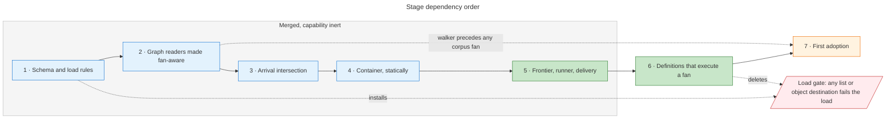
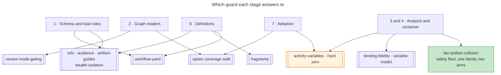
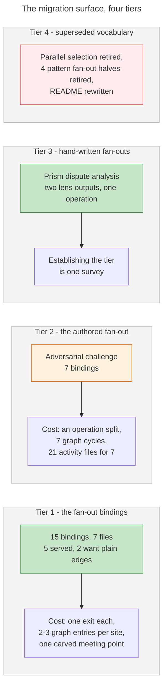

# Parallel activities — delivery plan

> Companion to [the specification](README.md) · 2026-09-09 · server at `e03cf7c5`, `workflows` branch at `f3733709`
>
> The specification says what a fan is and what holds it together. This says in what order it lands, what each stage has to satisfy before the next one starts, and what the corpus owes afterwards. Every construct named here is defined there.

## Delivery stages

Seven stages, one sequence. Both fan forms land stage for stage: a destination naming several different activities and a destination running one activity once per element of a collection are co-extensive, and each pair touches the same declaration, the same projection or the same handler branch. So each pair lands in the same commit — a half-landed union is a parse error waiting for an author, and a widened type whose readers still assume a string does not mis-read a fan, it silently stops reading it.

Stages 1 through 5 are independently mergeable in order and none of them can execute a fan, so each lands with the capability inert. Stage 6 is what makes a fan execute. Stage 7 is corpus adoption and does not gate the merge.

**One rule spans stages 1 to 5.** For the whole window in which the schema accepts a fan and the runner cannot execute one, the exit-binding validator in `src/loaders/workflow-loader.ts` rejects any list or object destination outright, with a message naming the stage that lands the runner. One line, deleted by stage 6. It makes the ceiling a load failure rather than a stage note, and it makes every intermediate stage's zero-corpus-movement criterion provable rather than argued, because the corpus cannot carry a fan at all while it stands.

| Stage | Lands | Principal files | Depends on | Merges before the next? |
|---|---|---|---|---|
| **1. The schema and the load rules** | The three-form destination, its derivations, the instance separator, the default fan ceiling, and L1 through L14 | `src/schema/workflow.schema.ts`, `src/loaders/workflow-loader.ts`, `src/config.ts`, `schemas/workflow.schema.json`, `site/`, `tests/workflow-loader.test.ts` | — | **Yes.** A union accepts every existing string and every fan rule is vacuous |
| **2. Every graph reader made fan-aware** | Each reader that walks a destination flattens it; each renderer stops interpolating one | `src/utils/activity-variables.ts`, `src/utils/validation.ts`, `src/tools/workflow-tools.ts`, `scripts/check-review-mode-gating.ts`, `tests/e2e/walker.ts`, `scripts/smoke/smoke-orchestrator.ts`, `evaluate-transition.md`, `finalize-activity.md` | 1 | **Yes**, and it must precede any corpus fan |
| **3. The arrival intersection** | The reachability meet over arrivals, a completed fan being one arrival contributing the union of its branches | `src/utils/activity-variables.ts`, `scripts/check-activity-variables.ts` | 1, 2 | **Yes.** Corpus output is byte-identical; fixtures carry the new behaviour |
| **4. The container, statically** | The container declaration, member-grain reads and writes, the synthetic collection read, the artifact-collision family | `src/utils/activity-variables.ts`, `scripts/check-activity-variables.ts`, `variable-binding.md`, `scatter-gather.md` | 3 | **Yes.** Same byte-identical criterion |
| **5. The frontier, the runner and the delivery** | The frontier replacing the single current activity, the one resolution rule, the fan enter with its refusals, the dense container, the per-instance projection | `src/schema/session.schema.ts`, `src/utils/session/resolver.ts`, `store.ts`, `migration.ts`, `src/tools/workflow-tools.ts`, `src/tools/resource-tools.ts`, `src/utils/variable-seed.ts`, `src/logging.ts` | 1, and 4 for the declarations it validates against | **Yes**, and the capability is still inert behind the load gate |
| **6. The definitions that make a fan execute** | The fan-dispatch operation, its bind site in the drive loop, the delivery entries, the rule amendments, and the deletion of the load gate | `dispatch-fan.md`, `03-dispatch-client-workflow.yaml`, `src/loaders/core-ops.ts`, `workflows/meta/workflow.yaml`, `docs/dispatch-model.md`, `schema-construct-inventory.md` | 5 | **No.** Nothing executes a fan until this lands, and nothing before it needs this |
| **7. First adoption** | One corpus site fanning for real, in its own submodule commit | `cicd-pipeline-security-audit/`, the coverage baseline, the pointer bump | 6 | **Yes**, and it does not gate the merge |

### Stage 1 — the schema and the load rules

**It delivers the vocabulary and closes it.** `src/schema/workflow.schema.ts` gains the instance-fan object, the three-member union with the array's arity message and the union error map, the widened graph description, and the flattening, fan-test, fan-extraction and branch-key helpers. `src/config.ts` gains the default fan ceiling beside `DEFAULT_BATCH_MAX_ACTIVITIES`, `DEFAULT_BATCH_HEADROOM_FRACTION` and `DEFAULT_BUNDLE_CHARS_PER_TOKEN`, so the operative bound has one home and moves without editing a single destination; `maxInstances` is optional and a destination declares one only to sit tighter than that default, with its reason stated. Three load rules join the set the fan brings: a meeting point that is the fan's own source, refused because such a graph opens the fan again on every convergence; the fan parameter's name, refused where it equals the collection or a name the fanned activity declares it writes; and the child-workflow dispatch, folded into the rule that already names the git, version-control and persist operations so that one rule covers every operation a branch cannot execute. `src/loaders/workflow-loader.ts` gains the instance separator with its base and index helpers, the checkpoint base helper retiring into `baseId` at its three call sites and one test import, the base fallback in the activity lookup, the base lookup in the exit-bindings reader, the fan-group derivations reading the graph object and nothing else, the widened binding record, the flattening reachable-activities helper, the widened destination-existence loop, and the load rules. The generated JSON schema and the site data are regenerated and committed. It lands alone because a union accepts every string the corpus already carries.

### Stage 2 — every graph reader made fan-aware

**Every reader of a destination reads all three forms.** The graph builder in `src/utils/activity-variables.ts` flattens, with the de-duplication placed *after* the flatten — an instance fan's target list is one activity, and de-duplicating first is what keeps the forward search, the predecessor index and the cycle pass seeing the graph one visit would produce.

`scripts/check-review-mode-gating.ts` imports the destination type instead of declaring the graph's shape itself and flattens every form, or its activity lookup on a list or an object is undefined and the whole subtree beyond a fan drops out of the set the guard exists for. `src/utils/validation.ts` satisfies a reported exit when the requested activity is among the destination's targets and compares set-wise on a fan enter, flattens the transition check, base-normalises the activity-manifest membership test and resolves the step-manifest validator through the base fallback — two of those readers fail *silently* without the change, looking the destination up, missing, and returning no finding.

`src/tools/workflow-tools.ts` projects a fanning exit in the routing header and the metadata map as a list, and stops interpolating a destination into the checkpoint consequence, the exit payload and the immediate-exit message, none of which the compiler catches because an array stringifies happily. The end-to-end walker and the smoke orchestrator import the type rather than re-declaring it. **This stage must precede any corpus fan**: unflattened, the walk sends a list or an object where a string is required, the tool's type rejects it, the walk throws, and the coverage job's no-walk-errored assertion fails.

### Stage 3 — the arrival intersection

**It changes one operator in the reachability analysis.** `unreachableReads` takes the fan groups from the loader's single derivation, splits the predecessor index so a branch is removed from its meeting point's plain predecessors, meets over *arrivals* rather than predecessors with a completed fan as one arrival contributing the union of its live branches' outgoing sets, and moves the candidate seed from the first predecessor's outgoing set to the first arrival's. Three ways exist to apply this and have it do nothing, and each is caught only by a fixture: an un-split predecessor index lets the intersection wipe the union straight back out, an unmoved seed never makes a union arrival's extra names candidates, and a branch head's own predecessor stays ordinary. Termination is unaffected — the meet changes, the lattice does not. It lands before stage 4 because stage 4's synthetic read arrives on the parameter this stage adds.

### Stage 4 — the container, statically

**It puts the container and its members in front of the guard.** The declaration merge contributes the container beside each fanned activity's own write declarations rather than in place of them, typed as an array with no starting value in both fan forms.

The read collectors return the full dotted reference and the read function splits it, recording the full reference so member grain is visible at all; productions and the landing site re-key onto the branch key, artifact writes and persisted productions included, or the artifact-write exemption stops applying and every artifact-valued branch output becomes an unread write. The guard's declared-write set becomes the container plus one entry per member, index-free because the width is a run-time value. The member-grain read test drops a leading all-digits segment and then the literal result segment. The synthetic read the load contributes for a fan's collection is exempt from the bare-container rule, and nothing else is, so a destination whose `over` names an earlier fan's container reports nothing while an authored bare read still does.

**`binding-fidelity`'s producer model learns the fan.** A fan's parameter is not a workflow variable, and must not become one: a workflow-owned name is skipped by the unwritten-read check and seeded into the availability lattice, so a read of it anywhere in the workflow would resolve silently. Left unlearned, the guard reports two findings on a correct fan — the fanned activity's own declared input for the parameter has no producer and reads as an orphan input, and an artifact name interpolating the parameter is collected as a read with no producer, since the read collector blanks fenced blocks and leaves inline code spans alone. Both are the guard not knowing the construct, and it is at hard zero, so the first fanned activity cannot land without them.

Two producibles close it. **The fan's parameter is producible for the fanned activity alone**, which the guard resolves by reading the graph's destinations to learn which activity a parameter belongs to — the first time this guard reads routing, and the substance of the change. **The branch container is producible at workflow scope**, at the grain the member-grain read test uses: a dotted segment after dropping a leading all-digits segment and then the literal result segment, never a head. The two land together, because a container producible at head grain would satisfy a member read that names nothing.

The fan's collection acquires a reader that is not an activity — the graph — so its head enters both the declared-read and the derived-read sets of the **branch**, never the source, because the source is where the collection is usually written. `variable-binding.md` gains the branch-scoped indexed landing, the derivation rule and the projection's place in the input precedence; `scatter-gather.md` gains the graph-fan application of isolate-then-combine, the third scatter mode over one gather contract, and the rule that a meeting point gathers the container rather than naming a slot.

### Stage 5 — the frontier, the runner and the delivery

**What a fan relies on from the record is that every concurrent append survives — the batch bound, the delivered-character tally and the fresh-versus-resume reading are all derived from exactly those events, and a lost append from one instance leaves a session whose history looks like a correct run of one fewer instance.

On top of the store, this stage lands the frontier replacing the single current activity, `heldActivity`, the canonical key ordering, the refusal that stops a pre-frontier record resuming with no position, the widened target parameter and the exiting-activity parameter, the one five-step resolution rule, the fan enter's collection read with its refusals and its id derivation, the width check over the flattened branch count so that a list, an instance fan and a mixture of the two answer to one bound, the comparison of a branch return's named destination against the derived meeting point on every return rather than only the one that empties the frontier, the dense materialisation through the variable-write path under a fan-enter write source, the fan metadata and the per-instance barrier reading, the indexed wrap in the mutator, the per-instance projection block on the load response overlaid onto the bag the eager-bundling decision reads, the instance-qualified composite on the exit, entry, step-completed, variable-set and trace events, and the frontier rendering on the status, identity, activity and inspection projections. `src/utils/variable-seed.ts` gains the write context carrying the key, the slot index and the unit's id, and commits the reported map into the slot's result with the event naming all three; its per-name validation loop runs unchanged against the retiring activity's own declared writes.

### Stage 6 — the definitions that make a fan execute

**This is where a fan becomes executable.** `dispatch-fan.md` is new: publish the in-progress marks once, enter the fan with one call, mint one identity per branch, compose one prompt per branch, spawn the batch, retire the branches in input order, hand back the destination the barrier reported. Its input is the destination as the graph names it, and steps three through six iterate the branch list the enter call returned, so the orchestrator never computes a width.

One rule ships with it and is stated nowhere else in the definitions: a refused call is repeated with the same arguments. No other operation says this, because no other operation puts several workers on one session record at once.

The drive loop's bind site gains three steps, two gate edits and one loop-condition edit; `src/loaders/core-ops.ts` and `workflows/meta/workflow.yaml` gain the two delivery entries, without which the bind is inert. Rule amendments carry the fan route into the dispatch topology, the delegation routes, the worker's gate rule, the one-advance rule, the persistence rule, the progress call-site table and the drive loop's orientation paragraph, and `compose-prompt` gains the instance-qualified clause on a substitution it already declares.

Every rule this stage writes addresses an actor that reads it and acts on it. Nothing here may be phrased as an instruction to a runner, because there is no runner to receive it.

`docs/dispatch-model.md` gains the fan section with the frontier as the cursor, the two barrier points, the fact that the per-scope bound does not limit a fan's width, and the arithmetic re-derived against a fresh benchmark run — **stated as a floor**, because no measured figure exists for a fanned activity's payload, so any number derived from the standalone benchmark is a substitution and a lower bound, and every figure counts eager payloads only.

### Stage 7 — first adoption

**It adopts one site.** The continuous-integration pipeline scan is the adoption target: its per-unit work is a whole submodule scan, long enough that an extra payload buys real wall clock and real context isolation.

It already parameterises its worker count from a session variable, so the migration **deletes** that variable: the width becomes the collection's length. The substrate audit's crate-review group is second. Adoption is one commit in the workflows submodule plus the pointer bump in the server repo, in the same pull request, with the coverage baseline re-recorded and the dry-walk budget re-measured from its current value of 50, because a fan seeded from a collection multiplies the branch orderings the enumerator produces and a short streak is reported as unreached options — a definitions defect — when the cause is the budget.

Green marks the stages that add behaviour; blue marks the ones that only widen readers. The red gate is installed by stage 1 and deleted by stage 6, which is what holds the corpus at zero fans for the whole inert window.

### Acceptance criteria

One criterion applies to every stage and is stated once: **a stage that changes what a live session or a live definition does is walked before merge**, and a green guard suite is not sufficient on its own. Stages 5, 6 and 7 each change live behaviour.

**Stage 1 — The schema and the load rules**

- [ ] `npm run check:all` green with **zero corpus movement** — 17 workflows, 109 activities bound in graphs, 207 graph edges, 18 of them terminal, 0 list-valued and 0 object-valued — so a union accepts every existing string and every fan rule is vacuous.
- [ ] The regenerated `schemas/workflow.schema.json` carries the three-member `anyOf`: the plain string, the array with `minItems: 2` and a non-empty `items` subschema, and the strict object with its required `activity`, `over` and `variable`, its optional ceiling and `additionalProperties: false`. The generated-schemas test that fails on an empty subschema under an `items` key stays green.
- [ ] The site's schema page carries the new graph description, and the site test stays green.
- [ ] **One test per load rule.** Each of L1 through L14 fails the load with its stated message against a fixture — every branch an activity this workflow contains, no branch named twice, no branch the terminal sentinel, every branch binding at least one exit, no branch fanning again, no branch routing an exit onto itself, every exit of every branch naming one and the same destination, the meeting point an activity rather than the sentinel, no branch declaring a decision gate, every branch key a legal and unique variable name, the fanned activity declaring the fan's parameter among the names it needs its workflow to supply, the collection's head a name this workflow's merged variable set contains, an authored index below the fan's effective ceiling, and a fanned activity mutating no checkout.
- [ ] Each authored form of a malformed destination renders its probed message: the array member's own arity message for a one-element and an empty list; the union error map for a number, a non-string member, a nested list and a partial object that matches no branch far enough to surface a field error; the ceiling's own field message for a declared ceiling of one; and the strict-object rejection naming an unrecognised key, which is what tells an author the output key is derived rather than authored.
- [ ] A destination omitting the ceiling loads and takes the configured default; a destination declaring one loads only where it is tighter than that default, and its reason is stated at the site.
- [ ] The instance base and index helpers are tested over both populations they serve — a checkpoint inside a loop body and an instance of a fanned activity — and the retired checkpoint base helper has no surviving alias.
- [ ] The exit-binding record carries a list and an object, and the reachable-activities helper returns every branch head.

**Stage 2 — Every graph reader made fan-aware**

- [ ] No corpus movement; `check:all` green.
- [ ] A fixture fan of each form walks end to end in the end-to-end walker: a fan-bound exit yields the branch set, the walk enters each branch and then the meeting point once, and the visit bookkeeping is keyed on activity ids.
- [ ] **No rendered message anywhere interpolates a destination directly.** A test covers the checkpoint consequence, the exit payload and the immediate-exit message.
- [ ] One test per stale reader, with the **two silent ones proved live rather than merely returning nothing**: a fan-instance transition whose reported exit is not bound is *refused*, and the transition validator reports on a fan enter.
- [ ] The graph builder's de-duplication happens after the flatten, and a test asserts an instance fan of eleven produces one graph node.

**Stage 3 — The arrival intersection**

- [ ] Corpus guard output **byte-identical**; this stage proves no regression and its new behaviour is proved by fixtures.
- [ ] On a fixture fan, a meeting point's declared read of a name only one branch writes produces **no** finding.
- [ ] A genuinely unwritten read inside a branch **is** reported as an entry finding.
- [ ] The arrival split removes **all** duplicate predecessor entries for a repeated destination.
- [ ] The fixed point terminates on a fan of eleven.
- [ ] A fan entered on a path where its collection was never written **is** reported; a fan whose source writes the collection is **not**.

**Stage 4 — The container, statically**

- [ ] Corpus guard output **byte-identical**.
- [ ] One correct fan of each form, with a gather-bound meeting point, produces **zero** findings — including no unused declaration on the branch whose synthetic collection read the graph contributes.
- [ ] A gather naming a member no branch produces is reported once; an ungathered member once; a bare read of a fanned activity's output once; a read that omits the index once.
- [ ] A branch that writes a working value and reads it back within its own steps is **not** reported, so the self-consumed exemption is carried forward.
- [ ] Two branches of one list fan resolving one literal artifact filename are reported once; an instance-fanned activity writing a literal artifact name is reported once; one whose artifact template carries the fan's parameter is **not**.
- [ ] The fan's parameter read by a non-branch activity is reported once, with the fan-specific detail string; the branch's own read of it is **not**.
- [ ] A destination opening more branches than its ceiling admits is refused at the enter, for a list, an instance fan and a mixture of the two, with the message naming the width it saw.
- [ ] A branch return naming any destination other than the derived meeting point is refused, on every return.
- [ ] A graph whose meeting point is its own fan's source fails the load; so does a fan parameter equal to its collection, or equal to a name the fanned activity declares it writes; so does a fanned activity binding the child-workflow dispatch.
- [ ] A fan whose `over` names an earlier fan's container loads clean and produces no guard finding, while an authored bare read of that container still produces one.
- [ ] The container is declared as an array with no starting value in both fan forms, so the merge's contradiction check, the write-time type warning and the rendered variable set all agree with it. A list fan's enter emits no declared-type warning.

**Stage 5 — The frontier, the runner and the delivery**

- [ ] **The whole existing unit and end-to-end suite green with a frontier of length one.** Every ordinary session takes the identical path: no walked route, activity order or step order moves, and no test is rewritten for behaviour.
- [ ] **Every caller of the transition names the activity it is exiting.** The exiting-activity parameter is required whenever anything is in flight, which is a change to the call shape rather than a field rename, and it reaches every caller: **67 direct call sites and 72 through the suite's own helpers, across 15 files**, plus the end-to-end walker, the batch benchmark and the corpus's dispatch operations. Cost it as its own item. Where a caller drives a linear sequence the helper tracks what it entered, which is what an orchestrator knows by having dispatched it, and one edit moves every site behind it; the rest go one at a time, each naming where its own session stands. Off an activity whose exit fans the call names the exit too, so a walker that drives a fan carries both.
- [ ] **A session recorded before this stage is refused on read, naming the activity it holds.** It does not resume. The converter reaches only a folder with no session file, so it never sees such a record; and resuming one without a refusal would give it an empty frontier and a stripped position, which reads as a session that has not started.
- [ ] **One test per refusal.** The fan-enter refusals — a destination wider than the effective ceiling, naming that ceiling and where it comes from, exercised for a list, an instance fan and a mixture of the two; an empty collection; a non-array collection; an element with no derivable id; and two elements sharing an id. Then the branch-return refusals, including a return naming a destination other than the derived meeting point; all three load-call refusals; the yield refusal; the child-dispatch refusal; and the exit-required refusal on a transition off an activity whose exit fans.
- [ ] **A three-instance fan executes end to end against real sessions under three distinct identities**, and a two-branch distinct-activity fan does the same.
- [ ] A branch return with siblings still live enters nothing and reports the outstanding branches; the last return empties the frontier and the same call enters the meeting point.
- [ ] A branch's writes land under its own key with a dotted read resolving through it, and two branches reporting the same bare name leave both values readable afterwards.
- [ ] **The container lands dense and in collection order**, surviving canonicalisation and the seal, with an indexed read resolving through it.
- [ ] **An instance that never returns leaves a slot both dotted-path evaluators read as absent** — a not-exists gate true for the empty slot, for a member of it and for an out-of-range index; an exists gate true for a present member.
- [ ] **A second entry of the same fan resets the container** rather than appending into the previous entry's slots.
- [ ] **Usage figures are per instance**: three figures for a three-instance fan, and one missing figure reported against the completed list rather than satisfied by a sibling's.
- [ ] A member whose value disagrees with its declaration warns with today's wording, validated against the retiring activity's own declared writes.
- [ ] Concurrent deliveries within one fan that meet `STALE_WRITE` succeed when the call is repeated with the same arguments, and the fan is accepted with those refusals present in the log.

**Stage 6 — The definitions that make a fan execute**

- [ ] `check:all` green, including every new anchor resolving, every new rule placed in an audience bucket, the fragment check, and the workflow-YAML validator loading the amended meta workflow.
- [ ] Version bumps on every edited definition.
- [ ] **A smoke run drives a three-instance fixture fan**: three workers spawn in one turn, each is served its own element at the name the destination gives, three slots land in collection order, the gather reports complete, the in-progress marks publish in one commit before the spawn and resolve in one persist at convergence, and **no barrier refusal appears in any log**. A repeated call after a `STALE_WRITE` is not a barrier refusal and does not fail this criterion.
- [ ] The drive loop's three new steps fire in order, the checkpoint trio and the artifact commit stay silent on the fan iteration, and the destination arrives through the output remap rather than a copying assignment.
- [ ] `docs/dispatch-model.md` states every delivery figure as a substitution and a lower bound, names the absence of a measured fanned-activity payload, and derives its arithmetic from a fresh benchmark run.
- [ ] The construct inventory carries the amended Graph row, the new instance-fan row, the activity-level exit row and the amended within-activity fan-out row, and no row claims a layer another row now owns.
- [ ] The load gate's line is deleted, and a fixture fan loads.

**Stage 7 — First adoption**

- [ ] The workflow loads with the fan and every load rule satisfied.
- [ ] `check:all` green on both sides with the submodule pointer bumped.
- [ ] The coverage walk green with no stale, newly-uncovered or newly-covered entries and the stamp fresh, the dry-walk budget re-measured in the same commit.
- [ ] **One live run** in which the instances spawn in one turn, each lands its outputs in its own slot, the meeting point gathers the container whole with the gather reporting complete, the progress marks publish in one commit before the spawn and resolve in one persist at convergence, and the barrier refusal appears in no log.
- [ ] The width comes from the collection's length and the site's shadow scanner-count variable is deleted rather than left standing.

### The stale-restatement sweep

Two keys, run against the tree by grep key rather than against this change's own file list, with each occurrence count recorded in the change manifest. A sweep driven by the file list misses the statements no survey of the change happens to touch, and a stale claim reads as current fact.

**The first key is a destination described as one activity per exit.** The load-bearing phrasings are *destination activity*, *where each of its exits leads*, *exit id → destination*, *the activity the workflow graph binds*, *the activity each declared exit leads to*, *read its destination from the graph* and *activity ID to dispatch next*. They stand at **28 authored statements across 15 files, plus 3 generated files carrying the same sentence: 31 sites across 18 files.** Authored: `src/schema/workflow.schema.ts` (2), `src/loaders/workflow-loader.ts` (2), `src/tools/workflow-tools.ts` (3), `src/utils/activity-variables.ts` (1), `scripts/check-review-mode-gating.ts` (1), `scripts/generate-site-data.ts` (2), `tests/e2e/walker.ts` (2), `docs/api-reference.md` (1), `docs/state-management-model.md` (1), `docs/workflow-fidelity.md` (3), `schemas/README.md` (2), `evaluate-transition.md` (3), `finalize-activity.md` (2), `workflows/meta/activities/README.md` (1) and `schema-construct-inventory.md` (2). Generated: `schemas/workflow.schema.json`, `site/api/schemas.html` and `site/api/tools.html`. **Seven of the authored statements, across five files, sit outside any file list this change would otherwise touch** — the tool description naming the exit-destinations block, the API reference row stating its return shape, the state-management walkthrough, the three fidelity-document statements and the activities README paragraph. The exit-destinations return shape changes and those files state it, which is Match the Harness Surface's business directly.

**The second key is the phrasings that route fan-out to the pattern activities and the orchestration operations.** Two canon sites are amended in the same commit, because each currently sends an author to an operation whose parallel branch is unreachable at every one of its fifteen bindings — the condition: the shared-capability principle's sentence preferring the orchestration operations and the borrowable pattern activities for mid-phase multi-agent fan-out, and the construct inventory's within-activity fan-out row prescribing the decompose, compose, dispatch, gather and synthesise chain as consecutive activity steps. Each is amended to name the layer it now covers — work units inside one worker for the operations, the graph instance fan for one activity over N work units. The pattern directory's README claim that its activities cover in-activity fan-out only becomes accurate in the same edit. Occurrence counts for this key are recorded beside the 31.

### Guard obligations

The fan's shape rules land in the load, so the registry gains no entry for them. What each stage owes is the guards it must leave passing, and the one new check the stage that introduces it must also land.

| Stage | Guards that must be satisfied | New check |
|---|---|---|
| 1 | `workflow-yaml` first, since it is the guard that rejects a fan today and the schema widens under it. `refs`, `audience`, `artifact-guides`, `stealth-isolation` and `activity-variables` all load workflows and inherit the load result | None. **Settled in this stage:** a session-contract check script sits on disk with no registry entry and no package script. It is registered with a proves line or deleted, in its own commit, so the registry's contents are the enumeration of what runs |
| 2 | `review-mode-gating`, which declares the graph's shape itself and parses raw YAML, so the fan rules cannot protect it — a gate reachable only through a fan stays audited for a review-mode auto-advance. The option-coverage walk, through the end-to-end walker | None |
| 3 | `activity-variables`, at hard zero with no ledger to diff, held to byte-identical corpus output | None. The arrival meet is a new operator in a silent guard, and its fixtures are the whole protection |
| 4 | `activity-variables` again at byte-identical output. **`binding-fidelity` is changed, not merely left passing** — it mechanises a declared input with no reader and a read with no producer, and it gains the two producibles above. `variable-model` joins the acceptance set, mechanising defaults, gates and variable effects staying coherent with the seeded model. `refs` for the two amended technique files | **`fan-artifact-collision`**, inside the existing `activity-variables` entry and under one family name, with two arms: two branches of a list fan whose composed technique signatures resolve one literal filename, and an instance-fanned activity whose artifact names do not interpolate the fan's parameter. Literal names only; templated names fail closed. It is the one new check on the safety floor, and it lands with the container because that is the stage after which two branches can write concurrently |
| 5 | No guard reads the session record. The obligation is the whole unit and end-to-end suite plus the migration test | None |
| 6 | `refs` resolving every new anchor, `audience` placing every new rule in a bucket — the check proposed for an instruction reaching a role that cannot act on it, applied to the fan's new worker and orchestrator rules — `fragments`, and `workflow-yaml` loading the amended meta workflow | None |
| 7 | `check:all` on both sides with the pointer bumped, and the coverage walk with a fresh stamp. A workflows-branch sweep runs the server's main tooling and stays red until the paired server change merges, so the site is verified locally and the sweep re-run by hand afterwards | None |

Green marks the one new check; the orange guard is the hard-zero one with no ledger, where a bug is silent and fixtures are the whole protection. Everything else exists and re-runs.

## The migration surface

Fifteen existing bindings of the corpus's fan-out vocabulary sit across seven definition files, and each sits inside an activity, where the parallel branch cannot execute. This design gives that shape a home at the layer where the dispatch primitive is. Migrating these sites is out of scope for the plan above; the surface is recorded here so its size is known.

| Site | Binds | Verdict |
|---|---|---|
| Orchestrator-workers pattern | Decompose, compose briefs, dispatch, gather, synthesise | **Served fully.** Three graph nodes: source, fan, meeting point. The gather's binding carries across unedited, the units being id-and-brief records with a stable slug id. The activity declares no exits, so a fannable per-unit activity must declare one; the brief-composition step is displaced, the brief travelling as the projection; and the pattern's home moves from a borrowable activity file to an inventory row |
| Supervisor pattern | One dispatch, concurrency one over a one-element collection | **Served but pointless.** The construct it wants is a plain graph edge, executed by the ordinary dispatch operation |
| Isolated fan-out pattern | Isolation mode, dispatch, require-complete validation | **Partly served.** Context isolation is exactly what a fan gives. Worktree isolation is not served — the branches share one working tree. Require-complete becomes structurally satisfied. Same missing-exit gap |
| Lead-researcher pattern | Two fans, the second inside a bounded loop | **Served at a stated cost.** The follow-up fan becomes a graph cycle: the meeting point assesses gaps and routes back to the source, and the declared iteration ceiling gives way to an authored round counter. The container's reset materialisation puts round two in fresh slots |
| Substrate reconnaissance | Two sequential single-agent dispatches with a file check between them | **Not served, and does not want to be.** That is a chain of two activities, and the fix is two graph edges |
| Substrate primary batch | The whole roster in one batch, the bound gather, three tail dispatches | **Partly served**, as three chained nodes — above |
| Continuous-integration pipeline scan | Width read from a session variable, the bound gather, three tail dispatches | **Served, and the readiest of the fifteen.** It already parameterises its width at run time, so the migration *deletes* a variable rather than adding one. Gate-free; the ordered gather already bound with an expectation list; the per-instance artifact token-templated on a scanner designator, guide-mapped and green. Named changes: the collection names the work units rather than the composed briefs, the per-submodule scan is carved into an activity of its own, and the exit's two flags move to the meeting point |

**Migrating any of this is out of the staged plan above.** The surface is recorded so its size is known.

Green marks what the graph fan serves; orange the tier the arithmetic disqualifies; red the vocabulary that is retired rather than migrated.

Tier one retires five unexecutable dispatch steps and, at the pipeline site, one shadow width variable. Tier two retires six duplicate literals of the perspectives list and, if adopted, the unbounded accumulation of up to ten reasoning passes in one worker. Tier three is one survey, and it should precede any wider adoption rather than be assumed. Tier four is a decision rather than an inheritance: once a graph instance fan owns the shape, **the dispatch-workers operation is retired whole rather than narrowed.** Both of its branches start an agent — the selection above one dispatches a concurrent batch, the selection at one dispatches one agent per brief — so retiring the parallel selection leaves an operation with no executable branch and no in-activity contract to state. The in-context loop that does run anywhere belongs to the scatter-gather primitive's sequential mode, which invokes a per-unit operation in the caller's own context with no agent involved, and which this operation does not use. **The fan-out halves of the four pattern activities that bind it are retired, the plan-and-execute pattern is kept because it binds no dispatch, and the pattern directory's README describes only what remains.** Five files' worth of unexecutable vocabulary comes out in the same change that makes the vocabulary expressible elsewhere. The prose that routes an author to an operation neither of whose branches can run from where it sits is an instruction reaching a role that cannot act on it.
