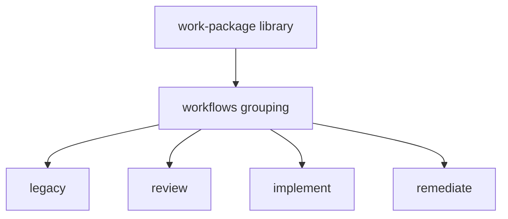

# Work-package modes

## Layout

Discovery stops at the first `workflow.yaml`, so the parent `corpus/work-package/` drops its definition and becomes the library the modes share. Its children are the library folders plus `workflows/`. `workflows/` holds no library and no definition, so it names nothing and the walk descends into it. The mode folders live there:

- `workflows/legacy/` — the current tree, moved as-is and still runnable. Workflow id is `legacy` (the id is the directory name). The path `work-package/workflows/legacy` also reaches it.
- `workflows/review/`, `workflows/implement/`, `workflows/remediate/` — each holds `workflow.yaml` and `activities/`. Ids are `review`, `implement`, and `remediate`.

Shared routines, techniques, and resources live on the library root: `corpus/work-package/routines/`, `techniques/`, and `resources/`. A mode activity binds them as `work-package::`. Legacy does not consume that library; it keeps its own copies.

`work-package/README.md` orients the library. It names `routines/`, `techniques/`, `resources/`, and each folder under `workflows/`, with one line for what that mode is. That naming is the orientation for `workflows/` itself. Each `workflows/<mode>/README.md` orients that mode: purpose, the activity sequence by name and role, and what it binds from the library. A mode README does not catalogue the library or describe another mode. Neither README transcribes steps, the graph, or the variable list. Construct folders keep their own READMEs.

## Legacy

`workflow.yaml`, `activities/`, `techniques/`, `routines/`, `resources/`, and the README live under `workflows/legacy/`. The definition's id is `legacy`. The schema path is two directories deeper than the combined workflow's was. Links follow the files. The README stays that workflow's own orientation.

In-repo references to the old id follow the move:

- Technique namespace `work-package::…` becomes `legacy::…` where the combined workflow's techniques are the ones named. Callers include workflow-authoring and workflow-design.
- Workflow id `work-package` becomes `legacy` where the combined workflow is the one being started, including `execute-package`. The new authoring path is `implement`. That dispatch names `implement` once implement can carry a package to a merged pull request.

## Mode graphs

Each new workflow's graph is that mode. Implement, review, and remediate declare neither `is_review_mode` nor `stealth_mode`. Review is the review workflow. Remediate is the remediate workflow. Legacy is the combined workflow and declares both.

- **implement** — authoring path through a public pull request: start, design, comprehension, optional elicitation and research, analysis, plan, assumptions, implement, lean-coding audit (apply), post-impl review (fix), validate (fix), strategic review (apply), submit (push, mark ready), complete (ADR when complexity requires it).
- **review** — review an existing pull request and post the review: start captures the PR; elicitation and implement are absent; lean-coding, post-impl, validate, and strategic review document and do not apply; submit posts the review; complete republishes the close-out and skips the ADR.
- **remediate** — remediate-vuln brought under this tree. Its start (private fork, `security` remote, no public GitHub) replaces implement's start. The rest follows implement, with submit reduced to a private push. Isolation rules sit on this workflow. It declares neither `is_review_mode` nor `stealth_mode`, and neither `rating_cap`, `prior_feedback_triage`, nor `squash_merge_supported`. `corpus/remediate-vuln` is retired and its readers retargeted (prism-audit, the readme-seed specimen, the meta patterns note).

## Variables

Each new `workflow.yaml` declares only names that mode reads or writes. Implement, review, and remediate declare neither `is_review_mode` nor `stealth_mode`. Seeded session names (`host_repo_path`, `planning_folder_path`, `user_request`) stay where the mode uses them. Review omits implementation-plan execution and public-PR lifecycle names it never writes. Implement omits review-delivery names (`flagged_block_indices` and the posted-review fields) and every security-remote name. Remediate omits public-PR names and review-delivery names, and declares the advisory and private-fork names that live on remediate-vuln today.

## Grain

The [grain rubric](grain-rubric.md) is the home for activity, routine, technique, and resource. Legacy's file layout is the behaviour reference. The new modes are authored from the rubric. Routines and techniques are specced, created, and tested before an activity binds them. The component tests are unit tests and integration tests. Wiring the activities, and walking them, comes after.

## Commands

Canon owns this. A command a shared namespace already owns is that technique, bound from the routine (Prefer Shared Capability, AP-110, AP-158). A protocol that only calls the tool and records the answer is retired.

A resource holds fill and consult, not the cadence (One Authoritative Home, AP-92). A spelling with no shared technique may be a resource section. The technique keeps the reading and the inputs. The routine keeps the order. Cite the narrowest section (Cite Resources at Section Grain).

## Authoring checks

Follow author mode on the workflows branch, in its own worktree. Walk each new file against the units for that construct before writing it. After the drafts, run the guard suite and the option-coverage walk for the three new graphs. Legacy is a relocation, so its behaviour is unchanged apart from the id.
