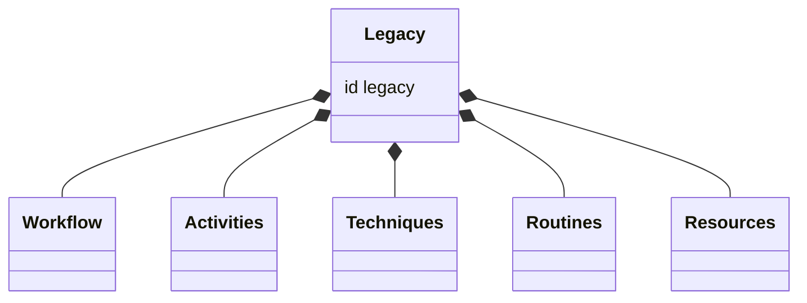
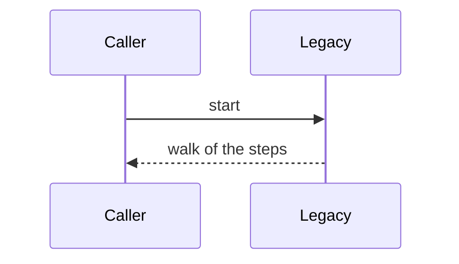

## Overview

This work places the combined work-package workflow where an operator can still start it, unchanged, as the behaviour reference for the modes that follow.

## Problem

- **One workflow holds three modes.**
  Implement, review, and remediate share one run. A worker sent that workflow is sent every mode's steps.

## Proposal

- **The combined workflow stays startable.**
  It moves to `corpus/work-package/workflows/legacy/`. Its id is `legacy`. The schema path is `../../../../schemas/workflow.schema.json`.

- **Callers name `legacy`.**
  Links whose target moved follow the files. Technique references to the combined workflow become `legacy::`. A caller that starts the combined workflow names `legacy`, including `execute-package`.

The files that move are:

- `workflow.yaml`
- `activities/`
- `techniques/`
- `routines/`
- `resources/`
- the README

- **Legacy keeps both mode flags.**
  It declares `is_review_mode` and `stealth_mode`. It does not bind the library. Its file layout is the behaviour reference. It is not the grain the new modes copy.

- **The walk accompanies the move.**
  A sidecar specimen walks legacy. The claim table in this record names the walk.

**Structure.** The legacy workflow contains the files that moved with it.

**Behaviour.** A caller starts `legacy`, and the specimen walk reports the steps.

## Work Breakdown

| Part | Description |
| --- | --- |
| Analysis | Name the files that move and the callers that start the combined workflow |
| Implementation | Place the tree at `workflows/legacy`, set the id to `legacy`, and retarget the callers |
| Test | Walk legacy and record the steps in the claim table |

## References

- **R1.** [E06](https://github.com/m2ux/workflow-server/issues/1126) — the epic whose table indexes this work.
- **R2.** [Planning record](README.md) — the record this file belongs to.
