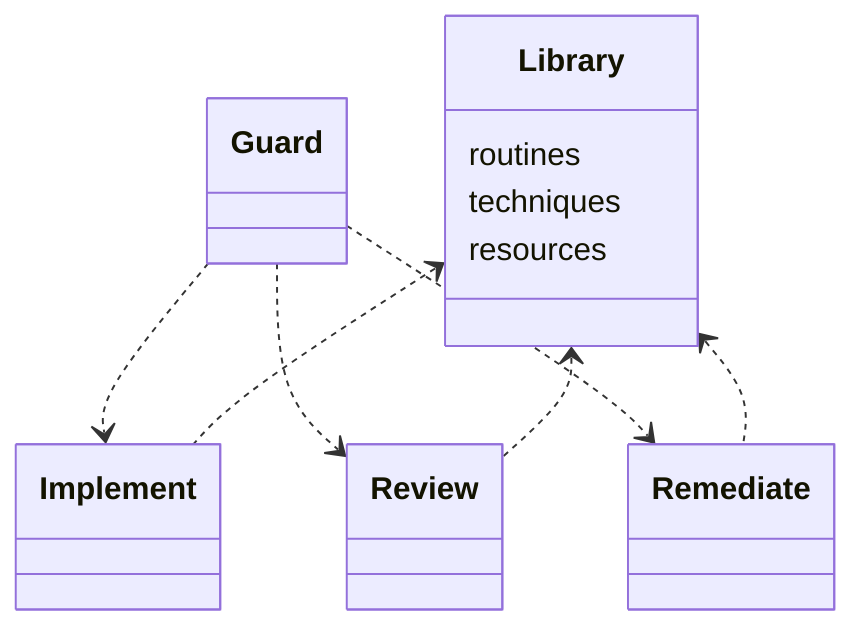
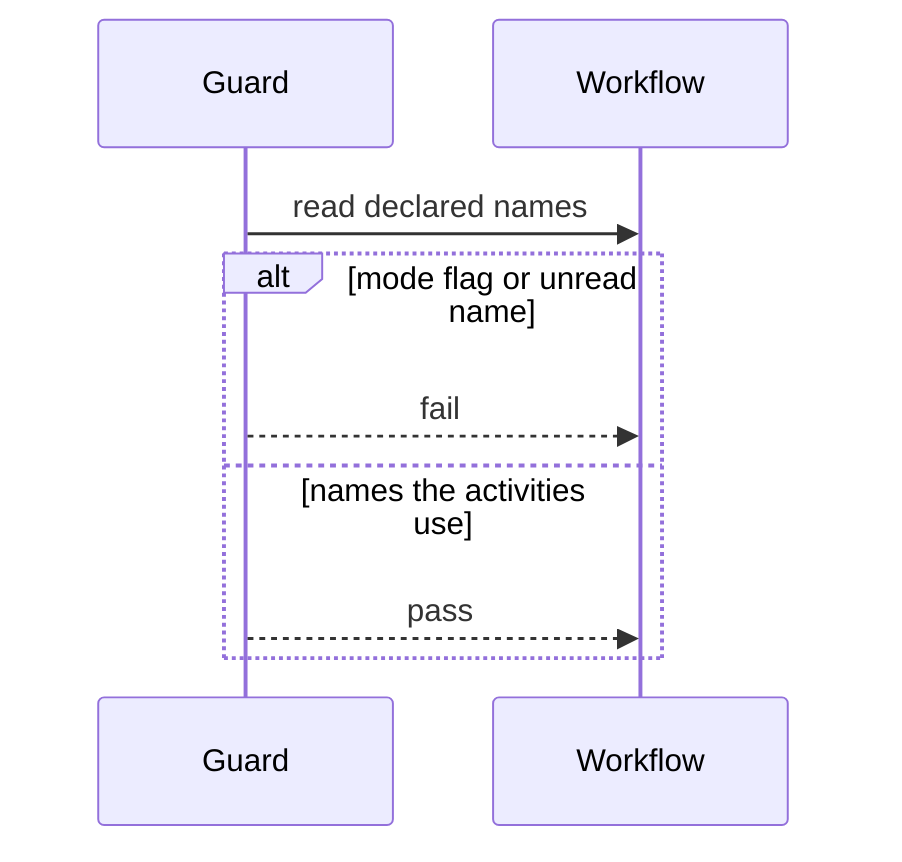

## Overview

This work adds the library the modes bind, and a guard that rejects a variable a mode does not use.

## Problem

- **Shared parts have no home of their own.**
  Once each mode is its own workflow, the routines, techniques, and resources they share still need one place to live.
- **A mode can declare another mode's variable.**
  Nothing yet stops implement, review, or remediate from declaring a name it does not read or write.

## Proposal

- **The library holds the shared folders and no workflow.**
  `corpus/work-package/` holds `routines/`, `techniques/`, and `resources/`, and no `workflow.yaml`.

- **The library README names each mode.**
  One line each, and it does not spec the routines or the resources:
  - `workflows/legacy`
  - `workflows/implement`
  - `workflows/review`
  - `workflows/remediate`

- **The guard lands on `main`.**
  Its unit tests and its integration test accompany it. The library files land on `workflows`.

The unit tests fail when:

- implement, review, or remediate declares `is_review_mode` or `stealth_mode`
- one of those workflows declares a variable none of its activities reads or writes

The integration test loads a fixture workflow that declares one of those names and expects the guard to fail.

**Structure.** The library holds the shared folders. The guard stands beside the three mode workflows.

**Behaviour.** The guard rejects a mode flag or a variable no activity uses.

## Work Breakdown

| Part | Description |
| --- | --- |
| Analysis | Name the shared folders and the variables a mode must not declare |
| Implementation | Add the library and its README, and add the mode-variable guard |
| Test | Unit tests for a mode flag and an unread variable, and an integration test that loads a fixture workflow |

## References

- **R1.** [E06](https://github.com/m2ux/workflow-server/issues/1126) — the epic whose table indexes this work.
- **R2.** [Planning record](README.md) — the record this file belongs to.
