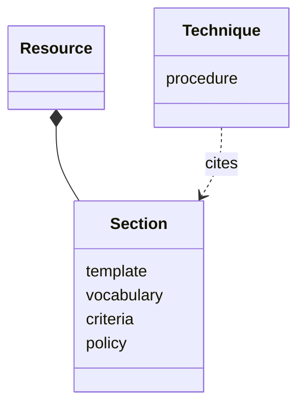
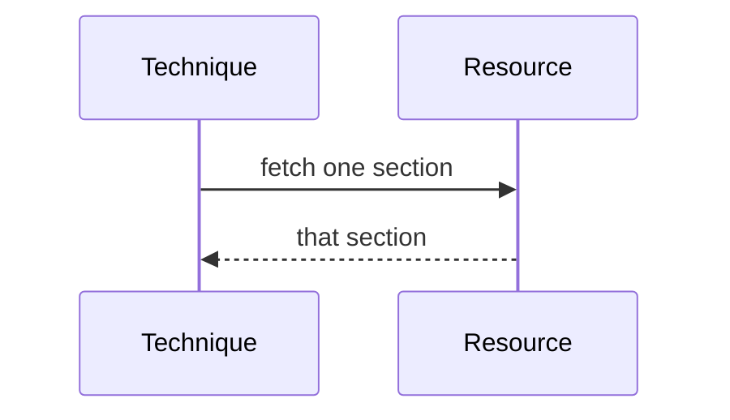

## Overview

This work rewrites the guides so a citation returns one section, and a procedure stays with the technique that owns it.

## Problem

- **Guides mix consult material with procedures.**
  Guides that travelled with the combined workflow hold both what a worker looks up and steps a technique should carry.
- **A section fetch returns the whole file.**
  The worker pays for every section when one would do.

## Proposal

- **A resource holds fill and consult.**
  - templates
  - vocabularies
  - criteria
  - policy

- **The set is the guides that move onto the library.**
  The combined workflow keeps its own copies.
  - the plan guide
  - the findings guide
  - the close-out guide
  - the ADR guide
  - the elicitation guide
  - the design-framework guide
  - the assumptions guide
  - the review guides

- **The tests accompany the rewrite.**
  A unit test fails when a refactored resource still contains a protocol cadence. An integration test fetches one section and fails when the response is the whole file.

**Structure.** A resource is sections of fill and consult. A technique cites a section and keeps the procedure.

**Behaviour.** A section fetch returns that section.

## Work Breakdown

| Part | Description |
| --- | --- |
| Analysis | Separate consult material from procedures in the guides that travelled with the combined workflow |
| Plan | Decide the sections each resource holds |
| Implementation | Rewrite the resources onto the library, at section grain |
| Test | A unit test for a protocol cadence, and a section fetch that returns that section |

## References

- **R1.** [E06](https://github.com/m2ux/workflow-server/issues/1126) — the epic whose table indexes this work.
- **R2.** [Planning record](README.md) — the record this file belongs to.
