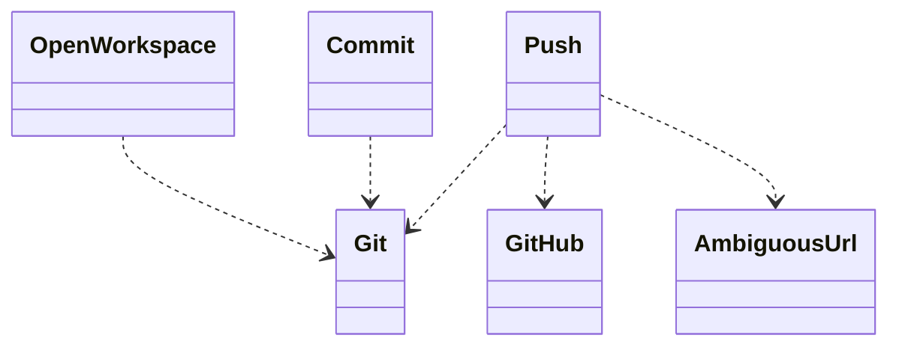
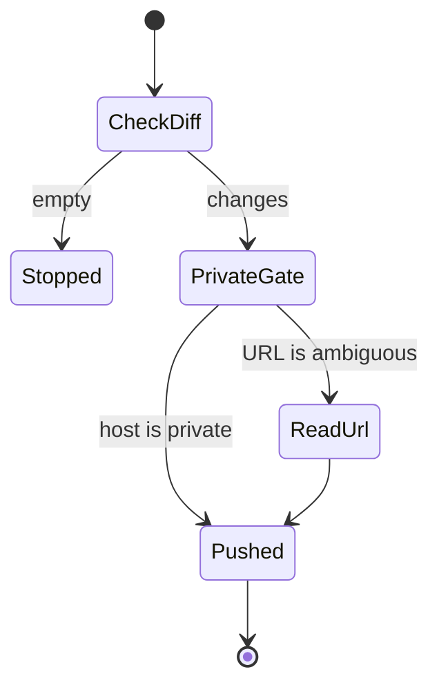

## Overview

This work makes opening a workspace, committing, and pushing a set of routines a mode can parameterise.

## Problem

- **The same steps repeat across modes.**
  Opening a workspace, committing, and pushing do not change from one mode to the next.
- **Two values do change.**
  The workspace kind changes, and so does whether the remote must be private.

## Proposal

- **A parameter selects the workspace and the privacy of the push.**

- **A determinate host and an ambiguous URL are different readings.**
  The private-remote check is a phase of the push routine when the host is determinate, and a technique when the URL is ambiguous. The routine binds `git::` and `github::` directly. A local technique exists only where this library adds a reading those namespaces do not contain.

- **The tests accompany the routines.**
  A unit test fails when the empty-diff gate or the determinate-private gate accepts the wrong input. An integration test loads each routine in a fixture workflow and fails when the splice does not bind the shared technique.

**Structure.** The three routines bind the shared git and GitHub techniques. An ambiguous URL is its own reading.

**Behaviour.** A push stops on an empty diff, and an ambiguous URL is read before the push.

## Work Breakdown

| Part | Description |
| --- | --- |
| Analysis | Separate the shared steps from the workspace kind and the private-remote value |
| Implementation | Write the open, commit, and push routines, and the reading for an ambiguous URL |
| Test | The empty-diff gate, the determinate-private gate, and a splice that binds the shared technique |

## References

- **R1.** [E06](https://github.com/m2ux/workflow-server/issues/1126) — the epic whose table indexes this work.
- **R2.** [Planning record](README.md) — the record this file belongs to.
