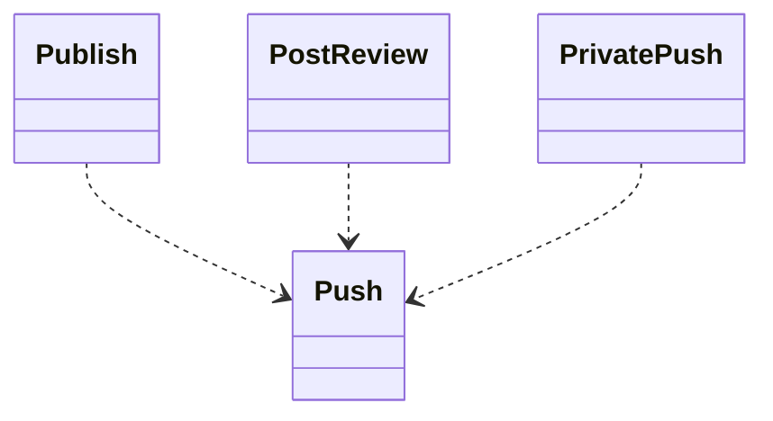
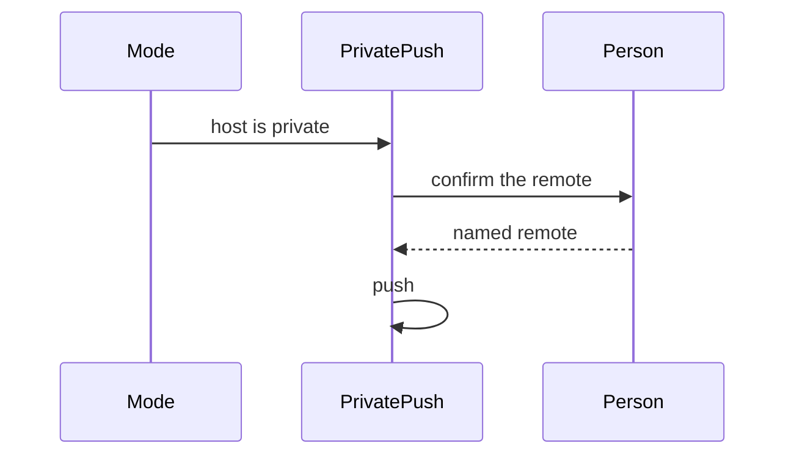

## Overview

This work makes publishing a pull request, posting a review, and pushing to a private remote three separate routines.

## Problem

- **The three deliveries are different jobs.**
  Publishing a pull request, posting a review, and pushing to a private remote do not belong in one routine.
- **A mode should carry only the delivery it runs.**

## Proposal

- **A mode binds only the routine it runs.**
  These routines bind the push routine.
  - publish a pull request
  - post a review
  - push to a private remote

- **A private push names the remote in the confirmation.**
  The private push waits for a confirmation that names the remote when the host is already known to be private. The ambiguous-URL reading stays a technique.

- **The tests accompany the routines.**
  A unit test fails when one delivery routine names a technique that belongs to another mode. An integration test loads each routine in a fixture workflow and fails when the unused mode's technique is bound.

**Structure.** Three delivery routines. Each binds the shared push, and a mode binds one of them.

**Behaviour.** A private push waits until the confirmation names the remote.

## Work Breakdown

| Part | Description |
| --- | --- |
| Analysis | Separate publish, post-review, and private push |
| Implementation | Write the three routines, each binding the shared push, and the confirmation that names the remote |
| Test | A delivery routine fails when it names another mode's technique |

## References

- **R1.** [E06](https://github.com/m2ux/workflow-server/issues/1126) — the epic whose table indexes this work.
- **R2.** [Planning record](README.md) — the record this file belongs to.
