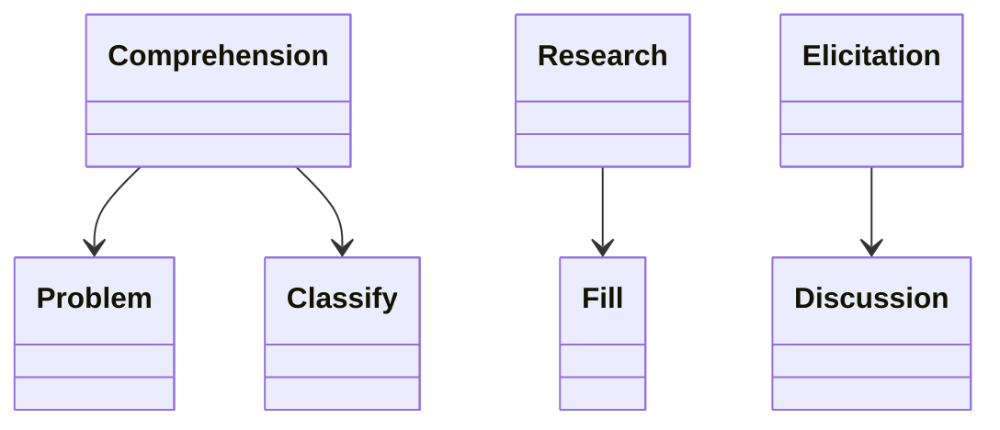
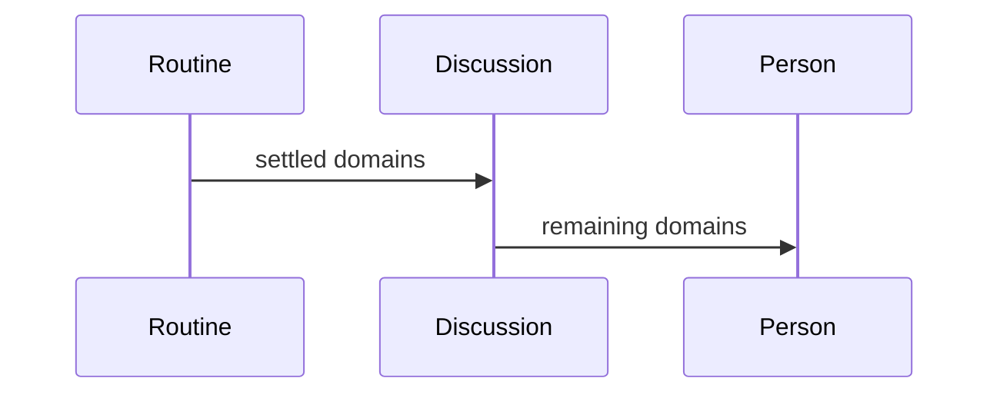

## Overview

This work makes the readings that happen before any code is written, and the order they run in.

## Problem

- **Implementation starts from an unsettled problem.**
  The worker has to say what the problem is, how it is classified, what is already known, and which questions are still open.

## Proposal

- **Each reading has its own place.**
  The research document is a fill into a refactored resource section.
  - The problem statement is its own technique.
  - Classification and the path rationale are one technique.
  - The routine records that comprehension runs.
  - Research gather, synthesis, and triage stay three techniques.
  - The elicitation routine walks the guide's domain list.
  - The discussion technique names domains already settled.

- **The tests accompany the components.**
  A unit test fails when a component's declared inputs do not match the contract in the [grain rubric](grain-rubric.md). An integration test loads the routine in a fixture workflow and fails when a settled domain is still posed.

**Structure.** Design and discovery is a set of techniques a routine orders. The research document is a fill.

**Behaviour.** The discussion poses only the domains the routine has not already settled.

## Work Breakdown

| Part | Description |
| --- | --- |
| Analysis | Name the readings that have to hold before code is written |
| Implementation | Write the problem, classification, research, and elicitation components |
| Test | A settled domain is not posed, and declared inputs match the grain rubric |

## References

- **R1.** [E06](https://github.com/m2ux/workflow-server/issues/1126) — the epic whose table indexes this work.
- **R2.** [Planning record](README.md) — the record this file belongs to.
