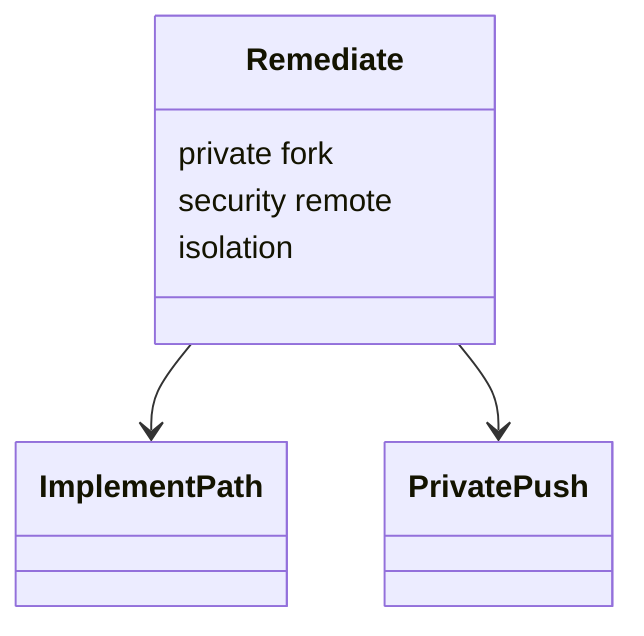
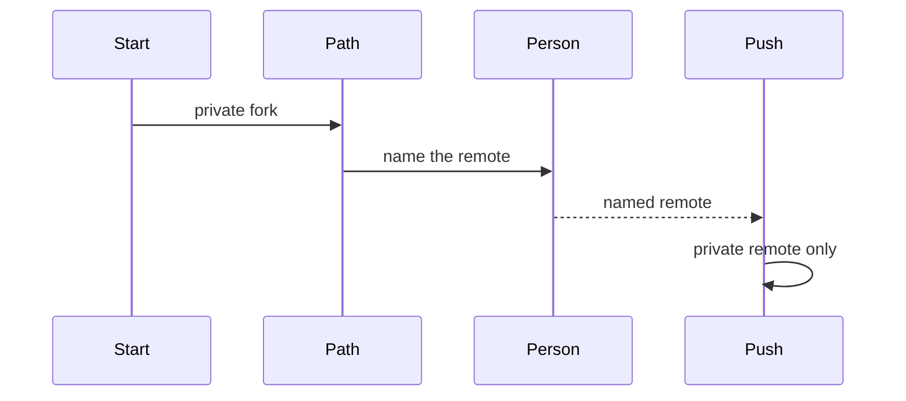

## Overview

This work wires the remediate run and walks it, so a vulnerability fix is pushed only to a private remote that someone has named.

## Problem

- **A vulnerability fix must leave the public repository untouched.**
  The change is pushed to a private remote, and only after someone has confirmed which remote that is.

## Proposal

- **The id is `remediate`.**
  Start is the private fork and the `security` remote, with no public GitHub. The rest follows implement. Submit is a private push. Isolation rules sit on this workflow.

- **The walk names the remote before the push.**
  The walk's push names only a private remote. The walk reaches that push only after a checkpoint whose message names the remote.

- **The workflow declares neither `is_review_mode` nor `stealth_mode`.**
  It also leaves undeclared:
  - `rating_cap`
  - `prior_feedback_triage`
  - `squash_merge_supported`

The README states this mode and names no other mode's activities.

The workflow omits:

- public-pull-request names
- review-delivery names

It declares the advisory and private-fork names.

- **The tests of this wiring accompany it.**
  A sidecar specimen walks remediate. Any unit or integration test of this wiring is in this work. The claim table names the walk. A mismatch changes the bound routine, technique, or resource, with the tests that cover that change.

- **`corpus/remediate-vuln` is retired.**
  Its readers are retargeted:
  - prism-audit
  - the readme-seed specimen
  - the meta patterns note

**Structure.** Remediate is the implement path plus a private fork and the security remote.

**Behaviour.** The push runs after a confirmation that names the remote.

## Work Breakdown

| Part | Description |
| --- | --- |
| Plan | Lay out the private fork, the security remote, and the names the workflow omits |
| Implementation | Wire `workflows/remediate`, including the confirmation that names the remote, and retarget the readers of `corpus/remediate-vuln` |
| Review | Walk the run through the confirmation to the private push |
| Test | The walk, and any unit or integration test of the wiring, stay with this work. A mismatch changes the bound component |

## References

- **R1.** [E06](https://github.com/m2ux/workflow-server/issues/1126) — the epic whose table indexes this work.
- **R2.** [Planning record](README.md) — the record this file belongs to.
