# Work — I10 E06

Each heading describes that task's work. Coverage, dependencies, and joins stay in the epic table.

Reusable routines, techniques, and resources are specced, created, and tested before an activity binds them. Wiring then derives behaviour from those activities and compares it with the behaviour the mode expected.

When they differ, the wiring task changes the routine, technique, or resource, and the tests that cover the change, until fit, form, and function hold. The same task changes the expected behaviour or the function when the structure shows that earlier statement was wrong.

Every test of a task accompanies that task:

- its unit tests
- its integration tests
- its walk

## W01 Place and walk the legacy workflow

The combined workflow moves to `corpus/work-package/workflows/legacy/`. The workflow id is `legacy`. The schema path is `../../../../schemas/workflow.schema.json`.

Links whose target moved follow the files. Technique references to the combined workflow become `legacy::`. A caller that starts the combined workflow names `legacy`, including `execute-package`.

The files that move are:

- `workflow.yaml`
- `activities/`
- `techniques/`
- `routines/`
- `resources/`
- the README

Legacy declares `is_review_mode` and `stealth_mode`. It does not bind the library. Its file layout is the behaviour reference for the components that follow. It is not the grain those components copy.

The tests of this move accompany it. A sidecar specimen walks legacy. The claim table in this record names the walk. The task stays open while any of its tests report a failure.

**Structure.** The legacy workflow contains the files that moved with it.

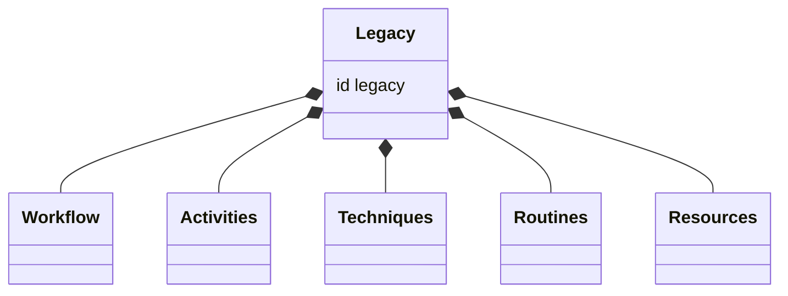

**Behaviour.** A caller starts `legacy`, and the specimen walk reports the steps.

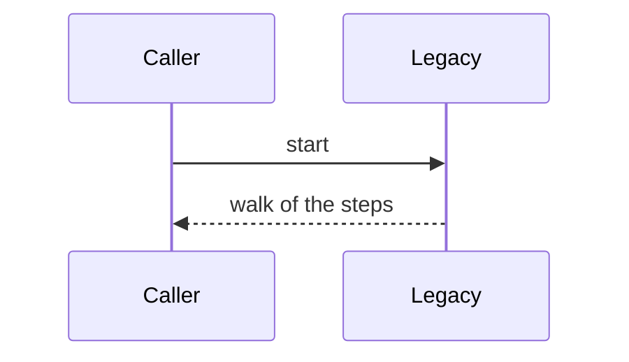

## W02 Add the library and its guard

`corpus/work-package/` holds the library folders and no `workflow.yaml`:

- `routines/`
- `techniques/`
- `resources/`

The library README names each mode in one line, and does not spec the routines or the resources:

- `workflows/legacy`
- `workflows/implement`
- `workflows/review`
- `workflows/remediate`

The mode-variable guard lands on `main`. Its unit tests and its integration test accompany it. The library files land on `workflows`.

The unit tests fail when:

- implement, review, or remediate declares `is_review_mode` or `stealth_mode`
- one of those workflows declares a variable none of its activities reads or writes

The integration test loads a fixture workflow that declares one of those names and expects the guard to fail.

**Structure.** The library holds the shared folders. The guard stands beside the three mode workflows.

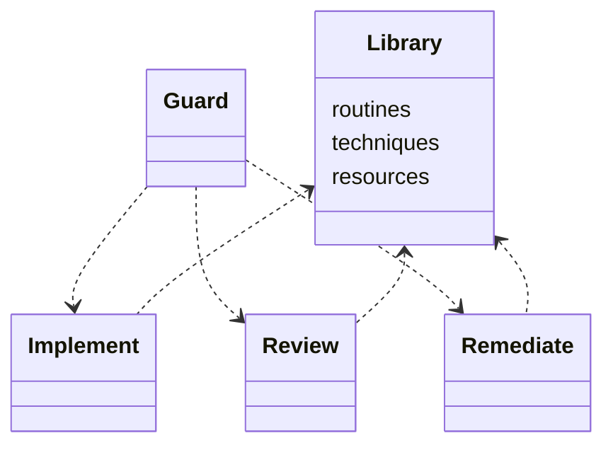

**Behaviour.** The guard rejects a mode flag or a variable no activity uses.

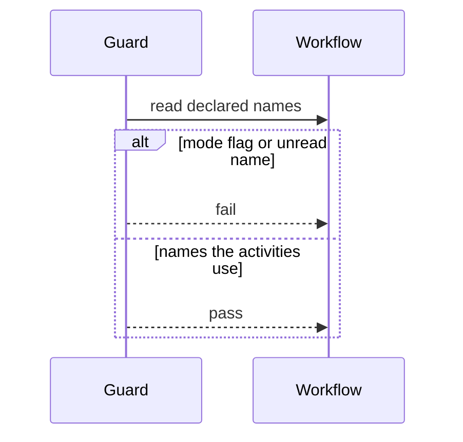

## W03 Refactor resource grain

The resources that live with the combined workflow are reviewed for grain and rewritten onto the library. A procedure a technique owns moves out of the resource. Citations are at section grain. A section fetch returns that section. Legacy keeps its own copies.

A resource holds:

- templates
- vocabularies
- criteria
- policy

The set is:

- the plan guide
- the findings guide
- the close-out guide
- the ADR guide
- the elicitation guide
- the design-framework guide
- the assumptions guide
- the review guides

The tests accompany the refactor. A unit test fails when a refactored resource still contains a protocol cadence. An integration test fetches one section and fails when the response is the whole file.

**Structure.** A resource is sections of fill and consult. A technique cites a section and keeps the procedure.

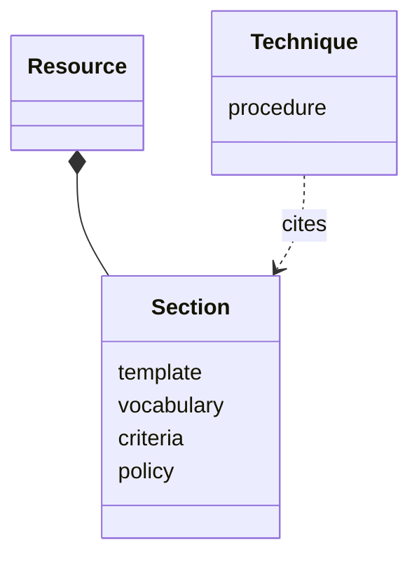

**Behaviour.** A section fetch returns that section.

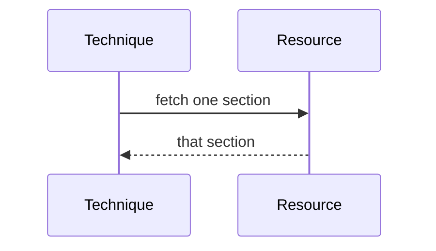

## W04 Add workspace, commit, and push

Spec and create the library routines for opening a workspace, committing, and pushing. A parameter selects the workspace kind and whether the push must be private.

The private-remote check is a phase of the push routine when the host is determinate, and a technique when the URL is ambiguous. The routine binds `git::` and `github::` directly. A local technique exists only where this library adds a reading those namespaces do not contain.

The tests accompany the routines. A unit test fails when the empty-diff gate or the determinate-private gate accepts the wrong input. An integration test loads each routine in a fixture workflow and fails when the splice does not bind the shared technique.

**Structure.** The three routines bind the shared git and GitHub techniques. An ambiguous URL is its own reading.

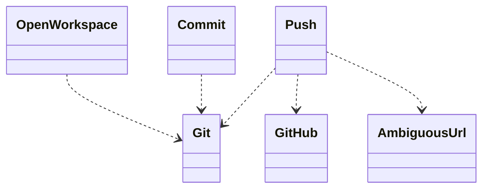

**Behaviour.** A push stops on an empty diff, and an ambiguous URL is read before the push.

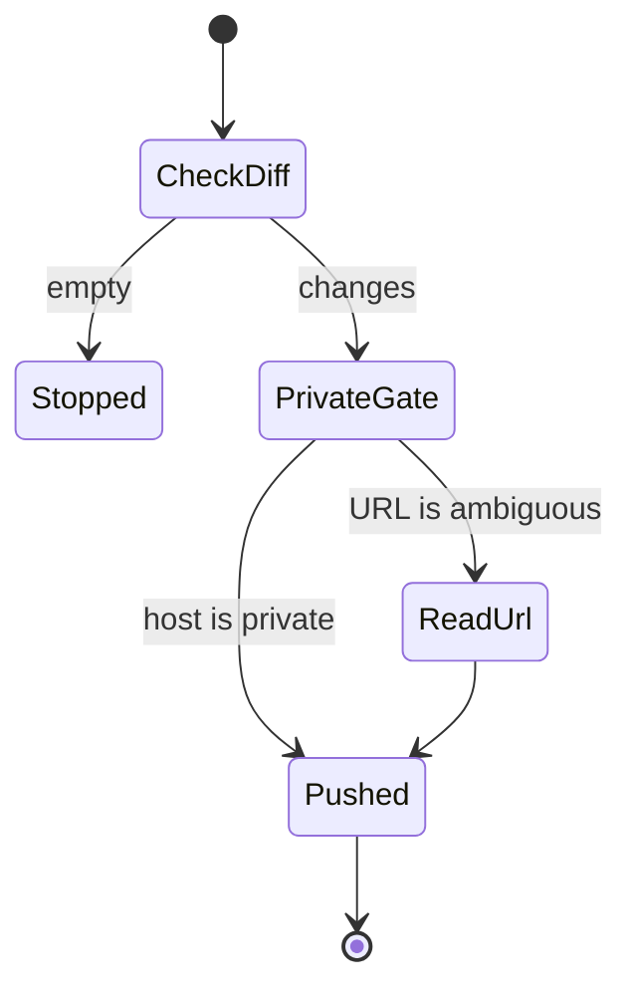

## W05 Add the document fill

Spec and create the one write technique. It cites a section of a refactored resource. The parameter names the section. A composition, such as the review summary, is not this technique.

The sections are:

- plan
- findings
- close-out
- ADR
- elicitation

The tests accompany the technique. A unit test fails when the technique cites a section the resource does not contain. An integration test loads the technique against a fixture resource and fails when the cited section is not the one the parameter selected.

**Structure.** One write technique reaches the fill sections. A composition stands apart from it.

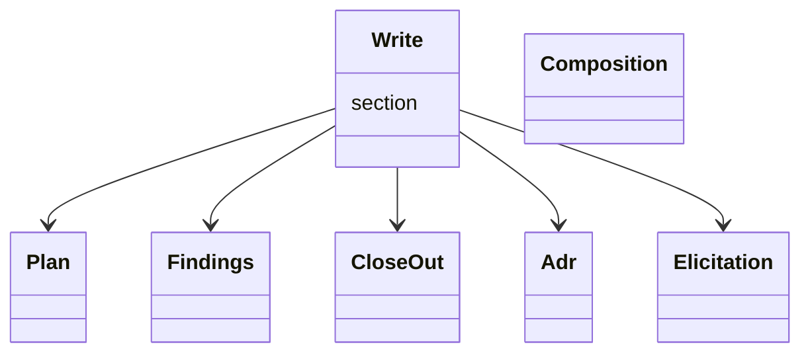

**Behaviour.** The parameter selects the section the technique cites.

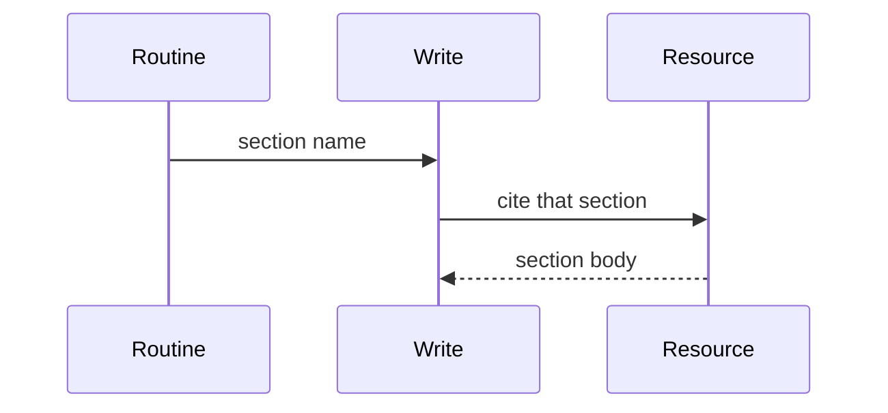

## W06 Add the review judgments

Spec and create the review-judgment techniques. They cite the refactored resource sections.

The techniques are:

- the diff review
- the code review
- the test-suite review
- settling findings

The diff review runs once. A fill applies a person's reply. The per-block interview stays a checkpoint. After a fix, only the lens that raised the finding runs again.

The tests accompany the techniques. A unit test fails when a second lens is selected for a finding the first lens raised. An integration test loads the diff technique and the fill and fails when the reply is applied by fetching the whole review again.

**Structure.** Each judgment technique cites the resource sections it reads.

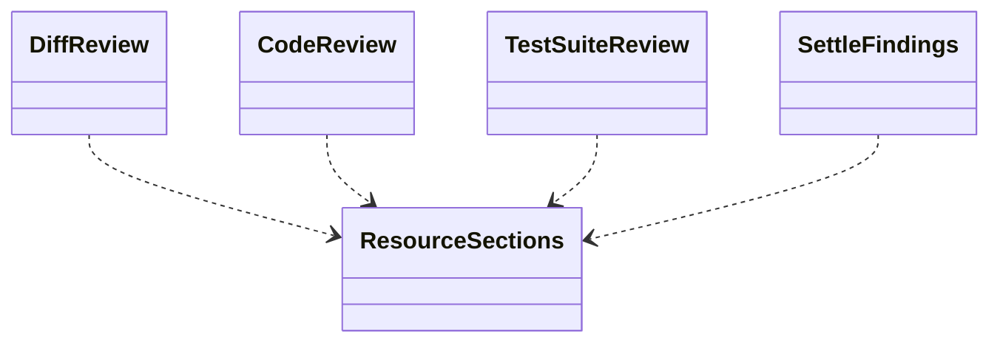

**Behaviour.** A finding is rechecked by the lens that raised it, after the fill applies the reply.

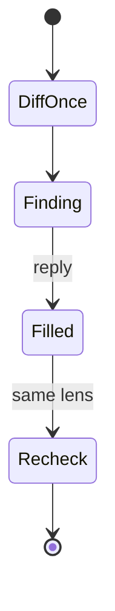

The review judgments are a sizeable contract of their own.

## W07 Add the delivery routines

Spec and create three separate library routines. A mode binds only the routine it runs. These routines bind the push routine.

The routines are:

- publish a pull request
- post a review
- push to a private remote

The private push waits for a confirmation that names the remote when the host is already known to be private. The ambiguous-URL reading stays a technique.

The tests accompany the routines. A unit test fails when one delivery routine names a technique that belongs to another mode. An integration test loads each routine in a fixture workflow and fails when the unused mode's technique is bound.

**Structure.** Three delivery routines. Each binds the shared push, and a mode binds one of them.

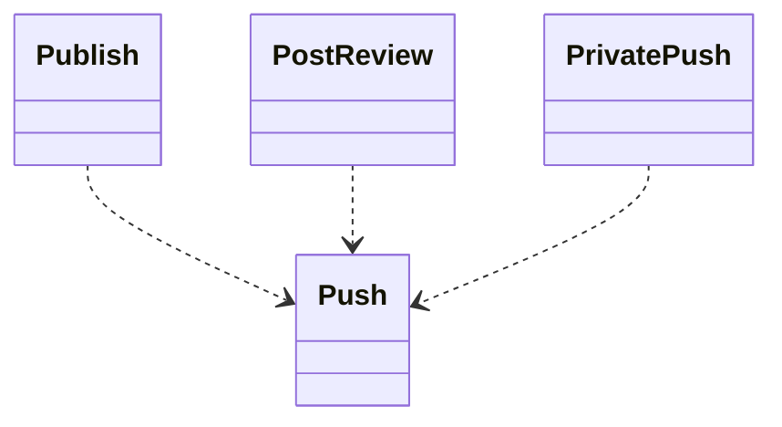

**Behaviour.** A private push waits until the confirmation names the remote.

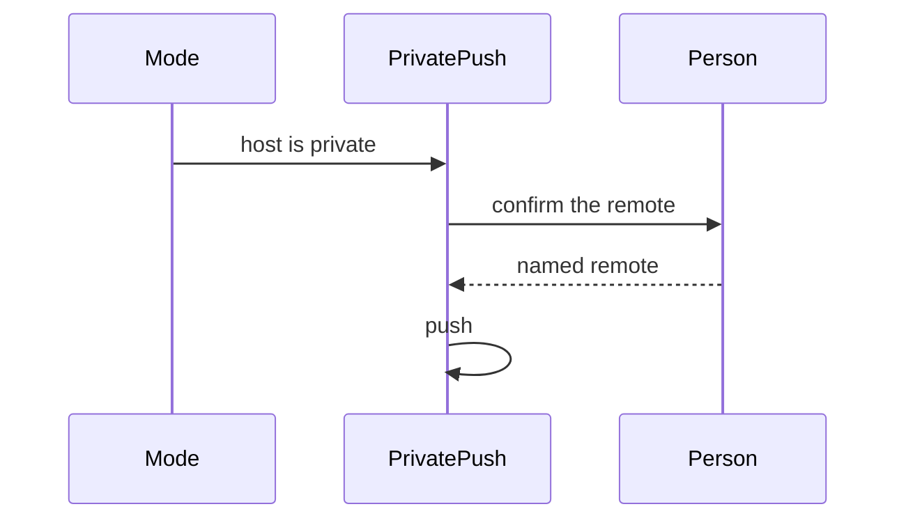

## W08 Add design and discovery

Spec and create the design and discovery components. The research document is a fill into a refactored resource section.

The components are:

- The problem statement is its own technique.
- Classification and the path rationale are one technique.
- The routine records that comprehension runs.
- Research gather, synthesis, and triage stay three techniques.
- The elicitation routine walks the guide's domain list.
- The discussion technique names domains already settled.

The tests accompany the components. A unit test fails when a component's declared inputs do not match the contract in the [grain rubric](grain-rubric.md). An integration test loads the routine in a fixture workflow and fails when a settled domain is still posed.

**Structure.** Design and discovery is a set of techniques a routine orders. The research document is a fill.

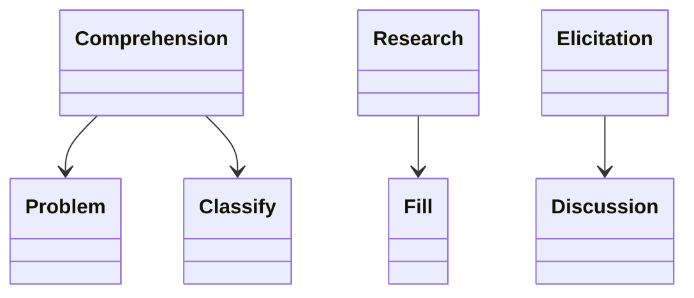

**Behaviour.** The discussion poses only the domains the routine has not already settled.

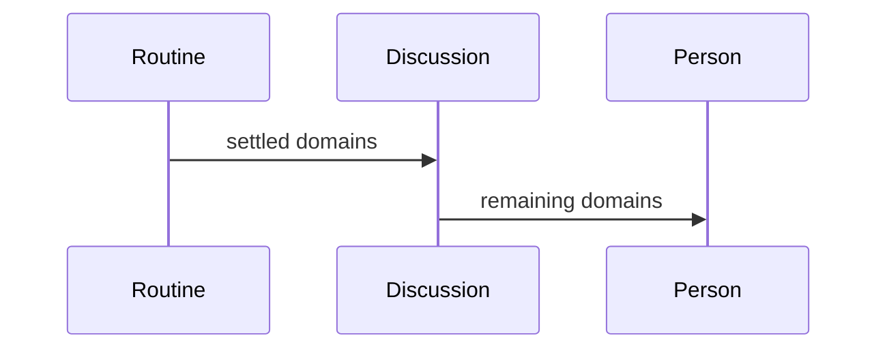

Design and discovery are one sizeable contract.

## W09 Add and walk the implement workflow

Wire `workflows/implement/` to the components above. The folder holds `workflow.yaml`, `activities/`, and a README. The id is `implement`.

The graph is the authoring path:

- start
- design
- comprehension
- optional elicitation and research
- analysis
- plan
- assumptions
- implement
- lean-coding audit that applies
- post-impl review that fixes
- validate that fixes
- strategic review that applies
- submit that pushes and marks ready
- complete that writes an ADR when complexity requires it

Activities bind `work-package::` routines and techniques, and only those this graph runs. The workflow declares neither `is_review_mode` nor `stealth_mode`. The README states this mode and names no other mode's activities.

The workflow omits:

- review-delivery names
- security-remote names

The tests of this wiring accompany it. A sidecar specimen walks implement. Any unit or integration test of this wiring is in this task. The claim table names the walk. The task stays open while any of its tests report a failure.

A mismatch changes the bound routine, technique, or resource in this task, with the tests that cover that change.

The step manifest includes no step that:

- posts a pull-request review
- pushes to a private remote

`execute-package` names `legacy`.

**Structure.** The implement workflow is its activities. They bind the library and carry no review-delivery or security-remote names.

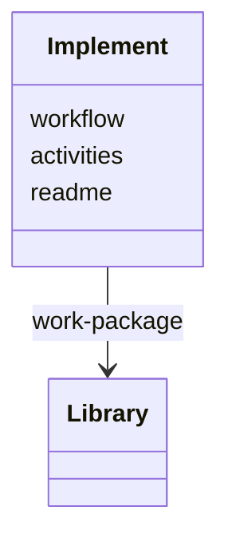

**Behaviour.** Review can return the work to implementation. Submit follows a review that holds.

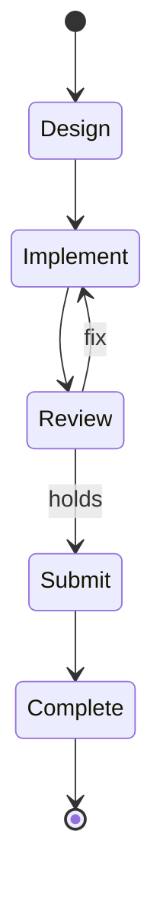

## W10 Add and walk the review workflow

Wire `workflows/review/` to the components above. The id is `review`. Start captures the existing pull request. Submit posts the review. Complete republishes the close-out and skips the ADR.

The path omits elicitation and implement. These activities document and do not apply:

- lean-coding
- post-impl
- validate
- strategic review

The workflow declares neither `is_review_mode` nor `stealth_mode`. The README states this mode and names no other mode's activities.

The workflow omits:

- implementation-plan execution names
- public-pull-request lifecycle names it never writes

The tests of this wiring accompany it. A sidecar specimen walks review. Any unit or integration test of this wiring is in this task. The claim table names the walk. The task stays open while any of its tests report a failure.

A mismatch changes the bound routine, technique, or resource in this task, with the tests that cover that change.

The step manifest includes no step that:

- writes implementation files
- creates a public pull request

**Structure.** The review workflow documents. It has no implement activity and no public-pull-request lifecycle.

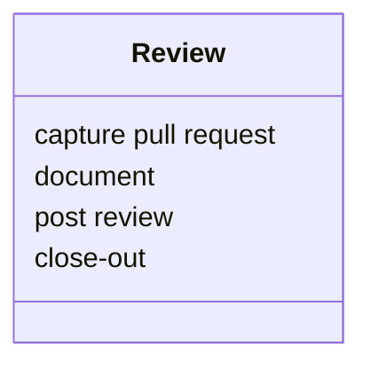

**Behaviour.** The run captures a pull request, documents the lenses, posts the review, and republishes the close-out.

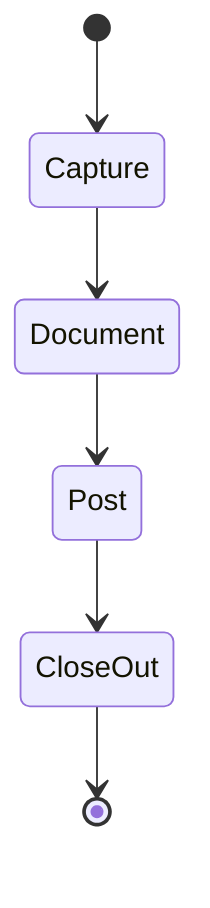

## W11 Add and walk the remediate workflow

Wire `workflows/remediate/` to the components above. The id is `remediate`. Start is the private fork and the `security` remote, with no public GitHub. The rest follows implement. Submit is a private push. Isolation rules sit on this workflow.

The walk's push names only a private remote. The walk reaches that push only after a checkpoint whose message names the remote.

The workflow declares neither `is_review_mode` nor `stealth_mode`. It also leaves undeclared:

- `rating_cap`
- `prior_feedback_triage`
- `squash_merge_supported`

The README states this mode and names no other mode's activities.

The workflow omits:

- public-pull-request names
- review-delivery names

It declares the advisory and private-fork names.

The tests of this wiring accompany it. A sidecar specimen walks remediate. Any unit or integration test of this wiring is in this task. The claim table names the walk. The task stays open while any of its tests report a failure.

A mismatch changes the bound routine, technique, or resource in this task, with the tests that cover that change.

`corpus/remediate-vuln` is retired. Its readers are retargeted:

- prism-audit
- the readme-seed specimen
- the meta patterns note

**Structure.** Remediate is the implement path plus a private fork and the security remote.

```mermaid
classDiagram
  class Remediate {
    private fork
    security remote
    isolation
  }
  class ImplementPath
  class PrivatePush
  Remediate --> ImplementPath
  Remediate --> PrivatePush
```

**Behaviour.** The push runs after a confirmation that names the remote.

```mermaid
sequenceDiagram
  participant Start
  participant Path
  participant Person
  participant Push
  Start->>Path: private fork
  Path->>Person: name the remote
  Person-->>Push: named remote
  Push->>Push: private remote only
```
