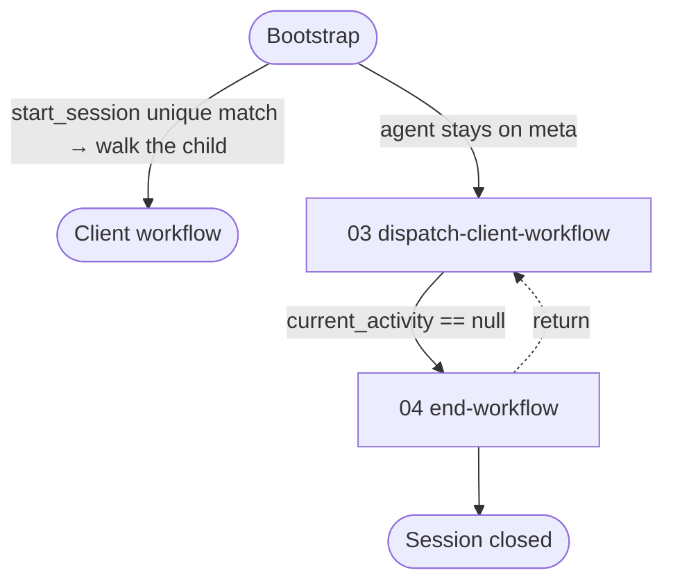

# Meta Workflow

> Top-level lifecycle workflow for the workflow-server. Bootstrap navigates here directly. `start_session` opens the client when the request uniquely matches a catalog workflow; walk that child. An agent that remains on meta drives the child through dispatch-client-workflow and closes the session. Provides the universal technique repository for all client workflows.

---

## Overview

The meta workflow is the structural home for the orchestration logic that used to live in technique prose. Every meta activity runs in the meta session as a real activity with formal steps (each binding a technique operation via `step.technique`), checkpoints, transitions, and — for `dispatch-client-workflow` — a reference to the [`activity-loop`](routines/activity-loop.yaml) run, which holds the `while` loop that walks a session one activity at a time. Universal techniques live under [techniques/](techniques/) and are auto-resolved for any client workflow via the loader's workflow-local → `meta` fallback.

**Key characteristics:**

- Excluded from `list_workflows` — not a user-facing workflow.
- Bootstrap (resource [`bootstrap-protocol`](./resources/bootstrap-protocol.md)) is the pre-session stub served by `discover`: `start_session` with `working_directory` and `user_request`. A unique catalog match returns `client.session_index`; walk that child. Named decisions (`workflow-selection`, `resume-session`) return with no session. Ongoing delivery policy lives in the operations bundle ([workflow-engine](./techniques/workflow-engine/TECHNIQUE.md)).
- Universal techniques resolve for any session via the loader's workflow-local → `meta` fallback chain.
- State persistence is server-managed (no agent-side persist/restore); on-disk shape: [`docs/state_management_model.md`](../../docs/state_management_model.md).

| # | Activity | Role |
|---|----------|------|
| 03 | [**Dispatch Client Workflow**](./activities/README.md#03-dispatch-client-workflow) | Drive the already-open client workflow end to end inline, each worker carrying a bounded run of activities, mediating its checkpoints with the user |
| 04 | [**End Workflow**](./activities/README.md#04-end-workflow) | Verify the client workflow's outcomes, summarise the session, and confirm closure |

**Detailed documentation:**

- **Activities:** see [activities/README.md](./activities/README.md) for the role each activity plays and links to its authoritative definition.
- **Pattern library:** see [activities/patterns/README.md](./activities/patterns/README.md) for borrowable mid-phase multi-agent pipelines (`orchestration-patterns` technique group).
- **Techniques:** see [techniques/](./techniques/) for the universal techniques and the rule-authority map ([`agent-conduct`](./techniques/agent-conduct.md) is the single source of truth for the cross-cutting rules every agent is held to, [`orchestrator-conduct`](./techniques/orchestrator-conduct.md) for the ones only an orchestrator can honour, and [`worker-conduct`](./techniques/worker-conduct.md) for the ones only a dispatched worker can). The [`orchestration-patterns`](./techniques/orchestration-patterns/TECHNIQUE.md) group supplies atomic dispatch/gather/synthesise ops for those pattern activities.
- **Resources:** see [resources/README.md](./resources/README.md) for the bootstrap protocol and prompt templates.

---

## Workflow Flow



---

## Hierarchical Orchestration Model

Meta is the user-facing orchestrator; the client session is a child `start_session` embeds. An agent that remains on meta drives that child inline through [`03-dispatch-client-workflow`](./activities/03-dispatch-client-workflow.yaml). Dispatch, checkpoint mediation, and role boundaries live in [workflow-engine](./techniques/workflow-engine/TECHNIQUE.md) ([dispatch-activity](./techniques/workflow-engine/dispatch-activity.md), [workflow-orchestrator](./techniques/workflow-engine/workflow-orchestrator.md), [activity-worker](./techniques/workflow-engine/activity-worker.md)) and [agent-conduct](./techniques/agent-conduct.md), which own that HOW.

---

## Techniques and the cross-workflow shared layer

The `meta/techniques/` and `meta/resources/` folders carry double duty. They
are the local content for the meta workflow itself AND the cross-workflow
shared layer — when any workflow asks for a technique that has no
workflow-local definition, the loader resolves it from `meta/techniques/`.
The ontology and section conventions every technique follows are defined in
[`meta/resources/workflow-canonical.md`](./resources/workflow-canonical.md).

Markdown techniques live under [`meta/techniques/`](techniques/). A standalone
technique is a single `<slug>.md` file; a grouped technique is a `<group>/`
folder containing `TECHNIQUE.md` (the index/base contract) plus one `<op>.md`
per operation, each addressed `<group>::<op>`. The
[`meta/techniques/TECHNIQUE.md`](techniques/TECHNIQUE.md) root base contract
is inherited by every meta technique.

---

## Techniques

Universal techniques referenced by canonical ID (the file/folder slug).

| Technique | Capability |
|-----------|------------|
| [`workflow-engine`](techniques/workflow-engine/TECHNIQUE.md) | Operations and rules for executing a workflow's structured flow — session lifecycle, activity dispatch, agent entry, transitions, planning Progress, and the checkpoint protocol. |
| [`agent-conduct`](techniques/agent-conduct.md) | Cross-cutting behavioural boundaries every agent is held to — single source of truth for file sensitivity, communication tone, attribution, code commentary, interaction, operational discipline and checkpoint discipline |
| [`orchestrator-conduct`](techniques/orchestrator-conduct.md) | The boundaries only an orchestrator can honour — single source of truth for domain-work delegation, agent-tree depth, dispatch on resume, commit scope, automatic transitions and ad-hoc interaction |
| [`worker-conduct`](techniques/worker-conduct.md) | The boundaries only a dispatched worker can honour — how it writes the artifacts its activity declares, and what it reports having written |
| [`verify-artifact-conforms`](techniques/verify-artifact-conforms.md) | Artifact-conformance pass any workflow binds: each artifact measured against the guide its filename maps to, the caller's canonical-home map, and the [Artifact Writing Register](resources/writing-register.md), corrected in place |
| [`harness-compat`](techniques/harness-compat/TECHNIQUE.md) | Harness-independent operations (`spawn-agent`, `continue-agent`, `spawn-concurrent`, `resolve-harness-operation`) abstracting cross-tool dispatch |

> Cross-cutting rules live in `agent-conduct` (any agent), `orchestrator-conduct` (an orchestrator's alone) and `worker-conduct` (a dispatched worker's alone), and capability techniques (`workflow-engine`, `harness-compat`, etc.) reference them as their single source of truth. A bundle addresses the rule families its role owns, so a rule reaches the agent that can act on it.

---

## Resources

| Resource ID | Resource | Purpose |
|-------------|----------|---------|
| `bootstrap-protocol` | [Bootstrap Protocol](./resources/bootstrap-protocol.md) | Pre-session stub served by `discover` — `start_session` with `working_directory` and `user_request`; unique match walks the child. Ongoing delivery policy is in the operations bundle. |
| `session-summary-template` | [Session Summary Template](./resources/session-summary-template.md) | Skeleton for the markdown session summary composed by `generate-summary` at workflow close. |
| `planning-readme` | [Planning Folder README Guide](./resources/planning-readme.md) | Universal Template + Progress Status policy for planning-folder `README.md`. |
| `resume-intent-lexicon` | [Resume Intent Lexicon](./resources/resume-intent-lexicon.md) | Continuation-phrase vocabulary `start_session` matches when deciding whether to scan saved sessions. |

Agent entry Protocol: [`workflow-engine::activity-worker`](./techniques/workflow-engine/activity-worker.md) and [`workflow-engine::workflow-orchestrator`](./techniques/workflow-engine/workflow-orchestrator.md); agent stubs from [`compose-prompt`](./techniques/workflow-engine/compose-prompt.md).

> The on-disk session-state shape is defined by [`schemas/session-file.schema.json`](../../schemas/session-file.schema.json); see [`docs/state_management_model.md`](../../docs/state_management_model.md) for the persistence model.

---

## Outputs

Meta itself produces no domain artefacts. Its outputs are session-state side-effects:

- A meta session that lives for the duration of the user's request.
- A child client session for the matched workflow, embedded in the meta session's own `session.json` under the launch record the server keeps of the dispatch.
- A planning folder under `.engineering/artifacts/planning/` containing the client workflow's server-managed `session.json` + `.session-token` (seal) pair and downstream artifacts.
- A session summary presented to the user at the completion checkpoint.

---

## File Structure

```
corpus/meta/
├── workflow.yaml                            # Meta workflow definition
├── README.md                                # This file
├── activities/
│   ├── 03-dispatch-client-workflow.yaml     # Drive the client activity loop, a bounded run of activities per worker
│   └── 04-end-workflow.yaml                 # Outcome verification, summary
├── routines/
│   ├── activity-loop.yaml                   # Walk a session one activity at a time, until none follows
│   └── dispatch-round.yaml                  # Compose, dispatch and gather one round of worker briefs
├── techniques/
│   ├── TECHNIQUE.md                         # Root base contract (inherited by every meta technique)
│   ├── agent-conduct.md                     # Cross-cutting rules any agent can act on (single source of truth)
│   ├── orchestrator-conduct.md              # The boundaries only an orchestrator can honour
│   ├── worker-conduct.md                    # The boundaries only a dispatched worker can honour
│   ├── variable-binding.md                  # Strategy technique — bind step inputs/outputs to variables
│   ├── scatter-gather.md                    # Strategy technique — forEach fan-out / gather
│   ├── verify-artifact-conforms.md          # Artifact-conformance pass bound by any workflow that persists artifacts
│   ├── workflow-engine/                     # Session lifecycle, dispatch, transitions, checkpoint protocol
│   │   ├── TECHNIQUE.md                     #   group index / base contract
│   │   └── {op}.md                          #   one file per operation (start-session, create-session, dispatch-activity, ...)
│   ├── harness-compat/                      # Harness-independent agent dispatch
│   ├── orchestration-patterns/              # Atomic dispatch/gather/synthesise ops for pattern activities
│   └── fan/                                 # Contract and rules for carrying a graph fan
└── resources/
    ├── README.md                            # Resource index
    ├── bootstrap-protocol.md                # Pre-session stub (discover)
    ├── session-summary-template.md
    ├── planning-readme.md                   # Universal planning README Template + Progress policy
    ├── resume-intent-lexicon.md             # Continuation phrases gating the saved-session search
    └── workflow-canonical.md                # Ontology / section conventions
```
