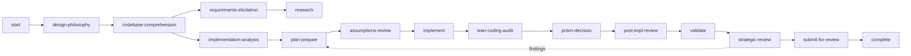

# Security Vulnerability Remediation Workflow (remediate-vuln)

## Overview
A workflow for remediating security vulnerabilities on the private `security` remote. It owns the security-specific setup. Every other activity is borrowed from `work-package`. Submission verifies that remote and confirms with the user before any push.

## Activities

| # | Activity | Source | Purpose |
|---|----------|--------|---------|
| 01 | start | own ([01-start.yaml](activities/01-start.yaml)) | Advisory inputs, private `security` remote, isolation checks, security branch, project-type + repo-root resolution, signing preflight |
| 02 | design-philosophy | work-package | Problem classification and workflow path |
| 03 | requirements-elicitation | work-package | Optional requirements discovery |
| 04 | research | work-package | Optional research (constrained by the private-research rule) |
| 05 | implementation-analysis | work-package | Current-state analysis |
| 06 | plan-prepare | work-package | Plan and test strategy |
| 07 | assumptions-review | work-package | Assumption interview |
| 08 | implement | work-package | Task-cycle implementation with provenance log |
| 09 | lean-coding-audit | work-package | Over-engineering audit |
| 16 | prism-decision | work-package | Full prism pipeline or inline structural pass |
| 10 | post-impl-review | work-package | Code/diff/test review |
| 11 | validate | work-package | Build/test/lint suite |
| 12 | strategic-review | work-package | Scope/minimality review + commit-signature scan and re-sign |
| 13 | submit-for-review | work-package | DCO attestation, private-remote isolation checks, push to `security` |
| 14 | complete | work-package | Close-out |
| 15 | codebase-comprehension | work-package | Comprehension deep-dive |

## Techniques
The workflow keeps one local technique group, [security-setup](techniques/security-setup/TECHNIQUE.md); all other techniques come from work-package (via borrowed activities) and meta.
