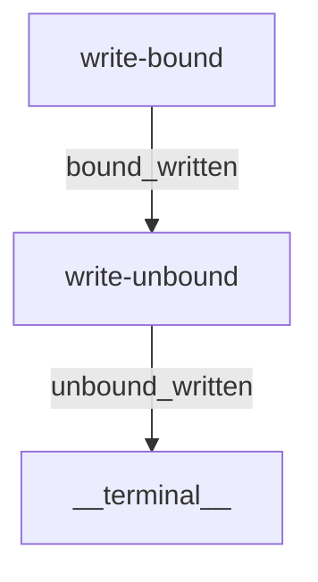

# Artifact Destination Conformance

Demonstrates that an activity writing an artifact to a bound external destination lands the artifact at that destination while leaving session state isolated in the planning folder. A subsequent activity without a bound destination defaults to the planning folder.

## Activities Flow

- **`write-bound`**: Persists `bound-conformance-report.md` to `{artifact_destination}`.
- **`write-unbound`**: Persists `unbound-conformance-report.md` under `{planning_folder_path}`.
