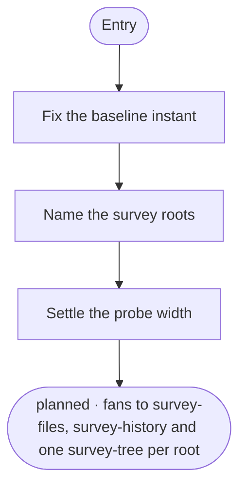
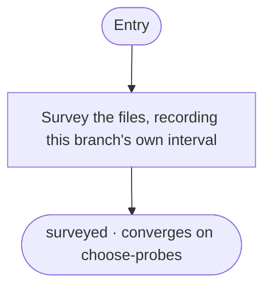
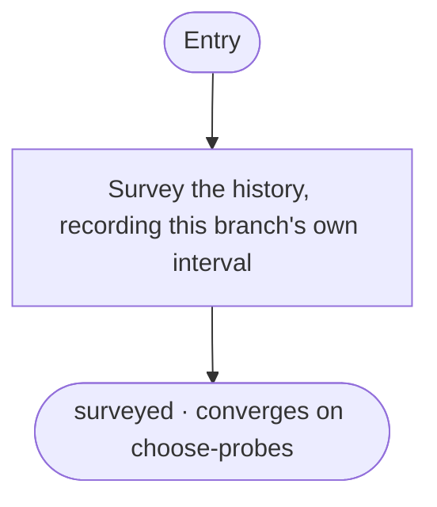
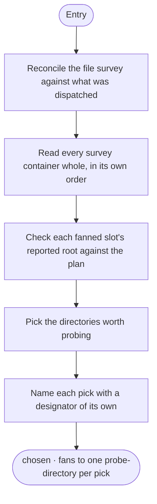
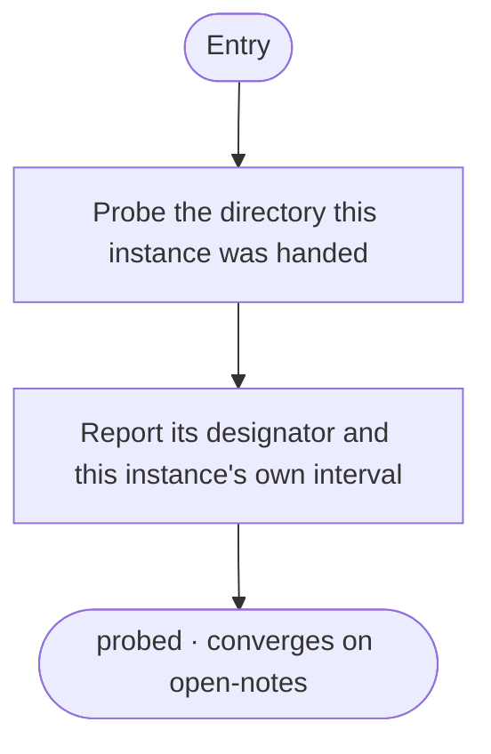
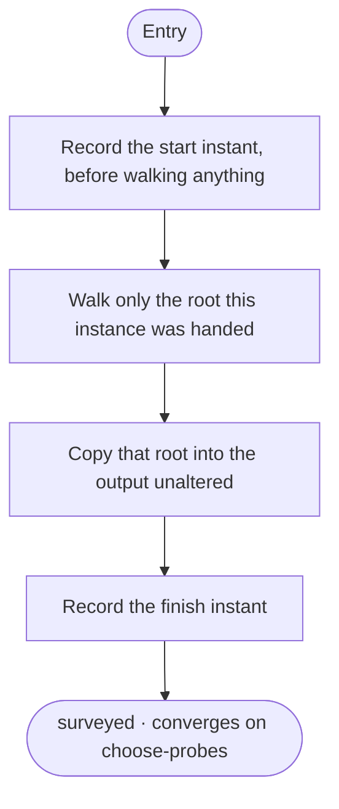
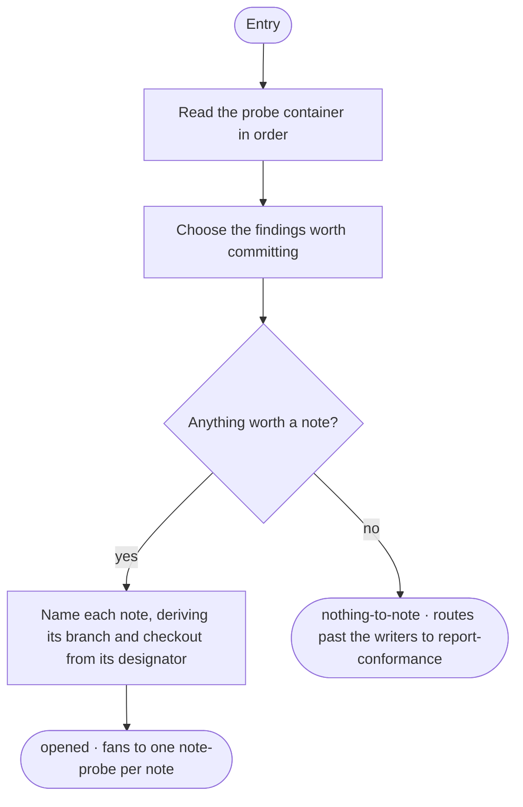
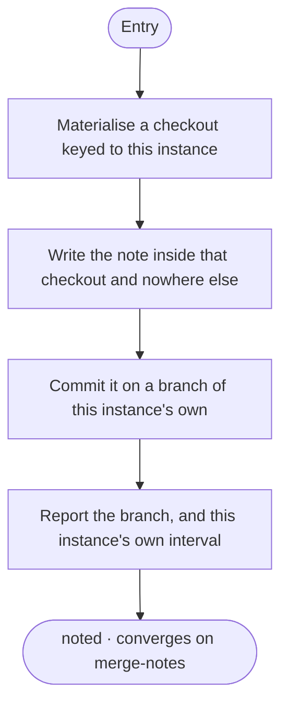
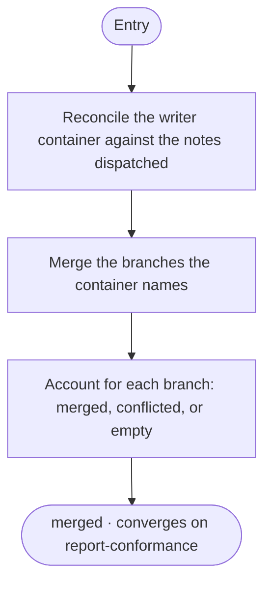
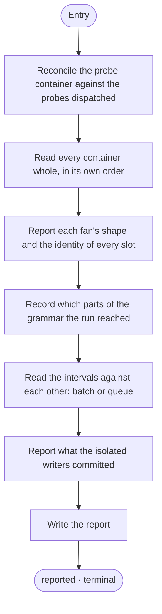

# Fan Conformance Activities

> Part of the [Fan Conformance Workflow](../README.md)

This is the per-activity orientation map: each entry gives the activity's purpose, the position it holds in a fan, what that position requires of it, and a link to its authoritative definition. The structured definition of each activity — its steps, exits, technique bindings and transitions — lives in the corresponding `NN-<id>.yaml` file; it is not duplicated here.

For the activity-to-activity flow diagram and the destination grammar the graph is written in, see the [workflow README](../README.md). Each activity section below also includes a mermaid diagram showing its internal flow.

---

## Position decides the contract

Almost every activity here is either a branch or the place branches converge, and which one it is decides what the run needs from it.

A **branch** cannot see its siblings, so everything the report needs about it has to come out of its own output. Two obligations follow structurally rather than stylistically: it records the instants it started and finished, and it reports back the designator it was handed. The first is what lets a reader tell a batch from a queue; the second is the only evidence that a branch was served its own element rather than a sibling's.

A **meeting point** never names a slot. It reads its containers whole and lets their order carry the correspondence, because the width of a fan is a run-time value no authored index could be checked against.

Choose Probes and Open Notes are each a meeting point and a fan source at once. That is legal — a fan may not converge on the activity whose exit opens it, since it would open again on every convergence and the graph would give it no way to finish, but nothing stops a convergence from opening a fan of its own.

---

### 01. Plan Conformance

Opens the run. Fixes the instant every branch's interval is read against, names the roots the tree survey walks, and settles how wide the probe fan opens — all before anything is surveyed, so the width is a decision rather than a consequence of the component it was pointed at. Source of the first fan, and the activity that writes the collection its own exit fans over.

Definition: [`01-plan-conformance.yaml`](./01-plan-conformance.yaml)

---

### 02. Survey Files

Counts the component's files by extension and ranks its largest directories, so a probe can be pointed somewhere worth probing. A branch the first destination names directly: it opens one branch and fills a single container slot.

Definition: [`02-survey-files.yaml`](./02-survey-files.yaml)

---

### 03. Survey History

Summarises the component's recent commits, their distinct authors, and the directories they touched, so a probe can be pointed at code that is moving rather than at the largest directory alone. The other member the first destination names directly.

Definition: [`03-survey-history.yaml`](./03-survey-history.yaml)

---

### 04. Choose Probes

Where the first fan converges and the second opens. Reads every survey container whole — the two single-slot containers its named siblings filled and the multi-slot container the fanned member filled — checks each fanned slot's reported root against the plan, then picks the directories worth probing and names each pick so its instance has a designator of its own.

Definition: [`04-choose-probes.yaml`](./04-choose-probes.yaml)

---

### 05. Probe Directory

Describes the one directory this instance was handed — its file count, its subdirectories, its largest file — from a context that saw only that directory, which is what an instance of its own is for. One instance per pick.

Definition: [`05-probe-directory.yaml`](./05-probe-directory.yaml)

---

### 06. Survey Tree

Walks one root of the component and reports its depth and its directory and file counts. The fanned member of the first destination: one instance per root, each reading only the root it was handed and reporting that root back unaltered, so an instance served a sibling's element is visible rather than silent.

Definition: [`06-survey-tree.yaml`](./06-survey-tree.yaml)

---

### 07. Open Notes

Where the probes converge and the last fan opens. Chooses which probe findings are worth a committed note — a note per probe by reflex would make the run's commits a count of the fan's width rather than evidence — and derives each note's branch and checkout path from its own designator, so no two writers can name one branch or one checkout. Carries the predicate that routes the run past the writers when nothing is worth recording.

Definition: [`07-open-notes.yaml`](./07-open-notes.yaml)

---

### 08. Note Probe

Writes one note and commits it on a branch of its own. Its first act is to materialise a checkout of its own — that binding is what admits the commit operations that follow, since branches of a fan otherwise share one working tree and no instance could attribute its own change. Every write it makes lands inside that checkout and nowhere else.

Definition: [`08-note-probe.yaml`](./08-note-probe.yaml)

---

### 09. Merge Notes

Where the isolated writers converge. Accounts for every branch the container names exactly once — merged with its commit, conflicted with its paths, or empty because that instance committed nothing — so no writer's commit is left in a checkout nothing reads. A conflict between two notes is reported rather than resolved by preferring one, because two units conflicting says the work was less independent than the fan assumed.

Definition: [`09-merge-notes.yaml`](./09-merge-notes.yaml)

---

### 10. Report Conformance

Where the run converges. Reads every container whole and writes the one document the run leaves behind: which slots were filled, by which designator, over which interval, which parts of the grammar the run reached, and what became of each isolated writer's branch. Entered on both paths — after the writers, or directly from Open Notes where nothing was worth committing.

Definition: [`10-report-conformance.yaml`](./10-report-conformance.yaml)

