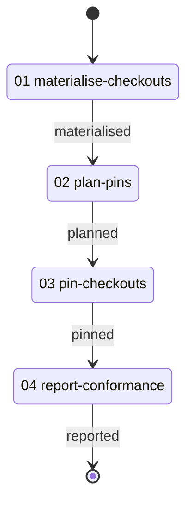

# Git Pin Conformance Workflow

> Stands two worktrees of the host repository, brings them to a branch, a tag and a commit through the git library's readiness run, asks for a name the repository cannot resolve, and reports what landed.

---

## Overview

This workflow exists to make the pin technique's answer observable for each kind of name it accepts. A session supplies it two things: a planning folder to write its report into and stand its checkouts under, and the repository the checkouts are worktrees of; everything else the run produces.

The work is deliberately cheap — two worktrees of a repository already present, moved by detached checkouts to commits the repository already holds. The evidence it leaves behind is about what the technique answered for each name and whether a refusal left the checkout where it stood, not about the repository it moved.

It serves two readers. One wants to know whether this server delivers the library's run so that a branch, a tag and a commit each land as their own kind and an unresolvable name is refused rather than guessed at, and takes that from the report. The other is writing a workflow that brings several checkouts to stated revisions and wants a worked example of the reference — a roster in, a per-checkout answer out.

| # | Activity | Description |
|---|----------|-------------|
| 01 | [**Materialise Checkouts**](./activities/README.md#01-materialise-checkouts) | Stand two worktrees of the host repository beneath the planning folder |
| 02 | [**Plan Pins**](./activities/README.md#02-plan-pins) | Name a branch, the newest tag, a commit, and a name nothing holds |
| 03 | [**Pin Checkouts**](./activities/README.md#03-pin-checkouts) | Bring both checkouts there through the shared readiness run |
| 04 | [**Report Conformance**](./activities/README.md#04-report-conformance) | Write what was asked beside what landed, and what the refusal left behind |

---

## Workflow Flow



---

## The shape it demonstrates

The pins are one run. The git library's [`ready-checkouts`](/git/routines/ready-checkouts.yaml) holds it: a loop over a roster, one [`pin-revision`](/git/techniques/pin-revision.md) per entry, and an answer appended per entry whatever the pin did.

Three things about that shape are worth copying.

**The roster is the whole argument.** The run reads `checkout_pins` from the host under its own spelling and lands `checkout_readiness` under the name the reference site binds, so the site carries no argument beyond that one output binding. A workflow wanting different checkouts writes a different roster.

**A refusal is an answer, not an abort.** A name the repository cannot resolve lands a refusal in the entry's row and the run walks on, so a roster of four asks yields four answers. The checkout a refused pin addressed is read back afterwards, because a refusal that moved the tree is the failure the specimen exists to catch.

**Each kind of name is its own row.** The roster names the form each entry should resolve as and the run answers with the form it did resolve as, so the report holds the two side by side. A tag the repository does not carry is a row the roster never held, written as a gap rather than dropped.

---

## File Structure

```
corpus/specimens/git-pin-conformance/
├── workflow.yaml                            # Workflow definition
├── README.md                                # This file
├── activities/
│   ├── 01-materialise-checkouts.yaml        # Stand the two worktrees
│   ├── 02-plan-pins.yaml                    # Name the roster
│   ├── 03-pin-checkouts.yaml                # The run, over the roster
│   └── 04-report-conformance.yaml           # Write the report
├── techniques/
│   ├── plan-pins.md                         # Name a branch, a tag, a commit, and a name nothing holds
│   └── report-pin-conformance.md            # Read asked beside landed and write the report
└── resources/
    └── conformance-report.md                # Creation guide for the report
```
