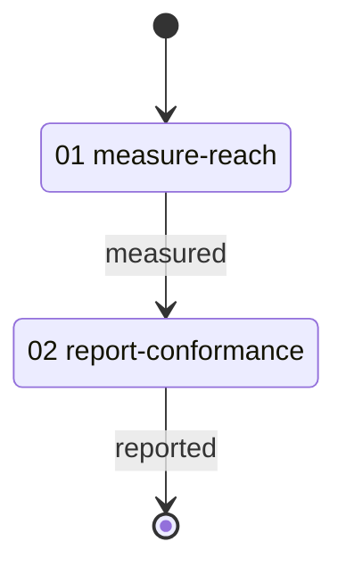

# GitNexus Radius Conformance Workflow

> Refers to the run that measures a concern's reach across a repository group, and reports what it settled for each member — the graph, the reach, and the instrument.

---

## Overview

This workflow exists to make the cross-graph reach run's answer observable. A session supplies it four things: a planning folder to write its report into, the name of a configured repository group, a symbol the concern was raised against, and the graph that symbol lives in; everything else the run produces.

The concern is whatever the session names, so the evidence the walk leaves behind is about the shape of the answer — one entry per member, each naming its graph and the instrument that settled it — and not about the code it was asked about.

It serves two readers. One wants to know whether this server delivers the library's run so that every member of the group gets an answer, the answers cross graphs, and the graph's silence is met by a recorded derivation rather than a blank, and takes that from the report. The other is writing a workflow that must judge how far a change in one repository reaches into its siblings and wants a worked example of the reference.

| # | Activity | Description |
|---|----------|-------------|
| 01 | [**Measure Reach**](./activities/README.md#01-measure-reach) | Bring the group current, take the home radius, probe every other member |
| 02 | [**Report Conformance**](./activities/README.md#02-report-conformance) | Write what the run settled per member, and which instrument settled it |

---

## Workflow Flow



---

## The shape it demonstrates

The measurement is one run. The gitnexus library's [`group-radius`](/gitnexus/routines/group-radius.yaml) holds it: a reference to the group readiness run, a chain of reads in the home graph, a judgement naming the boundary, one merged search across the group, a loop over members holding a loop over boundary names, and a judgement settling each member's reach.

Three things about that shape are worth copying.

**Readiness is a reference, not a restatement.** The run opens by referring to [`group-refresh`](/gitnexus/routines/group-refresh.yaml), so every member's graph and the contract registry are current before any claim, and the freshness the answers rest on is one the run itself read.

**The graph's silence is met, never passed on.** A member whose probes come back empty is searched by hand — [`judge-group-reach`](/gitnexus/techniques/judge-group-reach.md) names the instrument in the answer — because the graph holds no edge for a call a macro generates or a type a signature names, and an empty caller set from such a member is absence of evidence.

**Every answer names its graph.** The member list carries the graph name each probe addresses, the probes carry it into the reach report, and the report writes it in every row, so a reader never has to guess which tree an answer describes.

---

## File Structure

```
corpus/specimens/gitnexus-radius-conformance/
├── workflow.yaml                            # Workflow definition
├── README.md                                # This file
├── activities/
│   ├── 01-measure-reach.yaml                # The run, over the group
│   └── 02-report-conformance.yaml           # Write the report
├── techniques/
│   └── report-radius-conformance.md         # Read what the run settled and write the report
└── resources/
    └── conformance-report.md                # Creation guide for the report
```
