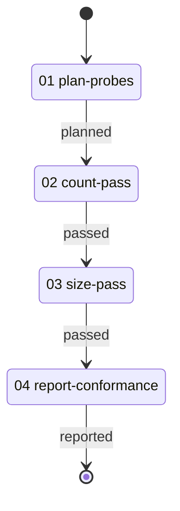

# Routine Conformance Workflow

> Runs one shared run twice against a real checkout, each site supplying a different measurement, and reports what each site produced.

---

## Overview

This workflow exists to make a routine's argument binding observable. A session supplies it two things: a planning folder to write its report into, and a path to the repository or submodule it looks at; everything else the run produces.

The work the measurements do is deliberately trivial — count what a directory holds, or sum the bytes of the files in it, and name the next directory down. Both only read, so the run costs about what the construct costs. The evidence it leaves behind is about which measurement each site supplied and what one run did with each, not about the repository it measured.

It serves two readers. One wants to know whether this server materialises a run correctly at two sites that disagree about the technique, and takes that from the report. The other is writing a run of their own and wants a worked example of the shape — a technique the site chooses, a repeat-until loop, and later steps steering on what that technique reported.

| # | Activity | Description |
|---|----------|-------------|
| 01 | [**Plan Probes**](./activities/README.md#01-plan-probes) | Choose the directory both passes open with |
| 02 | [**Count Pass**](./activities/README.md#02-count-pass) | Walk the targets counting what each holds |
| 03 | [**Size Pass**](./activities/README.md#03-size-pass) | Walk the same targets measuring how much each holds |
| 04 | [**Report Conformance**](./activities/README.md#04-report-conformance) | Write what each site supplied and what each pass produced |

---

## Workflow Flow



---

## The shape it demonstrates

The two passes are one run. [`routines/measured-pass.yaml`](./routines/measured-pass.yaml) holds it: a loop that continues while a target is held, a step whose technique the site supplies, gates that read what that technique reported, and an advance onto the target it named next.

Three things about that shape are worth copying.

**The technique is the site's choice, and the gates are not.** The run reads `probe_result` without knowing which measurement produced it, so every measurement a site may supply answers under that one name. The rule saying so lives with the measurements, in [`techniques/TECHNIQUE.md`](./techniques/TECHNIQUE.md), because the sites are where the choice is made and the run is where the reading is written.

**What the run produces for itself, it does not declare.** `probe_result` is neither an input nor an output of the run: the run's own step put it in the bag and the run's own gates read it back. A run may not promise it onward either, because which values it carries follows from the argument, and the next site's argument may carry others.

**Each site gets its own identifiers.** The loop body materialises under the reference step's id, so the counting site's steps and the sizing site's steps are distinct even though one file wrote both. The name the run holds for a value it passes between its own steps — `empty_target` here — is materialised per site for the same reason.

---

## File Structure

```
corpus/specimens/routine-conformance/
├── workflow.yaml                            # Workflow definition
├── README.md                                # This file
├── routines/
│   └── measured-pass.yaml                   # The run both passes refer to
├── activities/
│   ├── 01-plan-probes.yaml                  # Choose the opening target
│   ├── 02-count-pass.yaml                   # The run, under the counting measurement
│   ├── 03-size-pass.yaml                    # The run, under the sizing measurement
│   └── 04-report-conformance.yaml           # Write the report
├── techniques/
│   ├── TECHNIQUE.md                         # Shared input and the contract a measurement owes
│   ├── plan-probes.md                       # Choose the opening target
│   ├── count-entries.md                     # Count what a directory holds
│   ├── measure-size.md                      # Sum the bytes a directory holds
│   └── report-conformance.md                # Read both passes and write the report
└── resources/
    └── conformance-report.md                # Creation guide for the report
```
